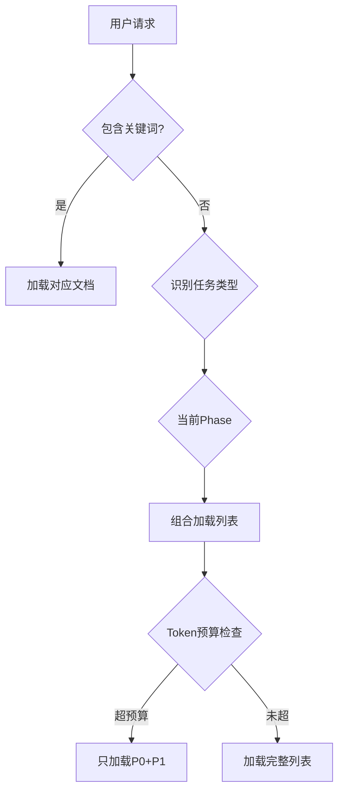

# 🎯 Claude Enhancer智能文档加载策略

> 解决问题：避免一次性加载所有文档造成的上下文污染
> 核心理念：按需加载，精准匹配，最小化Token使用

## 📊 文档分级体系

### P0级：核心必读（始终加载）
**Token成本：~2K**
```
- CLAUDE.md (根目录) - 项目配置入口
- .claude/settings.json - 系统配置
```

### P1级：高频参考（任务相关时加载）
**Token成本：~5K/文档**
```
任务类型触发：
- 添加新功能 → GROWTH-STRATEGY.md
- 代码重构 → LAYER-DEFINITION.md
- 创建文件 → NAMING-CONVENTIONS.md
- 架构设计 → v2.0-FOUNDATION.md
```

### P2级：专项查阅（特定场景加载）
**Token成本：~3K/文档**
```
场景触发：
- 架构决策疑问 → decisions/*.md
- 实施进度查询 → IMPLEMENTATION-STATUS.md
- 文档索引需求 → INDEX.md
```

### P3级：深度探究（明确要求时加载）
**Token成本：~10K+**
```
- 完整Agent列表（56个）
- 详细工作流文档
- 历史记录和备份
```

## 🔍 智能触发机制

### 1. 关键词触发器
```python
KEYWORD_TRIGGERS = {
    "新功能|新特性|add feature": ["GROWTH-STRATEGY.md"],
    "重构|架构|structure": ["v2.0-FOUNDATION.md", "LAYER-DEFINITION.md"],
    "命名|文件名|naming": ["NAMING-CONVENTIONS.md"],
    "为什么|决策|decision": ["decisions/"],
    "进度|状态|status": ["IMPLEMENTATION-STATUS.md"],
    "agent|Agent": ["AGENT_STRATEGY.md"],
    "工作流|workflow|phase": ["WORKFLOW.md"]
}
```

### 2. 任务类型映射
```yaml
task_type_mapping:
  bug_fix:
    load: ["WORKFLOW.md"]
    skip: ["GROWTH-STRATEGY.md", "decisions/"]

  new_feature:
    load: ["GROWTH-STRATEGY.md", "NAMING-CONVENTIONS.md"]
    optional: ["LAYER-DEFINITION.md"]

  refactoring:
    load: ["v2.0-FOUNDATION.md", "LAYER-DEFINITION.md"]
    skip: ["decisions/"]

  architecture_review:
    load: ["v2.0-FOUNDATION.md", "decisions/", "LAYER-DEFINITION.md"]
```

### 3. Phase阶段加载
```yaml
phase_loading:
  phase_0: # 分支创建
    - minimal docs only

  phase_1_2: # 分析设计
    - v2.0-FOUNDATION.md
    - LAYER-DEFINITION.md

  phase_3: # 开发实现
    - GROWTH-STRATEGY.md
    - NAMING-CONVENTIONS.md
    - AGENT_STRATEGY.md

  phase_4_5: # 测试提交
    - WORKFLOW.md

  phase_6_7: # 审查部署
    - minimal docs only
```

## 💡 加载决策逻辑



## 📈 Token预算管理

### 预算分配
```yaml
token_budget:
  simple_task: 10K    # Bug修复等
  standard_task: 20K  # 新功能开发
  complex_task: 30K   # 架构设计

document_sizes:
  CLAUDE.md: 2K
  v2.0-FOUNDATION.md: 5K
  LAYER-DEFINITION.md: 8K
  GROWTH-STRATEGY.md: 6K
  NAMING-CONVENTIONS.md: 4K
  decisions/*.md: 2K each
```

### 动态调整策略
1. **优先级降级**：Token不足时，P2→P3文档自动跳过
2. **摘要替代**：大文档可只加载摘要部分
3. **缓存机制**：已加载文档在会话内不重复加载

## 🚀 实施方案

### 方案A：配置文件驱动（推荐）
```json
// .claude/smart_loading.json
{
  "auto_load": {
    "always": ["CLAUDE.md"],
    "triggers": {
      "keywords": {...},
      "task_types": {...},
      "phases": {...}
    },
    "token_budget": 20000,
    "cache_loaded": true
  }
}
```

### 方案B：Hook脚本控制
```bash
# .claude/hooks/smart_doc_loader.sh
#!/bin/bash
TASK_DESCRIPTION="$1"
CURRENT_PHASE="$2"

# 分析任务，返回需要加载的文档列表
if [[ "$TASK_DESCRIPTION" =~ "新功能" ]]; then
    echo "GROWTH-STRATEGY.md NAMING-CONVENTIONS.md"
elif [[ "$TASK_DESCRIPTION" =~ "重构" ]]; then
    echo "v2.0-FOUNDATION.md LAYER-DEFINITION.md"
fi
```

### 方案C：智能提示符（内置规则）
在CLAUDE.md中添加：
```markdown
## 文档加载规则
- 默认只读取本文件
- 提到"新功能"时，追加读取GROWTH-STRATEGY.md
- 提到"架构"时，追加读取v2.0-FOUNDATION.md
- 不要一次性加载所有文档
```

## 📊 效果评估

### 优化前
- 每次加载：80K+ tokens
- 相关内容：<20%
- 上下文污染：严重

### 优化后
- 简单任务：5-10K tokens（节省87%）
- 标准任务：15-20K tokens（节省75%）
- 复杂任务：25-30K tokens（节省62%）
- 相关内容：>80%

## 🔧 使用指南

### Claude Code执行时
1. 先读取P0级文档（CLAUDE.md）
2. 分析用户请求，识别关键词和任务类型
3. 根据触发规则加载P1级文档
4. 仅在必要时加载P2/P3级文档

### 手动控制
用户可以明确指定：
- "只看基础文档"→ 只加载P0
- "需要完整架构信息"→ 加载P0+P1+P2
- "深度分析"→ 加载所有

## ⚠️ 注意事项

1. **避免过度优化**：宁可多加载一点，不要漏掉关键信息
2. **保持灵活**：用户可以覆盖自动加载决策
3. **定期评估**：根据实际使用调整触发规则
4. **缓存策略**：同一会话避免重复加载

---
*智能加载策略v1.0 - 让文档服务任务，而不是淹没任务*