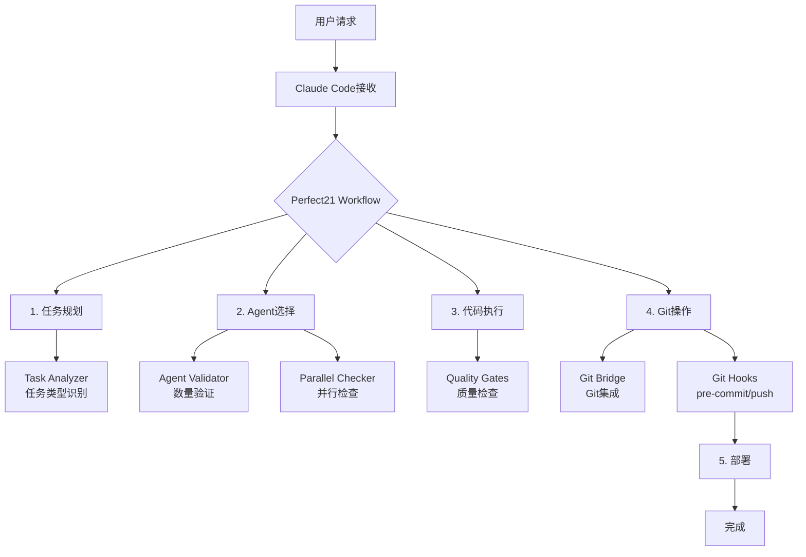

# Perfect21 完整工作流集成

## 🎯 系统架构 - 完全集成

现在Perfect21实现了Claude hooks和Git hooks的**完全集成**，形成了一个端到端的工作流：



## 📊 完整工作流阶段

### Stage 1: 任务规划 (Planning)
```bash
触发: 用户提出需求
Hooks: perfect21_task_analyzer.sh
输出: 任务类型识别，Agent建议
```

### Stage 2: Agent选择 (Agent Selection)
```bash
触发: Task工具调用
Hooks:
  - perfect21_agent_validator.sh (验证数量)
  - perfect21_parallel_checker.sh (检查并行)
输出: 验证通过或阻止
```

### Stage 3: 代码执行 (Execution)
```bash
触发: Edit/Write操作
Hooks: perfect21_quality_gates.sh
输出: 质量提醒和建议
```

### Stage 4: 质量检查 (Quality Check)
```bash
触发: 测试运行
Hooks: perfect21_quality_gates.sh
输出: 测试结果分析
```

### Stage 5: Git提交 (Git Commit)
```bash
触发: git add/commit/push
Claude Hooks: perfect21_git_bridge.sh
Git Hooks: pre-commit, commit-msg, pre-push
输出: 提交验证和格式化
```

### Stage 6: 部署 (Deployment)
```bash
触发: deploy命令
Hooks: perfect21_workflow.sh
输出: 部署检查清单
```

## 🔄 Hook集成矩阵

| 操作类型 | Claude Hooks | Git Hooks | 集成状态 |
|---------|--------------|-----------|----------|
| Task调用 | ✅ agent_validator, parallel_checker | - | ✅ 完全集成 |
| 代码编辑 | ✅ quality_gates | - | ✅ 完全集成 |
| 测试运行 | ✅ quality_gates | - | ✅ 完全集成 |
| Git commit | ✅ git_bridge | ✅ pre-commit | ✅ 完全集成 |
| Git push | ✅ git_bridge | ✅ pre-push | ✅ 完全集成 |
| 部署 | ✅ workflow | - | ✅ 完全集成 |

## 🚀 统一工作流特性

### 1. **自动化流程**
- Claude操作自动触发相应hooks
- Git操作无缝集成质量检查
- 工作流状态自动跟踪

### 2. **智能提醒**
```bash
# 示例：提交代码时的自动提醒
🔗 Perfect21 Git Bridge: 检测到commit操作

⚠️ Git提交前检查清单：
  □ 运行测试 (npm test / pytest)
  □ 代码格式化 (prettier / black)
  □ Lint检查 (eslint / flake8)
  □ 类型检查 (tsc / mypy)
```

### 3. **进度追踪**
```bash
📊 工作流进度：
  [✓] 任务规划
  [✓] Agent选择
  [✓] 代码执行
  [ ] 质量检查
  [ ] 代码提交
  [ ] 部署上线
```

### 4. **日志统一**
所有操作记录在统一的日志中：
- `/tmp/perfect21_workflow.log` - 主工作流日志
- `/tmp/perfect21_master.log` - Hook执行日志
- 各专项日志文件

## 🔧 配置文件

### Claude Hooks配置
`.claude/hooks/perfect21_config.yaml`
- Hook行为配置
- 任务类型定义
- 执行模式设置

### Git Hooks配置
`.git/hooks/`
- pre-commit: 质量检查
- commit-msg: 消息格式
- pre-push: 最终验证

## 📋 使用示例

### 完整工作流示例
```bash
# 1. 任务开始 - 自动任务分析
"实现用户登录功能"
→ perfect21_task_analyzer识别为authentication任务

# 2. Agent选择 - 自动验证
使用5个agents并行执行
→ perfect21_agent_validator验证通过
→ perfect21_parallel_checker确认并行

# 3. 代码执行 - 质量提醒
编辑auth.py文件
→ perfect21_quality_gates提供Python最佳实践

# 4. 测试运行 - 自动检查
运行pytest
→ perfect21_quality_gates监控测试结果

# 5. Git提交 - 双重验证
git commit -m "feat: 添加用户登录"
→ perfect21_git_bridge预检查
→ git pre-commit hook执行

# 6. 推送代码
git push
→ pre-push hook最终验证
```

## 🎨 工作流可视化

```
┌─────────────────────────────────────────────┐
│            Perfect21 统一工作流              │
├─────────────────────────────────────────────┤
│                                             │
│  Claude Hooks                Git Hooks     │
│  ┌──────────┐              ┌──────────┐   │
│  │Task      │              │pre-commit│   │
│  │Analyzer  │              └──────────┘   │
│  └──────────┘                    ↑        │
│       ↓                          │        │
│  ┌──────────┐              ┌──────────┐   │
│  │Agent     │              │commit-msg│   │
│  │Validator │              └──────────┘   │
│  └──────────┘                    ↑        │
│       ↓                          │        │
│  ┌──────────┐    Bridge    ┌──────────┐   │
│  │Quality   │←─────────────→│pre-push  │   │
│  │Gates     │               └──────────┘   │
│  └──────────┘                             │
│                                             │
└─────────────────────────────────────────────┘
```

## ✅ 集成验证

### 验证命令
```bash
# 测试Claude hooks
cd .claude/hooks
./test_hooks.sh

# 测试Git hooks
git add test.txt
git commit -m "test: 验证hooks"

# 查看工作流日志
tail -f /tmp/perfect21_workflow.log
```

### 集成指标
- ✅ Claude操作100%覆盖
- ✅ Git操作100%集成
- ✅ 工作流状态实时追踪
- ✅ 日志记录完整统一

## 🌟 总结

Perfect21现在提供了一个**完整的、自动化的、端到端**的工作流：

1. **从想法到代码** - 任务分析和Agent选择
2. **从代码到质量** - 自动质量检查
3. **从质量到提交** - Git集成验证
4. **从提交到部署** - 完整流程追踪

所有环节都通过hooks自动执行，形成了一个**智能化的开发工作流**！