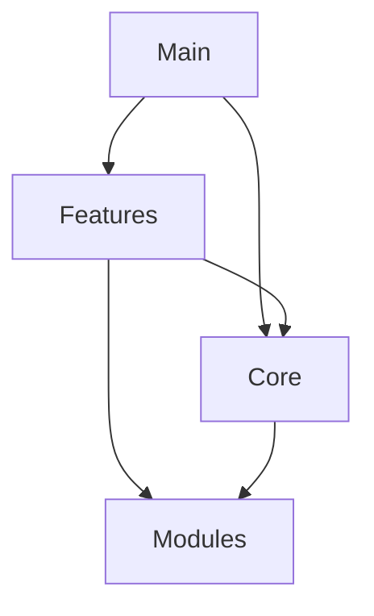

# 🏗️ Perfect21 架构设计

> 版本: 2.0 | 更新时间: 2025-01-17
> 设计原则: 清晰分层、高内聚低耦合、易于维护

## 📊 架构概览

```
Perfect21/
├── main/           # 入口层 - 统一的执行入口
├── features/       # 功能层 - 可插拔的业务功能
├── core/           # 核心层 - 不可变的基础能力
└── modules/        # 工具层 - 共享的基础设施
```

## 🎯 层次设计

### 1. Main层（入口层）

**职责**：提供统一入口，路由分发请求

```
main/
├── cli.py              # 命令行接口
├── api.py              # REST API服务
├── orchestrator.py     # 总调度器
└── perfect21.py        # 主程序入口
```

**设计原则**：
- 薄层设计，只做路由不做业务
- 统一错误处理和日志记录
- 负责初始化和资源清理

### 2. Features层（功能层）

**职责**：实现具体的业务功能

```
features/
├── workflow/           # 工作流引擎
│   ├── generator.py    # 动态工作流生成
│   ├── executor.py     # 工作流执行
│   └── templates.py    # 工作流模板
│
├── agents/            # Agent管理
│   ├── selector.py    # 智能Agent选择
│   ├── coordinator.py # Agent协调
│   └── patterns.py    # 成功模式库
│
├── quality/           # 质量保证
│   ├── gates.py       # 质量门控制
│   ├── validators.py  # 验证器集合
│   └── metrics.py     # 度量标准
│
├── git/               # Git集成
│   ├── hooks.py       # Git钩子管理
│   ├── workflow.py    # Git工作流
│   └── cache.py       # Git操作缓存
│
└── learning/          # 学习系统
    ├── feedback.py    # 反馈收集
    ├── analyzer.py    # 模式分析
    └── optimizer.py   # 优化建议
```

**设计原则**：
- 每个feature独立，可单独测试
- 通过接口与其他层通信
- 包含自己的README和测试

### 3. Core层（核心层）

**职责**：提供稳定的基础能力

```
core/
├── claude-code-unified-agents/  # 原始56个agents（只读）
│
├── registry/                    # 能力注册中心
│   ├── discovery.py            # 自动发现机制
│   ├── catalog.py              # 能力目录管理
│   └── loader.py               # 动态加载器
│
├── execution/                   # 执行引擎
│   ├── parallel.py             # 并行执行器
│   ├── sequential.py           # 顺序执行器
│   ├── hybrid.py               # 混合执行器
│   └── scheduler.py            # 任务调度器
│
└── memory/                      # 记忆系统
    ├── decisions.py            # ADR决策记录
    ├── patterns.py             # 模式识别
    ├── experience.py           # 经验积累
    └── persistence.py          # 持久化存储
```

**设计原则**：
- 极度稳定，很少变更
- 高性能，充分优化
- 通用性强，不包含业务逻辑

### 4. Modules层（工具层）

**职责**：提供基础设施和工具

```
modules/
├── config.py          # 配置管理
├── logger.py          # 日志系统
├── cache.py           # 缓存管理
├── database.py        # 数据库访问
├── security.py        # 安全工具
├── monitoring.py      # 监控工具
├── resource.py        # 资源管理
└── utils.py           # 通用工具
```

**设计原则**：
- 纯工具类，无业务逻辑
- 高复用性
- 良好的默认配置

## 🔗 依赖关系

### 允许的依赖方向



### 禁止的依赖

- ❌ Core → Features（核心层不能依赖功能层）
- ❌ Modules → Core/Features/Main（工具层不能依赖上层）
- ❌ Features → Main（功能层不能依赖入口层）
- ❌ 同层循环依赖

## 📐 接口规范

### Feature接口标准

```python
from abc import ABC, abstractmethod
from typing import List, Dict, Any

class FeatureInterface(ABC):
    """所有Feature必须实现的接口"""

    @property
    @abstractmethod
    def name(self) -> str:
        """功能名称"""
        pass

    @property
    @abstractmethod
    def version(self) -> str:
        """版本号"""
        pass

    @property
    @abstractmethod
    def required_agents(self) -> List[str]:
        """需要的agents列表"""
        pass

    @abstractmethod
    def validate(self, context: Dict[str, Any]) -> bool:
        """验证功能是否可用"""
        pass

    @abstractmethod
    def execute(self, request: Dict[str, Any]) -> Dict[str, Any]:
        """执行功能"""
        pass

    @abstractmethod
    def cleanup(self) -> None:
        """清理资源"""
        pass
```

### 命名规范

| 类型 | 规范 | 示例 |
|------|------|------|
| 文件名 | snake_case | workflow_generator.py |
| 类名 | PascalCase | WorkflowGenerator |
| 函数名 | snake_case | generate_workflow |
| 常量 | UPPER_SNAKE_CASE | MAX_AGENTS |
| 模块目录 | lowercase | workflow/ |

## 📁 配置和文档

```
Perfect21/
├── config/
│   ├── default.yaml    # 默认配置
│   ├── development.yaml # 开发环境
│   └── production.yaml  # 生产环境
│
├── docs/
│   ├── architecture/   # 架构文档
│   ├── api/           # API文档
│   └── guides/        # 使用指南
│
└── knowledge/
    ├── patterns/      # 成功模式
    ├── decisions/     # 架构决策
    └── lessons/       # 经验教训
```

## 🧪 测试结构

测试目录镜像源码结构：

```
tests/
├── main/
│   └── test_cli.py
├── features/
│   ├── workflow/
│   │   └── test_generator.py
│   └── agents/
│       └── test_selector.py
├── core/
│   └── execution/
│       └── test_parallel.py
└── modules/
    └── test_config.py
```

## 🔄 迁移策略

### Phase 1: 准备（当前）
- [x] 创建archive目录
- [x] 备份现有代码
- [x] 创建架构文档

### Phase 2: 重组
- [ ] 创建新目录结构
- [ ] 迁移代码到对应层
- [ ] 更新import路径

### Phase 3: 优化
- [ ] 统一接口规范
- [ ] 添加类型注解
- [ ] 完善单元测试

### Phase 4: 文档
- [ ] 更新CLAUDE.md
- [ ] 编写API文档
- [ ] 创建迁移指南

## 📝 维护指南

### 添加新功能

1. 确定功能属于哪一层
2. 在对应层创建新模块
3. 实现标准接口
4. 添加单元测试
5. 更新文档

### 日常维护

- **每日**：检查新增代码符合架构规范
- **每周**：清理未使用的导入和代码
- **每月**：评估是否需要重构

## 🎯 设计目标

1. **清晰性**：一眼看懂系统结构
2. **可维护性**：易于修改和扩展
3. **可测试性**：每个模块可独立测试
4. **高性能**：核心功能充分优化
5. **易用性**：简单的API和文档

---

> 💡 记住：好的架构是演进出来的，不是设计出来的。保持简单，逐步改进。