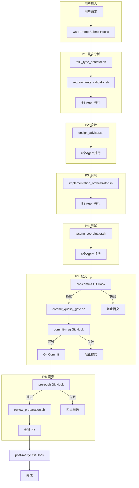

# Claude Enhancer 完整Hook-Phase映射关系文档
> 给ChatGPT的详细系统说明

## 📋 系统概述

- **系统名称**: Claude Enhancer 5.1
- **Phase模型**: 6-Phase (P1-P6)
- **Hook类型**: Claude Hooks（非阻塞提示）+ Git Hooks（强制阻塞）
- **核心理念**: Claude Hooks提供智能建议，Git Hooks强制质量标准

### 四个轨道文件（强制推进的抓手）
- `.phase/current`: 当前阶段（P1~P6），单行文本
- `.gates/NN.ok`: 第N步通过的合格证文件（含commit id）
- `.tickets/`: 并行工单卡（.todo→.done），无卡不开工
- `.limits/P#/max`: 每阶段并行上限（P1=4, P2=6, P3=8, P4=6, P5=4, P6=2）

## 🎯 6-Phase开发流程

### Phase定义与Agent配置

| Phase | 名称 | 描述 | Agent数量 | 主要工具 | 必须产物 | 推进条件 |
|-------|------|------|-----------|----------|---------|---------|
| **P1** | Requirements Analysis | 理解要做什么，为什么要做 | 4 | Read, Grep | docs/PLAN.md | 任务清单≥5条, .gates/01.ok |
| **P2** | Design Planning | 如何实现，技术选型，架构设计 | 6 | Read, Write | docs/DESIGN.md | 接口定义完整, .gates/02.ok |
| **P3** | Implementation | 编写代码，实现功能 | 8 | Task, Write, Edit | src/**代码 | 构建通过, .gates/03.ok |
| **P4** | Local Testing | 单元测试，集成测试，功能验证 | 6 | Bash, Read | tests/**≥2条 | 测试绿, .gates/04.ok |
| **P5** | Code Commit | Git提交，触发质量检查 | 4 | Bash | git commit | commit规范, .gates/05.ok |
| **P6** | Code Review | 创建PR，团队review，反馈修改 | 2 | Bash | PR merged | 健康检查过, .gates/06.ok |

## 🪝 Claude Hooks系统（38个）

### Hook触发时机

#### 1. PreToolUse Hooks（工具调用前）
```json
{
  "PreToolUse": [
    {
      "command": "bash .claude/hooks/workflow_enforcer.sh",
      "description": "工作流强制执行器 - 确保按6-Phase执行",
      "blocking": false,  // 非阻塞，仅提示
      "phase": "workflow_enforcement"
    },
    {
      "command": "bash .claude/hooks/unified_workflow_orchestrator.sh",
      "description": "统一工作流调度器 - 智能Hook批处理",
      "blocking": false,
      "phase": "unified_orchestration"
    }
  ]
}
```

#### 2. PostToolUse Hooks（工具调用后）
```json
{
  "PostToolUse": [
    {
      "command": "bash .claude/hooks/unified_post_processor.sh",
      "description": "统一后处理器 - 智能结果分析与进度跟踪",
      "blocking": false,
      "phase": "unified_post_processing"
    }
  ]
}
```

#### 3. UserPromptSubmit Hooks（用户输入时）
```json
{
  "UserPromptSubmit": [
    {
      "command": "bash .claude/hooks/task_type_detector.sh",
      "description": "P1: 任务类型检测和需求分析",
      "blocking": false,
      "phase": "P1_requirements"
    },
    {
      "command": "bash .claude/hooks/branch_helper.sh",
      "description": "分支状态检查和创建建议",
      "blocking": false,
      "phase": "branch_management"
    },
    {
      "command": "bash .claude/hooks/smart_agent_selector.sh",
      "description": "Agent选择策略初始化 - 4-6-8策略准备",
      "blocking": false,
      "phase": "agent_preparation"
    }
  ]
}
```

### Phase专属Claude Hooks

| Phase | Hook脚本 | 功能描述 | 触发时机 |
|-------|----------|----------|----------|
| **P1** | requirements_validator.sh | 需求分析和验证 | 开始P1时 |
| **P2** | design_advisor.sh | 设计规划和架构建议 | 开始P2时 |
| **P3** | implementation_orchestrator.sh | 4-6-8 Agent实现策略 | 开始P3时 |
| **P4** | testing_coordinator.sh | 本地测试和验证 | 开始P4时 |
| **P5** | commit_quality_gate.sh | 代码提交质量检查 | 开始P5时 |
| **P6** | review_preparation.sh | 代码审查准备 | 开始P6时 |

### 完整Claude Hooks列表（38个）

**⚠️ 重要声明：Claude Hooks全非阻塞，不具备放/拦权限；裁决一律由Git Hooks/执行器完成。**

```
核心Hook（6个）：
1. workflow_enforcer.sh          - 工作流执行建议
2. branch_helper.sh               - 分支管理提醒
3. smart_agent_selector.sh        - Agent智能选择
4. quality_gate.sh                - 质量门禁建议
5. performance_monitor.sh         - 性能监控
6. error_recovery.sh              - 错误恢复

Phase专属Hook（6个）：
7. requirements_validator.sh      - P1需求验证
8. design_advisor.sh              - P2设计建议
9. implementation_orchestrator.sh - P3实现协调
10. testing_coordinator.sh        - P4测试协调
11. commit_quality_gate.sh        - P5提交检查
12. review_preparation.sh         - P6审查准备

辅助Hook（26个）：
13-38. 各种优化、监控、清理等辅助功能
```

## 🔒 Git Hooks系统（强制阻塞）

### 核心Git Hooks与Phase对应

| Git Hook | 对应Phase | 功能 | 阻塞条件 |
|----------|-----------|------|----------|
| **pre-commit** | P5之前 | 代码质量检查 | 格式错误、lint失败 |
| **commit-msg** | P5 | 提交信息规范 | 格式不符合规范 |
| **pre-push** | P5之后 | 推送前测试 | 测试失败 |
| **post-merge** | P6之后 | 合并后健康检查+自动回滚 | 测试失败自动回滚 |

### Git Hook执行逻辑

```bash
# pre-commit示例
#!/bin/bash
# 对应P4→P5转换

# 1. 代码格式检查
if ! black --check .; then
    echo "❌ Python代码格式错误"
    exit 1  # 阻止提交
fi

# 2. 测试运行（对应P4）
if ! pytest; then
    echo "❌ 测试失败，请先通过P4测试"
    exit 1  # 阻止提交
fi

# 3. 安全检查
if ! bandit -r .; then
    echo "❌ 发现安全问题"
    exit 1  # 阻止提交
fi
```

## 🔄 Hook与Phase协作流程

### 完整执行流程



## 📊 Hook执行矩阵

### Phase转换时的Hook触发

| 从Phase | 到Phase | Claude Hooks触发 | Git Hooks触发 | 阻塞可能 |
|---------|---------|-----------------|---------------|----------|
| 开始 | P1 | task_type_detector.sh | 无 | ❌ |
| P1 | P2 | design_advisor.sh | 无 | ❌ |
| P2 | P3 | implementation_orchestrator.sh | 无 | ❌ |
| P3 | P4 | testing_coordinator.sh | 无 | ❌ |
| P4 | P5 | commit_quality_gate.sh | pre-commit | ✅ |
| P5 | P6 | review_preparation.sh | commit-msg, pre-push | ✅ |
| P6 | 完成 | 无 | post-merge | ✅ |

## 🎨 Quality Gates（质量门禁）

### 每个Phase的质量检查点

```json
{
  "quality_gates": {
    "P3_implementation": [
      "code_style",           // 代码风格
      "architecture_compliance", // 架构合规
      "security_basic"        // 基础安全
    ],
    "P4_testing": [
      "unit_tests",           // 单元测试
      "integration_tests",    // 集成测试
      "performance_tests"     // 性能测试
    ],
    "P5_commit": [
      "lint_check",           // Lint检查
      "test_coverage",        // 测试覆盖率
      "security_scan"         // 安全扫描
    ],
    "P6_review": [
      "code_review",          // 代码审查
      "documentation",        // 文档完整
      "deployment_ready"      // 部署就绪
    ]
  }
}
```

## 💡 关键设计原则

### 1. Hook职责分离
- **Claude Hooks**: 建议、提示、信息收集（非阻塞）
- **Git Hooks**: 强制检查、质量保证（阻塞）

### 2. Phase隔离机制
- Claude Hooks提醒Phase顺序
- Git Hooks在关键节点（P5、P6）强制检查
- 不合格的代码无法进入下一Phase

### 3. Agent并发策略
- P1-P2: 轻量级（4-6 Agents）
- P3: 重量级（8 Agents）
- P4-P6: 收敛（6-4-2 Agents）

## 📝 给ChatGPT的核心信息

1. **系统采用6-Phase模型（P1-P6）**，每个Phase有明确的目标和Agent配置
2. **Claude Hooks全部非阻塞**（blocking: false），提供智能建议
3. **Git Hooks强制阻塞**，在P5-P6阶段执行质量门禁
4. **4-6-8 Agent策略**根据任务复杂度动态调整
5. **Hook协作**：Claude Hooks引导最佳实践，Git Hooks强制执行标准

## 🔧 实际使用示例

### 场景：开发新功能

1. **用户输入**："帮我实现用户登录功能"
2. **Claude Hook触发**：
   - `task_type_detector.sh`识别为"功能实现"任务
   - `branch_helper.sh`提醒创建feature分支
   - `smart_agent_selector.sh`推荐使用6个Agent（标准任务）
3. **P1执行**：`requirements_validator.sh`引导需求分析
4. **P2执行**：`design_advisor.sh`建议架构设计
5. **P3执行**：`implementation_orchestrator.sh`协调8个Agent实现
6. **P4执行**：`testing_coordinator.sh`组织测试
7. **P5关键点**：
   - `pre-commit` Git Hook检查代码质量（可能阻塞）
   - `commit-msg` Git Hook验证提交信息（可能阻塞）
8. **P6完成**：`pre-push` Git Hook确保可推送

---

*这是Claude Enhancer 5.1的完整Hook-Phase映射关系，展示了非阻塞建议系统（Claude Hooks）和强制质量门禁（Git Hooks）的协同工作机制。*