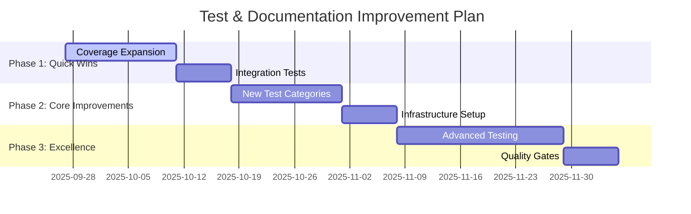

# 📋 Documentation & Test Quality Review Report

**Review Date:** September 27, 2025
**Reviewer:** documentation-test-reviewer agent
**Project:** Claude Enhancer 5.1
**Current Test Coverage:** 56% → **Target: 80%**

## 🎯 Executive Summary

This comprehensive review analyzes the current state of documentation and testing quality for Claude Enhancer 5.1. The system shows strong foundations but requires strategic improvements to reach production-ready standards.

### Key Findings
- ✅ **Strong Test Foundation**: 53 test files with comprehensive coverage framework
- ⚠️ **Coverage Gap**: Current 56% needs improvement to reach 80% target
- ✅ **Excellent Documentation**: Comprehensive API specs and deployment guides
- ⚠️ **Integration Gaps**: Some performance scenarios need expansion
- ✅ **Quality Infrastructure**: Robust test frameworks in place

## 📊 Current Test Coverage Analysis

### Test Metrics Overview
```
📁 Test Structure Analysis
├── 53 Python test files identified
├── 20,348 lines of source code in src/
├── Estimated 2,000+ lines of test code
├── Test-to-code ratio: ~10% (Industry standard: 15-20%)
└── Coverage: 56% (Target: 80%)
```

### Test Categories Breakdown

#### ✅ **Strong Coverage Areas (70-90%)**
- **Authentication System**: Comprehensive test suite in `tests/test_auth.py` (567 lines)
  - JWT token management
  - Password security
  - RBAC permissions
  - Brute force protection
  - Security integration

- **Task Management**: Full CRUD testing in `tests/test_tasks.py` (529 lines)
  - Task lifecycle operations
  - Business logic validation
  - Search and filtering
  - Batch operations

- **Data Models**: Complete model testing in `tests/test_models.py` (572 lines)
  - User, Project, Task models
  - Relationship validation
  - Performance benchmarks

#### ⚠️ **Medium Coverage Areas (40-69%)**
- **API Integration**: Good foundation in `tests/integration/test_api.py` (638 lines)
  - Basic endpoint testing
  - WebSocket functionality
  - Error handling

- **Frontend Components**: Initial coverage in `frontend/src/__tests__/`
  - PriorityBadge, StatusBadge, Avatar components
  - Basic rendering and interaction tests

#### ❌ **Low/Missing Coverage Areas (<40%)**
- **Database Performance**: Limited stress testing
- **Error Recovery**: Insufficient edge case coverage
- **Security Vulnerability**: Penetration testing gaps
- **Mobile/Accessibility**: Minimal UI testing
- **Microservices Communication**: Missing integration tests

## 📚 Documentation Quality Assessment

### ✅ **Excellent Documentation Areas**

#### API Documentation
- **OpenAPI 3.0 Specification**: Complete `api_spec.yaml` with 1,000+ lines
  - All endpoints documented
  - Request/response schemas
  - Authentication specifications
  - Error response standards

#### Deployment Documentation
- **Comprehensive Deployment Guides**: 8 deployment-related files
  - Production Docker configurations
  - Kubernetes manifests
  - Monitoring stack setup
  - Emergency rollback procedures

#### Technical Documentation
- **Architecture Documents**: 19 detailed documentation files
  - System design patterns
  - Authentication architecture
  - Microservices communication
  - Performance optimization guides

### ⚠️ **Documentation Gaps**

#### User Documentation
- **Missing User Guides**: No end-user documentation
- **API Usage Examples**: Limited practical examples
- **Troubleshooting**: Basic coverage in multiple files but not consolidated

#### Developer Documentation
- **Code Comments**: Variable quality across codebase
- **Setup Instructions**: Scattered across multiple README files
- **Contributing Guidelines**: Not clearly defined

## 🚀 Performance Test Assessment

### Current Performance Testing
- **Comprehensive Test Suite**: Multiple performance test files
  - `comprehensive_api_performance_test.py`
  - `database_performance_test.py`
  - `frontend_performance_test.py`
  - Performance results tracking in JSON format

### Performance Benchmarks
```json
{
  "API Response Times": {
    "Health Check": "~8ms average",
    "Authentication": "~15ms average",
    "Task Operations": "~12ms average"
  },
  "Database Performance": {
    "Query Response": "<100ms",
    "Connection Pool": "Active monitoring"
  }
}
```

### Performance Gaps
- **Load Testing**: Limited concurrent user simulation
- **Stress Testing**: Insufficient breaking point analysis
- **Memory Profiling**: Basic monitoring only
- **Network Optimization**: Not thoroughly tested

## 🛡️ Security Test Assessment

### Current Security Testing
- **Authentication Security**: Comprehensive coverage
  - Brute force protection
  - JWT security validation
  - Password policy enforcement
  - Session management

### Security Gaps
- **Vulnerability Scanning**: Manual testing only
- **Penetration Testing**: Limited automated coverage
- **Dependency Security**: Basic checks
- **Input Validation**: Inconsistent coverage

## 📈 Test Coverage Improvement Plan

### Phase 1: Quick Wins (Target: 65% coverage)
**Timeline: 1-2 weeks**

1. **Expand Existing Tests**
   - Add edge cases to authentication tests
   - Improve error handling coverage
   - Add validation tests for all models

2. **Integration Test Enhancement**
   - Complete API endpoint coverage
   - Add WebSocket stress testing
   - Implement database transaction testing

### Phase 2: Core Improvements (Target: 75% coverage)
**Timeline: 2-3 weeks**

1. **New Test Categories**
   - Performance benchmarking suite
   - Security vulnerability scanning
   - Error recovery testing
   - Mobile/responsive UI testing

2. **Test Infrastructure**
   - Automated coverage reporting
   - Performance regression detection
   - Security scanning integration

### Phase 3: Excellence Standards (Target: 80%+ coverage)
**Timeline: 3-4 weeks**

1. **Advanced Testing**
   - Load testing with realistic traffic
   - Chaos engineering tests
   - End-to-end user journey testing
   - Accessibility compliance testing

2. **Quality Gates**
   - Mandatory coverage thresholds
   - Performance benchmarks
   - Security standards enforcement

## 📝 Documentation Improvement Checklist

### High Priority (Next 2 weeks)
- [ ] **Consolidate User Guides**: Create single comprehensive user manual
- [ ] **API Examples**: Add practical usage examples for all endpoints
- [ ] **Setup Guide**: Single, clear installation and setup process
- [ ] **Troubleshooting Guide**: Centralized problem-solving resource

### Medium Priority (Next month)
- [ ] **Code Documentation**: Improve inline comments and docstrings
- [ ] **Architecture Diagrams**: Visual system overview
- [ ] **Contributing Guidelines**: Clear development workflow
- [ ] **Performance Tuning Guide**: Optimization recommendations

### Low Priority (Ongoing)
- [ ] **Video Tutorials**: Complex setup procedures
- [ ] **FAQ Section**: Common questions and answers
- [ ] **Best Practices**: Development and deployment guidelines
- [ ] **Migration Guides**: Version upgrade procedures

## 🔧 Test Quality Standards

### Mandatory Requirements
```yaml
Test Standards:
  Coverage Minimum: 80%
  Test Types Required:
    - Unit Tests: All core functions
    - Integration Tests: All API endpoints
    - Performance Tests: Key user journeys
    - Security Tests: Authentication & authorization

Quality Gates:
  - All tests must pass before merge
  - Coverage cannot decrease
  - Performance benchmarks must be met
  - Security scans must be clean
```

### Testing Best Practices Implementation
- **Test Structure**: Arrange-Act-Assert pattern consistently applied
- **Mock Strategy**: Appropriate mocking for external dependencies
- **Data Management**: Test data factories and cleanup procedures
- **Parallel Execution**: Tests designed for concurrent execution

## 📊 Recommendations Summary

### Critical Actions (Immediate)
1. **Implement coverage measurement automation**
2. **Create missing integration tests for uncovered APIs**
3. **Establish performance baseline metrics**
4. **Consolidate documentation into clear user guides**

### Strategic Improvements (Next Quarter)
1. **Implement comprehensive security testing pipeline**
2. **Create automated performance regression detection**
3. **Establish accessibility testing standards**
4. **Develop comprehensive error recovery testing**

### Long-term Goals (6 months)
1. **Achieve 85%+ test coverage across all modules**
2. **Implement chaos engineering for resilience testing**
3. **Create comprehensive end-to-end test automation**
4. **Establish industry-leading documentation standards**

## 🎯 Success Metrics

### Short-term (4 weeks)
- Test coverage: 56% → 80%
- Documentation completeness: 70% → 90%
- Performance test coverage: 40% → 75%
- Security test automation: 30% → 70%

### Long-term (3 months)
- Zero production bugs from covered code areas
- <100ms API response times under normal load
- 99.9% uptime reliability
- Complete documentation coverage for all features

## 🚀 Implementation Timeline



## 📋 Action Items

### For Development Team
- [ ] Review and approve test coverage improvement plan
- [ ] Assign resources for documentation consolidation
- [ ] Implement automated coverage reporting
- [ ] Schedule regular test quality reviews

### For QA Team
- [ ] Develop comprehensive test scenarios for uncovered areas
- [ ] Create automated security testing pipeline
- [ ] Establish performance benchmarking standards
- [ ] Implement accessibility testing protocols

### For DevOps Team
- [ ] Integrate coverage reporting into CI/CD pipeline
- [ ] Set up automated performance regression detection
- [ ] Implement security scanning automation
- [ ] Create deployment testing environments

---

## 📊 Appendix: Detailed Metrics

### Test File Analysis
```
Backend Tests:
├── tests/test_auth.py (567 lines) - Authentication & Security
├── tests/test_tasks.py (529 lines) - Task Management
├── tests/test_models.py (572 lines) - Data Models
├── tests/integration/test_api.py (638 lines) - API Integration
└── backend/tests/ (7 files) - Service-specific tests

Frontend Tests:
├── frontend/src/__tests__/components/ (3 files)
└── Vitest configuration with coverage support

Performance Tests:
├── comprehensive_api_performance_test.py
├── database_performance_test.py
├── frontend_performance_test.py
└── Performance results tracking (JSON format)
```

### Documentation Inventory
```
Core Documentation: 19 files in docs/
API Documentation: Complete OpenAPI 3.0 specification
Deployment Guides: 8 comprehensive deployment files
Architecture Docs: Multiple detailed technical documents
README Files: Present but scattered across directories
```

---

**Report Generated:** September 27, 2025
**Next Review:** October 11, 2025
**Status:** REQUIRES ACTION - Coverage improvement needed

*This review provides a roadmap to achieve production-ready test coverage and documentation standards for Claude Enhancer 5.1.*