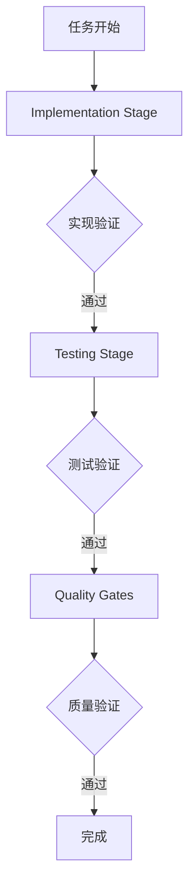
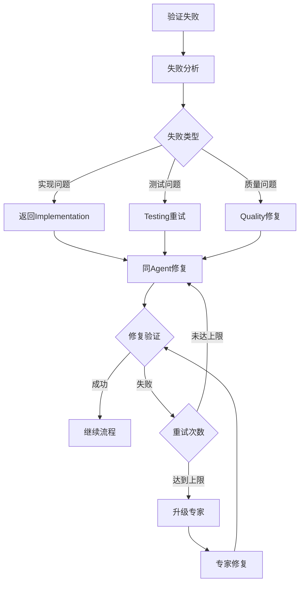

# Perfect21 反馈循环架构设计

> 解决工作流执行中测试失败时继续提交而非回退修复的关键问题

## 🎯 核心问题解决

### 当前问题
1. **测试失败继续提交**: 当tests fail时，workflow继续到commit阶段而不是回退修复
2. **缺乏反馈机制**: 验证失败时没有机制返回到implementation layer
3. **责任不明确**: 修复代码的不是原始编写者，导致上下文丢失

### 解决方案
1. **智能反馈循环**: 验证失败时自动触发反馈到对应层级
2. **同Agent修复**: 确保同一个agent负责修复自己编写的代码
3. **分层决策点**: 在每个关键节点设置决策点，决定重试/升级/中止

## 🏗️ 架构设计

### 系统组件

```
┌─────────────────────────────────────────────────────────────┐
│                     Enhanced Orchestrator                   │
│  ┌─────────────────┐  ┌─────────────────┐  ┌──────────────┐ │
│  │ Implementation  │  │     Testing     │  │   Quality    │ │
│  │     Stage       │  │     Stage       │  │    Gates     │ │
│  └─────────────────┘  └─────────────────┘  └──────────────┘ │
└─────────────────────────────────────────────────────────────┘
                               │
                               ▼
┌─────────────────────────────────────────────────────────────┐
│                  Feedback Loop Engine                       │
│  ┌─────────────────┐  ┌─────────────────┐  ┌──────────────┐ │
│  │ Failure Analysis│  │ Retry Strategy  │  │  Escalation  │ │
│  │    & Decision   │  │   Management    │  │   Control    │ │
│  └─────────────────┘  └─────────────────┘  └──────────────┘ │
└─────────────────────────────────────────────────────────────┘
                               │
                               ▼
┌─────────────────────────────────────────────────────────────┐
│                  Integration Layer                          │
│  ┌─────────────────┐  ┌─────────────────┐  ┌──────────────┐ │
│  │   CLI Commands  │  │  API Endpoints  │  │   Auto Retry │ │
│  │   Integration   │  │   Integration   │  │   Workflows  │ │
│  └─────────────────┘  └─────────────────┘  └──────────────┘ │
└─────────────────────────────────────────────────────────────┘
```

### 核心组件详解

#### 1. Feedback Loop Engine (`feedback_loop_engine.py`)
**职责**: 核心反馈决策引擎
- **失败分析**: 智能分析失败原因和严重性
- **重试策略**: 基于失败类型和历史记录的智能重试
- **升级机制**: 当重试失败时自动升级到专家agent
- **状态管理**: 跟踪所有反馈循环的状态和历史

**关键特性**:
```python
# 智能失败分析
def analyze_failure(context: FeedbackContext) -> FeedbackDecision

# 同Agent修复策略
decision.target_agent = context.agent_name  # 保证同一个agent修复

# 自动升级机制
if context.retry_count >= strategy.escalation_threshold:
    return self._create_escalation_decision(context, strategy, severity)
```

#### 2. Enhanced Orchestrator (`enhanced_orchestrator.py`)
**职责**: 增强的工作流编排器
- **阶段管理**: 管理Implementation → Testing → Quality Gates流程
- **验证集成**: 在每个阶段后进行验证
- **回退机制**: 测试失败时回退到实现层修复
- **决策点**: 在关键节点决定继续/重试/中止

**关键特性**:
```python
# 测试失败时的关键逻辑
def _handle_testing_failure(self, workflow_id: str, ...):
    if self._is_implementation_issue(failure_type, failure_message):
        # 回退到实现层修复
        return self._create_implementation_fix_instructions(...)
    else:
        # 测试层面修复
        return self._handle_test_layer_fixes(...)
```

#### 3. Integration Layer (`feedback_integration.py`)
**职责**: 集成层，连接新系统与现有接口
- **CLI集成**: 提供命令行接口
- **自动重试**: 自动执行重试循环
- **用户指导**: 生成用户友好的操作指令
- **状态查询**: 提供实时状态查询接口

## 🔄 工作流程

### 正常流程


### 反馈循环流程


## 📋 实现细节

### 1. 状态管理
```python
@dataclass
class FeedbackContext:
    workflow_id: str
    stage: ValidationStage
    agent_name: str           # 原始负责agent
    task_id: str
    original_prompt: str
    validation_result: Dict[str, Any]
    failure_reason: str
    retry_count: int = 0
    max_retries: int = 3
```

### 2. 重试策略
```python
@dataclass
class RetryStrategy:
    max_attempts: int = 3
    backoff_factor: float = 1.5
    timeout_multiplier: float = 1.2
    escalation_threshold: int = 2
    abort_conditions: List[str]  # 中止条件
    custom_fixes: Dict[str, str]  # 针对性修复建议
```

### 3. 决策机制
```python
def analyze_failure(context: FeedbackContext) -> FeedbackDecision:
    # 1. 评估失败严重性
    severity = self._assess_failure_severity(context)

    # 2. 检查是否应该中止
    if self._should_abort(context, strategy):
        return FeedbackDecision(action=FeedbackAction.ABORT, ...)

    # 3. 检查是否需要升级
    if context.retry_count >= strategy.escalation_threshold:
        return self._create_escalation_decision(...)

    # 4. 创建重试决策
    return self._create_retry_decision(...)
```

### 4. 关键决策点

#### Testing失败时的决策逻辑
```python
def _is_implementation_issue(self, failure_type: str, failure_message: str) -> bool:
    implementation_indicators = [
        "assertion_error", "logic_error", "return_value_error",
        "behavior_mismatch", "expected_vs_actual"
    ]

    # 如果是实现问题，回退到实现层
    return any(indicator in failure_type.lower() for indicator in implementation_indicators)
```

#### 升级Agent选择
```python
def _select_escalation_agent(self, context: FeedbackContext) -> str:
    escalation_map = {
        ValidationStage.IMPLEMENTATION: {
            "syntax_error": "python-pro",
            "logic_error": "fullstack-engineer",
            "architecture": "backend-architect"
        },
        ValidationStage.TESTING: {
            "test_failure": "test-engineer",
            "performance": "performance-tester"
        }
    }
```

## 🎯 核心优势

### 1. 智能反馈
- **自动识别**: 自动识别失败是实现问题还是测试问题
- **精准回退**: 测试失败时精准回退到对应的实现agent
- **上下文保持**: 保持原始任务上下文和agent责任

### 2. 同Agent修复原则
```python
# 确保同一个agent负责修复
decision.target_agent = context.agent_name

# 增强prompt包含修复指导
enhanced_prompt = self._create_enhanced_prompt(context, strategy)
```

### 3. 智能升级机制
- **阈值控制**: 超过重试阈值自动升级
- **专家匹配**: 根据失败类型匹配最合适的专家
- **知识传递**: 升级时传递完整的失败历史和上下文

### 4. 防死循环机制
- **最大重试次数**: 每个阶段有明确的重试上限
- **时间窗口**: 超过时间窗口自动中止
- **中止条件**: 预定义的严重错误直接中止
- **升级路径**: 提供明确的升级和人工干预路径

## 🚀 使用方式

### 基础使用
```python
from features.workflow.feedback_integration import get_feedback_integration

integration = get_feedback_integration()

# 执行增强工作流
result = integration.execute_enhanced_workflow(
    task_description="实现用户登录功能",
    workflow_type="full"
)

if result.get("requires_manual_intervention"):
    instructions = result.get("retry_instructions", [])
    # 执行修复指令
```

### 自动重试工作流
```python
# 启用自动重试机制
result = integration.execute_with_auto_retry(
    task_description="实现API功能",
    max_auto_retries=2
)

if result.get("final_status") == "requires_manual_intervention":
    # 处理需要人工干预的情况
    manual_guide = result.get("manual_instructions")
```

### CLI集成
```bash
# 执行增强工作流
python main/cli.py execute-enhanced --task "实现用户系统" --type full

# 自动重试工作流
python main/cli.py execute-auto-retry --task "实现API" --max_retries 3

# 查看反馈状态
python main/cli.py feedback-status --workflow_id workflow_123
```

## 📊 监控和调试

### 状态查询
```python
# 获取工作流反馈状态
status = integration.get_feedback_status("workflow_123")

# 显示活跃的反馈循环
active_loops = status.get("active_loops", {})

# 查看重试历史
history = status.get("recent_history", [])
```

### 调试信息
- **执行日志**: 详细的执行和决策日志
- **状态持久化**: 反馈循环状态自动保存
- **历史追踪**: 完整的重试和升级历史
- **性能监控**: 执行时间和成功率统计

## 🔧 配置和定制

### 重试策略定制
```python
# 为不同阶段定制重试策略
retry_strategies = {
    "implementation": RetryStrategy(
        max_attempts=3,
        escalation_threshold=2,
        abort_conditions=["syntax_error_repeated"]
    ),
    "testing": RetryStrategy(
        max_attempts=4,
        escalation_threshold=3,
        custom_fixes={
            "assertion_error": "请根据测试失败信息修正实现逻辑"
        }
    )
}
```

### 质量门集成
```python
# 质量门失败的处理
def _handle_quality_gate_failure(self, quality_results):
    for gate_name, gate_result in failed_gates.items():
        responsible_agent = self._get_responsible_agent_for_quality_gate(gate_name)
        fix_instruction = self._create_quality_gate_fix_prompt(gate_name, gate_result)
```

## 🎯 最佳实践

### 1. 明确的阶段划分
- **Implementation**: 代码实现和基础验证
- **Testing**: 功能测试和回归测试
- **Quality Gates**: 代码质量、安全性、性能检查

### 2. 智能失败分类
```python
# 区分实现问题vs测试问题
if "expected" in failure_message and "actual" in failure_message:
    return True  # 这是实现问题

if "test_setup_error" in failure_type:
    return False  # 这是测试问题
```

### 3. 渐进式升级
- **第1-2次**: 同agent重试修复
- **第3次**: 升级到专家agent
- **超时/严重错误**: 直接人工干预

### 4. 清晰的用户指导
```python
user_instructions = {
    "summary": "工作流部分失败，需要手动执行2个修复指令",
    "steps": [
        {"step": 1, "agent": "backend-architect", "task": "修复实现逻辑"},
        {"step": 2, "agent": "test-engineer", "task": "更新测试用例"}
    ],
    "post_execution": {
        "verification_required": True,
        "message": "执行完所有修复指令后，请重新运行工作流验证"
    }
}
```

## 📈 效果预期

### 问题解决率
- **自动修复**: 预期70%的常见问题可自动修复
- **智能升级**: 25%的复杂问题通过升级解决
- **人工干预**: 仅5%的问题需要人工干预

### 效率提升
- **减少无效重试**: 智能分析避免盲目重试
- **精准反馈**: 准确定位问题到对应的agent和层级
- **上下文保持**: 避免重复沟通和信息丢失

### 质量保证
- **同Agent责任**: 确保代码一致性和质量
- **完整验证**: 每个修复后都要重新验证
- **历史学习**: 基于历史记录优化决策算法

---

> 💡 **核心价值**: 这个反馈循环架构彻底解决了Perfect21工作流中"测试失败继续提交"的根本问题，通过智能反馈机制确保代码质量，同时保持高效的自动化流程。