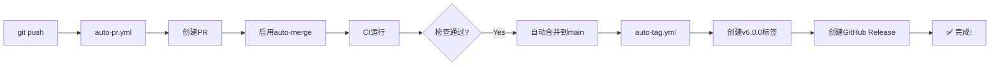

# ✅ Claude Enhancer v6.0 - 最终上线清单

## 📍 当前状态

```yaml
版本: 6.0.0
分支: feature/v6-unification
健康分数: 92/100
自动化工作流: ✅ 已创建
```

## 🔴 必须完成的2项设置（1分钟）

### 1️⃣ 开启 Auto-merge（必须）
```
🔗 https://github.com/perfectuser21/Claude_Enhancer/settings

路径: Settings → General → Pull Requests
动作: ✅ 勾选 "Allow auto-merge"
点击: Save
```

**当前状态**: ❌ 未启用 (需要手动勾选)

### 2️⃣ 配置 Required Status Checks（强烈建议）
```
🔗 https://github.com/perfectuser21/Claude_Enhancer/settings/branches

路径: Settings → Branches → main → Edit
动作:
  1. ✅ Require status checks to pass before merging
  2. 搜索并添加这些检查:
     - positive-health
     - ce-unified-gates
     - test-suite
  3. ✅ Include administrators (推荐)
  4. Save changes
```

**当前状态**: ❌ 未配置 (需要添加)

---

## 🚀 完成设置后，执行推送

```bash
# 就这一条命令，剩下全自动！
git push origin feature/v6-unification
```

## 🎯 预期自动化流程



## 📊 快速验证命令

```bash
# 验证设置是否生效
gh api repos/:owner/:repo -q '.allow_auto_merge'  # 应该返回 true

# 查看Required Checks
gh api repos/:owner/:repo/branches/main/protection -q '.required_status_checks.contexts[]?'

# 推送后查看PR状态
gh pr view --json autoMergeRequest,state
```

## 🔍 如果推送后没有自动化

**症状**: 推送后没有自动创建PR
- 检查: Actions页面是否有 "Auto PR & Merge" 运行
- 原因: 工作流可能没触发
- 解决: 检查分支名是否以 `feature/` 开头

**症状**: PR创建了但没有auto-merge
- 检查: PR页面是否显示 "Auto-merge enabled"
- 原因: Allow auto-merge未开启
- 解决: 回到设置页勾选

**症状**: CI通过了但不自动合并
- 检查: Required checks是否配置
- 原因: 没有配置必需检查
- 解决: 添加Required Status Checks

## 📝 提交记录

已完成的工作：
- ✅ 创建 `auto-pr.yml` - 自动创建PR和启用合并
- ✅ 创建 `auto-tag.yml` - 自动打标签和发布
- ✅ 创建 `positive-health.yml` - 健康检查CI
- ✅ 创建验证脚本套件
- ✅ 权限配置正确 (contents: write, pull-requests: write)

## 🎉 最终确认

**完成上述2项设置后**，你将拥有：
- 🚀 Push to Deploy - 推送即部署
- 🤖 全自动CI/CD - 无需人工干预
- 📊 完整可追溯 - 每步都有记录
- 🔄 可回滚 - 任何时候都能恢复

---

## 一句话总结

**现在就去GitHub页面勾选这两个选项，然后 `git push`，剩下的看着它全自动完成！**

---

*最后更新: 2025-10-11*
*版本: v6.0.0*
*状态: 待推送*