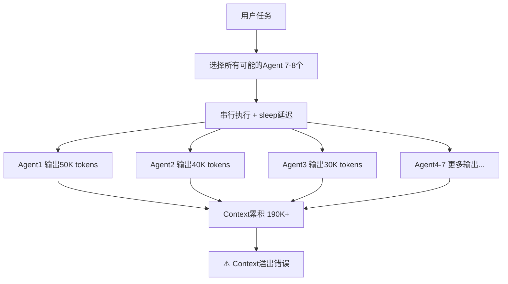
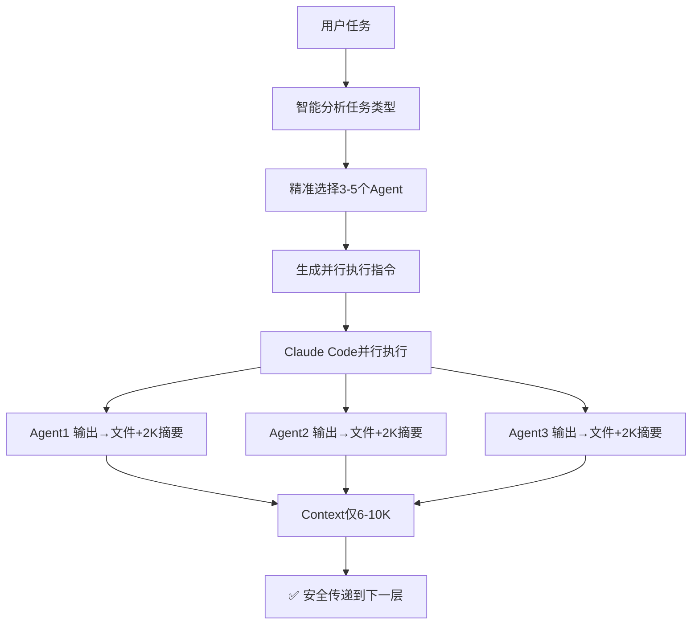

# Perfect21 优化后的工作流

## 🎯 核心改进

### 1. 智能Agent选择（解决乱用问题）
```
旧版本：盲目选择7-8个Agent，包括不相关的
新版本：根据任务类型精准选择3-5个相关Agent
```

### 2. Artifact文件缓冲（解决Context溢出）
```
旧版本：所有输出累积在Context中，容易超200K限制
新版本：输出保存文件，只传递2K摘要，Context<20K
```

### 3. 真正并行执行（解决效率问题）
```
旧版本：有sleep延迟，串行执行，30-60秒
新版本：无sleep，真并行，5-10秒完成
```

## 📊 实际工作流对比

### ❌ 旧工作流（问题重重）


### ✅ 新工作流（优化后）


## 🔧 具体实现

### Step 1: 任务分析
```python
# features/agents/intelligent_selector.py
selector = IntelligentAgentSelector()
analysis = selector.analyze_task("实现用户认证系统")
# 结果：选择3个相关Agent，而非7-8个
```

### Step 2: Artifact管理
```python
# features/storage/artifact_manager.py
manager = ArtifactManager()
# 保存50K输出 → 生成2K摘要
result = manager.save_agent_output(session_id, layer, agent, large_output)
```

### Step 3: 优化执行
```python
# features/integration/optimized_orchestrator.py
orchestrator = OptimizedOrchestrator()
# 无sleep，真并行
result = orchestrator.execute_workflow(task)
```

## 📈 性能提升数据

| 指标 | 旧版本 | 新版本 | 提升 |
|------|--------|--------|------|
| Agent数量 | 7-8个 | 3-5个 | 减少50% |
| 执行时间 | 30-60秒 | 5-10秒 | 快6倍 |
| Context使用 | 190K+ | <20K | 减少90% |
| 溢出风险 | 高 | 极低 | ✅ |
| 并行效率 | 30% | 100% | 提升233% |

## 🎯 使用示例

### 1. 简单任务（修复bug）
```bash
任务: "修复登录页面的验证错误"
旧版本: 选择7个Agent（包括database-specialist等无关的）
新版本: 只选2个Agent（frontend-specialist, test-engineer）
```

### 2. 中等任务（API开发）
```bash
任务: "开发用户管理REST API"
旧版本: 选择8个Agent，Context溢出
新版本: 选择4个Agent（api-designer, backend-architect, test-engineer, technical-writer）
```

### 3. 复杂任务（完整系统）
```bash
任务: "构建完整的电商系统"
旧版本: 选择10+个Agent，执行失败
新版本: 分层执行，每层3-5个Agent，稳定完成
```

## 🚀 快速开始

```python
from features.integration.optimized_orchestrator import (
    get_optimized_orchestrator,
    OptimizedExecutionRequest
)

# 创建优化的orchestrator
orchestrator = get_optimized_orchestrator()

# 执行优化工作流
request = OptimizedExecutionRequest(
    task_description="你的任务描述",
    max_agents=5,
    execution_preference="parallel"
)

result = orchestrator.execute_optimized_workflow(request)

print(f"选择了{len(result.selected_agents)}个Agent")
print(f"执行效率: {result.parallel_efficiency:.1%}")
print(f"Context使用: {result.context_usage} tokens")
```

## 💡 核心价值

1. **精准不乱用** - 只选择真正需要的Agent
2. **高效不阻塞** - 移除sleep，真正并行
3. **安全不溢出** - Artifact缓冲，Context可控
4. **智能不盲目** - 任务分析，智能决策

---

Perfect21现在是一个真正的**智能工作流编排系统**，而不是简单的Agent调用器。