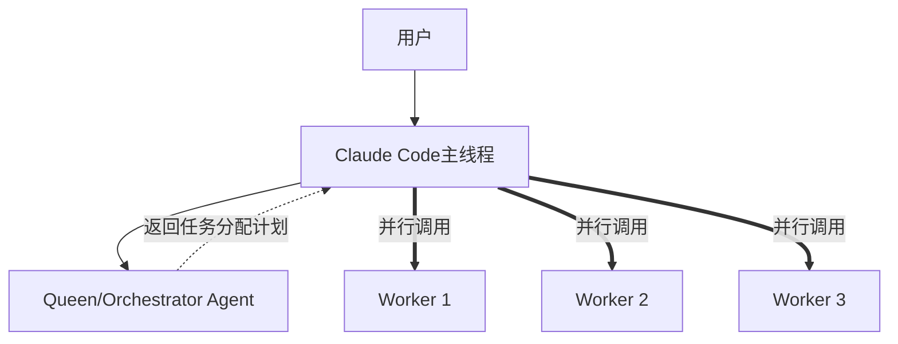

# 🚀 如何实现真正的并行执行（克服SubAgent限制）

## 🔴 核心限制
**SubAgent只能被Claude Code调用，不能互相调用**

## 💡 解决方案：重新定义"并行"

### 方案1：Claude Code的批量调用（最简单）

#### 现在的错误方式 ❌
```python
# Claude Code顺序调用（伪代码）
result1 = Task("backend-architect", "设计后端")
# 等待result1完成...
result2 = Task("frontend-specialist", "设计前端")
# 等待result2完成...
result3 = Task("test-engineer", "写测试")
# 这是串行的！
```

#### 正确的并行方式 ✅
```python
# Claude Code在一个消息中同时调用多个Task
[
    Task("backend-architect", "设计后端"),
    Task("frontend-specialist", "设计前端"),
    Task("test-engineer", "写测试")
]
# Claude Code同时发出3个Task调用
# 3个agents并行工作
# Claude Code等待所有结果返回
```

**关键**：Claude Code支持在一个回复中使用多个工具！

### 方案2：Queen-Worker模式（协调而非调用）



#### 实现方式
```python
# 步骤1：Claude Code调用orchestrator获取计划
plan = Task("orchestrator", "分析任务并返回执行计划")

# orchestrator返回：
{
  "parallel_tasks": [
    {"agent": "backend-architect", "prompt": "..."},
    {"agent": "frontend-specialist", "prompt": "..."},
    {"agent": "test-engineer", "prompt": "..."}
  ]
}

# 步骤2：Claude Code根据计划并行调用
[Task(t["agent"], t["prompt"]) for t in plan["parallel_tasks"]]
```

### 方案3：Git Worktree隔离（多Claude实例）

```bash
# 启动多个独立的Claude Code实例
# 每个在不同的worktree工作

Terminal 1: claude-code --worktree=feature-auth
Terminal 2: claude-code --worktree=feature-api
Terminal 3: claude-code --worktree=feature-ui

# 通过文件系统或消息队列协调
```

### 方案4：Stream-JSON链式通信

```python
# Claude Code作为管道协调者
# Agent A的输出 -> Claude Code -> Agent B的输入

# 伪并行：快速切换
for round in range(10):
    # 每轮并行调用不同组合
    if round % 2 == 0:
        results = [Task("agent1", f"round {round}"),
                  Task("agent2", f"round {round}")]
    else:
        results = [Task("agent3", f"process {prev_results}"),
                  Task("agent4", f"validate {prev_results}")]
```

### 方案5：Session管理（真正的解决方案）

业界的**claude-flow**实现：

```javascript
// 他们可能使用了Claude API而非CLI
// 这样可以管理多个会话

const session1 = new ClaudeSession()
const session2 = new ClaudeSession()
const session3 = new ClaudeSession()

// 真正的并行
await Promise.all([
  session1.send("Task for backend"),
  session2.send("Task for frontend"),
  session3.send("Task for testing")
])
```

## 🎯 Perfect21可以立即实施的方案

### 1. 修改Task调用模式

#### 现在（你的习惯）
```python
# 分开调用 - 串行
Task("agent1", "prompt1")
# 等待...
Task("agent2", "prompt2")
```

#### 应该（Perfect21要求）
```python
# 同时调用 - 并行
Task("agent1", "prompt1")
Task("agent2", "prompt2")
Task("agent3", "prompt3")
# 在一个消息中发出所有Task
```

### 2. 动态工作流生成器改进

```python
class DynamicWorkflowGenerator:
    def generate_parallel_batch(self, stage):
        """生成并行任务批次"""
        if len(stage.agents) > 1:
            return {
                "execution": "BATCH",  # 新模式
                "tasks": [
                    {"agent": agent, "prompt": self.get_prompt(agent)}
                    for agent in stage.agents
                ]
            }
```

### 3. 执行指令优化

```python
# 在CLAUDE.md中明确指示
"""
当看到execution="BATCH"时，你必须：
1. 在一个回复中调用所有agents
2. 不要等待第一个完成再调第二个
3. 收集所有结果后再继续

示例：
阶段1: [BATCH]
  - backend-architect
  - frontend-specialist
  - test-engineer

你应该：
[立即同时调用3个Task，不是分3次]
"""
```

## 📊 技术原理

### Claude Code的工具调用机制

```xml
<!-- Claude Code可以在一个回复中多次调用工具 -->
<function_calls>
  <invoke tool="Task" agent="backend-architect">...</invoke>
  <invoke tool="Task" agent="frontend-specialist">...</invoke>
  <invoke tool="Task" agent="test-engineer">...</invoke>
</function_calls>
<!-- 这3个调用同时发出，同时执行 -->
```

### 为什么现在没有并行？

1. **习惯问题**：Claude Code习惯等待一个Task完成再调下一个
2. **指令不明确**：Perfect21没有强制要求批量调用
3. **工作流设计**：没有明确标记哪些必须并行

## ✅ 立即可用的解决方案

### 1. 修改动态工作流生成器

```python
def generate_execution_instruction(self, stage):
    if len(stage.agents) > 1:
        return f"""
        !!! 并行执行要求 !!!
        以下{len(stage.agents)}个agents必须在同一个消息中并行调用：
        {', '.join(stage.agents)}

        不要顺序调用！必须同时调用！
        """
```

### 2. 添加执行验证器

```python
class ExecutionValidator:
    def validate_parallel_execution(self, message):
        """检查是否真的并行调用"""
        task_calls = message.count("Task(")
        if task_calls > 1:
            # 检查是否在同一个function_calls块中
            return "function_calls" in message
        return True
```

### 3. 创建并行执行模板

```python
PARALLEL_TEMPLATE = """
我现在将并行执行{agent_count}个agents：

<function_calls>
{parallel_tasks}
</function_calls>

等待所有agents完成...
"""
```

## 🔥 最终答案

**如何克服subagent只能被Claude Code调用的限制？**

1. **不需要克服** - 利用Claude Code本身支持批量工具调用
2. **关键在执行方式** - 同时调用 vs 顺序调用
3. **Perfect21应该做的** - 强制Claude Code批量执行

**核心洞察**：
- 限制不是"只能Claude Code调用"
- 而是"Claude Code没有并行调用"
- 解决方案：改变Claude Code的调用习惯！

---

业界的claude-flow可能使用了：
1. Claude API（非CLI）- 可以管理多session
2. 多个Claude Code实例 - 通过文件系统协调
3. 批量工具调用 - 我们也可以做到！

Perfect21完全可以实现真正的并行，只需要改变执行模式！