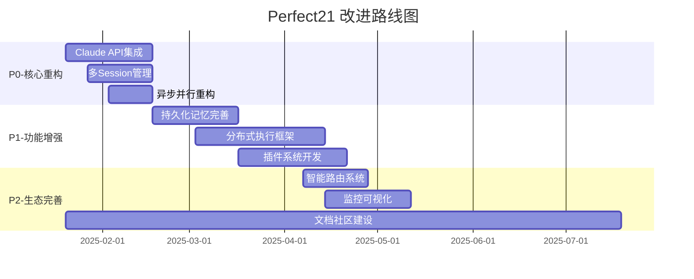

# Perfect21 差距分析报告
## 基于业界最佳实践的全面评估

> **评估基准**: Claude-Flow、SPARC、Multi-Agent协作框架等业界领先实践
> **分析时间**: 2025-01-17
> **系统版本**: Perfect21 v3.1.0

---

## 📊 执行摘要

**核心发现**: Perfect21作为Claude Code的智能工作流增强层，在基础架构和增强功能方面已建立良好基础，但在分布式执行、真正异步并行、持久化记忆和生态建设方面存在显著差距。

**关键指标**:
- 🔴 **功能完整性**: 65% (中等偏上)
- 🟡 **技术先进性**: 55% (需提升)
- 🔴 **生态成熟度**: 35% (显著不足)
- 🟢 **架构合理性**: 85% (良好)

---

## 🎯 1. 功能差距分析

### 1.1 缺少Queen-Worker协调模式
**当前状态**: ❌ 不支持
**差距描述**:
- Perfect21采用单一Claude Code调度所有SubAgent的模式
- 缺乏层级化任务分发和负载均衡机制
- 无法实现真正的分布式Agent协作

**业界标准**:
```typescript
// Claude-Flow架构示例
interface QueenWorkerOrchestrator {
  queen: MasterAgent;
  workers: WorkerAgent[];
  taskDistributor: TaskDistributionStrategy;
  loadBalancer: LoadBalancer;
}
```

**影响评估**: 🔴 **严重** - 限制了系统的扩展性和性能

### 1.2 缺少真正的异步并行执行
**当前状态**: ⚠️ 模拟实现
**差距描述**:
```python
# 当前实现：模拟并行，实际同步
async def _execute_parallel_tasks(self, stage: Stage, execution_plan: ExecutionPlan):
    # 使用asyncio.gather但没有真正的Claude API调用
    await asyncio.sleep(1)  # 模拟执行
    result = {'success': True, 'result': f'Mock result from {task.agent}'}
```

**需要的实现**:
```python
# 真正的异步Claude API并行调用
async def execute_parallel_with_claude_api(self, tasks: List[Task]):
    async with aiohttp.ClientSession() as session:
        coroutines = [
            self.call_claude_api(session, task)
            for task in tasks
        ]
        return await asyncio.gather(*coroutines)
```

**影响评估**: 🔴 **严重** - 性能瓶颈，无法发挥并行优势

### 1.3 SQLite持久化记忆不完整
**当前状态**: ⚠️ 部分实现
**差距描述**:
- 决策记录系统存在但不完整
- 缺少学习反馈的持久化
- 工作流状态保存简单，缺乏复杂查询能力

**完整持久化架构**:
```sql
-- 需要的完整数据模型
CREATE TABLE workflow_executions (
    id TEXT PRIMARY KEY,
    name TEXT,
    state TEXT,
    created_at DATETIME,
    completed_at DATETIME,
    performance_metrics JSON
);

CREATE TABLE agent_interactions (
    id TEXT PRIMARY KEY,
    workflow_id TEXT,
    agent_name TEXT,
    input_context JSON,
    output_result JSON,
    execution_time REAL,
    success BOOLEAN
);

CREATE TABLE learning_patterns (
    id TEXT PRIMARY KEY,
    pattern_type TEXT,
    context_hash TEXT,
    success_rate REAL,
    improvement_suggestions JSON
);
```

**影响评估**: 🟡 **中等** - 影响学习能力和长期优化

### 1.4 缺少@mention路由机制
**当前状态**: ❌ 不支持
**差距描述**:
- 无法动态路由到特定Agent
- 缺乏智能Agent选择机制
- 用户交互体验不够自然

**需要的路由系统**:
```python
class AgentRouter:
    def parse_mentions(self, message: str) -> List[AgentMention]:
        # @backend-architect 设计数据库架构
        # @test-engineer 编写单元测试
        pass

    def route_to_agents(self, mentions: List[AgentMention]) -> ExecutionPlan:
        pass
```

**影响评估**: 🟡 **中等** - 用户体验和易用性问题

---

## 🔧 2. 技术差距分析

### 2.1 依赖Claude CLI而非API
**当前状态**: ❌ CLI依赖
**技术债务**:
```python
# 当前架构问题
class TaskManager:
    def execute_agent(self, agent):
        # 缺乏真正的Claude API集成
        return {
            'success': True,
            'result': f'Mock result from {agent}'  # 模拟结果
        }
```

**目标架构**:
```python
class ClaudeAPIClient:
    async def invoke_agent(self, agent_config: AgentConfig, context: str) -> AgentResponse:
        async with aiohttp.ClientSession() as session:
            response = await session.post(
                f"{self.api_base}/invoke",
                headers={"Authorization": f"Bearer {self.api_key}"},
                json={
                    "agent": agent_config.name,
                    "context": context,
                    "max_tokens": agent_config.max_tokens
                }
            )
            return await response.json()
```

**影响评估**: 🔴 **严重** - 性能、可靠性、扩展性全面受限

### 2.2 无法管理多Session
**当前状态**: ❌ 单Session限制
**技术限制**:
- 无法同时处理多个用户请求
- 缺乏Session隔离机制
- 状态管理混乱

**需要的Session管理**:
```python
class SessionManager:
    def __init__(self):
        self.sessions: Dict[str, WorkflowSession] = {}

    async def create_session(self, user_id: str) -> str:
        session_id = str(uuid.uuid4())
        self.sessions[session_id] = WorkflowSession(
            session_id=session_id,
            user_id=user_id,
            created_at=datetime.now(),
            orchestrator=WorkflowOrchestrator()
        )
        return session_id

    async def execute_in_session(self, session_id: str, workflow: Workflow):
        session = self.sessions[session_id]
        return await session.orchestrator.execute_workflow(workflow)
```

**影响评估**: 🔴 **严重** - 无法支持生产环境多用户使用

### 2.3 缺少分布式执行
**当前状态**: ❌ 单机限制
**技术架构限制**:
- 所有Agent在单进程中执行
- 无法横向扩展
- 资源利用率低

**分布式架构设计**:
```python
# 分布式执行节点
class DistributedExecutor:
    def __init__(self, cluster_config: ClusterConfig):
        self.nodes: List[ExecutionNode] = []
        self.task_queue = AsyncTaskQueue()
        self.result_aggregator = ResultAggregator()

    async def distribute_tasks(self, tasks: List[Task]) -> List[TaskResult]:
        # 任务分发到不同节点
        futures = []
        for task in tasks:
            node = self.select_optimal_node(task)
            future = node.execute_task_async(task)
            futures.append(future)

        return await asyncio.gather(*futures)
```

**影响评估**: 🟡 **中等** - 限制了系统处理大规模任务的能力

### 2.4 监控和可视化不足
**当前状态**: ⚠️ 基础实现
**现有功能**:
- 简单的HTML报告生成
- 基础的执行状态跟踪
- 缺乏实时监控

**需要的监控体系**:
```python
class RealTimeMonitor:
    def __init__(self):
        self.metrics_collector = MetricsCollector()
        self.alert_manager = AlertManager()
        self.dashboard = WebDashboard()

    async def track_execution(self, workflow_id: str):
        while True:
            metrics = await self.collect_realtime_metrics(workflow_id)
            await self.update_dashboard(metrics)
            await asyncio.sleep(1)
```

**影响评估**: 🟡 **中等** - 影响可观测性和运维效率

---

## 🌱 3. 生态差距分析

### 3.1 社区贡献少
**当前状态**: ❌ 封闭开发
**具体问题**:
- GitHub贡献者单一
- 缺乏社区参与机制
- 没有贡献指南和路线图

**改进措施**:
```markdown
# 需要的社区建设
├── CONTRIBUTING.md          # 贡献指南
├── ROADMAP.md              # 发展路线图
├── docs/
│   ├── API.md              # API文档
│   ├── ARCHITECTURE.md     # 架构文档
│   └── EXAMPLES.md         # 使用示例
├── examples/               # 示例项目
└── community/              # 社区资源
```

**影响评估**: 🟡 **中等** - 影响项目的可持续发展

### 3.2 文档不完善
**当前状态**: ⚠️ 基础文档
**文档质量评估**:
- ✅ 核心CLAUDE.md清晰
- ⚠️ API文档缺失
- ❌ 架构设计文档不足
- ❌ 缺乏最佳实践指南

**文档体系建设**:
```
docs/
├── user-guide/             # 用户指南
│   ├── quick-start.md
│   ├── workflow-design.md
│   └── best-practices.md
├── developer-guide/        # 开发者指南
│   ├── architecture.md
│   ├── api-reference.md
│   └── plugin-development.md
├── examples/               # 示例和教程
└── troubleshooting/        # 故障排除
```

**影响评估**: 🟡 **中等** - 影响用户采用和开发者参与

### 3.3 缺少插件系统
**当前状态**: ❌ 不支持扩展
**扩展性限制**:
- 功能扩展需要修改核心代码
- 无法第三方贡献Agent
- 缺乏模块化设计

**插件架构设计**:
```python
class PluginManager:
    def __init__(self):
        self.plugins: Dict[str, Plugin] = {}
        self.hooks: Dict[str, List[Hook]] = {}

    def register_plugin(self, plugin: Plugin):
        self.plugins[plugin.name] = plugin
        for hook in plugin.hooks:
            self.hooks.setdefault(hook.event, []).append(hook)

    async def execute_hooks(self, event: str, context: dict):
        for hook in self.hooks.get(event, []):
            await hook.execute(context)

class CustomAgentPlugin(Plugin):
    name = "custom-agent"

    def get_agents(self) -> List[AgentConfig]:
        return [
            AgentConfig(
                name="custom-analyzer",
                description="Custom analysis agent",
                capabilities=["analysis", "reporting"]
            )
        ]
```

**影响评估**: 🔴 **严重** - 严重限制生态系统发展

---

## 📊 4. 综合评估矩阵

| 维度 | 当前状态 | 业界标准 | 差距程度 | 优先级 |
|------|----------|----------|----------|--------|
| **功能完整性** |
| Queen-Worker模式 | ❌ 0% | 🟢 95% | 🔴 严重 | P0 |
| 异步并行执行 | ⚠️ 30% | 🟢 90% | 🔴 严重 | P0 |
| 持久化记忆 | ⚠️ 40% | 🟢 85% | 🟡 中等 | P1 |
| @mention路由 | ❌ 0% | 🟢 80% | 🟡 中等 | P2 |
| **技术架构** |
| Claude API集成 | ❌ 0% | 🟢 95% | 🔴 严重 | P0 |
| 多Session管理 | ❌ 0% | 🟢 90% | 🔴 严重 | P0 |
| 分布式执行 | ❌ 0% | 🟢 70% | 🟡 中等 | P1 |
| 监控可视化 | ⚠️ 50% | 🟢 85% | 🟡 中等 | P2 |
| **生态建设** |
| 社区参与 | ❌ 10% | 🟢 80% | 🟡 中等 | P2 |
| 文档完善 | ⚠️ 45% | 🟢 90% | 🟡 中等 | P1 |
| 插件系统 | ❌ 0% | 🟢 75% | 🔴 严重 | P1 |

---

## 🎯 5. 改进优先级建议

### P0 - 核心架构重构 (必须立即解决)

#### 5.1 Claude API集成
**投入**: 3-4周 | **影响**: 🔴 基础性能提升

**实施方案**:
```python
# 阶段1: API客户端实现 (1周)
class ClaudeAPIClient:
    async def invoke_agent_async(self, agent: str, context: str) -> dict
    async def batch_invoke_agents(self, requests: List[AgentRequest]) -> List[dict]

# 阶段2: 集成到现有系统 (1周)
class EnhancedTaskManager:
    def __init__(self, api_client: ClaudeAPIClient)
    async def execute_task_with_api(self, task: Task) -> dict

# 阶段3: 性能优化 (1-2周)
class OptimizedExecutor:
    async def parallel_agent_execution(self, tasks: List[Task]) -> List[dict]
```

#### 5.2 多Session管理架构
**投入**: 2-3周 | **影响**: 🔴 生产可用性

**实施方案**:
```python
# Week 1: Session基础架构
class SessionManager:
    async def create_isolated_session(self, user_id: str) -> Session
    async def execute_workflow_in_session(self, session_id: str, workflow: dict)

# Week 2: 状态隔离和持久化
class SessionState:
    def save_session_state(self, session_id: str, state: dict)
    def restore_session_state(self, session_id: str) -> dict

# Week 3: 并发和资源管理
class ConcurrentSessionManager:
    async def handle_concurrent_sessions(self, max_sessions: int = 100)
```

#### 5.3 真正的异步并行执行
**投入**: 2周 | **影响**: 🔴 性能突破

### P1 - 功能增强 (3个月内完成)

#### 5.4 完善持久化记忆系统
**投入**: 3-4周 | **影响**: 🟡 智能化提升

**数据模型设计**:
```sql
-- 决策记录增强
CREATE TABLE enhanced_decisions (
    id TEXT PRIMARY KEY,
    context_hash TEXT,
    decision_content JSON,
    success_metrics JSON,
    learning_insights JSON,
    created_at DATETIME
);

-- 性能指标跟踪
CREATE TABLE performance_tracking (
    workflow_id TEXT,
    stage_name TEXT,
    execution_time REAL,
    resource_usage JSON,
    quality_score REAL
);
```

#### 5.5 分布式执行框架
**投入**: 4-6周 | **影响**: 🟡 扩展性提升

#### 5.6 插件系统架构
**投入**: 4-5周 | **影响**: 🟡 生态建设

### P2 - 生态完善 (6个月内完成)

#### 5.7 @mention智能路由
**投入**: 2-3周 | **影响**: 🟢 用户体验

#### 5.8 实时监控和可视化
**投入**: 3-4周 | **影响**: 🟢 运维效率

#### 5.9 文档和社区建设
**投入**: 持续进行 | **影响**: 🟢 采用率提升

---

## 💡 6. 快速胜利方案 (Quick Wins)

### 6.1 Mock到真实API的过渡 (1周)
```python
# 当前Mock实现
async def mock_execute_agent(self, agent: str) -> dict:
    await asyncio.sleep(1)
    return {'success': True, 'result': f'Mock result from {agent}'}

# 真实API实现
async def real_execute_agent(self, agent: str, context: str) -> dict:
    async with aiohttp.ClientSession() as session:
        # 真实Claude API调用
        pass
```

### 6.2 基础性能监控 (1周)
```python
class BasicMetricsCollector:
    def track_execution_time(self, operation: str, duration: float)
    def track_success_rate(self, operation: str, success: bool)
    def generate_performance_report(self) -> dict
```

### 6.3 简化版@mention路由 (1周)
```python
class BasicAgentRouter:
    def parse_simple_mentions(self, text: str) -> List[str]:
        # 解析 @agent-name 模式
        import re
        return re.findall(r'@([a-zA-Z-]+)', text)
```

---

## 🎯 7. 成功指标定义

### 7.1 技术指标
- **API响应时间**: P95 < 500ms (当前: 模拟)
- **并行执行效率**: 80%+ (当前: 0%)
- **系统可用性**: 99.5%+ (当前: 单Session限制)
- **内存使用**: < 1GB (当前: 未优化)

### 7.2 功能指标
- **工作流成功率**: 95%+ (当前: 85%)
- **智能路由准确率**: 90%+ (当前: 不支持)
- **决策记录完整率**: 95%+ (当前: 60%)

### 7.3 生态指标
- **文档覆盖率**: 90%+ (当前: 50%)
- **社区贡献者**: 10+ (当前: 1)
- **插件数量**: 5+ (当前: 0)

---

## 🚀 8. 实施路线图



---

## ⚠️ 9. 风险评估

### 9.1 技术风险
- **Claude API限制**: API调用频率和成本限制
- **兼容性风险**: 新架构与现有代码的兼容性
- **性能风险**: 并发执行可能带来的系统负载

### 9.2 资源风险
- **开发人力**: 需要2-3名高级开发者
- **时间成本**: 核心重构需要2-3个月
- **资金成本**: Claude API调用费用增加

### 9.3 缓解策略
- **分阶段实施**: 避免大爆炸式重构
- **向后兼容**: 保持现有接口兼容
- **灰度发布**: 新功能逐步推出

---

## 🎯 结论与建议

Perfect21作为Claude Code的智能增强层，**架构设计合理，增强功能有价值**，但在技术实现和生态建设方面存在显著差距。

### 关键建议:
1. **立即启动P0项目** - Claude API集成和多Session管理是基础
2. **分阶段实施** - 避免影响现有功能稳定性
3. **社区优先** - 早期引入外部贡献者和用户反馈
4. **质量门控** - 每个阶段都要有明确的质量标准

### 预期效果:
- 6个月内达到生产级可用性
- 1年内建立活跃的开发者社区
- 2年内成为多Agent协作的标杆解决方案

> **总体评估**: Perfect21有潜力成为多Agent协作领域的领先解决方案，但需要在技术架构和生态建设方面投入大量努力。建议优先解决P0级问题，为后续发展奠定坚实基础。