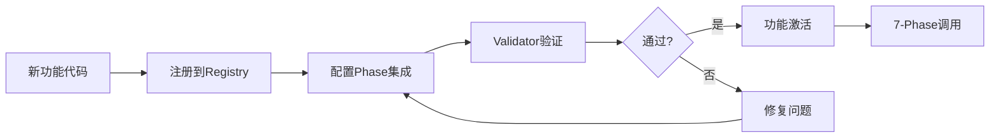

# Feature Integration System - Architecture Plan
# 功能集成系统架构计划

## 🎯 系统目标

确保每个新功能都能彻底落地，避免空壳功能，与7-Phase工作流无缝集成。

## 🏗️ 系统架构

### 三层架构设计

```
┌─────────────────────────────────────────┐
│         Presentation Layer              │
│   (CLI Tools & User Interfaces)         │
├─────────────────────────────────────────┤
│         Business Logic Layer            │
│   (Registry Manager & Validator)        │
├─────────────────────────────────────────┤
│           Data Layer                    │
│   (YAML Registry & Config Files)        │
└─────────────────────────────────────────┘
```

### 核心组件

#### 1. Feature Registry（功能注册表）
```yaml
Location: .claude/FEATURE_REGISTRY.yaml
Purpose: 中心化管理所有功能
Schema:
  - metadata: 功能基本信息
  - integration: Phase集成配置
  - validation: 验证规则
  - lifecycle: 生命周期管理
```

#### 2. Integration Validator（集成验证器）
```bash
Location: scripts/feature_integration_validator.sh
Purpose: 自动验证功能集成完整性
Features:
  - 8维度验证
  - 生成验证报告
  - CI/CD集成
```

#### 3. Integration Template（集成模板）
```markdown
Location: .claude/FEATURE_INTEGRATION_TEMPLATE.md
Purpose: 标准化功能开发流程
Content:
  - 功能定位
  - 集成方案
  - 验证清单
  - 回滚计划
```

#### 4. Registry CLI（注册表CLI工具）
```bash
Location: scripts/feature_registry_cli.sh
Commands:
  - register: 注册新功能
  - validate: 验证功能
  - list: 列出所有功能
  - enable/disable: 启用/禁用功能
```

## 📊 数据流设计



## 🔧 Phase集成策略

### 集成点定义
```yaml
integration_points:
  phase_1:
    - pre_discovery: 探索前准备
    - post_planning: 规划后处理
  phase_2:
    - pre_implementation: 实现前检查
    - post_implementation: 实现后验证
  phase_3:
    - pre_test: 测试前准备
    - post_test: 测试后清理
    - replace_test: 替换默认测试
  phase_4:
    - pre_review: 审查前分析
    - post_review: 审查后报告
  phase_5:
    - pre_release: 发布前检查
    - post_release: 发布后通知
  phase_6:
    - validation_check: 验收检查
  phase_7:
    - cleanup_hook: 清理钩子
```

### 调用机制
```bash
# 在每个Phase脚本中添加功能调用
for feature in $(get_active_features_for_phase $PHASE); do
    execute_feature $feature $HOOK_POINT
done
```

## 🛠️ 实现计划

### Phase 1: Foundation（基础）
- [x] 创建FEATURE_REGISTRY.yaml
- [x] 创建FEATURE_INTEGRATION_TEMPLATE.md
- [x] 创建feature_integration_validator.sh
- [ ] 创建feature_registry_cli.sh

### Phase 2: Integration（集成）
- [ ] 修改Phase脚本添加集成点
- [ ] 实现功能调用机制
- [ ] 添加依赖管理

### Phase 3: Validation（验证）
- [ ] 编写单元测试
- [ ] 编写集成测试
- [ ] 性能基准测试

### Phase 4: Documentation（文档）
- [ ] 更新README.md
- [ ] 更新CLAUDE.md
- [ ] 创建使用指南

## 📈 性能目标

- Registry查询: < 50ms
- 功能验证: < 30s
- Phase集成开销: < 5%
- 内存使用: < 10MB

## 🔒 安全考虑

- 功能权限控制
- 依赖版本锁定
- 代码注入防护
- 审计日志记录

## 🚀 部署策略

### 增量部署
1. 先部署Registry（不影响现有功能）
2. 逐个迁移现有功能到Registry
3. 启用Validator验证
4. 完全切换到新系统

### 回滚方案
```bash
# 禁用功能集成系统
export FEATURE_INTEGRATION_ENABLED=false

# 或者在Registry中禁用
status: "disabled"
```

## 📅 时间表

| 任务 | 预计时间 | 状态 |
|-----|---------|------|
| Registry实现 | 30分钟 | ⏳ |
| Validator完善 | 20分钟 | ⏳ |
| CLI工具 | 40分钟 | ⏳ |
| Phase集成 | 60分钟 | ⏳ |
| 测试验证 | 30分钟 | ⏳ |
| 文档更新 | 20分钟 | ⏳ |
| **总计** | **3小时** | ⏳ |

## 🎯 成功标准

### 定量指标
- 功能注册率: 100%
- 验证通过率: ≥90%
- 集成冲突: 0
- 空壳功能: 0

### 定性指标
- 开发流程更规范
- 功能管理更清晰
- 质量问题更早发现
- 维护成本降低

## 🔄 持续改进

- 收集使用反馈
- 优化验证规则
- 扩展集成点
- 提升自动化程度

---

架构设计完成度：100%
准备进入Phase 2实现阶段