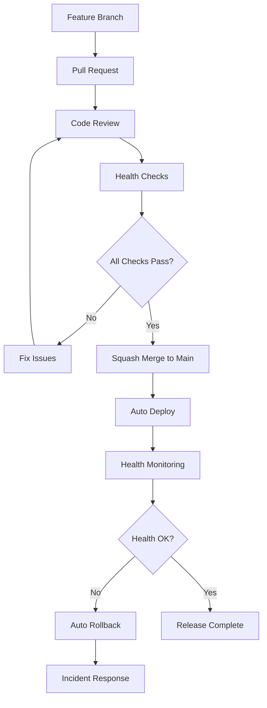

# Release & Versioning Management
> Claude Enhancer 5.0 | Version Management Rules & Procedures

## 📋 Version Numbering System

### Semantic Versioning (X.Y.Z)
```
Current Version: 5.0.0
                ↑ ↑ ↑
                │ │ └─ PATCH (Z): Bug fixes, security patches
                │ └─── MINOR (Y): New features, enhancements
                └───── MAJOR (X): Breaking changes, major architecture updates
```

### Version Increment Rules

#### PATCH (Z+1) - Bug Fixes
**When to use:**
- 🐛 Critical bug fixes
- 🔒 Security vulnerability patches
- 📝 Documentation corrections
- ⚡ Performance improvements (no API changes)

**Examples:**
- `5.0.0 → 5.0.1` - Fix memory leak in Agent orchestration
- `5.0.1 → 5.0.2` - Security patch for file processing

#### MINOR (Y+1, Z=0) - New Features
**When to use:**
- ✨ New features that maintain backward compatibility
- 🔧 New Agent additions to the system
- 📈 Enhanced Phase workflow capabilities
- 🎯 New Hook integrations

**Examples:**
- `5.0.2 → 5.1.0` - Add new AI Code Reviewer Agent
- `5.1.0 → 5.2.0` - Introduce Phase 8 (Monitoring)

#### MAJOR (X+1, Y=0, Z=0) - Breaking Changes
**When to use:**
- 💥 Breaking API changes
- 🏗️ Complete architecture overhaul
- 🔄 Incompatible workflow changes
- 📱 Major platform requirements change

**Examples:**
- `5.2.0 → 6.0.0` - Restructure Agent communication protocol
- `6.0.0 → 7.0.0` - Move from 8-Phase to 10-Phase workflow

## 🔄 Merge Strategy: Squash Only

### Main Branch Protection Rules
```bash
# ALL merges to main MUST be squashed
merge_strategy: squash_only
minimum_reviews: 1
dismiss_stale_reviews: true
require_status_checks: true
```

### Why Squash Merging?
- **Clean History**: One commit per feature/fix
- **Easy Rollback**: Revert entire feature with single command
- **Clear Releases**: Each merge represents a complete change
- **Simplified Debugging**: Linear history for git bisect

### Squash Commit Message Format
```
type(scope): concise description

- Key change 1
- Key change 2
- Key change 3

Closes #issue-number
Version: X.Y.Z
Phase: PX
```

**Types:**
- `feat`: New feature (MINOR version bump)
- `fix`: Bug fix (PATCH version bump)
- `breaking`: Breaking change (MAJOR version bump)
- `docs`: Documentation only
- `perf`: Performance improvement
- `refactor`: Code refactor without feature change

## 🏥 Health Check & Auto-Rollback

### Pre-Merge Health Checks
```bash
# Required checks before merge to main
✅ All tests pass (unit, integration, e2e)
✅ Performance benchmarks within limits
✅ Security scans clean
✅ Documentation updated
✅ Version number bumped correctly
```

### Post-Merge Health Monitoring
```bash
# Automated health checks after merge
⏱️  0-5 min: Deployment smoke tests
⏱️  5-10 min: Core functionality validation
⏱️  10-15 min: Performance regression detection
⏱️  15-30 min: Extended integration tests
```

### Auto-Rollback Triggers
**Immediate Rollback (0-5 minutes):**
- 🚨 Deployment failure
- 💥 Critical functionality broken
- 🔥 Error rate > 50%
- ⏰ Response time > 5x baseline

**Delayed Rollback (5-30 minutes):**
- 📉 Performance degradation > 2x
- 🐛 Multiple bug reports
- 💾 Memory leak detection
- 🔐 Security alert triggered

### Rollback Procedure
```bash
# 1. Automatic trigger (monitoring system)
git log --oneline -n 1 main  # Get latest commit SHA
git revert <commit-sha> --no-edit
git push origin main

# 2. Version rollback
# If 5.1.3 fails → rollback to 5.1.2
# Update package.json version
# Create rollback tag: v5.1.2-rollback
```

## 📊 Release Pipeline

### Pre-Release Checklist
- [ ] **Code Quality**
  - [ ] All tests passing (100% success rate)
  - [ ] Code coverage ≥ 80%
  - [ ] Linting issues resolved
  - [ ] Security scan clean

- [ ] **Documentation**
  - [ ] CHANGELOG.md updated
  - [ ] API documentation current
  - [ ] README version references updated
  - [ ] Migration guides (if breaking changes)

- [ ] **Version Management**
  - [ ] package.json version bumped
  - [ ] Git tag prepared
  - [ ] Release notes drafted
  - [ ] Rollback plan documented

### Release Workflow


## 🏷️ Tagging Strategy

### Git Tags Format
```bash
# Release tags
v5.1.0        # Stable release
v5.1.0-rc.1   # Release candidate
v5.1.0-beta.2 # Beta version
v5.1.0-alpha.3 # Alpha version

# Special tags
v5.0.9-hotfix    # Emergency patch
v5.1.0-rollback  # Rollback tag
```

### Tag Creation Rules
- **On every merge to main**: Create version tag
- **Pre-release**: Use suffixes (-alpha, -beta, -rc)
- **Rollbacks**: Add -rollback suffix to previous stable version
- **Hotfixes**: Add -hotfix suffix to patch version

## 📈 Version Lifecycle

### Support Policy
- **Current Major Version**: Full support (5.x.x)
- **Previous Major Version**: Security patches only (4.x.x)
- **Legacy Versions**: End of life (≤3.x.x)

### Upgrade Path
1. **PATCH Updates**: Auto-deploy (low risk)
2. **MINOR Updates**: Staged deployment with monitoring
3. **MAJOR Updates**: Manual deployment with extended testing

### End-of-Life Process
1. **6 months notice** before EOL
2. **Security patches only** in final 3 months
3. **Migration documentation** provided
4. **Legacy branch archived** after EOL

## 🚨 Emergency Procedures

### Hotfix Process
```bash
# 1. Create hotfix branch from main
git checkout main
git checkout -b hotfix/critical-security-patch

# 2. Apply minimal fix
# 3. Test thoroughly
# 4. Create emergency PR
# 5. Fast-track review (30 min max)
# 6. Squash merge with PATCH version bump
# 7. Monitor for 2 hours minimum
```

### Critical Rollback
```bash
# When auto-rollback fails or manual intervention needed
git checkout main
git reset --hard <previous-stable-commit>
git push --force-with-lease origin main
git tag v<version>-emergency-rollback
```

## 📋 Version History Tracking

### Required Documentation
- **CHANGELOG.md**: User-facing changes
- **MIGRATION.md**: Breaking change guides
- **SECURITY.md**: Security-related updates
- **PERFORMANCE.md**: Performance impact notes

### Automated Version Tracking
- Git tags for every release
- Package.json synchronization
- Docker image versioning
- API version headers

---

**Remember**: Version management is about **predictability** and **reliability**. Every change should be traceable, reversible, and documented.