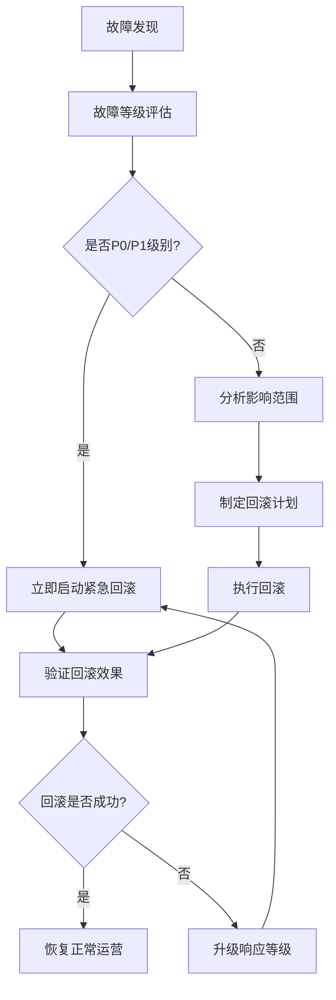

# Claude Enhancer 5.0 回滚和容灾方案

## 📋 概览

Claude Enhancer 5.0 采用多层次、全方位的回滚和容灾策略，确保在任何阶段出现问题时都能快速、安全地恢复到稳定状态。

## 🎯 设计原则

### 1. 分层防护原则
- **Git层**: 代码版本回滚
- **数据库层**: 数据备份与恢复
- **配置层**: 配置文件版本控制
- **应用层**: 服务和部署回滚

### 2. 时效性原则
- **P0级故障**: 5分钟内回滚
- **P1级故障**: 15分钟内回滚
- **P2级故障**: 30分钟内回滚
- **P3级故障**: 1小时内回滚

### 3. 最小影响原则
- 优先部分回滚，避免全系统回滚
- 保持服务连续性
- 数据完整性优先

## 🔧 1. 代码回滚策略

### 1.1 Git分支管理策略

```
main (生产稳定分支)
├── release/v5.1 (发布分支)
├── develop (开发分支)
├── feature/task-{id} (功能分支)
├── hotfix/critical-{id} (紧急修复分支)
└── rollback/emergency-{timestamp} (回滚分支)
```

### 1.2 自动标签策略

**检查点标签**
```bash
# Phase完成标签
checkpoint-P1-task-123-20250927_143021
checkpoint-P6-release-v5.1-20250927_150000

# 紧急回滚点标签
rollback-before-hotfix-20250927_143500
rollback-manual-checkpoint-20250927_144000
```

**使用方法**
```bash
# 创建Phase标签
./rollback-strategy/git-tagging-strategy.sh phase P3 task-456

# 创建回滚点
./rollback-strategy/git-tagging-strategy.sh rollback "before-critical-change"

# 列出回滚点
./rollback-strategy/git-tagging-strategy.sh list

# 清理旧标签
./rollback-strategy/git-tagging-strategy.sh cleanup 15
```

### 1.3 Git回滚执行

**快速回滚**
```bash
# 回滚到最近的稳定点
git checkout rollback-manual-checkpoint-20250927_143021

# 创建紧急分支继续工作
git checkout -b emergency-fix-$(date +%Y%m%d_%H%M%S)
```

## 🗄️ 2. 数据库回滚策略

### 2.1 备份策略

**自动备份调度**
- **每日全量备份**: 凌晨2点执行
- **每小时增量备份**: 工作时间内执行
- **Phase节点备份**: 每个Phase完成时自动备份

**备份类型**
- **完整备份**: 包含所有数据和结构
- **增量备份**: 仅备份变更数据
- **架构备份**: 仅包含表结构

### 2.2 备份管理

```bash
# 创建完整备份
python rollback-strategy/database-backup-manager.py backup --type full --description "Pre-deployment backup"

# 创建架构备份
python rollback-strategy/database-backup-manager.py backup --type schema

# 列出可用备份
python rollback-strategy/database-backup-manager.py list --limit 10

# 验证备份完整性
python rollback-strategy/database-backup-manager.py verify backup_id

# 恢复备份
python rollback-strategy/database-backup-manager.py restore backup_id --confirm
```

### 2.3 Migration回滚

**快照管理**
```bash
# 创建Migration快照
python rollback-strategy/migration-rollback-manager.py snapshot --description "Before major schema change"

# 安全升级（自动创建快照）
python rollback-strategy/migration-rollback-manager.py upgrade --revision head

# 回滚到指定版本
python rollback-strategy/migration-rollback-manager.py rollback revision_id --confirm

# 验证回滚安全性
python rollback-strategy/migration-rollback-manager.py validate revision_id
```

**回滚路径分析**
系统自动分析从当前版本到目标版本的最安全回滚路径：
1. 检查版本依赖关系
2. 评估数据丢失风险
3. 验证备份可用性
4. 生成分步执行计划

## ⚙️ 3. 配置回滚策略

### 3.1 监控的配置文件

```
配置监控范围:
├── .claude/settings.json          # Claude配置
├── .workflow/config.yml           # 工作流配置
├── .phase/current                 # 当前Phase状态
├── .limits/*/max                  # 并发限制配置
├── .gates/*.ok                    # 质量门禁状态
├── backend/core/config.py         # 后端核心配置
├── backend/db/config.py           # 数据库配置
├── .env*                          # 环境变量文件
└── docker-compose.yml             # 容器配置
```

### 3.2 配置快照管理

```bash
# 创建配置快照
python rollback-strategy/config-rollback-manager.py snapshot --description "Before config change"

# 回滚配置
python rollback-strategy/config-rollback-manager.py rollback snapshot_id --confirm

# 比较两个配置快照
python rollback-strategy/config-rollback-manager.py compare snapshot1 snapshot2

# 验证配置快照
python rollback-strategy/config-rollback-manager.py validate snapshot_id

# 导出/导入配置快照
python rollback-strategy/config-rollback-manager.py export snapshot_id backup.tar.gz
python rollback-strategy/config-rollback-manager.py import backup.tar.gz
```

### 3.3 环境变量管理

**关键环境变量监控**
```bash
CLAUDE_ENHANCER_MODE=production
PYTHON_PATH=.workflow/executor
CACHE_DIR=.workflow/executor/cache
METRICS_FILE=.workflow/metrics.jsonl
LOG_LEVEL=INFO
DB_HOST=localhost
DB_PORT=5432
DB_NAME=claude_enhancer
DB_USER=postgres
DB_PASSWORD=***
```

**环境变量回滚**
- 配置快照包含环境变量状态
- 回滚时自动恢复环境变量
- 支持分离的文件和环境变量回滚

## 🚨 4. 紧急修复流程

### 4.1 Hotfix分支策略

**分支命名规范**
```
hotfix/hotfix_P0_20250927_143021  # P0级紧急修复
hotfix/hotfix_P1_20250927_144521  # P1级高优先级修复
hotfix/hotfix_P2_20250927_145021  # P2级中等优先级修复
```

### 4.2 Hotfix生命周期

```bash
# 创建紧急修复
python rollback-strategy/emergency-hotfix-manager.py create "System down" \
  --description "Database connection pool exhausted" \
  --priority P0 \
  --components database auth

# 测试修复
python rollback-strategy/emergency-hotfix-manager.py test hotfix_P0_20250927_143021

# 部署修复
python rollback-strategy/emergency-hotfix-manager.py deploy hotfix_P0_20250927_143021 --confirm

# 验证修复
python rollback-strategy/emergency-hotfix-manager.py verify hotfix_P0_20250927_143021

# 快速部署（测试+部署）
python rollback-strategy/emergency-hotfix-manager.py quick-deploy hotfix_P0_20250927_143021

# 回滚修复
python rollback-strategy/emergency-hotfix-manager.py rollback hotfix_P0_20250927_143021 --confirm
```

### 4.3 优先级和SLA

| 优先级 | 描述 | 响应时间 | 修复时间 | 自动回滚阈值 |
|--------|------|----------|----------|--------------|
| P0-Critical | 系统完全不可用 | 5分钟 | 30分钟 | 15分钟 |
| P1-High | 核心功能受影响 | 15分钟 | 2小时 | 30分钟 |
| P2-Medium | 部分功能受影响 | 1小时 | 8小时 | 1小时 |
| P3-Low | 轻微问题 | 4小时 | 24小时 | 不适用 |

### 4.4 自动回滚监控

Hotfix部署后自动启动监控：
- 监控系统健康指标
- 检查错误率和响应时间
- 在阈值时间内无手动验证时自动回滚
- 发送告警通知

## 🎛️ 5. 统一回滚管理

### 5.1 智能回滚分析

统一回滚管理器能够：
- 自动分析受影响的组件
- 确定最佳回滚策略
- 选择最优回滚点
- 生成执行计划和风险评估

```bash
# 分析回滚需求
python rollback-strategy/unified-rollback-manager.py analyze "Database migration failed" \
  --components database migration \
  --severity high

# 执行回滚计划
python rollback-strategy/unified-rollback-manager.py execute plan_id --confirm

# 紧急回滚（分析+执行）
python rollback-strategy/unified-rollback-manager.py emergency "System crash" \
  --components database api auth \
  --confirm
```

### 5.2 回滚类型决策矩阵

| 受影响组件 | 严重程度 | 回滚类型 | 执行顺序 |
|------------|----------|----------|----------|
| 仅配置 | 任意 | CONFIG_ONLY | config |
| 仅数据库 | 任意 | DATABASE_ONLY | migration → database |
| 单一组件 | 低/中 | SELECTIVE | config → database → git |
| 多个组件 | 高 | FULL_SYSTEM | config → migration → database → git |
| 任意组件 | Critical | FULL_SYSTEM | hotfix → config → database → git |

### 5.3 验证和监控

**自动验证步骤**
1. 系统基本健康检查
2. 核心服务运行状态验证
3. 数据库连接和完整性检查
4. API功能验证
5. 用户认证功能测试
6. 端到端功能测试

**回滚监控指标**
- 系统响应时间
- 错误率
- 数据库连接状态
- 服务可用性
- 用户会话有效性

## 📊 6. 容灾演练计划

### 6.1 演练类型

**定期演练**
- **每月**: 配置回滚演练
- **每季度**: 数据库回滚演练
- **每半年**: 全系统回滚演练
- **每年**: 极端故障模拟演练

**演练场景**
1. **数据库故障**: 主数据库不可用
2. **代码回滚**: 部署后发现严重Bug
3. **配置错误**: 关键配置文件损坏
4. **全系统故障**: 多个组件同时失效

### 6.2 演练检查清单

**准备阶段**
- [ ] 确认演练时间和参与人员
- [ ] 备份当前系统状态
- [ ] 准备回滚脚本和工具
- [ ] 设置监控和日志记录

**执行阶段**
- [ ] 模拟故障场景
- [ ] 执行回滚程序
- [ ] 记录执行时间和问题
- [ ] 验证回滚效果

**复盘阶段**
- [ ] 分析回滚性能
- [ ] 识别改进点
- [ ] 更新回滚文档
- [ ] 优化回滚工具

## 🚨 7. 紧急响应流程

### 7.1 故障等级定义

**P0-Critical (红色警报)**
- 系统完全不可用
- 数据丢失风险
- 影响所有用户
- 立即响应，5分钟内开始回滚

**P1-High (橙色警报)**
- 核心功能不可用
- 影响大部分用户
- 15分钟内响应
- 30分钟内开始回滚

**P2-Medium (黄色警报)**
- 部分功能受影响
- 影响部分用户
- 1小时内响应
- 2小时内制定回滚计划

### 7.2 响应团队

**回滚决策组**
- 技术负责人：最终回滚决策
- 系统管理员：执行回滚操作
- 数据库管理员：数据库回滚
- 质量保证：验证回滚效果

**通知清单**
- Slack紧急频道
- 邮件通知组
- 短信通知（P0/P1）
- PagerDuty（Critical级别）

### 7.3 回滚决策流程



## 📈 8. 性能指标和监控

### 8.1 回滚时间目标

| 操作类型 | 目标时间 | 最大可接受时间 |
|----------|----------|----------------|
| 配置回滚 | 1分钟 | 3分钟 |
| Git回滚 | 2分钟 | 5分钟 |
| 数据库回滚 | 5分钟 | 15分钟 |
| 全系统回滚 | 10分钟 | 30分钟 |
| Hotfix回滚 | 3分钟 | 10分钟 |

### 8.2 监控指标

**回滚成功率**
- 目标：99.5%
- 计算：成功回滚次数 / 总回滚次数

**平均回滚时间**
- 目标：<= 5分钟
- 计算：总回滚时间 / 回滚次数

**系统恢复时间**
- 目标：<= 15分钟
- 计算：从故障发生到系统完全恢复的时间

### 8.3 告警阈值

**回滚失败告警**
- 单次回滚失败立即告警
- 1小时内多次回滚触发升级告警

**性能告警**
- 回滚时间超过目标时间50%
- 系统恢复时间超过目标时间100%

## 🔧 9. 工具和脚本清单

### 9.1 核心回滚工具

```bash
# Git标签策略工具
rollback-strategy/git-tagging-strategy.sh

# 数据库备份管理器
rollback-strategy/database-backup-manager.py

# Migration回滚管理器
rollback-strategy/migration-rollback-manager.py

# 配置回滚管理器
rollback-strategy/config-rollback-manager.py

# 紧急修复管理器
rollback-strategy/emergency-hotfix-manager.py

# 统一回滚管理器
rollback-strategy/unified-rollback-manager.py
```

### 9.2 快捷命令

**快速回滚别名**
```bash
# 添加到 ~/.bashrc 或 ~/.zshrc
alias quick-rollback="python rollback-strategy/unified-rollback-manager.py emergency"
alias check-rollback="python rollback-strategy/unified-rollback-manager.py status"
alias create-checkpoint="python rollback-strategy/config-rollback-manager.py snapshot"
```

**一键脚本**
```bash
# 创建完整系统快照
./scripts/create-full-snapshot.sh

# 紧急回滚到最近快照
./scripts/emergency-rollback.sh

# 验证系统健康状态
./scripts/health-check.sh
```

## 📚 10. 常见问题处理

### 10.1 回滚失败处理

**数据库回滚失败**
1. 检查备份文件完整性
2. 验证数据库连接
3. 尝试使用较早的备份
4. 考虑手动数据修复

**Git回滚失败**
1. 检查工作目录状态
2. 处理未提交的更改
3. 强制重置到目标点
4. 重新创建工作分支

**配置回滚失败**
1. 验证配置文件权限
2. 检查配置语法正确性
3. 手动恢复关键配置
4. 重启相关服务

### 10.2 回滚验证失败

**健康检查失败**
1. 等待服务完全启动
2. 检查依赖服务状态
3. 查看应用程序日志
4. 手动验证核心功能

**性能指标异常**
1. 监控资源使用情况
2. 检查网络连接
3. 分析慢查询日志
4. 考虑配置优化

## 🔄 11. 持续改进

### 11.1 回滚效果评估

**每次回滚后记录**
- 回滚触发原因
- 执行时间和步骤
- 遇到的问题和解决方案
- 系统恢复效果

**月度回滚报告**
- 回滚次数和成功率统计
- 平均回滚时间趋势
- 常见问题汇总
- 改进建议

### 11.2 工具优化

**自动化程度提升**
- 增加智能故障检测
- 优化回滚路径选择
- 改进验证步骤
- 加强监控和告警

**性能优化**
- 压缩备份文件大小
- 并行化回滚操作
- 优化数据传输速度
- 减少回滚停机时间

## 📞 12. 联系方式和升级路径

### 12.1 紧急联系人

**一线支持**
- 系统管理员：ext-001
- 数据库管理员：ext-002

**二线支持**
- 技术负责人：ext-101
- 架构师：ext-102

**三线支持**
- CTO：ext-201

### 12.2 升级触发条件

**升级到二线**
- 一线处理超过30分钟
- 回滚失败需要专家支持
- 涉及架构级别问题

**升级到三线**
- 二线处理超过2小时
- 涉及业务决策
- 需要外部资源协调

---

## 📝 总结

Claude Enhancer 5.0的回滚和容灾方案提供了：

✅ **全面覆盖**: Git、数据库、配置、应用四个层面的完整回滚能力

✅ **智能决策**: 自动分析最佳回滚策略，减少人为错误

✅ **快速响应**: P0级故障5分钟内开始回滚，最大化系统可用性

✅ **安全可靠**: 多重验证机制，确保回滚过程和结果的安全性

✅ **易于操作**: 统一的命令行接口，简化紧急情况下的操作复杂度

✅ **持续改进**: 完整的监控、演练和优化机制，确保方案的有效性

这套方案确保Claude Enhancer 5.0在面对任何级别的故障时，都能快速、安全、可靠地恢复到稳定状态，最大程度地保障系统的连续性和数据的完整性。