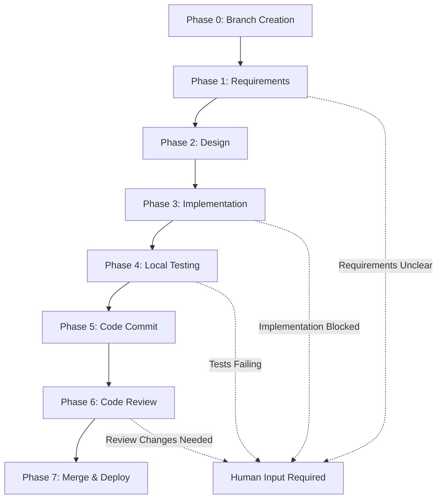

# Claude Enhancer 5.0 Operations Runbook
> Complete Operations Guide | Emergency Procedures | Daily Operations

## 🚀 Getting Started

### How to Begin a New Development Task
1. **Provide PRD to Claude Code**
   ```
   "我需要开发一个新功能：[详细描述功能需求]

   期望结果：[明确的成功标准]
   优先级：[High/Medium/Low]
   截止时间：[如有时间要求]"
   ```

2. **Claude Code Automatic Response**
   - 自动识别任务复杂度
   - 选择合适的Agent数量（4-6-8策略）
   - 启动8-Phase工作流（Phase 0-7）
   - 创建适当的分支结构

3. **System Auto-Progression**
   - 系统会自动推进到下一个Phase
   - 每个Phase完成后自动触发下一阶段
   - 无需手动干预，除非遇到错误

## ⚙️ Automatic Phase Progression Rules

### Phase Transition Logic


### Auto-Progression Conditions
- **Phase 0 → Phase 1**: Branch created successfully
- **Phase 1 → Phase 2**: Requirements documented and validated
- **Phase 2 → Phase 3**: Design approved and architecture defined
- **Phase 3 → Phase 4**: Code implementation complete
- **Phase 4 → Phase 5**: All tests passing
- **Phase 5 → Phase 6**: Code committed and hooks passed
- **Phase 6 → Phase 7**: Code review approved
- **Phase 7 → Complete**: Successfully merged and deployed

### Manual Intervention Triggers
System will **pause and request human input** when:
- Requirements are ambiguous or conflicting
- Technical blockers cannot be resolved automatically
- Test failures require business decision
- Security concerns need stakeholder approval
- Performance issues need optimization strategy

## 🔄 Failure Handling & Retry Logic

### 3-Strike Retry System
```
Attempt 1: Auto-retry with same approach
         ↓ (if fails)
Attempt 2: Auto-retry with alternative approach
         ↓ (if fails)
Attempt 3: Pause and request human assistance
```

### Retry Strategies by Phase

#### Phase 0 (Branch Creation)
- **Retry 1**: Clean branch name, remove special characters
- **Retry 2**: Force create branch with timestamp suffix
- **Pause**: Branch naming conflict needs human decision

#### Phase 1 (Requirements)
- **Retry 1**: Ask clarifying questions automatically
- **Retry 2**: Propose multiple requirement interpretations
- **Pause**: Requirements too vague for AI interpretation

#### Phase 2 (Design)
- **Retry 1**: Simplify design approach
- **Retry 2**: Alternative architecture pattern
- **Pause**: Design decision needs business input

#### Phase 3 (Implementation)
- **Retry 1**: Different Agent combination (4→6 or 6→8)
- **Retry 2**: Break down into smaller chunks
- **Pause**: Technical blocker requires research/decision

#### Phase 4 (Local Testing)
- **Retry 1**: Fix obvious test failures automatically
- **Retry 2**: Adjust test parameters or mocks
- **Pause**: Test failures indicate requirement misunderstanding

#### Phase 5 (Code Commit)
- **Retry 1**: Fix linting and formatting issues
- **Retry 2**: Resolve merge conflicts automatically
- **Pause**: Git conflicts require manual resolution

#### Phase 6 (Code Review)
- **Retry 1**: Address review comments automatically
- **Retry 2**: Refactor based on feedback
- **Pause**: Substantial changes requested

#### Phase 7 (Merge & Deploy)
- **Retry 1**: Retry deployment with fresh environment
- **Retry 2**: Rollback and re-deploy
- **Pause**: Infrastructure issues need investigation

## 📊 Release & Deployment Flow

### Standard Release Process
```bash
# Automated by Claude Enhancer 5.0
1. Feature branch development (Phase 0-4)
2. Local validation complete (Phase 4)
3. Create Pull Request (Phase 5-6)
4. Squash merge to main (Phase 7)
5. Automatic deployment (Phase 7)
6. Health monitoring (Post-Phase 7)
7. Success confirmation or auto-rollback
```

### Release Checklist (Automated)
- [ ] **Code Quality Gates**
  - [ ] All tests passing (100%)
  - [ ] Code coverage ≥ 80%
  - [ ] Linting clean
  - [ ] Security scan passed

- [ ] **Version Management**
  - [ ] Version number incremented correctly
  - [ ] Git tag created
  - [ ] CHANGELOG.md updated
  - [ ] Package.json synchronized

- [ ] **Deployment Validation**
  - [ ] Staging deployment successful
  - [ ] Smoke tests passed
  - [ ] Performance benchmarks within limits
  - [ ] Rollback plan confirmed

### Post-Deployment Monitoring
```
0-5 minutes:    Critical function checks
5-15 minutes:   Performance monitoring
15-30 minutes:  Full integration validation
30+ minutes:    Extended stability monitoring
```

## 🚨 Emergency Procedures

### System Failure Response
1. **Immediate Assessment** (< 2 minutes)
   - Check current Phase status
   - Identify failure point
   - Assess impact scope

2. **Auto-Recovery Attempt** (2-5 minutes)
   - Execute automatic rollback if applicable
   - Restart failed services
   - Clear temporary files and caches

3. **Manual Intervention** (5+ minutes)
   - If auto-recovery fails
   - Escalate to human operator
   - Provide detailed failure context

### Critical Issues Escalation
- **P0 (Critical)**: System completely down → Immediate human notification
- **P1 (High)**: Major feature broken → 15-minute auto-recovery, then escalate
- **P2 (Medium)**: Performance degraded → 30-minute monitoring, then escalate
- **P3 (Low)**: Minor issues → Log for next maintenance window

### Rollback Procedures
```bash
# Automatic Rollback Triggers
- Deployment failure (any stage)
- Critical functionality broken
- Error rate > 50% increase
- Performance degraded > 2x baseline

# Rollback Execution
1. Identify last stable version
2. Revert main branch to stable commit
3. Re-deploy previous version
4. Validate rollback success
5. Create incident report
```

## 📋 Daily Operations

### Morning Health Check
```bash
# Automated daily at 09:00
✅ System components status
✅ Overnight deployment results
✅ Performance metrics review
✅ Error log analysis
✅ Security alert review
```

### Continuous Monitoring
- **Performance**: Response time, throughput, resource usage
- **Errors**: Application errors, system errors, user errors
- **Security**: Failed authentication, suspicious activities
- **Capacity**: Disk usage, memory usage, connection pools

### Weekly Maintenance
```bash
# Automated weekly on Sunday 02:00
🔄 System updates and patches
🗃️ Log rotation and cleanup
📊 Performance report generation
🔍 Security scan execution
💾 Backup validation
```

## 🎯 Performance Monitoring

### Key Metrics Dashboard
```
System Health: ●●●●● (5/5)
├─ CPU Usage: 45% (Normal)
├─ Memory: 2.1GB/8GB (Normal)
├─ Response Time: 120ms (Good)
├─ Error Rate: 0.02% (Excellent)
└─ Uptime: 99.98% (Target: 99.9%)

Phase Execution Times:
├─ Phase 0 (Branch): ~30s
├─ Phase 1 (Requirements): ~2-5min
├─ Phase 2 (Design): ~5-10min
├─ Phase 3 (Implementation): ~15-30min
├─ Phase 4 (Testing): ~5-15min
├─ Phase 5 (Commit): ~1-2min
├─ Phase 6 (Review): ~10-30min
└─ Phase 7 (Deploy): ~3-8min
```

### Performance Alerts
- **Warning**: Response time > 500ms
- **Critical**: Response time > 2000ms
- **Warning**: Error rate > 1%
- **Critical**: Error rate > 5%
- **Warning**: CPU > 80%
- **Critical**: CPU > 95%

## 🔧 Troubleshooting Guide

### Common Issues & Solutions

#### "Phase Stuck" Issues
**Symptoms**: Phase not progressing after expected time
**Solutions**:
1. Check `.phase/current` file status
2. Review last 10 log entries
3. Restart phase with `reset_phase` command
4. If persistent, escalate with full context

#### Agent Communication Failures
**Symptoms**: Agents not responding or incomplete responses
**Solutions**:
1. Verify Agent file integrity
2. Check system resource availability
3. Restart with reduced Agent count (8→6→4)
4. Clear Agent cache and retry

#### Git Operations Failing
**Symptoms**: Cannot create branches, commit, or push
**Solutions**:
1. Verify Git configuration
2. Check repository permissions
3. Clean working directory
4. Reset Git hooks if needed

#### Performance Degradation
**Symptoms**: Slower response times, high resource usage
**Solutions**:
1. Check current load and active processes
2. Clear temporary files and caches
3. Restart background services
4. Scale resources if needed

### Log Analysis Commands
```bash
# Recent errors
grep -i error logs/*.log | tail -50

# Performance issues
grep -i "slow\|timeout\|performance" logs/*.log

# Phase progression tracking
grep "Phase.*started\|completed" logs/*.log

# Agent execution tracking
grep "Agent.*invoked\|completed" logs/*.log
```

## 📞 Support & Escalation

### Contact Information
- **Emergency**: System completely down
- **Urgent**: Major feature broken, affecting users
- **Standard**: Performance issues, minor bugs
- **Low**: Enhancement requests, documentation updates

### Escalation Timeline
- **0-15 minutes**: Automatic recovery attempts
- **15-30 minutes**: System administrator notification
- **30-60 minutes**: Development team alert
- **1+ hours**: Management escalation

### Information to Provide
1. **Current Phase**: What phase was running
2. **Error Context**: Exact error messages and codes
3. **Environment**: System state and resource usage
4. **Timeline**: When issue started and progression
5. **Impact**: What functionality is affected
6. **Attempted Solutions**: What auto-recovery was tried

---

**Remember**: Claude Enhancer 5.0 is designed for autonomous operation. Most issues should be handled automatically. Human intervention is only needed for business decisions or when automatic recovery fails after 3 attempts.