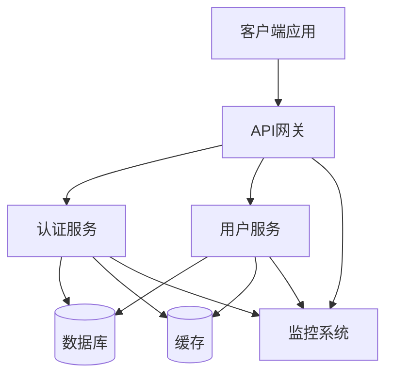
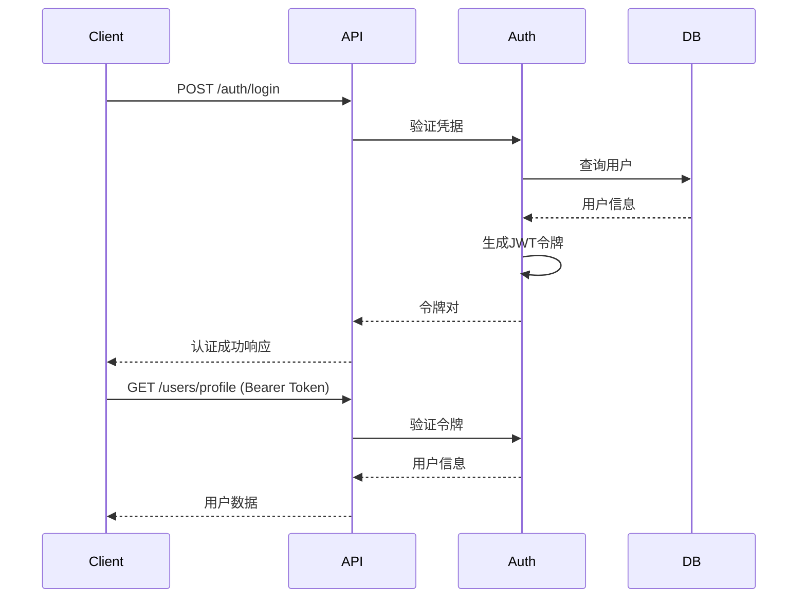

# 📚 Perfect21 RESTful API 接口规范文档

## 🎯 文档概览

这是Perfect21项目的完整RESTful API接口规范，包含认证系统、用户管理、错误处理、版本管理和速率限制等全套文档。

### 📋 文档结构

```
api-specification/
├── README.md                           # 本文档 - 总览和导航
├── openapi-auth-spec.yaml              # OpenAPI 3.0 完整规范
├── api-interfaces-summary.md           # API接口列表和示例
├── error-codes-definition.md           # 错误码体系定义
└── api-versioning-and-rate-limiting.md # 版本管理和速率限制策略
```

## 🚀 快速开始

### 1. API基础信息
- **Base URL**: `https://api.perfect21.dev/v1`
- **协议**: HTTPS Only
- **数据格式**: JSON
- **认证方式**: JWT Bearer Token / API Key
- **API版本**: v1.0.0

### 2. 快速集成示例

#### 用户注册
```bash
curl -X POST https://api.perfect21.dev/v1/auth/register \
  -H "Content-Type: application/json" \
  -d '{
    "username": "johndoe",
    "email": "john@example.com",
    "password": "SecurePass123",
    "firstName": "John",
    "lastName": "Doe"
  }'
```

#### 用户登录
```bash
curl -X POST https://api.perfect21.dev/v1/auth/login \
  -H "Content-Type: application/json" \
  -d '{
    "email": "john@example.com",
    "password": "SecurePass123"
  }'
```

#### 获取用户信息
```bash
curl -X GET https://api.perfect21.dev/v1/users/profile \
  -H "Authorization: Bearer YOUR_ACCESS_TOKEN"
```

## 📖 详细文档导航

### 🔐 认证相关文档

#### [完整OpenAPI规范](./openapi-auth-spec.yaml)
- ✅ OpenAPI 3.0.3 标准格式
- ✅ 完整的认证和用户管理API
- ✅ 详细的请求/响应模型定义
- ✅ 丰富的示例和说明
- ✅ 安全策略和监控配置

**主要包含**:
- 系统健康检查接口
- 用户注册/登录/登出流程
- 密码管理 (忘记/重置/修改)
- 用户配置文件管理
- 头像上传功能
- 邮箱验证流程
- 管理员用户管理功能

#### [API接口列表](./api-interfaces-summary.md)
- ✅ 14个核心API接口详细列表
- ✅ 完整的请求/响应示例
- ✅ cURL命令行使用示例
- ✅ 错误响应示例
- ✅ 性能指标和SLA目标

**接口分类**:
- 🔍 系统状态 (1个接口)
- 🔐 认证接口 (7个接口)
- 👤 用户管理 (5个接口)
- 🛡️ 管理员接口 (4个接口)

### ⚠️ 错误处理文档

#### [错误码体系](./error-codes-definition.md)
- ✅ 8大类错误码详细定义
- ✅ HTTP状态码映射关系
- ✅ 错误响应格式标准
- ✅ 客户端处理最佳实践
- ✅ 监控和告警策略

**错误码分类**:
1. **通用错误** (GENERAL_*) - 基础请求错误
2. **认证错误** (AUTH_*) - 身份验证相关
3. **权限错误** (PERMISSION_*) - 访问权限相关
4. **验证错误** (VALIDATION_*) - 数据验证失败
5. **资源错误** (RESOURCE_*) - 资源操作相关
6. **业务错误** (BUSINESS_*) - 业务逻辑错误
7. **限制错误** (RATE_LIMIT_*) - 速率限制相关
8. **文件错误** (FILE_*) - 文件操作相关

### 🔄 版本管理和限制策略

#### [版本管理与速率限制](./api-versioning-and-rate-limiting.md)
- ✅ 完整的API版本管理策略
- ✅ 多层级速率限制配置
- ✅ 客户端SDK集成示例
- ✅ 监控和自动化响应机制

**核心特性**:
- 📋 **版本策略**: URL路径 + Header混合管理
- ⚡ **速率限制**: 令牌桶/固定窗口/滑动窗口算法
- 🛡️ **安全防护**: 白名单、熔断、DDoS防护
- 📊 **智能监控**: 实时指标、自动告警、动态调整

## 🎯 核心特性

### 🔒 安全特性
- **JWT令牌认证**: 1小时访问令牌 + 30天刷新令牌
- **密码安全**: bcrypt加密，12轮哈希
- **传输安全**: 强制HTTPS，TLS 1.2+
- **访问控制**: 基于角色的权限管理 (RBAC)
- **审计日志**: 完整的操作审计记录
- **防护机制**: 防暴力破解、DDoS防护、SQL注入防护

### ⚡ 性能特性
- **响应时间**: P95 < 500ms
- **高可用性**: 99.9% SLA保证
- **速率限制**: 智能分层限制策略
- **缓存策略**: 多层缓存优化
- **CDN加速**: 全球内容分发
- **数据库优化**: 查询优化和连接池

### 📊 监控特性
- **实时监控**: 请求量、响应时间、错误率
- **告警系统**: 多维度自动告警
- **链路追踪**: 分布式请求追踪
- **性能分析**: 性能瓶颈识别
- **用户行为**: API使用模式分析

## 🛠️ 开发工具和资源

### API开发工具
- **[Swagger UI](https://swagger.io/tools/swagger-ui/)**: 在线API文档
- **[Postman Collection](./postman-collection.json)**: API测试集合
- **[Insomnia Workspace](./insomnia-workspace.json)**: REST客户端配置
- **[OpenAPI Generator](https://openapi-generator.tech/)**: 客户端SDK生成器

### 客户端SDK
```bash
# JavaScript/TypeScript
npm install @perfect21/api-client

# Python
pip install perfect21-api-client

# Go
go get github.com/perfect21/api-client-go

# Java
<!-- Maven -->
<dependency>
    <groupId>dev.perfect21</groupId>
    <artifactId>api-client</artifactId>
    <version>1.0.0</version>
</dependency>
```

### 测试工具
```bash
# API测试套件
npm install -g @perfect21/api-test-suite

# 运行完整测试
perfect21-test --config ./test-config.yaml

# 性能测试
perfect21-load-test --endpoints auth,users --duration 5m
```

## 🏗️ 系统架构

### API架构图


### 技术栈
- **API框架**: Express.js / FastAPI / Spring Boot
- **数据库**: PostgreSQL (主) + Redis (缓存)
- **认证**: JWT + bcrypt
- **文档**: OpenAPI 3.0 + Swagger UI
- **监控**: Prometheus + Grafana
- **部署**: Docker + Kubernetes
- **CI/CD**: GitHub Actions

## 📈 使用指南

### 1. 认证流程


### 2. 错误处理模式
```javascript
// 标准错误处理
const handleApiResponse = async (response) => {
  if (!response.ok) {
    const error = await response.json();

    switch (error.error.code) {
      case 'AUTH_TOKEN_EXPIRED':
        await refreshToken();
        return retryRequest();

      case 'VALIDATION_ERROR':
        showFieldErrors(error.error.details);
        break;

      case 'RATE_LIMIT_EXCEEDED':
        showRetryMessage(error.error.retryAfter);
        break;

      default:
        showGenericError(error.error.message);
    }

    throw new ApiError(error);
  }

  return response.json();
};
```

### 3. 速率限制处理
```python
class ApiClient:
    def __init__(self):
        self.rate_limits = {}

    async def make_request(self, endpoint, **kwargs):
        # 检查本地限制缓存
        if self._is_rate_limited(endpoint):
            await self._wait_for_reset(endpoint)

        response = await self._http_request(endpoint, **kwargs)

        # 更新限制信息
        self._update_rate_limits(endpoint, response.headers)

        if response.status == 429:
            retry_after = int(response.headers.get('Retry-After', 60))
            await asyncio.sleep(retry_after)
            return await self.make_request(endpoint, **kwargs)

        return response
```

## 🔧 部署和配置

### 环境配置
```yaml
# config/production.yaml
api:
  version: "1.0.0"
  base_url: "https://api.perfect21.dev"

security:
  jwt:
    secret: "${JWT_SECRET}"
    access_token_ttl: 3600
    refresh_token_ttl: 2592000

rate_limiting:
  global:
    requests_per_hour: 1000
  authentication:
    login_per_minute: 10
    register_per_hour: 5

database:
  host: "${DB_HOST}"
  port: 5432
  name: "perfect21_prod"
  ssl: true

monitoring:
  enabled: true
  metrics_endpoint: "/metrics"
  health_endpoint: "/health"
```

### Docker部署
```dockerfile
FROM node:18-alpine

WORKDIR /app
COPY package*.json ./
RUN npm ci --only=production

COPY . .
EXPOSE 3000

HEALTHCHECK --interval=30s --timeout=3s --start-period=5s --retries=3 \
  CMD curl -f http://localhost:3000/health || exit 1

CMD ["npm", "start"]
```

## 📞 支持和联系

### 文档和帮助
- **API文档**: https://docs.perfect21.dev/api
- **开发者指南**: https://docs.perfect21.dev/guides
- **FAQ**: https://docs.perfect21.dev/faq
- **更新日志**: https://docs.perfect21.dev/changelog

### 技术支持
- **邮箱**: api-support@perfect21.dev
- **GitHub**: https://github.com/perfect21/api-issues
- **Discord**: https://discord.gg/perfect21
- **工作时间**: 周一至周五 9:00-18:00 (UTC+8)

### 贡献和反馈
- **Bug报告**: 通过GitHub Issues提交
- **功能请求**: 通过GitHub Discussions讨论
- **安全问题**: 发送至security@perfect21.dev
- **API建议**: 参与我们的API设计讨论

---

## 📋 检查清单

在使用API之前，请确认以下事项：

### 开发环境准备
- [ ] 已获取API密钥或访问令牌
- [ ] 已设置正确的Base URL
- [ ] 已配置HTTPS证书验证
- [ ] 已实现错误处理机制
- [ ] 已集成速率限制处理

### 安全最佳实践
- [ ] 使用HTTPS进行所有API调用
- [ ] 安全存储API密钥和令牌
- [ ] 实现令牌刷新机制
- [ ] 验证SSL证书
- [ ] 记录安全相关事件

### 性能优化
- [ ] 实现请求缓存策略
- [ ] 使用连接池管理
- [ ] 实现超时机制
- [ ] 监控API响应时间
- [ ] 优化批量操作

### 监控和日志
- [ ] 实现API调用日志
- [ ] 监控错误率和响应时间
- [ ] 设置告警阈值
- [ ] 跟踪API使用量
- [ ] 记录用户行为分析

这套完整的RESTful API接口规范为Perfect21项目提供了企业级的认证和用户管理解决方案，具备高安全性、高性能和高可维护性。