# Perfect21 API 版本管理与速率限制策略

## 🔄 API 版本管理策略

### 版本命名规范

#### 主版本号 (Major Version)
- **格式**: v1, v2, v3...
- **变更条件**:
  - 破坏性API变更
  - 重大架构调整
  - 不向后兼容的修改
- **生命周期**: 至少支持2年

#### 次版本号 (Minor Version)
- **格式**: v1.1, v1.2, v1.3...
- **变更条件**:
  - 新增API功能
  - 向后兼容的修改
  - 性能优化
- **标识方式**: HTTP响应头 `API-Version: 1.2`

#### 修订版本号 (Patch Version)
- **格式**: v1.1.1, v1.1.2...
- **变更条件**:
  - Bug修复
  - 安全补丁
  - 文档更新
- **标识方式**: HTTP响应头 `API-Build: 1.1.15`

### 版本策略实施

#### 1. URL路径版本控制
```
# 主版本通过URL路径管理
https://api.perfect21.dev/v1/auth/login    # 版本1
https://api.perfect21.dev/v2/auth/login    # 版本2

# 次版本通过Header管理
GET /v1/users/profile
Accept: application/json
API-Version: 1.2
```

#### 2. 向后兼容性保证
- **兼容期**: 至少支持前一个主版本
- **废弃通知**: 提前6个月通知
- **迁移支持**: 提供迁移工具和文档
- **监控支持**: 监控旧版本使用情况

#### 3. 版本生命周期管理

```mermaid
graph LR
    A[开发阶段] --> B[测试阶段]
    B --> C[发布阶段]
    C --> D[稳定阶段]
    D --> E[维护阶段]
    E --> F[废弃阶段]
    F --> G[终止阶段]
```



| 阶段 | 持续时间 | 描述 | 支持级别 |
|------|----------|------|----------|
| 开发阶段 | 3-6个月 | 新版本开发 | 无生产支持 |
| 测试阶段 | 1-2个月 | Beta测试 | 有限支持 |
| 发布阶段 | 1个月 | 逐步发布 | 完整支持 |
| 稳定阶段 | 18-24个月 | 生产使用 | 完整支持 |
| 维护阶段 | 12个月 | 仅修复Bug | 有限支持 |
| 废弃阶段 | 6个月 | 废弃通知 | 最小支持 |
| 终止阶段 | - | 停止服务 | 无支持 |

### 版本变更示例

#### 破坏性变更 (主版本升级)
```yaml
# v1 API
POST /v1/auth/login
{
  "username": "johndoe",
  "password": "secret"
}

# v2 API - 字段名称变更
POST /v2/auth/login
{
  "identifier": "johndoe",  # username -> identifier
  "credential": "secret"    # password -> credential
}
```

#### 向后兼容变更 (次版本升级)
```yaml
# v1.0 API
GET /v1/users/profile
Response: {
  "id": "usr_123",
  "name": "John Doe",
  "email": "john@example.com"
}

# v1.1 API - 新增字段
GET /v1/users/profile
API-Version: 1.1
Response: {
  "id": "usr_123",
  "name": "John Doe",
  "email": "john@example.com",
  "avatar": "https://...",     # 新增字段
  "preferences": {...}         # 新增字段
}
```

### 版本响应头标准

```http
HTTP/1.1 200 OK
API-Version: 1.2.15
API-Deprecated: false
API-Sunset: 2025-12-31
API-Documentation: https://docs.perfect21.dev/v1
Content-Type: application/json

# 废弃版本示例
HTTP/1.1 200 OK
API-Version: 1.0.8
API-Deprecated: true
API-Deprecation-Date: 2024-06-01
API-Sunset: 2024-12-31
API-Migration-Guide: https://docs.perfect21.dev/migration/v1-to-v2
Warning: 299 - "API version 1.0 is deprecated. Migrate to v2 before 2024-12-31"
```

## ⚡ 速率限制 (Rate Limiting) 策略

### 限制算法选择

#### 1. 令牌桶算法 (Token Bucket)
- **使用场景**: 允许突发流量的API
- **优点**: 平滑处理突发请求
- **适用**: 用户操作API

#### 2. 固定窗口算法 (Fixed Window)
- **使用场景**: 严格控制时间窗口内的请求数
- **优点**: 实现简单，内存占用少
- **适用**: 管理员API，批量操作API

#### 3. 滑动窗口算法 (Sliding Window)
- **使用场景**: 需要精确控制请求速率
- **优点**: 更平滑的限制策略
- **适用**: 核心业务API

### 限制策略配置

#### 全局限制策略
```yaml
global_limits:
  per_ip:
    requests: 1000
    window: 3600  # 1小时
    algorithm: "sliding_window"

  per_user:
    requests: 2000
    window: 3600
    algorithm: "token_bucket"
    burst: 100    # 突发容量

  concurrent_connections:
    limit: 50
    per_ip: true
```

#### 接口级限制策略

##### 认证接口限制
```yaml
authentication_limits:
  register:
    per_ip:
      requests: 5
      window: 3600      # 每小时5次
    per_email:
      requests: 3
      window: 86400     # 每天3次

  login:
    per_ip:
      requests: 60      # 每分钟60次
      window: 60
    per_user:
      requests: 10      # 每分钟10次
      window: 60
      lockout_threshold: 5  # 5次失败后锁定
      lockout_duration: 900 # 锁定15分钟

  forgot_password:
    per_email:
      requests: 3
      window: 3600      # 每小时3次

  refresh_token:
    per_user:
      requests: 60
      window: 3600      # 每小时60次
```

##### 用户管理接口限制
```yaml
user_management_limits:
  profile_read:
    per_user:
      requests: 300
      window: 3600      # 每小时300次

  profile_update:
    per_user:
      requests: 60
      window: 3600      # 每小时60次

  avatar_upload:
    per_user:
      requests: 10
      window: 3600      # 每小时10次
    file_size_limit: 5242880  # 5MB
```

##### 管理员接口限制
```yaml
admin_limits:
  user_list:
    per_admin:
      requests: 120
      window: 3600      # 每小时120次

  user_operations:
    per_admin:
      requests: 100
      window: 3600      # 每小时100次

  bulk_operations:
    per_admin:
      requests: 10
      window: 3600      # 每小时10次
      require_confirmation: true
```

### 限制层级结构

```
1. 全局IP限制 (最外层)
   ├── 2. 用户级限制
   │   ├── 3. 接口分组限制
   │   │   └── 4. 具体接口限制
   │   └── 特殊权限豁免
   └── 服务级熔断保护
```

### 响应头标准

#### 正常请求响应头
```http
HTTP/1.1 200 OK
X-RateLimit-Limit: 1000
X-RateLimit-Remaining: 950
X-RateLimit-Reset: 1642680000
X-RateLimit-Window: 3600
X-RateLimit-Policy: "1000 requests per hour"
```

#### 超限响应
```http
HTTP/1.1 429 Too Many Requests
X-RateLimit-Limit: 1000
X-RateLimit-Remaining: 0
X-RateLimit-Reset: 1642680000
X-RateLimit-Retry-After: 600
X-RateLimit-Policy: "1000 requests per hour"
Content-Type: application/json

{
  "success": false,
  "error": {
    "code": "RATE_LIMIT_EXCEEDED",
    "message": "请求频率超过限制",
    "retryAfter": 600,
    "limit": {
      "type": "per_hour",
      "max": 1000,
      "remaining": 0,
      "resetTime": "2024-01-20T11:00:00Z"
    }
  }
}
```

### 特殊处理策略

#### 1. 白名单机制
```yaml
whitelist:
  ips:
    - "10.0.0.0/8"      # 内网IP
    - "192.168.1.100"   # 监控系统
  users:
    - "admin@perfect21.dev"
    - "service@perfect21.dev"
  api_keys:
    - "sk_live_..."     # 服务间调用
```

#### 2. 动态调整策略
```yaml
dynamic_limits:
  system_load_based:
    enabled: true
    thresholds:
      high_load: 0.8    # CPU > 80%时降低50%限制
      critical_load: 0.9 # CPU > 90%时降低75%限制

  user_tier_based:
    free_tier:
      multiplier: 1.0
    premium_tier:
      multiplier: 5.0
    enterprise_tier:
      multiplier: 10.0
```

#### 3. 熔断机制
```yaml
circuit_breaker:
  error_threshold: 50   # 50%错误率触发熔断
  timeout: 30          # 30秒超时
  recovery_time: 300   # 5分钟恢复时间

  conditions:
    - "http_5xx_rate > 0.5"
    - "response_time_p95 > 5000"
    - "database_connection_errors > 10"
```

### 监控和告警

#### 关键指标监控
```yaml
monitoring_metrics:
  rate_limit_violations:
    - metric: "api.rate_limit.exceeded"
    - labels: ["endpoint", "user_id", "ip"]
    - threshold: 100     # 每分钟超过100次告警

  api_usage_patterns:
    - metric: "api.requests.per_minute"
    - aggregation: "sum"
    - window: "5m"

  performance_impact:
    - metric: "api.response_time"
    - filter: "rate_limited=true"
    - threshold: "p95 > 1000ms"
```

#### 自动化响应
```yaml
automated_responses:
  aggressive_behavior:
    trigger: "rate_limit_violations > 1000/hour"
    action: "temporary_ip_ban"
    duration: 3600      # 1小时禁封

  ddos_protection:
    trigger: "requests_per_second > 10000"
    action: "emergency_rate_limit"
    limit: 10           # 紧急限制到10 req/s

  user_education:
    trigger: "repeated_violations"
    action: "send_notification"
    template: "rate_limit_guidance"
```

## 📊 实施示例

### 客户端SDK示例

#### JavaScript SDK
```javascript
class Perfect21ApiClient {
  constructor(apiKey, options = {}) {
    this.apiKey = apiKey;
    this.baseUrl = options.baseUrl || 'https://api.perfect21.dev/v1';
    this.rateLimitManager = new RateLimitManager();
  }

  async makeRequest(endpoint, options = {}) {
    // 检查本地速率限制
    await this.rateLimitManager.checkLimit(endpoint);

    try {
      const response = await fetch(`${this.baseUrl}${endpoint}`, {
        ...options,
        headers: {
          'Authorization': `Bearer ${this.accessToken}`,
          'X-API-Key': this.apiKey,
          'API-Version': '1.2',
          ...options.headers
        }
      });

      // 更新速率限制信息
      this.rateLimitManager.updateFromResponse(response.headers);

      if (response.status === 429) {
        const retryAfter = response.headers.get('X-RateLimit-Retry-After');
        throw new RateLimitError(`Rate limit exceeded. Retry after ${retryAfter}s`);
      }

      return response.json();
    } catch (error) {
      if (error instanceof RateLimitError) {
        // 自动重试逻辑
        await this.rateLimitManager.waitForRetry();
        return this.makeRequest(endpoint, options);
      }
      throw error;
    }
  }
}

class RateLimitManager {
  constructor() {
    this.limits = new Map();
  }

  async checkLimit(endpoint) {
    const limit = this.limits.get(endpoint);
    if (limit && limit.remaining <= 0) {
      const waitTime = limit.resetTime - Date.now();
      if (waitTime > 0) {
        await this.sleep(waitTime);
      }
    }
  }

  updateFromResponse(headers) {
    const endpoint = headers.get('X-Endpoint');
    this.limits.set(endpoint, {
      limit: parseInt(headers.get('X-RateLimit-Limit')),
      remaining: parseInt(headers.get('X-RateLimit-Remaining')),
      resetTime: parseInt(headers.get('X-RateLimit-Reset')) * 1000
    });
  }
}
```

#### Python SDK
```python
import time
import asyncio
from typing import Dict, Optional
import httpx

class Perfect21ApiClient:
    def __init__(self, api_key: str, base_url: str = "https://api.perfect21.dev/v1"):
        self.api_key = api_key
        self.base_url = base_url
        self.rate_limits: Dict[str, dict] = {}
        self.client = httpx.AsyncClient()

    async def make_request(self, method: str, endpoint: str, **kwargs):
        # 检查速率限制
        await self._check_rate_limit(endpoint)

        headers = {
            'Authorization': f'Bearer {self.access_token}',
            'X-API-Key': self.api_key,
            'API-Version': '1.2',
            **kwargs.get('headers', {})
        }

        try:
            response = await self.client.request(
                method,
                f"{self.base_url}{endpoint}",
                headers=headers,
                **kwargs
            )

            # 更新速率限制信息
            self._update_rate_limits(endpoint, response.headers)

            if response.status_code == 429:
                retry_after = int(response.headers.get('X-RateLimit-Retry-After', 0))
                await asyncio.sleep(retry_after)
                return await self.make_request(method, endpoint, **kwargs)

            response.raise_for_status()
            return response.json()

        except httpx.HTTPStatusError as e:
            if e.response.status_code == 429:
                # 处理速率限制
                await self._handle_rate_limit(endpoint, e.response.headers)
                return await self.make_request(method, endpoint, **kwargs)
            raise

    async def _check_rate_limit(self, endpoint: str):
        if endpoint in self.rate_limits:
            limit_info = self.rate_limits[endpoint]
            if limit_info['remaining'] <= 0:
                sleep_time = limit_info['reset_time'] - time.time()
                if sleep_time > 0:
                    await asyncio.sleep(sleep_time)

    def _update_rate_limits(self, endpoint: str, headers):
        self.rate_limits[endpoint] = {
            'limit': int(headers.get('X-RateLimit-Limit', 0)),
            'remaining': int(headers.get('X-RateLimit-Remaining', 0)),
            'reset_time': int(headers.get('X-RateLimit-Reset', 0))
        }
```

## 🎯 最佳实践建议

### 1. 版本管理最佳实践
- **提前规划**: 在设计阶段考虑版本演进
- **渐进迁移**: 提供迁移工具和文档
- **监控使用**: 跟踪各版本使用情况
- **及时沟通**: 提前通知重大变更

### 2. 速率限制最佳实践
- **合理设置**: 基于实际使用场景设置限制
- **分层管理**: 不同用户类型不同限制
- **友好提示**: 提供清晰的限制信息
- **优雅降级**: 超限时的用户体验优化

### 3. 监控和维护
- **实时监控**: 关键指标实时监控
- **自动告警**: 异常情况自动通知
- **定期审查**: 定期评估和调整策略
- **性能优化**: 持续优化系统性能

这套完整的版本管理和速率限制策略确保了API的稳定性、可扩展性和安全性。