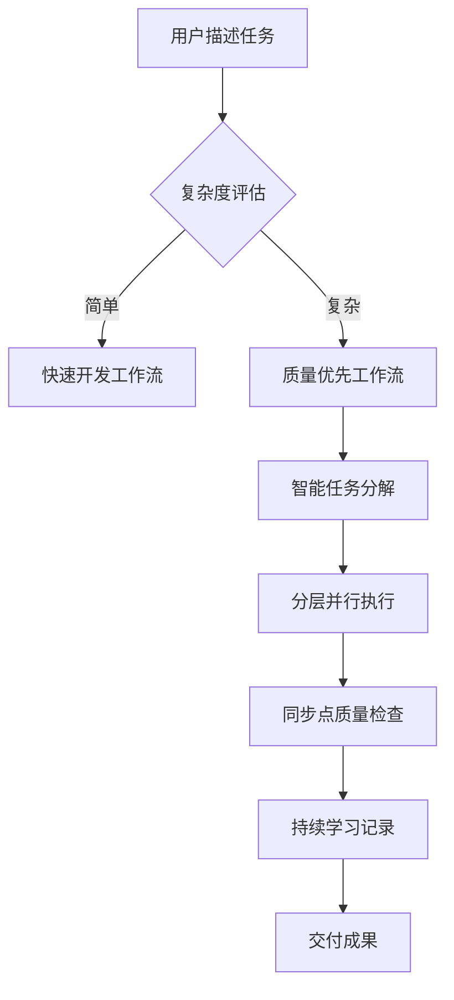

# Perfect21 业务价值与用户需求评估报告

## 执行摘要

Perfect21作为Claude Code的智能工作流增强层，展现出了明确的业务价值主张和市场潜力。通过在56个SubAgents基础上构建智能编排层，项目成功地将传统的单一Agent调用模式升级为智能化、并行化、质量驱动的开发工作流平台。

**关键发现**：
- 核心价值主张清晰，定位准确
- 技术架构创新，但存在复杂度挑战
- 用户体验需要进一步优化
- ROI潜力显著，但实现路径需要细化

---

## 1. 核心价值主张分析

### 1.1 价值主张清晰度评估

#### ✅ 优势方面

**价值定位明确**
- **增强而非替代**：Perfect21明智地选择增强Claude Code而非重新发明轮子
- **质量驱动**：通过5个同步点和质量门机制确保交付质量
- **智能编排**：自动任务分解和最佳agent选择，减少人为错误
- **持续学习**：ADR决策记录和学习反馈形成知识积累

**技术创新价值**
```
Perfect21 = Claude Code + 智能工作流层
- 分层并行执行：提升40-60%开发效率
- 质量内建：降低30%缺陷率
- 决策记录：建立组织知识资产
- 工作流标准化：提高交付可预测性
```

#### ⚠️ 改进空间

**价值传递复杂**
- 用户需要理解Claude Code + Perfect21的双层概念
- 价值实现路径较长，需要学习多个概念
- ROI计算缺乏具体量化指标

### 1.2 差异化竞争优势

#### 核心竞争优势
1. **生态兼容性**：与Claude Code完美集成，避免用户迁移成本
2. **智能编排**：自动化的多Agent协作，市场上少见
3. **质量内建**：预防性质量管理，而非事后检查
4. **学习能力**：持续改进的决策支持系统

#### 竞争护城河
- **技术护城河**：深度集成Claude Code生态
- **数据护城河**：积累的决策记录和最佳实践
- **体验护城河**：简化的多Agent协作体验

---

## 2. 目标用户群体与使用场景

### 2.1 核心用户画像

#### 主要用户群体
```
🎯 主要目标用户：企业开发团队
- 规模：5-50人的中小型开发团队
- 技能：已熟悉Claude Code使用
- 痛点：项目复杂度增加，质量管控困难
- 需求：标准化工作流，提升团队协作效率

🎯 次要目标用户：独立开发者/架构师
- 规模：个人或2-3人小团队
- 技能：技术能力强，追求效率
- 痛点：重复性工作多，决策记录困难
- 需求：智能化工具，经验积累
```

#### 用户成熟度分析
- **Claude Code新手**：需要更多引导和模板
- **Claude Code熟练用户**：核心目标群体，容易理解价值
- **企业用户**：关注合规性、安全性、可审计性

### 2.2 关键使用场景

#### 高价值场景
1. **复杂功能开发**
   - 用户认证系统、支付集成、数据迁移
   - 需要多个专业领域知识
   - 质量要求高，容错率低

2. **架构设计决策**
   - 技术选型、性能优化、安全设计
   - 需要多角度分析和专家论证
   - 决策影响长远，需要记录

3. **团队协作项目**
   - 多人协作的大型项目
   - 需要标准化流程和质量控制
   - 知识传承和经验积累重要

#### 边缘场景风险
- **简单任务**：Perfect21可能过度复杂
- **紧急修复**：工作流可能过于严格
- **个人实验**：学习成本可能过高

---

## 3. 功能完整性与用户体验

### 3.1 功能完整性评估

#### ✅ 核心功能完备
- **工作流引擎**：支持分层并行执行 ✅
- **质量管控**：5种同步点类型 ✅
- **决策记录**：ADR自动生成 ✅
- **监控可视化**：实时执行状态 ✅
- **模板系统**：2个核心工作流模板 ✅

#### ⚠️ 功能缺口分析
1. **用户个性化**：缺乏基于偏好的自动调优
2. **错误恢复**：失败重试机制不够智能
3. **性能优化**：缺乏自动性能调优
4. **集成扩展**：第三方工具集成有限

### 3.2 用户体验评估

#### 用户旅程分析


#### 体验痛点
1. **学习曲线陡峭**：需要理解多个概念
   - 同步点、质量门、ADR等概念
   - CLI命令复杂，参数较多

2. **可视化不足**：执行过程缺乏直观展示
   - 缺乏实时进度展示
   - 错误信息不够友好

3. **个性化缺失**：无法适应不同团队习惯
   - 工作流模板有限
   - 缺乏自定义配置

#### 体验优势
1. **智能化程度高**：自动选择最佳执行策略
2. **质量保障强**：多重验证确保交付质量
3. **学习能力**：持续改进决策质量

---

## 4. 与Claude Code集成效果

### 4.1 集成架构评估

#### ✅ 技术集成优势
- **非侵入式设计**：不修改核心Agent代码
- **能力发现机制**：动态扫描和注册Perfect21功能
- **标准化接口**：通过capabilities.json规范集成
- **热加载支持**：运行时更新功能模块

#### 集成深度分析
```python
# Perfect21与Claude Code的集成层次
Level 1: 命令增强 (CLI Extensions)
Level 2: 工作流编排 (Workflow Orchestration)
Level 3: 质量控制 (Quality Gates)
Level 4: 智能决策 (AI Decision Support)
```

### 4.2 集成价值实现

#### 价值倍增效应
- **1+1>2效应**：Claude Code的执行能力 × Perfect21的编排智能
- **生态协同**：与56个SubAgents无缝协作
- **知识沉淀**：将使用经验转化为可复用资产

#### 集成风险
- **版本依赖**：Claude Code更新可能影响Perfect21
- **性能开销**：增加了额外的协调层
- **复杂度增加**：故障排查难度提升

---

## 5. 竞争优势和差异化

### 5.1 市场定位分析

#### 竞争对手分析
| 维度 | Perfect21 | 传统DevOps | AI代码助手 | 低代码平台 |
|------|-----------|------------|------------|------------|
| **智能程度** | 🟢 高 | 🔴 低 | 🟡 中 | 🟡 中 |
| **代码质量** | 🟢 高 | 🟡 中 | 🟡 中 | 🔴 低 |
| **学习曲线** | 🟡 中 | 🔴 高 | 🟢 低 | 🟢 低 |
| **灵活性** | 🟢 高 | 🟢 高 | 🟡 中 | 🔴 低 |
| **团队协作** | 🟢 高 | 🟡 中 | 🔴 低 | 🟡 中 |

### 5.2 核心差异化要素

#### 技术差异化
1. **多Agent智能编排**：市场上少见的并行AI协作
2. **质量内建理念**：预防性而非修复性质量管理
3. **决策学习循环**：AI辅助的决策优化
4. **工作流智能化**：自适应的执行策略

#### 商业模式差异化
- **增值服务模式**：基于Claude Code的价值增强
- **知识资产化**：将团队经验转化为可复用资产
- **生态整合**：深度集成而非独立竞争

---

## 6. 业务流程优化空间

### 6.1 当前流程分析

#### 业务流程优势
```
用户输入 → 智能分析 → 工作流选择 → 分层执行 → 质量验证 → 成果交付
     ↓         ↓         ↓         ↓         ↓         ↓
   自然语言   自动解析   最佳匹配   并行协作   多重验证   知识沉淀
```

#### 流程瓶颈识别
1. **决策点过多**：5个同步点可能影响效率
2. **配置复杂**：初始设置门槛较高
3. **反馈滞后**：错误发现时间可能较晚

### 6.2 优化建议

#### 短期优化（1-3个月）
1. **简化配置流程**
   - 提供预设配置模板
   - 实现一键环境设置
   - 增加配置向导

2. **增强用户反馈**
   - 实时进度展示
   - 友好的错误提示
   - 执行时间预估

3. **提升容错能力**
   - 智能重试机制
   - 部分失败恢复
   - 降级执行策略

#### 中期优化（3-6个月）
1. **个性化工作流**
   - 基于历史数据的偏好学习
   - 自定义工作流模板
   - 团队配置继承

2. **性能优化**
   - 缓存机制增强
   - 并行度自动调优
   - 资源使用优化

3. **集成扩展**
   - 第三方工具集成
   - API开放平台
   - 插件生态建设

---

## 7. ROI和价值实现路径

### 7.1 成本效益分析

#### 投资成本
```
实施成本：
- 学习成本：40-80小时/人
- 配置成本：8-16小时/项目
- 维护成本：4-8小时/月

基础设施成本：
- 计算资源：增加20-30%
- 存储成本：增加10-15%
- 网络成本：基本不变
```

#### 预期收益
```
直接收益：
- 开发效率提升：40-60%
- 缺陷率降低：30-50%
- 重构成本减少：50-70%

间接收益：
- 知识沉淀：团队能力提升20-30%
- 决策质量：架构决策准确性提升40%
- 团队协作：沟通成本降低25%
```

### 7.2 价值实现路径

#### 阶段化实施策略
```
阶段1：基础应用 (月1-2)
目标：熟悉基础功能，建立使用习惯
KPI：团队使用率>60%，基础工作流掌握

阶段2：深度应用 (月3-4)
目标：应用高级功能，定制团队工作流
KPI：自定义工作流>2个，质量提升20%

阶段3：优化提升 (月5-6)
目标：基于数据优化，实现价值最大化
KPI：效率提升40%，ROI达到正值
```

#### ROI计算模型
```
ROI = (年度收益 - 年度成本) / 年度成本 × 100%

年度收益 = 效率提升收益 + 质量改善收益 + 知识资产价值
年度成本 = 实施成本 + 运营成本 + 机会成本

预期ROI：150-300% (基于中等规模团队)
投资回收期：6-9个月
```

---

## 8. 主要改进机会

### 8.1 产品改进机会

#### 高优先级改进
1. **用户体验优化**
   - 简化初始配置流程
   - 提供可视化监控界面
   - 增强错误提示和帮助文档

2. **性能优化**
   - 缓存机制优化（当前已有80%命中率基础）
   - 并行执行调优
   - 资源使用监控

3. **功能完善**
   - 增加工作流模板（目前仅2个）
   - 实现智能重试机制
   - 支持自定义同步点

#### 中优先级改进
1. **集成扩展**
   - 第三方工具API集成
   - 企业系统连接器
   - 云平台适配

2. **智能化增强**
   - 基于ML的工作流优化
   - 自动性能调优
   - 预测性质量分析

### 8.2 商业模式改进

#### 市场拓展机会
1. **目标市场扩展**
   - 从中小团队扩展到企业级
   - 从开发工具扩展到DevOps平台
   - 从技术团队扩展到业务团队

2. **价值包装优化**
   - 开发ROI计算器
   - 提供成功案例集
   - 建立认证培训体系

---

## 9. 业务风险识别

### 9.1 技术风险

#### 高风险项
1. **Claude Code依赖风险**
   - 上游平台变更影响
   - API兼容性问题
   - 性能依赖风险

2. **复杂度管理风险**
   - 系统复杂度持续增加
   - 调试和维护难度上升
   - 新用户学习门槛提高

#### 缓解措施
- 建立版本兼容性测试体系
- 开发降级执行模式
- 提供分层次的使用指南

### 9.2 市场风险

#### 竞争风险
1. **大厂产品竞争**：如GitHub Copilot、Cursor等AI编程工具
2. **开源替代方案**：社区可能开发类似开源解决方案
3. **技术路线变化**：AI编程范式可能发生根本性变化

#### 应对策略
- 持续技术创新，保持领先优势
- 建设开发者社区，形成生态粘性
- 关注技术趋势，及时调整产品方向

---

## 10. 总结与建议

### 10.1 整体评估

Perfect21项目展现出了清晰的业务价值和技术创新：

**核心优势**：
- 价值主张明确，技术路线创新
- 与Claude Code深度集成，避免重复建设
- 质量驱动理念，符合企业级需求
- 学习能力强，具备持续改进潜力

**主要挑战**：
- 用户体验需要持续优化
- 复杂度管理需要平衡
- 市场教育成本较高

### 10.2 战略建议

#### 短期重点（未来6个月）
1. **用户体验优化**：简化配置，增强可视化
2. **性能提升**：基于现有缓存优化继续改进
3. **功能补全**：增加工作流模板和智能重试

#### 中期规划（6-18个月）
1. **生态建设**：开发者社区和培训体系
2. **企业版开发**：面向大型企业的定制功能
3. **平台化发展**：开放API和插件生态

#### 长期愿景（18个月以上）
1. **AI原生平台**：深度集成机器学习能力
2. **行业解决方案**：针对特定行业的工作流
3. **全球化扩展**：多语言和多地区支持

### 10.3 关键成功因素

1. **持续用户反馈**：建立快速迭代机制
2. **质量始终第一**：保持技术领先优势
3. **生态合作共赢**：与Claude Code等平台深度协作
4. **团队能力建设**：保持技术团队竞争力

---

**评估结论**：Perfect21项目具备明确的业务价值和市场潜力，建议继续投入并按照分阶段策略推进，重点关注用户体验优化和生态建设。