# 认证系统数据库ER图设计

## 📊 实体关系图概览

```mermaid
erDiagram
    %% 用户核心实体
    USERS {
        bigint id PK
        uuid uuid UK
        varchar username UK
        varchar email UK
        varchar phone
        varchar password_hash
        varchar password_salt
        user_status status
        boolean email_verified
        boolean phone_verified
        varchar first_name
        varchar last_name
        timestamptz last_login_at
        timestamptz created_at
        timestamptz updated_at
        timestamptz deleted_at
        jsonb attributes
        text[] tags
    }

    %% 角色权限实体
    ROLES {
        bigint id PK
        varchar name UK
        varchar display_name
        text description
        bigint parent_role_id FK
        integer level
        role_type role_type
        varchar scope
        bigint scope_id
        jsonb permissions
        jsonb restrictions
        role_status status
        boolean is_system_role
        timestamptz created_at
        timestamptz updated_at
    }

    PERMISSIONS {
        bigint id PK
        varchar name UK
        varchar display_name
        text description
        varchar category
        varchar subcategory
        varchar resource_type
        text[] actions
        integer permission_level
        boolean requires_mfa
        jsonb conditions
        text[] dependencies
        permission_status status
        risk_level risk_level
        timestamptz created_at
    }

    USER_ROLES {
        bigint id PK
        bigint user_id FK
        bigint role_id FK
        bigint assigned_by FK
        timestamptz assigned_at
        timestamptz effective_from
        timestamptz expires_at
        jsonb permission_overrides
        assignment_status status
        text assignment_reason
        timestamptz revoked_at
        bigint revoked_by FK
    }

    ROLE_PERMISSIONS {
        bigint id PK
        bigint role_id FK
        bigint permission_id FK
        boolean granted
        jsonb conditions
        jsonb constraints
        timestamptz created_at
        bigint granted_by FK
    }

    %% 会话管理实体
    SESSIONS {
        bigint id PK
        varchar session_id UK
        bigint user_id FK
        session_type session_type
        client_type client_type
        varchar device_id
        varchar device_name
        varchar device_fingerprint
        text user_agent
        inet ip_address
        varchar country_code
        varchar region
        varchar city
        boolean is_trusted_device
        boolean requires_mfa
        boolean mfa_verified
        varchar mfa_method
        session_status status
        timestamptz created_at
        timestamptz last_activity_at
        timestamptz expires_at
        integer risk_score
        text[] security_flags
        jsonb metadata
    }

    %% MFA多因素认证实体
    MFA_DEVICES {
        bigint id PK
        bigint user_id FK
        varchar device_name
        mfa_device_type device_type
        varchar device_identifier
        text secret_key_encrypted
        varchar phone_number
        varchar email_address
        text public_key
        text push_token
        mfa_device_status status
        boolean is_primary
        boolean is_trusted
        timestamptz last_used_at
        integer use_count
        integer failed_attempts
        timestamptz locked_until
        timestamptz created_at
        timestamptz verified_at
    }

    MFA_BACKUP_CODES {
        bigint id PK
        bigint user_id FK
        varchar code_hash
        varchar code_partial
        boolean is_used
        timestamptz used_at
        inet used_ip
        timestamptz generated_at
        timestamptz expires_at
    }

    MFA_VERIFICATIONS {
        bigint id PK
        bigint user_id FK
        bigint mfa_device_id FK
        varchar session_id FK
        mfa_verification_type verification_type
        varchar challenge_code
        varchar submitted_code
        mfa_verification_status status
        varchar failure_reason
        inet ip_address
        text user_agent
        timestamptz created_at
        timestamptz verified_at
        timestamptz expires_at
    }

    %% OAuth实体
    OAUTH_CLIENTS {
        bigint id PK
        varchar client_id UK
        varchar client_secret_hash
        varchar name
        text description
        varchar website_url
        oauth_client_type client_type
        oauth_application_type application_type
        text[] redirect_uris
        oauth_grant_type[] grant_types
        varchar[] response_types
        text scope
        integer access_token_lifetime_seconds
        integer refresh_token_lifetime_seconds
        boolean require_pkce
        boolean require_consent
        oauth_client_status status
        boolean is_first_party
        varchar contact_email
        timestamptz created_at
        timestamptz updated_at
        timestamptz deleted_at
    }

    OAUTH_AUTHORIZATION_CODES {
        bigint id PK
        varchar code UK
        varchar client_id FK
        bigint user_id FK
        varchar code_challenge
        varchar code_challenge_method
        text scope
        varchar redirect_uri
        varchar state
        varchar nonce
        oauth_code_status status
        timestamptz created_at
        timestamptz expires_at
        timestamptz used_at
        inet ip_address
        text user_agent
    }

    OAUTH_ACCESS_TOKENS {
        bigint id PK
        varchar token_hash UK
        varchar token_prefix
        varchar client_id FK
        bigint user_id FK
        text scope
        varchar token_type
        bigint authorization_code_id FK
        bigint refresh_token_id FK
        oauth_token_status status
        timestamptz created_at
        timestamptz expires_at
        timestamptz last_used_at
        integer use_count
        inet ip_address
    }

    OAUTH_REFRESH_TOKENS {
        bigint id PK
        varchar token_hash UK
        varchar token_prefix
        varchar client_id FK
        bigint user_id FK
        uuid token_family_id
        bigint previous_token_id FK
        text scope
        oauth_token_status status
        timestamptz created_at
        timestamptz expires_at
        timestamptz last_used_at
        timestamptz rotated_at
        integer use_count
        inet ip_address
    }

    OAUTH_USER_CONSENTS {
        bigint id PK
        bigint user_id FK
        varchar client_id FK
        text scope
        text[] granted_scopes
        text[] denied_scopes
        oauth_consent_status status
        timestamptz granted_at
        timestamptz expires_at
        timestamptz revoked_at
        inet ip_address
    }

    %% 审计日志实体（分区表）
    AUDIT_LOGS {
        bigint id PK
        bigint user_id FK
        varchar session_id FK
        varchar client_id FK
        audit_event_category event_category
        varchar event_type
        varchar event_action
        varchar resource_type
        varchar resource_id
        varchar resource_name
        audit_status status
        varchar error_code
        text error_message
        inet ip_address
        text user_agent
        varchar request_id
        varchar correlation_id
        varchar country_code
        jsonb old_values
        jsonb new_values
        text[] changed_fields
        integer risk_score
        text[] security_flags
        text[] compliance_tags
        timestamptz created_at
        jsonb metadata
        date partition_date
    }

    %% 黑名单实体
    IP_BLACKLIST {
        bigint id PK
        inet ip_address
        cidr ip_range
        ip_block_type block_type
        varchar reason
        block_severity severity
        varchar detection_method
        jsonb detection_details
        text[] affects_services
        timestamptz blocked_at
        timestamptz expires_at
        timestamptz last_attempt_at
        integer attempt_count
        blacklist_status status
        bigint created_by FK
    }

    TOKEN_BLACKLIST {
        bigint id PK
        varchar token_id UK
        token_blacklist_type token_type
        varchar token_hash
        bigint user_id FK
        varchar client_id FK
        timestamptz issued_at
        timestamptz expires_at
        timestamptz revoked_at
        bigint revoked_by FK
        varchar revocation_reason
        token_revocation_type revocation_type
        date partition_date
    }

    DEVICE_BLACKLIST {
        bigint id PK
        varchar device_fingerprint UK
        varchar device_id
        varchar device_name
        text user_agent
        inet last_seen_ip
        timestamptz blocked_at
        varchar block_reason
        device_block_type block_type
        bigint[] associated_user_ids
        blacklist_status status
        timestamptz expires_at
        bigint created_by FK
    }

    USER_BLACKLIST {
        bigint id PK
        bigint user_id FK
        user_block_type block_type
        varchar block_reason
        block_severity severity
        timestamptz blocked_at
        timestamptz expires_at
        text[] blocked_services
        blacklist_status status
        bigint blocked_by FK
        boolean review_required
        timestamptz last_reviewed_at
        boolean appeal_submitted
        text appeal_details
        varchar appeal_status
    }

    %% 关系定义
    USERS ||--o{ USER_ROLES : "has roles"
    ROLES ||--o{ USER_ROLES : "assigned to users"
    ROLES ||--o{ ROLE_PERMISSIONS : "has permissions"
    PERMISSIONS ||--o{ ROLE_PERMISSIONS : "granted to roles"
    ROLES ||--o{ ROLES : "parent role"

    USERS ||--o{ SESSIONS : "has sessions"
    USERS ||--o{ MFA_DEVICES : "has MFA devices"
    USERS ||--o{ MFA_BACKUP_CODES : "has backup codes"
    USERS ||--o{ MFA_VERIFICATIONS : "MFA attempts"
    MFA_DEVICES ||--o{ MFA_VERIFICATIONS : "used in verification"
    SESSIONS ||--o{ MFA_VERIFICATIONS : "session verification"

    OAUTH_CLIENTS ||--o{ OAUTH_AUTHORIZATION_CODES : "issues codes"
    OAUTH_CLIENTS ||--o{ OAUTH_ACCESS_TOKENS : "issues access tokens"
    OAUTH_CLIENTS ||--o{ OAUTH_REFRESH_TOKENS : "issues refresh tokens"
    OAUTH_CLIENTS ||--o{ OAUTH_USER_CONSENTS : "user consents"
    USERS ||--o{ OAUTH_AUTHORIZATION_CODES : "authorizes"
    USERS ||--o{ OAUTH_ACCESS_TOKENS : "owns tokens"
    USERS ||--o{ OAUTH_REFRESH_TOKENS : "owns refresh tokens"
    USERS ||--o{ OAUTH_USER_CONSENTS : "gives consent"
    OAUTH_AUTHORIZATION_CODES ||--o{ OAUTH_ACCESS_TOKENS : "generates"
    OAUTH_REFRESH_TOKENS ||--o{ OAUTH_REFRESH_TOKENS : "rotates to"

    USERS ||--o{ AUDIT_LOGS : "activity logged"
    SESSIONS ||--o{ AUDIT_LOGS : "session events"
    OAUTH_CLIENTS ||--o{ AUDIT_LOGS : "client events"

    USERS ||--o{ IP_BLACKLIST : "blocked by admin"
    USERS ||--o{ TOKEN_BLACKLIST : "tokens revoked"
    USERS ||--o{ DEVICE_BLACKLIST : "devices blocked"
    USERS ||--o{ USER_BLACKLIST : "user blocked"
    OAUTH_CLIENTS ||--o{ TOKEN_BLACKLIST : "client tokens revoked"
```



## 🏗️ 核心设计模式

### 1. 用户身份管理层
```
Users (核心用户表)
├── 基本信息：用户名、邮箱、手机
├── 安全字段：密码哈希、盐值、锁定状态
├── 状态管理：激活、暂停、删除等
├── 个人资料：姓名、头像、地区、偏好
└── 审计字段：创建、更新、删除时间
```

### 2. RBAC权限控制层
```
角色层次结构:
├── 角色 (Roles)
│   ├── 系统角色 vs 自定义角色
│   ├── 权限级别和继承
│   └── 作用域控制 (全局/组织/项目)
├── 权限 (Permissions)
│   ├── 资源类型和操作
│   ├── 条件约束
│   └── 风险级别
└── 用户角色分配 (User_Roles)
    ├── 临时授权
    ├── 权限覆盖
    └── 过期管理
```

### 3. 会话生命周期管理
```
会话管理:
├── 会话创建和验证
├── 设备信息和指纹
├── 地理位置追踪
├── 风险评分
├── 自动过期清理
└── 并发会话控制
```

### 4. 多因素认证 (MFA)
```
MFA设备管理:
├── TOTP (时间基础一次性密码)
├── SMS/邮箱验证码
├── 硬件密钥 (YubiKey等)
├── 推送通知
├── 备份恢复码
└── 验证历史追踪
```

### 5. OAuth 2.0/OIDC支持
```
OAuth流程管理:
├── 客户端注册和管理
├── 授权码模式
├── 访问令牌生命周期
├── 刷新令牌轮换
├── 用户授权记录
└── PKCE安全增强
```

### 6. 审计和合规
```
审计系统:
├── 分区表设计 (按月分区)
├── 事件分类和风险评级
├── 变更追踪 (before/after)
├── 合规标记
├── 地理位置记录
└── 关联ID追踪
```

### 7. 安全防护层
```
黑名单系统:
├── IP地址/段封禁
├── 设备指纹黑名单
├── 令牌撤销列表
├── 用户账户封禁
├── 自动检测和手动管理
└── 分层防护策略
```

## 🚀 高性能索引策略

### 主要查询模式优化

1. **用户认证查询**
   ```sql
   -- 登录查询优化
   idx_users_email_active (email) WHERE deleted_at IS NULL
   idx_users_username_active (username) WHERE deleted_at IS NULL
   ```

2. **会话验证查询**
   ```sql
   -- 会话验证优化
   idx_sessions_session_id (session_id) UNIQUE
   idx_sessions_user_active (user_id, status) WHERE status = 'active'
   ```

3. **权限检查查询**
   ```sql
   -- 权限快速查询
   idx_user_roles_user_active (user_id, status) WHERE status = 'active'
   idx_role_permissions_role_id (role_id)
   ```

4. **黑名单快速检查**
   ```sql
   -- IP黑名单检查
   idx_ip_blacklist_ip (ip_address) WHERE status = 'active'
   idx_ip_blacklist_range USING GIST(ip_range)
   ```

5. **审计日志查询**
   ```sql
   -- 分区表索引
   idx_audit_logs_YYYY_MM_created_user (created_at, user_id)
   idx_audit_logs_YYYY_MM_event (event_category, event_type)
   ```

## 📊 分区策略

### 审计日志分区 (按月)
```sql
-- 自动分区管理
auth_system.audit_logs_2024_01  -- 2024年1月
auth_system.audit_logs_2024_02  -- 2024年2月
auth_system.audit_logs_2024_03  -- 2024年3月
...
```

### 令牌黑名单分区 (按日)
```sql
-- 高频写入优化
auth_system.token_blacklist_2024_01_01
auth_system.token_blacklist_2024_01_02
...
```

## 🔒 安全设计原则

1. **最小权限原则**: 用户默认只有最基本权限
2. **纵深防御**: 多层安全检查
3. **零信任**: 每次访问都要验证
4. **数据加密**: 敏感数据加密存储
5. **审计追踪**: 所有操作可追溯
6. **快速响应**: 安全事件快速检测和处理

## 📈 扩展性考虑

1. **水平分片**: 用户表可按用户ID分片
2. **读写分离**: 查询分离到只读副本
3. **缓存策略**: 权限和会话信息缓存
4. **归档策略**: 历史数据定期归档
5. **监控告警**: 性能和安全监控

## 🛠️ 运维管理

1. **自动清理**: 过期数据自动清理
2. **分区维护**: 自动创建和管理分区
3. **索引监控**: 索引使用情况监控
4. **备份策略**: 增量备份和恢复
5. **性能调优**: 查询计划优化

这个ER图展示了一个企业级认证系统的完整数据库架构，涵盖了现代应用程序所需的所有认证、授权、安全和合规功能。