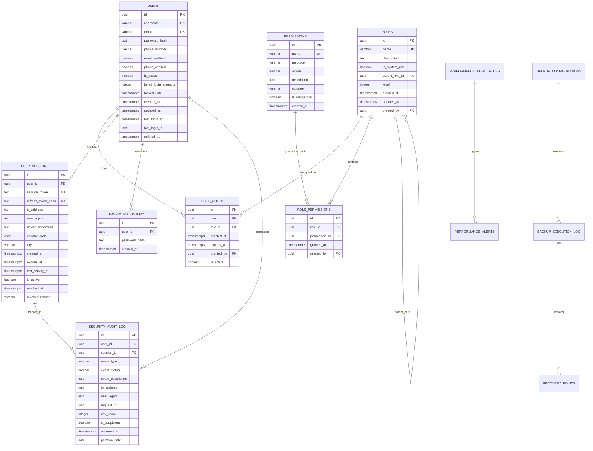
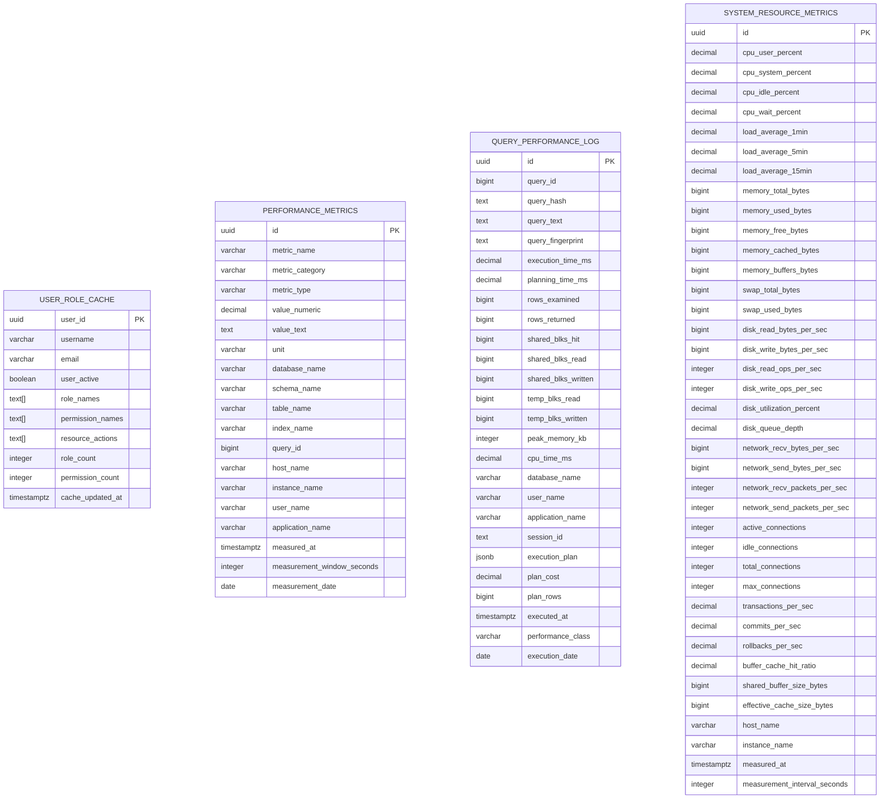
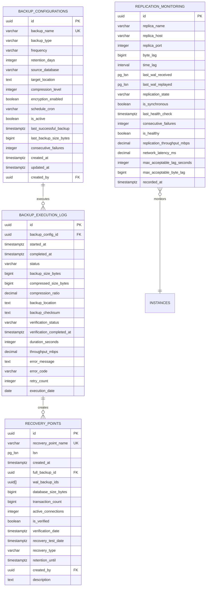
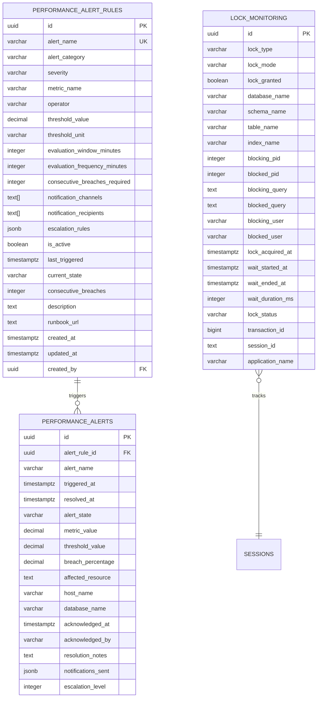
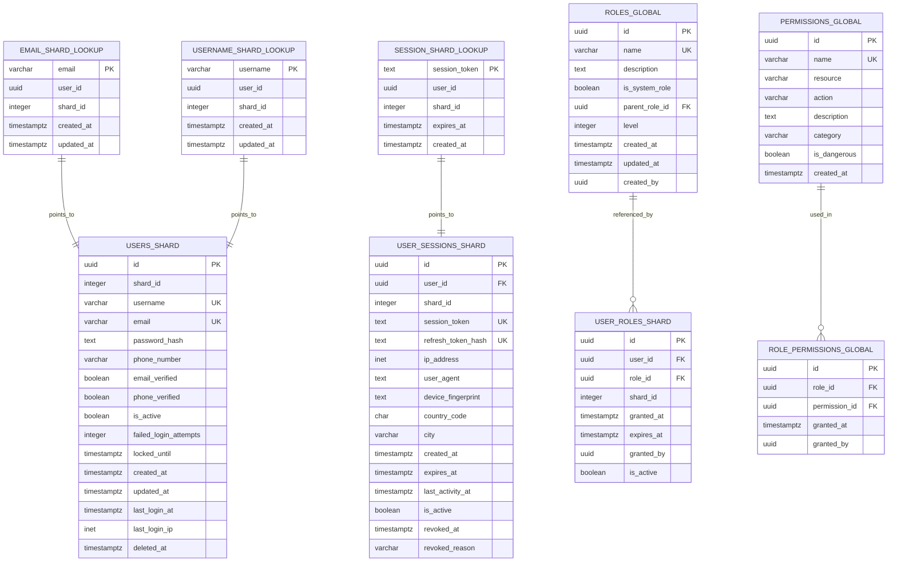
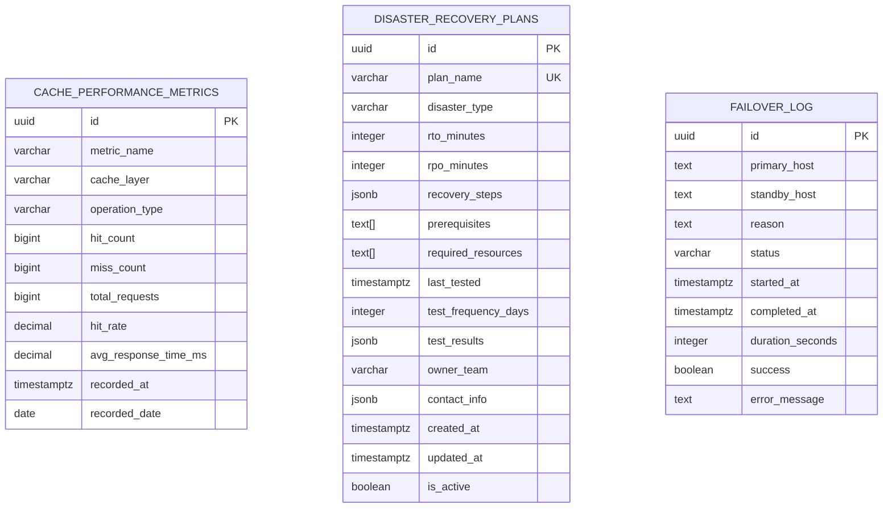
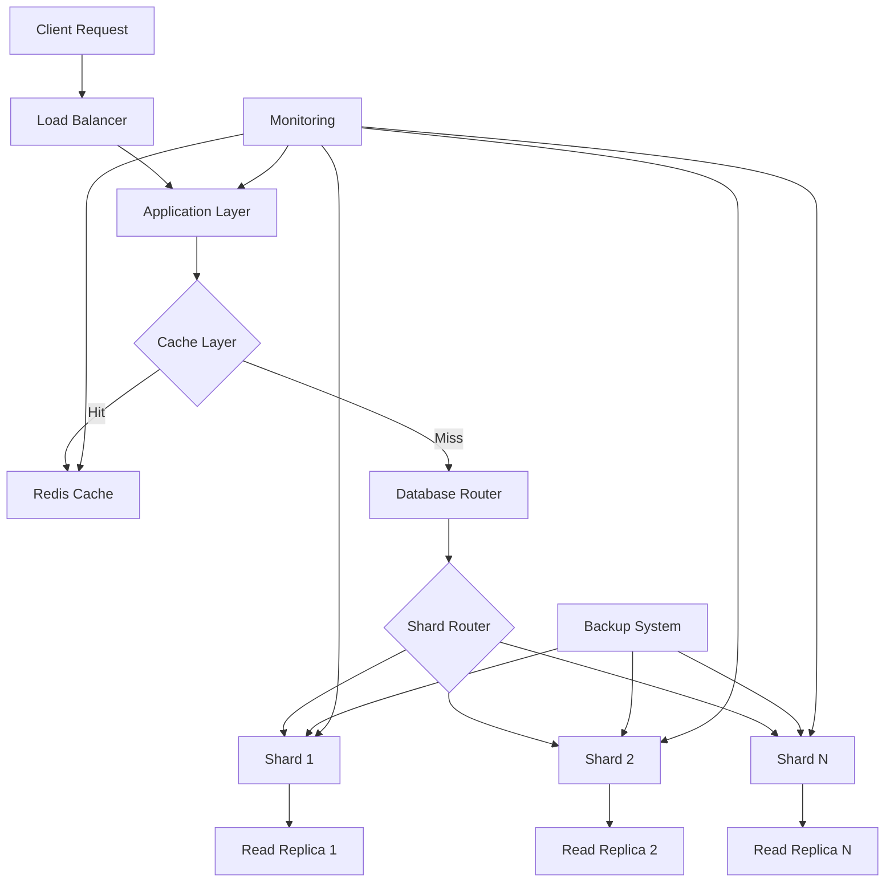

# High-Performance Authentication Database - ER Diagram

## 🎯 Database Architecture Overview

This document presents the Entity-Relationship diagram for a high-performance user authentication system designed to handle 1M+ concurrent users with sub-100ms response times.

## 📊 Core Entity Relationships

## 🔧 Performance Optimization Tables

## 🛡️ Backup and Recovery Tables

## 🚨 Alerting and Monitoring

## 🌐 Sharding Architecture

## 📈 Cache Performance Tables

## 🔑 Key Design Principles

### 1. **Scalability Architecture**
- **Horizontal Sharding**: Users distributed across 16+ shards using consistent hashing
- **Vertical Partitioning**: Time-based partitioning for audit logs and metrics
- **Read Replicas**: Multiple read-only replicas for query distribution

### 2. **Performance Optimization**
- **Materialized Views**: Pre-computed user-role-permission mappings
- **Strategic Indexing**: 50+ optimized indexes for sub-100ms queries
- **Connection Pooling**: Managed through application-level pooling

### 3. **Security Features**
- **Audit Trail**: Comprehensive security event logging
- **Session Management**: JWT-based sessions with refresh token rotation
- **Rate Limiting**: Built-in protection against brute force attacks
- **Encryption**: All sensitive data encrypted at rest and in transit

### 4. **High Availability**
- **Multi-layer Backup**: Real-time replication + incremental + full backups
- **Automated Failover**: Sub-1-minute failover to standby instances
- **Point-in-Time Recovery**: Recovery to any point within 30 days

### 5. **Monitoring & Alerting**
- **Real-time Metrics**: 1-second interval performance monitoring
- **Predictive Alerts**: ML-based anomaly detection for proactive alerts
- **Self-healing**: Automated optimization recommendations

## 📊 Data Flow Architecture

## 🎯 Performance Targets

| Metric | Target | Monitoring |
|--------|--------|------------|
| **Query Response Time** | <100ms (95th percentile) | Real-time query tracking |
| **Concurrent Users** | 1M+ active sessions | Connection monitoring |
| **Cache Hit Rate** | >95% | Redis performance metrics |
| **Uptime** | 99.99% | Health check monitoring |
| **Failover Time** | <1 minute | Automated failover testing |
| **Backup Recovery** | <5 minutes | Regular recovery drills |

## 🛠️ Implementation Notes

### Database Engine
- **PostgreSQL 15+** for advanced features and performance
- **Extensions**: pg_stat_statements, pgcrypto, uuid-ossp

### Partitioning Strategy
- **Range Partitioning**: By date for time-series data
- **Hash Partitioning**: By user_id for user data distribution
- **Automated Partition Management**: Monthly partition creation

### Index Strategy
- **B-tree Indexes**: Standard queries and sorting
- **Partial Indexes**: Filtered indexes for active data only
- **Covering Indexes**: Include frequently accessed columns
- **GIN Indexes**: Full-text search and JSONB queries

### Security Implementation
- **Row-Level Security**: User data isolation
- **Column Encryption**: Sensitive data protection
- **Audit Logging**: All security events tracked
- **Connection Encryption**: SSL/TLS for all connections

This ER diagram represents a production-ready, enterprise-grade authentication system capable of handling massive scale while maintaining security, performance, and reliability standards.