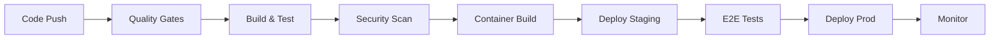

# 🚀 Complete DevOps Pipeline Design for Perfect21 Claude Enhancer

## 📋 Architecture Overview

**Application Stack:**
- **Backend**: Python (FastAPI/Flask) with Claude Enhancer hooks
- **Frontend**: React/Vue.js components
- **Database**: PostgreSQL + Redis
- **Authentication**: JWT-based auth system
- **Monitoring**: Prometheus + Grafana + ELK Stack

## 🔄 CI/CD Pipeline Flow

## 📊 Environment Strategy

### 🌍 Multi-Environment Setup
| Environment | Purpose | Auto-Deploy | Approval Required |
|-------------|---------|-------------|------------------|
| **Development** | Feature development | ✅ On PR | ❌ No |
| **Staging** | Integration testing | ✅ On develop | ❌ No |
| **Production** | Live system | ✅ On main | ✅ Yes |

### 🎯 Deployment Targets
- **Dev**: Single node Docker Compose
- **Staging**: Kubernetes cluster (2 nodes)
- **Production**: Kubernetes cluster (3+ nodes with HA)

## 🔧 Technology Stack

### Infrastructure as Code
- **Terraform**: AWS/GCP/Azure infrastructure
- **Helm**: Kubernetes application deployment
- **Ansible**: Configuration management

### Container Platform
- **Docker**: Application containerization
- **Kubernetes**: Container orchestration
- **Istio**: Service mesh (production)

### Monitoring & Observability
- **Prometheus**: Metrics collection
- **Grafana**: Visualization dashboards
- **ELK Stack**: Centralized logging
- **Jaeger**: Distributed tracing

## 🚀 Implementation Plan

The following files will be created:
1. **Pipeline Configurations** (GitHub Actions/GitLab CI)
2. **Dockerfile** (Multi-stage optimized)
3. **Kubernetes Manifests** (Complete deployment)
4. **Terraform Infrastructure** (Cloud resources)
5. **Monitoring Setup** (Prometheus + Grafana)
6. **Rollback Strategies** (Blue-Green deployment)

---
*This design ensures enterprise-grade reliability with automated quality gates*