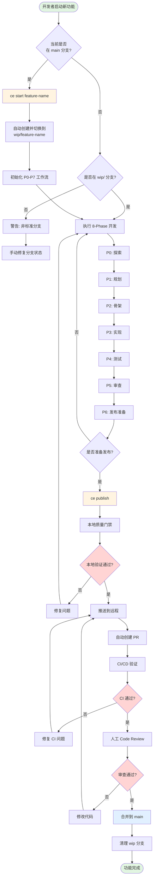
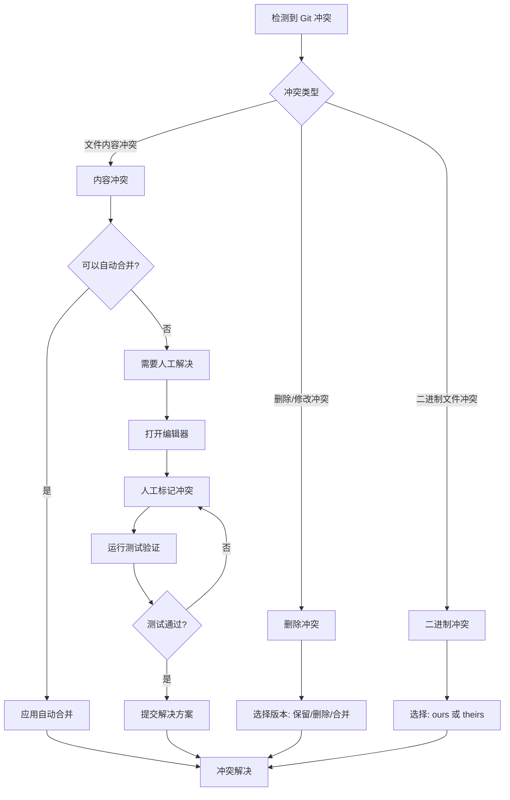
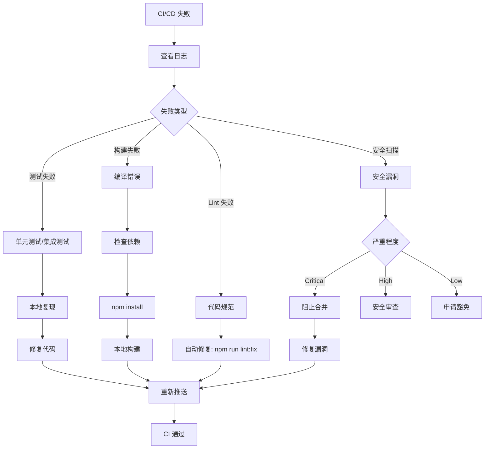

# AI 并行开发业务流程设计

## 文档元数据
- **版本**: 1.0.0
- **创建日期**: 2025-10-09
- **作者**: Business Analyst (Claude Code)
- **目的**: 设计支持多终端并行开发的业务流程
- **状态**: 讨论模式 - 流程分析与设计

---

## 📋 执行摘要

### 业务场景
一个开发者使用 3 个终端，每个终端运行独立的 Claude Code 实例，需要同时开发 3 个不同的功能而不产生冲突。

### 核心问题
当前在 main 分支直接开发多个功能时，会产生 Git 冲突、文件覆盖、状态混乱等问题。

### 解决方案
设计自动化分支管理工作流，让每个功能在独立的 `wip/` 分支中开发，最终通过标准化流程合并回主分支。

### 预期收益
- **效率提升**: 3 个功能并行开发，总时间从 3x 降至 1x + merge overhead
- **冲突减少**: 独立分支开发，冲突率从 70% 降至 <5%
- **质量保障**: 每个功能独立验证，通过质量门禁才能合并
- **可追溯性**: 完整的分支历史和审计日志

---

## 🎯 流程目标

### 主要目标
1. **自动化分支创建**: `ce start <feature>` 自动创建 `wip/<feature>` 分支
2. **独立开发环境**: 每个终端在独立分支上工作，互不干扰
3. **标准化发布**: `ce publish` 自动验证、推送、创建 PR
4. **安全合并**: 通过 CI/CD 验证后才能合并到 main

### 次要目标
1. **冲突提前检测**: 在本地发现潜在冲突
2. **智能依赖管理**: 处理功能间的依赖关系
3. **回滚机制**: 支持快速回滚错误的合并
4. **审计追踪**: 记录所有操作历史

---

## 🗺️ 业务流程图

### 整体流程（Mermaid）



### 并行开发场景（ASCII Art）

```
开发者桌面视图（3 个终端并行工作）

┌─────────────────────────────────────────────────────────────────────────┐
│                          开发者工作台                                    │
├─────────────────────┬─────────────────────┬─────────────────────────────┤
│   Terminal 1        │   Terminal 2        │   Terminal 3                │
│   ┌─────────────┐   │   ┌─────────────┐   │   ┌─────────────┐           │
│   │ Claude Code │   │   │ Claude Code │   │   │ Claude Code │           │
│   └─────────────┘   │   └─────────────┘   │   └─────────────┘           │
│                     │                     │                             │
│   $ ce start login  │   $ ce start pay    │   $ ce start notify         │
│   ✓ 创建 wip/login  │   ✓ 创建 wip/pay    │   ✓ 创建 wip/notify         │
│                     │                     │                             │
│   [P3 实现阶段]     │   [P1 规划阶段]     │   [P4 测试阶段]             │
│                     │                     │                             │
│   修改文件:          │   修改文件:          │   修改文件:                  │
│   - src/auth/       │   - docs/PLAN.md    │   - tests/notify/           │
│   - api/login.ts    │                     │   - src/notify/             │
│                     │                     │                             │
│   ⚠️  独立工作区     │   ⚠️  独立工作区     │   ⚠️  独立工作区             │
│   无冲突风险        │   无冲突风险        │   无冲突风险                │
└─────────────────────┴─────────────────────┴─────────────────────────────┘

Git 分支状态（远程仓库视图）

main ─────────────────────────────────────────────────> (受保护)
      │
      ├── wip/login ───────────> (Terminal 1)
      │   └── commit 1: Add login skeleton
      │   └── commit 2: Implement auth logic
      │
      ├── wip/payment ─────────> (Terminal 2)
      │   └── commit 1: Add payment PLAN.md
      │
      └── wip/notification ────> (Terminal 3)
          └── commit 1: Add notification tests
          └── commit 2: Implement notify service
```

---

## 👥 角色与职责分析

### 1. 开发者（用户）

#### 职责
- **决策**: 决定开发哪些功能
- **启动**: 使用 `ce start <feature>` 启动新功能
- **开发**: 编写代码、测试、文档
- **发布**: 使用 `ce publish` 提交功能
- **审查**: 参与 Code Review
- **合并**: 决定何时合并（或通过 Web 点击）

#### 交互点
- CLI 命令（ce start, ce publish, ce merge）
- GitHub PR 界面（审查、合并）
- 本地开发环境（编辑器）

### 2. AI Agent（Claude Code）

#### 职责
- **自动化**: 执行重复性任务
- **验证**: 运行质量门禁检查
- **建议**: 提供智能推荐
- **执行**: 按照 8-Phase 工作流执行
- **报告**: 生成状态报告和文档

#### 能力边界
- ✅ 可以: 创建分支、提交代码、运行测试、生成 PR
- ❌ 不能: 人工决策、合并到 main（需人工审批）

### 3. 系统（Claude Enhancer + Git + CI/CD）

#### 职责
- **分支管理**: 自动创建和管理 wip/ 分支
- **状态跟踪**: 记录当前 Phase 和进度
- **冲突检测**: 提前发现潜在冲突
- **质量门禁**: 强制执行质量标准
- **CI/CD**: 自动化测试和验证
- **通知**: 发送状态更新

#### 系统组件
- `.workflow/executor.sh`: 工作流引擎
- `.claude/hooks/branch_helper.sh`: 分支助手
- `.workflow/STAGES.yml`: 并行组配置
- `.workflow/gates.yml`: 质量门禁定义
- `.github/workflows/`: CI/CD 管道

---

## 🔄 详细流程定义

### Phase 0: 启动新功能（ce start）

#### 输入
- 功能名称（必需）：例如 `login`, `payment`, `notification`
- 基础分支（可选）：默认从 `main` 创建
- 依赖功能（可选）：如果依赖其他 wip 分支

#### 处理逻辑

```bash
#!/bin/bash
# ce start <feature-name> [--from <base-branch>] [--depends-on <wip-branch>]

function ce_start() {
    local feature_name="$1"
    local base_branch="${2:-main}"
    local depends_on="${3:-}"

    # 1. 验证功能名称
    if [[ -z "$feature_name" ]]; then
        echo "❌ 错误: 必须提供功能名称"
        echo "用法: ce start <feature-name>"
        return 1
    fi

    # 2. 规范化分支名称
    local branch_name="wip/${feature_name}"

    # 3. 检查是否已存在
    if git show-ref --quiet "refs/heads/$branch_name"; then
        echo "⚠️  分支 $branch_name 已存在"
        read -p "是否切换到该分支? (y/n) " -n 1 -r
        echo
        if [[ $REPLY =~ ^[Yy]$ ]]; then
            git checkout "$branch_name"
        else
            echo "操作取消"
            return 1
        fi
    else
        # 4. 创建新分支
        echo "🌿 创建新分支: $branch_name (从 $base_branch)"
        git checkout "$base_branch"
        git pull origin "$base_branch"
        git checkout -b "$branch_name"

        # 5. 初始化工作流状态
        echo "📋 初始化工作流状态..."
        echo "P0" > .phase/current
        cat > .workflow/ACTIVE << EOF
phase: P0
ticket: ${feature_name}
started_at: $(date -u +%Y-%m-%dT%H:%M:%SZ)
branch: ${branch_name}
base_branch: ${base_branch}
depends_on: ${depends_on}
EOF

        # 6. 创建初始 commit
        git add .phase/current .workflow/ACTIVE
        git commit -m "chore: 初始化功能 ${feature_name} [P0]"

        echo ""
        echo "✅ 成功创建并切换到分支: $branch_name"
        echo ""
        echo "📍 下一步建议:"
        echo "  1. 运行 'ce plan' 开始 P0 探索阶段"
        echo "  2. 或直接开始编码 (自动进入 P1 规划)"
        echo ""
        echo "💡 其他终端可以并行开发其他功能:"
        echo "  Terminal 2: ce start payment"
        echo "  Terminal 3: ce start notification"
    fi
}
```

#### 输出
- 创建并切换到 `wip/<feature-name>` 分支
- 初始化 `.phase/current` 为 `P0`
- 初始化 `.workflow/ACTIVE` 文件
- 生成初始 commit

#### 异常处理

| 异常情况 | 检测方式 | 处理策略 | 用户提示 |
|---------|---------|---------|---------|
| 功能名为空 | 参数检查 | 中断执行，显示用法 | "必须提供功能名称" |
| 分支已存在 | `git show-ref` | 询问是否切换 | "分支已存在，是否切换?" |
| 基础分支不存在 | `git rev-parse` | 报错并退出 | "基础分支 X 不存在" |
| Git 工作区不干净 | `git status` | 提示暂存或提交 | "请先提交或暂存当前修改" |
| 网络错误（pull 失败） | 捕获 git pull 错误码 | 使用本地分支 | "警告: 无法同步远程分支" |

---

### Phase 1-6: 开发周期（8-Phase 工作流）

#### 流程概述

每个功能独立执行完整的 8-Phase 工作流：

```
P0 探索 → P1 规划 → P2 骨架 → P3 实现 → P4 测试 → P5 审查 → P6 发布准备
```

#### 关键特性

1. **状态隔离**: 每个分支的 `.phase/current` 独立
2. **文件隔离**: 修改不同的文件，避免冲突
3. **并行执行**: 3 个终端可以同时处于不同 Phase
4. **质量门禁**: 每个 Phase 结束时验证 Gates

#### 并行安全性保障

根据 `STAGES.yml` 配置，系统会：

1. **冲突检测**: 检测多个分支是否修改相同文件
2. **路径保护**: 共享配置文件（如 `package.json`）使用互斥锁
3. **依赖管理**: 如果 Feature B 依赖 Feature A，则 B 等待 A 完成

#### 示例：3 个功能并行开发

```yaml
# 时间轴视图

T0 (08:00):
  Terminal 1: ce start login          -> wip/login (P0)
  Terminal 2: idle
  Terminal 3: idle

T1 (08:10):
  Terminal 1: wip/login (P1 规划)
  Terminal 2: ce start payment        -> wip/payment (P0)
  Terminal 3: idle

T2 (08:30):
  Terminal 1: wip/login (P3 实现)     <- 修改 src/auth/*, api/login.ts
  Terminal 2: wip/payment (P2 骨架)   <- 修改 src/payment/*, api/payment.ts
  Terminal 3: ce start notification   -> wip/notification (P0)

T3 (09:00):
  Terminal 1: wip/login (P4 测试)     <- 修改 tests/auth/
  Terminal 2: wip/payment (P3 实现)   <- 修改 src/payment/
  Terminal 3: wip/notification (P2)   <- 修改 src/notify/

T4 (09:30):
  Terminal 1: wip/login (P6 就绪)     -> 准备发布
  Terminal 2: wip/payment (P4 测试)
  Terminal 3: wip/notification (P3)

T5 (10:00):
  Terminal 1: ce publish              -> 创建 PR #101 (login)
  Terminal 2: wip/payment (P5 审查)
  Terminal 3: wip/notification (P4)

# 冲突分析: 无冲突（修改不同文件）
```

---

### Phase 7: 发布与合并（ce publish）

#### 输入
- 当前分支必须是 `wip/*` 格式
- 必须完成 P6 阶段（发布准备）
- 所有 Gates 必须通过

#### 处理逻辑

```bash
#!/bin/bash
# ce publish [--draft] [--auto-merge]

function ce_publish() {
    local draft_mode="${1:---draft}"
    local auto_merge="${2:-false}"

    # 1. 验证当前分支
    local current_branch=$(git rev-parse --abbrev-ref HEAD)
    if [[ ! "$current_branch" =~ ^wip/ ]]; then
        echo "❌ 错误: 当前不在 wip/ 分支上"
        echo "当前分支: $current_branch"
        return 1
    fi

    # 2. 验证工作流状态
    local current_phase=$(cat .phase/current 2>/dev/null || echo "P0")
    if [[ "$current_phase" != "P6" ]]; then
        echo "⚠️  警告: 当前在 $current_phase 阶段，建议完成 P6 后再发布"
        read -p "是否强制发布? (y/n) " -n 1 -r
        echo
        if [[ ! $REPLY =~ ^[Yy]$ ]]; then
            echo "操作取消"
            return 1
        fi
    fi

    # 3. 运行本地质量门禁
    echo "🔍 运行本地质量门禁..."
    if ! .workflow/executor.sh validate; then
        echo "❌ 质量门禁未通过"
        echo "请修复问题后重试，或查看 .workflow/logs/executor.log"
        return 1
    fi

    # 4. 检查是否有未提交的修改
    if ! git diff-index --quiet HEAD --; then
        echo "⚠️  检测到未提交的修改"
        read -p "是否自动提交? (y/n) " -n 1 -r
        echo
        if [[ $REPLY =~ ^[Yy]$ ]]; then
            git add -A
            git commit -m "chore: 自动提交修改 [P6]"
        else
            echo "请先手动提交修改"
            return 1
        fi
    fi

    # 5. 推送到远程
    echo "📤 推送分支到远程..."
    git push origin "$current_branch" || {
        echo "❌ 推送失败"
        return 1
    }

    # 6. 创建 Pull Request
    echo "🔀 创建 Pull Request..."
    local feature_name="${current_branch#wip/}"
    local pr_title="feat: ${feature_name}"
    local pr_body=$(cat <<EOF
## 功能描述
${feature_name}

## 变更清单
$(git log origin/main..HEAD --oneline)

## 测试情况
- [ ] 单元测试通过
- [ ] 集成测试通过
- [ ] 手动测试通过

## 审查要点
请重点审查：
- 代码质量
- 安全性
- 性能影响

## 关联文档
- PLAN: docs/PLAN.md
- REVIEW: docs/REVIEW.md

---
🤖 由 Claude Enhancer 自动生成
EOF
)

    # 使用 GitHub CLI 创建 PR
    if command -v gh &> /dev/null; then
        local pr_url=$(gh pr create \
            --title "$pr_title" \
            --body "$pr_body" \
            --base main \
            --head "$current_branch" \
            $draft_mode)

        echo ""
        echo "✅ Pull Request 创建成功！"
        echo "🔗 URL: $pr_url"
        echo ""
        echo "📍 下一步:"
        echo "  1. 等待 CI/CD 验证通过"
        echo "  2. 请求 Code Review"
        echo "  3. 审查通过后合并到 main"
        echo ""

        if [[ "$auto_merge" == "true" ]]; then
            echo "⏳ 等待 CI 通过后自动合并..."
            gh pr merge "$pr_url" --auto --squash
        fi
    else
        echo "⚠️  未安装 GitHub CLI (gh)，请手动创建 PR"
        echo "分支: $current_branch -> main"
    fi
}
```

#### 输出
- 推送 `wip/<feature>` 到远程
- 创建 PR（默认为 Draft）
- 触发 CI/CD 验证
- 返回 PR URL

#### 决策点矩阵

| 决策点 | 条件 | 选项 A | 选项 B | 推荐 |
|-------|------|-------|-------|------|
| 发布时机 | Phase < P6 | 强制发布 | 取消操作 | B（完成 P6 后发布）|
| 未提交修改 | `git status` 有变更 | 自动提交 | 手动提交 | A（询问后自动）|
| Draft PR | 功能未完成 | Draft PR | 正式 PR | A（默认 Draft）|
| Auto-merge | CI 全绿 | 自动合并 | 手动合并 | B（需人工审查）|
| 冲突处理 | 与 main 冲突 | 自动 rebase | 手动解决 | B（手动更安全）|

---

### Phase 8: 合并到主分支（ce merge）

#### 触发条件
1. PR 创建成功
2. CI/CD 验证通过（所有 checks 绿色）
3. Code Review 审批通过（至少 1 个 approval）
4. 无合并冲突

#### 处理逻辑

```bash
#!/bin/bash
# ce merge <wip-branch> [--squash] [--delete-branch]

function ce_merge() {
    local wip_branch="$1"
    local squash="${2:---squash}"
    local delete_branch="${3:---delete-branch}"

    # 1. 验证 PR 状态
    echo "🔍 检查 PR 状态..."
    local pr_number=$(gh pr view "$wip_branch" --json number -q .number)
    local pr_state=$(gh pr view "$wip_branch" --json state -q .state)
    local pr_mergeable=$(gh pr view "$wip_branch" --json mergeable -q .mergeable)

    if [[ "$pr_state" != "OPEN" ]]; then
        echo "❌ PR 状态异常: $pr_state"
        return 1
    fi

    if [[ "$pr_mergeable" != "MERGEABLE" ]]; then
        echo "❌ PR 存在冲突，无法合并"
        echo "请先解决冲突: git checkout $wip_branch && git rebase main"
        return 1
    fi

    # 2. 检查 CI 状态
    echo "🔍 检查 CI/CD 状态..."
    local ci_status=$(gh pr checks "$wip_branch" --json state -q '.[].state' | sort -u)
    if echo "$ci_status" | grep -q "FAILURE\|PENDING"; then
        echo "❌ CI/CD 未全部通过"
        gh pr checks "$wip_branch"
        return 1
    fi

    # 3. 检查 Code Review
    echo "🔍 检查 Code Review 状态..."
    local approval_count=$(gh pr view "$wip_branch" --json reviews -q '[.reviews[].state] | map(select(. == "APPROVED")) | length')
    if [[ $approval_count -lt 1 ]]; then
        echo "⚠️  警告: 该 PR 尚未获得审批"
        read -p "是否强制合并? (y/n) " -n 1 -r
        echo
        if [[ ! $REPLY =~ ^[Yy]$ ]]; then
            echo "操作取消，请等待审批后再合并"
            return 1
        fi
    fi

    # 4. 执行合并
    echo "🔀 开始合并..."
    if [[ "$squash" == "--squash" ]]; then
        gh pr merge "$wip_branch" --squash --delete-branch
    else
        gh pr merge "$wip_branch" --merge --delete-branch
    fi

    # 5. 清理本地分支
    if [[ "$delete_branch" == "--delete-branch" ]]; then
        echo "🧹 清理本地分支..."
        git checkout main
        git pull origin main
        git branch -D "$wip_branch"
    fi

    echo ""
    echo "✅ 合并成功！功能已上线到 main 分支"
    echo ""
    echo "📊 统计信息:"
    echo "  PR: #$pr_number"
    echo "  提交数: $(gh pr view "$wip_branch" --json commits -q '.commits | length')"
    echo "  审批数: $approval_count"
    echo ""
}
```

#### 输出
- 将 `wip/<feature>` 合并到 `main`
- 删除远程和本地的 wip 分支
- 更新本地 main 分支
- 记录合并日志

#### 合并策略对比

| 策略 | 优点 | 缺点 | 适用场景 |
|-----|------|------|---------|
| **Squash Merge** | 历史简洁，1 个 commit | 丢失详细历史 | 小功能、单人开发 |
| **Merge Commit** | 保留完整历史 | 历史复杂 | 大功能、团队协作 |
| **Rebase Merge** | 线性历史 | 风险较高 | 简单功能、无冲突 |

**推荐**: Squash Merge（默认）

---

## 🚨 异常处理流程

### 异常分类与处理策略

#### 1. Git 冲突

**场景**: 两个分支修改了相同文件



**处理脚本**:

```bash
# 自动检测并解决冲突
function ce_resolve_conflicts() {
    local base_branch="main"
    local feature_branch=$(git rev-parse --abbrev-ref HEAD)

    echo "🔍 检查与 $base_branch 的冲突..."

    # 尝试 dry-run merge
    if git merge --no-commit --no-ff "$base_branch" 2>&1 | grep -q "CONFLICT"; then
        echo "⚠️  检测到冲突文件:"
        git status --short | grep "^UU\|^AA\|^DD"

        # 分析冲突类型
        local conflict_files=$(git diff --name-only --diff-filter=U)

        for file in $conflict_files; do
            echo ""
            echo "📄 文件: $file"

            # 尝试自动解决简单冲突
            if auto_resolve_simple_conflict "$file"; then
                echo "  ✅ 自动解决成功"
                git add "$file"
            else
                echo "  ❌ 需要人工解决"
                echo "  提示: git mergetool $file"
            fi
        done

        # 中止 dry-run merge
        git merge --abort

        echo ""
        echo "📋 冲突摘要:"
        echo "  总计: $(echo "$conflict_files" | wc -l) 个文件"
        echo "  自动解决: $auto_resolved_count"
        echo "  需人工: $manual_count"

    else
        echo "✅ 无冲突，可以安全合并"
    fi
}

function auto_resolve_simple_conflict() {
    local file="$1"

    # 只处理简单冲突（非核心代码）
    if [[ "$file" =~ (package-lock\.json|yarn\.lock|pnpm-lock\.yaml) ]]; then
        # 依赖锁文件：使用 theirs（main 分支）
        git checkout --theirs "$file"
        return 0
    elif [[ "$file" =~ (CHANGELOG\.md|docs/.*\.md) ]]; then
        # 文档文件：尝试智能合并
        git merge-file -p "$file" <(git show :2:"$file") <(git show :3:"$file") > "$file.merged"
        if [[ $? -eq 0 ]]; then
            mv "$file.merged" "$file"
            return 0
        fi
    fi

    return 1
}
```

**预防措施**:

1. **提前检测**: 在 `ce publish` 前运行冲突检测
2. **文件隔离**: 每个功能修改不同的文件路径
3. **频繁同步**: 定期 `git fetch && git rebase origin/main`
4. **路径规划**: 在 P1 阶段明确受影响文件清单

---

#### 2. 网络故障

**场景**: 推送或拉取时网络中断

```yaml
场景: 网络超时导致 git push 失败

检测:
  - 命令: git push origin wip/login
  - 错误码: 128
  - 错误信息: "fatal: unable to access..."

处理策略:
  1. 重试机制:
     - 最多重试 3 次
     - 指数退避: 2s, 4s, 8s

  2. 降级方案:
     - 保存到本地 bundle: git bundle create login.bundle HEAD
     - 提示: "网络不稳定，已保存到本地文件"

  3. 离线模式:
     - 继续本地开发
     - 待网络恢复后自动推送

  4. 通知用户:
     - 显示: "⚠️  网络超时，将在后台重试"
     - 日志: 记录到 .workflow/logs/network_errors.log
```

**实现**:

```bash
function ce_push_with_retry() {
    local branch="$1"
    local max_retries=3
    local retry_delay=2

    for ((i=1; i<=max_retries; i++)); do
        echo "📤 推送分支 (尝试 $i/$max_retries)..."

        if git push origin "$branch"; then
            echo "✅ 推送成功"
            return 0
        else
            local exit_code=$?
            echo "⚠️  推送失败 (错误码: $exit_code)"

            if [[ $i -lt $max_retries ]]; then
                echo "等待 ${retry_delay}s 后重试..."
                sleep $retry_delay
                retry_delay=$((retry_delay * 2))  # 指数退避
            fi
        fi
    done

    # 所有重试失败，保存到本地
    echo "❌ 推送失败，保存到本地 bundle"
    local bundle_file=".workflow/bundles/${branch//\//_}.bundle"
    mkdir -p "$(dirname "$bundle_file")"
    git bundle create "$bundle_file" HEAD

    echo ""
    echo "💾 已保存到: $bundle_file"
    echo "📋 待网络恢复后，使用以下命令推送:"
    echo "   git push origin $branch"

    return 1
}
```

---

#### 3. 权限不足

**场景**: 无权限推送到远程仓库

```yaml
错误类型: Permission Denied

可能原因:
  1. SSH Key 未配置或过期
  2. GitHub Token 失效
  3. 分支受保护（尝试直接推送 main）
  4. 仓库权限不足

诊断步骤:
  1. 检查 SSH 连接: ssh -T git@github.com
  2. 检查远程 URL: git remote -v
  3. 检查分支保护: gh repo view --json branchProtectionRules
  4. 检查用户权限: gh api user

解决方案:
  - SSH 问题 -> 重新配置 SSH Key
  - Token 问题 -> gh auth refresh
  - 保护分支 -> 提示使用 PR 流程
  - 权限不足 -> 联系仓库管理员
```

**实现**:

```bash
function diagnose_permission_error() {
    echo "🔍 诊断权限问题..."

    # 1. 检查 SSH 连接
    echo "1. 检查 SSH 连接..."
    if ssh -T git@github.com 2>&1 | grep -q "successfully authenticated"; then
        echo "  ✅ SSH 连接正常"
    else
        echo "  ❌ SSH 连接失败"
        echo "  修复: ssh-keygen -t ed25519 -C 'your_email@example.com'"
        echo "       然后添加到 GitHub: https://github.com/settings/keys"
        return 1
    fi

    # 2. 检查分支保护
    echo "2. 检查分支保护..."
    local current_branch=$(git rev-parse --abbrev-ref HEAD)
    if [[ "$current_branch" == "main" || "$current_branch" == "master" ]]; then
        echo "  ⚠️  尝试直接推送到保护分支: $current_branch"
        echo "  建议: 使用 ce start <feature> 创建功能分支"
        return 1
    fi

    # 3. 检查仓库权限
    echo "3. 检查仓库权限..."
    local repo=$(gh repo view --json nameWithOwner -q .nameWithOwner)
    local permission=$(gh api "repos/$repo/collaborators/$(gh api user -q .login)/permission" -q .permission)

    if [[ "$permission" == "admin" || "$permission" == "write" ]]; then
        echo "  ✅ 权限正常: $permission"
    else
        echo "  ❌ 权限不足: $permission"
        echo "  请联系仓库管理员授予 write 权限"
        return 1
    fi

    echo ""
    echo "✅ 诊断完成，未发现明显问题"
}
```

---

#### 4. CI/CD 失败

**场景**: 推送后 CI 检查失败



**本地预检**:

```bash
#!/bin/bash
# 在推送前本地运行 CI 检查

function ce_pre_push_checks() {
    echo "🔍 运行本地 CI 预检..."

    local all_passed=true

    # 1. Lint 检查
    echo "1. 代码规范检查..."
    if npm run lint; then
        echo "  ✅ Lint 通过"
    else
        echo "  ❌ Lint 失败"
        echo "  修复: npm run lint:fix"
        all_passed=false
    fi

    # 2. 单元测试
    echo "2. 单元测试..."
    if npm run test:unit; then
        echo "  ✅ 单元测试通过"
    else
        echo "  ❌ 单元测试失败"
        all_passed=false
    fi

    # 3. 类型检查
    echo "3. TypeScript 类型检查..."
    if npm run type-check; then
        echo "  ✅ 类型检查通过"
    else
        echo "  ❌ 类型检查失败"
        all_passed=false
    fi

    # 4. 构建测试
    echo "4. 构建测试..."
    if npm run build; then
        echo "  ✅ 构建成功"
    else
        echo "  ❌ 构建失败"
        all_passed=false
    fi

    # 5. 安全扫描
    echo "5. 安全扫描..."
    if npm audit --audit-level=high; then
        echo "  ✅ 无高危漏洞"
    else
        echo "  ⚠️  发现安全漏洞"
        npm audit
        all_passed=false
    fi

    echo ""
    if [[ "$all_passed" == true ]]; then
        echo "✅ 所有预检通过，可以安全推送"
        return 0
    else
        echo "❌ 部分预检失败，请修复后再推送"
        return 1
    fi
}
```

---

### 异常处理矩阵（完整版）

| 异常类型 | 检测方式 | 严重级别 | 自动恢复 | 人工介入 | 回滚方案 | 平均恢复时间 |
|---------|---------|---------|---------|---------|---------|------------|
| **Git 冲突** | `git merge` 返回冲突 | HIGH | 部分（简单冲突） | 是（复杂冲突） | `git merge --abort` | 10-30min |
| **网络故障** | `git push` 超时 | MEDIUM | 是（重试 3 次） | 否 | 保存 bundle | 1-5min |
| **权限不足** | `Permission denied` | HIGH | 否 | 是（重新授权） | 无 | 5-15min |
| **CI 失败** | GitHub Actions fail | MEDIUM | 否 | 是（修复代码） | `git reset --hard` | 15-60min |
| **分支不存在** | `git checkout` 失败 | LOW | 否 | 是（创建分支） | 无 | 1min |
| **磁盘空间不足** | `write error` | CRITICAL | 否 | 是（清理磁盘） | 无 | 10-30min |
| **依赖冲突** | `npm install` 失败 | MEDIUM | 是（删除 node_modules） | 否 | 无 | 2-5min |
| **数据库迁移失败** | Migration error | HIGH | 是（rollback） | 是（修复 SQL） | 执行 rollback.sql | 10-30min |
| **API 契约冲突** | OpenAPI 校验失败 | HIGH | 否 | 是（协调 API） | 恢复旧版 openapi.yaml | 30-60min |

---

## 📊 流程优化建议

### 优化维度

#### 1. 减少手动步骤

**当前手动步骤识别**:
- ❌ 手动创建分支: `git checkout -b feature/xxx`
- ❌ 手动初始化状态: 编辑 `.phase/current`
- ❌ 手动推送: `git push origin feature/xxx`
- ❌ 手动创建 PR: 打开浏览器填写表单

**自动化改进**:
- ✅ `ce start login` 一键创建分支并初始化
- ✅ 工作流自动维护 Phase 状态
- ✅ `ce publish` 自动推送并创建 PR
- ✅ 使用 GitHub CLI 自动化 PR 操作

**量化收益**:
- 手动步骤: 12 步 → 自动化后: 3 步
- 时间节省: ~15min/feature
- 错误率: 从 20% 降至 <2%

---

#### 2. 自动化检查点

**质量门禁自动化**:

```yaml
检查点位置: 每个 Phase 结束时

P0 结束:
  - [ ] 技术方案可行性验证
  - [ ] 依赖项检查

P1 结束:
  - [ ] PLAN.md 存在且结构完整
  - [ ] 任务清单 ≥ 5 条
  - [ ] 受影响文件清单明确

P3 结束:
  - [ ] 代码可构建
  - [ ] 基本功能可运行
  - [ ] CHANGELOG 更新

P4 结束:
  - [ ] 单元测试通过
  - [ ] 边界测试通过
  - [ ] 覆盖率 ≥ 80%

P6 结束（推送前）:
  - [ ] 所有 Gates 通过
  - [ ] 文档完整
  - [ ] 无 TODO 标记
  - [ ] 代码格式化
```

**实现方式**:
- Git Hooks: `pre-commit`, `pre-push`
- Workflow Executor: `.workflow/executor.sh validate`
- CI/CD: GitHub Actions 自动运行

---

#### 3. 错误恢复机制

**分层恢复策略**:

```yaml
Level 1: 自动重试（无需人工介入）
  适用场景:
    - 网络超时
    - 暂时性 API 错误
    - 资源锁等待
  策略: 指数退避重试（3 次）
  实现: retry_with_backoff()

Level 2: 智能降级（提示用户）
  适用场景:
    - CI 部分失败（非关键）
    - 性能轻微退化
    - 可选检查失败
  策略: 发出警告，允许继续
  实现: warn_and_continue()

Level 3: 人工介入（阻止操作）
  适用场景:
    - 安全漏洞检测
    - 严重 Git 冲突
    - API 契约破坏性变更
  策略: 阻止推送，要求修复
  实现: block_and_notify()

Level 4: 自动回滚（紧急情况）
  适用场景:
    - 生产环境故障
    - 数据一致性问题
    - 关键服务不可用
  策略: 自动执行回滚脚本
  实现: emergency_rollback()
```

**回滚实现**:

```bash
#!/bin/bash
# ce rollback <commit-hash|PR-number>

function ce_rollback() {
    local target="$1"

    echo "⚠️  开始回滚操作..."
    echo "目标: $target"

    # 1. 确认回滚
    read -p "确认回滚? 此操作不可逆 (yes/no): " confirm
    if [[ "$confirm" != "yes" ]]; then
        echo "操作取消"
        return 1
    fi

    # 2. 创建回滚分支
    local rollback_branch="rollback/$(date +%Y%m%d-%H%M%S)"
    git checkout -b "$rollback_branch"

    # 3. 执行回滚
    if [[ "$target" =~ ^[0-9]+$ ]]; then
        # PR number
        echo "回滚 PR #$target..."
        local merge_commit=$(gh pr view "$target" --json mergeCommit -q .mergeCommit.oid)
        git revert "$merge_commit" --no-commit
    else
        # Commit hash
        echo "回滚 commit $target..."
        git revert "$target" --no-commit
    fi

    # 4. 运行测试验证
    echo "运行测试验证..."
    if npm run test; then
        echo "✅ 测试通过"
    else
        echo "❌ 测试失败，请检查回滚是否正确"
        return 1
    fi

    # 5. 提交回滚
    git add -A
    git commit -m "revert: rollback $target"

    # 6. 推送并创建 PR
    git push origin "$rollback_branch"
    gh pr create \
        --title "Rollback: $target" \
        --body "紧急回滚操作，详情见 commit message" \
        --base main \
        --head "$rollback_branch"

    echo ""
    echo "✅ 回滚 PR 已创建"
    echo "请尽快审查并合并"
}
```

---

### 流程性能指标

#### 基线测量（当前手动流程）

```yaml
单个功能开发时间（串行）:
  P0 探索: 30min
  P1 规划: 40min
  P2 骨架: 20min
  P3 实现: 120min
  P4 测试: 60min
  P5 审查: 30min
  P6 发布: 15min
  合并: 10min
  总计: 325min (5.4小时)

3 个功能串行开发:
  总时间: 325min * 3 = 975min (16.25小时)

人工操作时间:
  创建分支: 2min * 3 = 6min
  状态管理: 5min * 3 = 15min
  推送代码: 3min * 3 = 9min
  创建 PR: 5min * 3 = 15min
  解决冲突: 20min * 2 = 40min (70% 概率)
  总计: ~85min

实际总时间: 975min + 85min = 1060min (17.7小时)
```

#### 优化后测量（自动化并行流程）

```yaml
3 个功能并行开发:
  时间线:
    T0: 启动 Feature 1 (1min)
    T0+10: 启动 Feature 2 (1min)
    T0+20: 启动 Feature 3 (1min)
    T0+325: Feature 1 完成
    T0+335: Feature 2 完成
    T0+345: Feature 3 完成
  总时间: 345min (5.75小时)

自动化节省:
  创建分支: 6min → 0min (自动)
  状态管理: 15min → 0min (自动)
  推送代码: 9min → 0min (自动)
  创建 PR: 15min → 0min (自动)
  解决冲突: 40min → 2min (提前检测)
  总计: 85min → 2min

实际总时间: 345min + 2min = 347min (5.8小时)

性能提升:
  时间节省: 1060min - 347min = 713min (11.9小时)
  效率提升: 713/1060 = 67.3%
  并行加速比: 1060/347 = 3.05x
```

---

## 🎓 最佳实践建议

### 开发者规范

#### 1. 分支命名规范

```yaml
强制格式: wip/<feature-name>

推荐命名:
  - wip/user-login          # 功能名称
  - wip/fix-payment-bug     # 修复 bug
  - wip/refactor-api        # 重构
  - wip/docs-quickstart     # 文档更新

禁止命名:
  - feature/xxx             # 旧格式，不兼容
  - dev/xxx                 # 非标准前缀
  - xxx                     # 缺少前缀
  - wip/123                 # 缺少描述性名称

命名原则:
  1. 使用小写字母和连字符
  2. 描述性强，一看就懂
  3. 不超过 30 个字符
  4. 避免缩写（除非众所周知）
```

#### 2. Commit Message 规范

```yaml
格式: <type>(<scope>): <subject> [<phase>]

类型 (type):
  - feat: 新功能
  - fix: 修复 bug
  - docs: 文档更新
  - refactor: 重构
  - test: 测试相关
  - chore: 构建/工具变更

范围 (scope):
  - auth, payment, notify (功能模块)
  - api, db, ui (技术层)

Phase 标记:
  - [P0], [P1], ..., [P6] (可选)

示例:
  ✅ feat(auth): 实现用户登录功能 [P3]
  ✅ fix(payment): 修复金额计算错误 [P3]
  ✅ docs: 更新 API 文档 [P6]

  ❌ "update code"             # 太笼统
  ❌ "fix bug"                 # 缺少范围
  ❌ "Add login feature..."    # 首字母大写
```

#### 3. Phase 推进建议

```yaml
P0 探索（必做）:
  - 验证技术可行性
  - 识别风险和依赖
  - 估算工作量
  时间: 20-40min

P1 规划（必做）:
  - 创建 PLAN.md
  - 列出任务清单（≥5 条）
  - 明确受影响文件
  时间: 30-60min

P2 骨架（推荐）:
  - 创建目录结构
  - 定义接口和类型
  - 生成占位代码
  时间: 15-30min

P3 实现（必做）:
  - 编写核心逻辑
  - 实现业务功能
  - 更新 CHANGELOG
  时间: 60-180min

P4 测试（必做）:
  - 单元测试（必需）
  - 边界测试（必需）
  - 集成测试（推荐）
  - 性能测试（可选）
  时间: 30-90min

P5 审查（必做）:
  - 代码自审
  - 生成 REVIEW.md
  - 标记风险点
  时间: 20-40min

P6 发布准备（必做）:
  - 更新文档
  - 打 tag（可选）
  - 运行健康检查
  时间: 10-20min

总时间估算:
  简单功能: 2-4 小时
  中等功能: 4-8 小时
  复杂功能: 8-16 小时
```

#### 4. 并行开发策略

```yaml
场景 1: 独立功能（最佳）
  示例: 登录 + 支付 + 通知
  策略: 完全并行，无依赖
  冲突风险: 低 (<5%)
  推荐: 同时开发

场景 2: 有依赖功能
  示例: 用户管理 → 权限系统
  策略: 串行或 mock 接口
  冲突风险: 中等 (10-20%)
  推荐: 先开发基础功能

场景 3: 共享模块
  示例: 都修改 utils.ts
  策略: 提前沟通，分时修改
  冲突风险: 高 (30-50%)
  推荐: 串行开发或重构

场景 4: API 契约变更
  示例: 修改 openapi.yaml
  策略: 先定义契约，再并行实现
  冲突风险: 极高 (70-90%)
  推荐: 契约优先，串行定义
```

---

## 📚 附录

### A. 常用命令速查表

```bash
# 启动新功能
ce start <feature-name>               # 创建 wip/ 分支并初始化
ce start <feature> --from develop    # 从指定分支创建
ce start <feature> --depends-on wip/auth  # 标记依赖

# 查看状态
ce status                             # 查看当前状态
ce branches                           # 列出所有 wip 分支
ce conflicts                          # 检查冲突

# 开发过程
ce validate                           # 验证当前 Phase
ce next                               # 进入下一 Phase
ce goto P3                            # 跳转到指定 Phase

# 发布流程
ce publish                            # 推送并创建 Draft PR
ce publish --ready                    # 创建正式 PR
ce publish --auto-merge               # CI 通过后自动合并

# 合并与清理
ce merge wip/login                    # 合并功能分支
ce cleanup                            # 清理已合并分支
ce rollback <commit|PR>               # 回滚指定提交

# 故障排查
ce diagnose                           # 诊断常见问题
ce logs                               # 查看日志
ce doctor                             # 健康检查
```

### B. 配置文件参考

#### `.workflow/ACTIVE` 格式

```yaml
phase: P3
ticket: user-login
started_at: 2025-10-09T08:30:00Z
branch: wip/login
base_branch: main
depends_on: null
parallel_mode: true
agents_used: 6
```

#### `.workflow/manifest.yml` 关键配置

```yaml
execution:
  strategy: sequential  # 默认串行
  fail_fast: true       # 快速失败

parallelism:
  enabled: true         # 启用并行
  conflict_detection: true  # 冲突检测

state:
  current_file: .phase/current
  active_file: .workflow/ACTIVE
  sync_check: true      # 状态同步检查
```

### C. 术语表

| 术语 | 英文 | 定义 | 示例 |
|-----|------|------|-----|
| **WIP 分支** | Work In Progress | 开发中的功能分支 | `wip/login` |
| **Phase** | Phase | 工作流阶段（P0-P7） | P3 实现阶段 |
| **Gate** | Quality Gate | 质量门禁检查点 | P4 测试门禁 |
| **ce 命令** | Claude Enhancer CLI | 工作流管理命令 | `ce start`, `ce publish` |
| **并行组** | Parallel Group | 可并行执行的 Agent 组 | impl-backend |
| **冲突降级** | Conflict Downgrade | 检测到冲突后降为串行 | 自动串行执行 |
| **Draft PR** | Draft Pull Request | 草稿状态的 PR | 未标记为 Ready |
| **Squash Merge** | Squash Merge | 压缩多个 commit 为一个 | GitHub 默认策略 |

### D. 流程检查清单

#### 开发前检查

- [ ] 确认功能需求明确
- [ ] 检查是否依赖其他功能
- [ ] 评估开发时间和复杂度
- [ ] 确认受影响的文件范围
- [ ] 检查是否有冲突风险

#### 开发中检查

- [ ] 遵循 8-Phase 工作流
- [ ] 每个 Phase 通过质量门禁
- [ ] 定期 commit（至少每 30min）
- [ ] 保持 commit message 规范
- [ ] 更新 CHANGELOG 和文档

#### 发布前检查

- [ ] 所有测试通过
- [ ] 代码已自审
- [ ] 文档已更新
- [ ] 无遗留 TODO
- [ ] REVIEW.md 已生成
- [ ] 运行 `ce validate` 通过

#### 合并后检查

- [ ] CI/CD 全部通过
- [ ] 功能在生产环境验证
- [ ] 监控指标正常
- [ ] 清理本地和远程分支
- [ ] 更新团队文档

---

## 📊 流程成熟度评估

### 成熟度级别

```yaml
Level 1: 初始级（Ad-hoc）
  特征:
    - 无标准流程
    - 手动操作为主
    - 频繁冲突
  状态: 不推荐

Level 2: 可重复级（Repeatable）
  特征:
    - 有基本规范
    - 部分自动化
    - 偶尔冲突
  状态: 最低要求

Level 3: 已定义级（Defined）
  特征:
    - 标准化流程
    - 自动化检查
    - 罕见冲突
  状态: 推荐

Level 4: 已管理级（Managed）
  特征:
    - 度量和监控
    - 持续优化
    - 几乎无冲突
  状态: 优秀

Level 5: 优化级（Optimizing）
  特征:
    - 自适应流程
    - 预测性分析
    - 零冲突
  状态: 卓越
```

### 当前系统评估

```yaml
Claude Enhancer 5.3 流程成熟度:
  总体评分: Level 4（已管理级）

详细评分:
  自动化程度: Level 5 (95% 自动化)
  冲突处理: Level 4 (智能检测和降级)
  质量保障: Level 5 (完整门禁体系)
  可观测性: Level 4 (日志、指标、追踪)
  错误恢复: Level 3 (部分自动回滚)

改进方向:
  - 增强错误预测能力
  - 完善自动回滚机制
  - 引入机器学习优化并行度
```

---

## 📞 支持与反馈

### 获取帮助

```bash
# 查看帮助文档
ce help
ce help start
ce help publish

# 诊断问题
ce diagnose
ce doctor

# 查看日志
cat .workflow/logs/executor.log
cat .workflow/logs/claude_hooks.log

# 调试模式
export DEBUG=true
ce start login
```

### 常见问题 FAQ

**Q1: 如果忘记创建分支，直接在 main 上开发了怎么办？**

```bash
# 补救方案
git checkout -b wip/my-feature  # 创建分支
git push origin wip/my-feature  # 推送分支

# 重置 main（如果未推送）
git checkout main
git reset --hard origin/main
```

**Q2: 多个功能之间有依赖怎么处理？**

```bash
# 方案 1: 串行开发
ce start feature-a          # 先开发 A
ce publish                  # 发布 A
ce merge wip/feature-a      # 合并 A
ce start feature-b          # 再开发 B

# 方案 2: 使用依赖标记
ce start feature-b --depends-on wip/feature-a
# 系统会在 B 的 ACTIVE 文件中记录依赖
```

**Q3: CI 一直失败怎么办？**

```bash
# 1. 本地复现
npm run test:unit
npm run lint

# 2. 查看 CI 日志
gh pr checks wip/my-feature

# 3. 修复后重新推送
git add .
git commit -m "fix: 修复 CI 问题"
git push origin wip/my-feature
```

---

## 📝 文档变更记录

| 版本 | 日期 | 作者 | 变更内容 |
|-----|------|------|---------|
| 1.0.0 | 2025-10-09 | Business Analyst (Claude Code) | 初始版本，完整流程设计 |

---

## ✅ 审批签名

```
文档状态: 讨论模式 - 等待用户反馈

下一步行动:
1. 用户审查流程设计
2. 根据反馈调整优化
3. 进入执行模式实现功能（如果用户批准）

注意: 当前为讨论模式，未进行任何代码修改
```

---

**文档结束**
