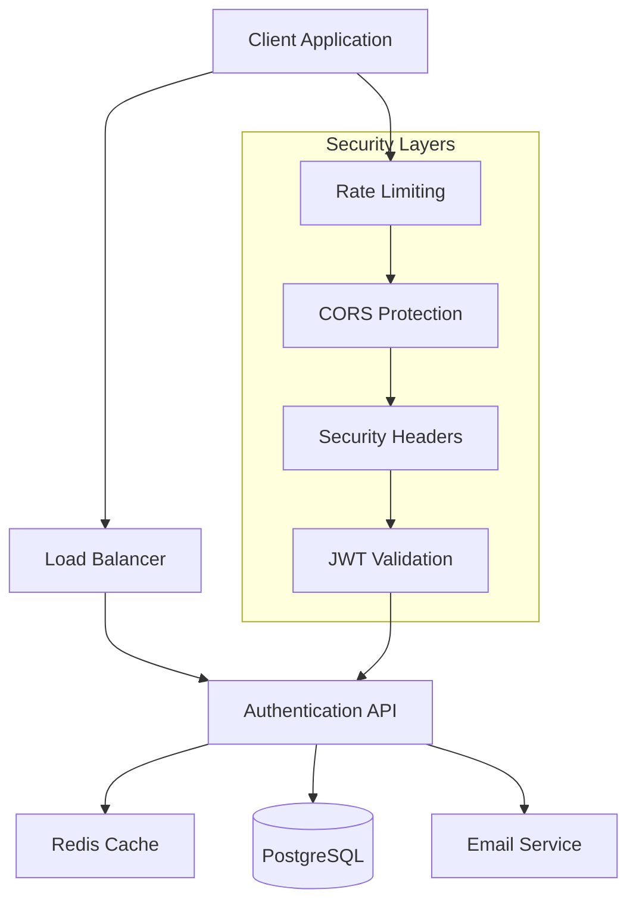

# Perfect21 JWT Authentication API Documentation

## 🌟 API Overview

Perfect21 JWT Authentication API provides a complete, secure authentication system with advanced features like JWT token management, role-based access control, multi-factor authentication, and comprehensive security measures.

### 📋 Quick Information

| Attribute | Value |
|-----------|-------|
| **Base URL** | `https://api.perfect21.com/v1` |
| **Protocol** | HTTPS (Required in production) |
| **Authentication** | Bearer JWT Token |
| **Content Type** | `application/json` |
| **API Version** | v1.0.0 |
| **Rate Limiting** | Yes (See [Rate Limits](#rate-limits)) |

### 🏗️ Architecture Overview



## 🔐 Authentication & Authorization

### Authentication Flow

1. **User Registration** → Email verification required
2. **User Login** → Returns access token + refresh token (HttpOnly cookie)
3. **API Access** → Include `Authorization: Bearer <token>` header
4. **Token Refresh** → Use refresh token to get new access token
5. **Logout** → Revoke tokens and clear session

### Token Management

| Token Type | Expiry | Storage | Purpose |
|------------|--------|---------|---------|
| **Access Token** | 15 minutes | Memory/Variable | API access |
| **Refresh Token** | 7 days | HttpOnly Cookie | Token renewal |

## 📚 API Endpoints

### 🔑 Authentication Endpoints

#### 1. User Registration

**Endpoint:** `POST /auth/register`

Register a new user account with email verification.

**Request Body:**
```json
{
  "email": "user@example.com",
  "username": "johndoe",
  "password": "SecurePass123!",
  "firstName": "John",
  "lastName": "Doe",
  "phone": "+1234567890"
}
```

**Validation Rules:**
- `email`: Valid email format, max 255 chars, must be unique
- `username`: 3-50 chars, alphanumeric + underscore/hyphen, must be unique
- `password`: Min 12 chars, must include uppercase, lowercase, number, special char
- `firstName`/`lastName`: Max 100 chars each
- `phone`: Optional, max 20 chars

**Success Response (201):**
```json
{
  "success": true,
  "message": "User registered successfully. Please check your email for verification.",
  "data": {
    "userId": "123e4567-e89b-12d3-a456-426614174000",
    "email": "user@example.com",
    "username": "johndoe",
    "status": "pending",
    "emailVerified": false,
    "createdAt": "2023-12-01T09:00:00Z"
  }
}
```

**Error Responses:**

| Status | Error Code | Description | Example Response |
|--------|------------|-------------|------------------|
| 400 | `VALIDATION_ERROR` | Invalid input data | `{"success": false, "error": {"code": "VALIDATION_ERROR", "message": "Password must be at least 12 characters", "details": [{"field": "password", "message": "Too short"}]}}` |
| 409 | `EMAIL_EXISTS` | Email already registered | `{"success": false, "error": {"code": "EMAIL_EXISTS", "message": "Email address is already registered"}}` |
| 409 | `USERNAME_EXISTS` | Username already taken | `{"success": false, "error": {"code": "USERNAME_EXISTS", "message": "Username is already taken"}}` |
| 429 | `RATE_LIMIT_EXCEEDED` | Too many requests | `{"success": false, "error": {"code": "RATE_LIMIT_EXCEEDED", "message": "Too many registration attempts. Try again in 1 hour."}}` |

**cURL Example:**
```bash
curl -X POST https://api.perfect21.com/v1/auth/register \
  -H "Content-Type: application/json" \
  -d '{
    "email": "user@example.com",
    "username": "johndoe",
    "password": "SecurePass123!",
    "firstName": "John",
    "lastName": "Doe"
  }'
```

---

#### 2. User Login

**Endpoint:** `POST /auth/login`

Authenticate user credentials and return JWT tokens.

**Request Body:**
```json
{
  "email": "user@example.com",
  "password": "SecurePass123!",
  "rememberMe": true
}
```

Alternative login with username:
```json
{
  "username": "johndoe",
  "password": "SecurePass123!",
  "rememberMe": false
}
```

**Success Response (200):**
```json
{
  "success": true,
  "message": "Login successful",
  "data": {
    "accessToken": "eyJhbGciOiJIUzI1NiIsInR5cCI6IkpXVCJ9...",
    "refreshToken": "def502004e6a0b5c9df6e5...",
    "expiresIn": 900,
    "tokenType": "Bearer",
    "user": {
      "id": "123e4567-e89b-12d3-a456-426614174000",
      "email": "user@example.com",
      "username": "johndoe",
      "firstName": "John",
      "lastName": "Doe",
      "status": "active",
      "emailVerified": true,
      "roles": ["user"],
      "permissions": ["users.read"],
      "lastLogin": "2023-12-01T10:30:00Z"
    }
  }
}
```

**Error Responses:**

| Status | Error Code | Description |
|--------|------------|-------------|
| 400 | `MISSING_CREDENTIALS` | Email/username or password missing |
| 401 | `INVALID_CREDENTIALS` | Wrong email/username or password |
| 401 | `EMAIL_NOT_VERIFIED` | Account exists but email not verified |
| 423 | `ACCOUNT_LOCKED` | Account locked due to failed attempts |
| 429 | `RATE_LIMIT_EXCEEDED` | Too many login attempts |

**Security Features:**
- ✅ Account lockout after 5 failed attempts (30 min)
- ✅ Rate limiting: 5 attempts per 15 minutes
- ✅ Refresh token stored as HttpOnly cookie
- ✅ Session tracking with IP and user agent
- ✅ Failed attempt logging and monitoring

**cURL Example:**
```bash
curl -X POST https://api.perfect21.com/v1/auth/login \
  -H "Content-Type: application/json" \
  -b cookies.txt -c cookies.txt \
  -d '{
    "email": "user@example.com",
    "password": "SecurePass123!",
    "rememberMe": true
  }'
```

---

#### 3. Token Refresh

**Endpoint:** `POST /auth/refresh`

Generate new access token using refresh token.

**Request Body (Optional):**
```json
{
  "refreshToken": "def502004e6a0b5c9df6e5..."
}
```

> **Note:** Refresh token can be provided in request body OR automatically read from HttpOnly cookie.

**Success Response (200):**
```json
{
  "success": true,
  "data": {
    "accessToken": "eyJhbGciOiJIUzI1NiIsInR5cCI6IkpXVCJ9...",
    "expiresIn": 900,
    "tokenType": "Bearer"
  }
}
```

**Error Responses:**

| Status | Error Code | Description |
|--------|------------|-------------|
| 400 | `MISSING_REFRESH_TOKEN` | No refresh token provided |
| 401 | `INVALID_REFRESH_TOKEN` | Refresh token invalid or expired |
| 401 | `TOKEN_REVOKED` | Refresh token has been revoked |

**Security Features:**
- ✅ Token rotation (optional configuration)
- ✅ Token family management
- ✅ Automatic cleanup of expired tokens
- ✅ Revocation detection and cleanup

**cURL Example:**
```bash
curl -X POST https://api.perfect21.com/v1/auth/refresh \
  -H "Content-Type: application/json" \
  -b cookies.txt -c cookies.txt
```

---

#### 4. User Logout

**Endpoint:** `POST /auth/logout`

Logout user and revoke refresh token.

**Request Body (Optional):**
```json
{
  "logoutAllDevices": false
}
```

**Success Response (200):**
```json
{
  "success": true,
  "message": "Logged out successfully"
}
```

**Features:**
- ✅ Revokes current refresh token
- ✅ Clears HttpOnly cookies
- ✅ Optional logout from all devices
- ✅ Session termination logging

**cURL Example:**
```bash
curl -X POST https://api.perfect21.com/v1/auth/logout \
  -H "Authorization: Bearer YOUR_ACCESS_TOKEN" \
  -b cookies.txt -c cookies.txt
```

---

### 📧 Email Verification

#### 5. Verify Email

**Endpoint:** `POST /auth/verify-email`

Verify user email address using verification token.

**Request Body:**
```json
{
  "token": "abc123def456ghi789..."
}
```

**Success Response (200):**
```json
{
  "success": true,
  "message": "Email verified successfully"
}
```

**Error Responses:**

| Status | Error Code | Description |
|--------|------------|-------------|
| 400 | `MISSING_TOKEN` | Verification token missing |
| 410 | `TOKEN_EXPIRED` | Verification token expired |
| 404 | `INVALID_TOKEN` | Token not found or invalid |

---

### 🔒 Password Management

#### 6. Forgot Password

**Endpoint:** `POST /auth/forgot-password`

Request password reset email.

**Request Body:**
```json
{
  "email": "user@example.com"
}
```

**Success Response (200):**
```json
{
  "success": true,
  "message": "Password reset email sent if account exists"
}
```

> **Security Note:** Always returns success to prevent email enumeration attacks.

**Rate Limiting:** 3 requests per hour per IP.

---

#### 7. Reset Password

**Endpoint:** `POST /auth/reset-password`

Reset password using reset token from email.

**Request Body:**
```json
{
  "token": "reset_token_from_email",
  "newPassword": "NewSecurePass123!"
}
```

**Success Response (200):**
```json
{
  "success": true,
  "message": "Password reset successfully"
}
```

---

#### 8. Change Password

**Endpoint:** `PUT /auth/change-password`

Change password for authenticated user.

**Headers:** `Authorization: Bearer <access_token>`

**Request Body:**
```json
{
  "currentPassword": "OldSecurePass123!",
  "newPassword": "NewSecurePass123!"
}
```

**Success Response (200):**
```json
{
  "success": true,
  "message": "Password changed successfully"
}
```

---

### 👤 User Management

#### 9. Get User Profile

**Endpoint:** `GET /users/me`

Get current user's profile information.

**Headers:** `Authorization: Bearer <access_token>`

**Success Response (200):**
```json
{
  "success": true,
  "data": {
    "id": "123e4567-e89b-12d3-a456-426614174000",
    "email": "user@example.com",
    "username": "johndoe",
    "firstName": "John",
    "lastName": "Doe",
    "phone": "+1234567890",
    "status": "active",
    "emailVerified": true,
    "phoneVerified": false,
    "lastLogin": "2023-12-01T10:30:00Z",
    "createdAt": "2023-11-01T09:00:00Z",
    "updatedAt": "2023-12-01T10:30:00Z",
    "roles": ["user"],
    "permissions": ["users.read"]
  }
}
```

---

#### 10. Update User Profile

**Endpoint:** `PUT /users/me`

Update current user's profile information.

**Headers:** `Authorization: Bearer <access_token>`

**Request Body:**
```json
{
  "firstName": "John",
  "lastName": "Smith",
  "phone": "+1234567890"
}
```

**Success Response (200):**
```json
{
  "success": true,
  "message": "Profile updated successfully",
  "data": {
    "id": "123e4567-e89b-12d3-a456-426614174000",
    "email": "user@example.com",
    "username": "johndoe",
    "firstName": "John",
    "lastName": "Smith",
    "phone": "+1234567890",
    "updatedAt": "2023-12-01T10:35:00Z"
  }
}
```

---

### 📱 Session Management

#### 11. Get User Sessions

**Endpoint:** `GET /users/me/sessions`

Get all active sessions for the authenticated user.

**Headers:** `Authorization: Bearer <access_token>`

**Success Response (200):**
```json
{
  "success": true,
  "data": [
    {
      "id": "session-uuid-1",
      "deviceInfo": {
        "browser": "Chrome",
        "os": "Windows",
        "device": "Desktop"
      },
      "ipAddress": "192.168.1.100",
      "location": {
        "country": "US",
        "city": "New York"
      },
      "lastActivity": "2023-12-01T10:30:00Z",
      "isCurrent": true
    },
    {
      "id": "session-uuid-2",
      "deviceInfo": {
        "browser": "Safari",
        "os": "iOS",
        "device": "Mobile"
      },
      "ipAddress": "192.168.1.101",
      "location": {
        "country": "US",
        "city": "New York"
      },
      "lastActivity": "2023-11-30T15:20:00Z",
      "isCurrent": false
    }
  ]
}
```

---

#### 12. Terminate Session

**Endpoint:** `DELETE /users/me/sessions/{sessionId}`

Terminate a specific session.

**Headers:** `Authorization: Bearer <access_token>`

**Success Response (200):**
```json
{
  "success": true,
  "message": "Session terminated successfully"
}
```

---

### 🔐 Multi-Factor Authentication (MFA)

#### 13. Setup MFA

**Endpoint:** `POST /auth/mfa/setup`

Initialize multi-factor authentication for user.

**Headers:** `Authorization: Bearer <access_token>`

**Request Body:**
```json
{
  "type": "totp",
  "deviceName": "My iPhone"
}
```

**Success Response (200):**
```json
{
  "success": true,
  "data": {
    "secret": "JBSWY3DPEHPK3PXP",
    "qrCode": "data:image/png;base64,iVBORw0KGgoAAAANSUhEUgAA...",
    "backupCodes": [
      "12345678",
      "87654321",
      "13579246",
      "86420135"
    ]
  }
}
```

**MFA Types:**
- `totp` - Time-based One-Time Password (Google Authenticator, Authy)
- `sms` - SMS-based verification
- `email` - Email-based verification

---

#### 14. Verify MFA Code

**Endpoint:** `POST /auth/mfa/verify`

Verify multi-factor authentication code.

**Headers:** `Authorization: Bearer <access_token>`

**Request Body:**
```json
{
  "code": "123456",
  "deviceId": "device-uuid-optional"
}
```

**Success Response (200):**
```json
{
  "success": true,
  "message": "MFA verified successfully"
}
```

---

### 👑 Admin Endpoints

#### 15. List All Users (Admin Only)

**Endpoint:** `GET /admin/users`

Get paginated list of all users (admin access required).

**Headers:** `Authorization: Bearer <admin_access_token>`

**Query Parameters:**
- `page` (integer): Page number (default: 1)
- `limit` (integer): Items per page (default: 20, max: 100)
- `status` (string): Filter by status (`active`, `pending`, `suspended`, `deleted`)
- `search` (string): Search in email or username

**Example:** `GET /admin/users?page=1&limit=20&status=active&search=john`

**Success Response (200):**
```json
{
  "success": true,
  "data": {
    "users": [
      {
        "id": "123e4567-e89b-12d3-a456-426614174000",
        "email": "user@example.com",
        "username": "johndoe",
        "firstName": "John",
        "lastName": "Doe",
        "status": "active",
        "emailVerified": true,
        "lastLogin": "2023-12-01T10:30:00Z",
        "createdAt": "2023-11-01T09:00:00Z",
        "roles": ["user"]
      }
    ],
    "pagination": {
      "page": 1,
      "limit": 20,
      "total": 150,
      "pages": 8
    }
  }
}
```

**Error Responses:**

| Status | Error Code | Description |
|--------|------------|-------------|
| 401 | `UNAUTHORIZED` | Invalid or missing access token |
| 403 | `INSUFFICIENT_PERMISSIONS` | User lacks admin permissions |

---

#### 16. Get User by ID (Admin Only)

**Endpoint:** `GET /admin/users/{userId}`

Get specific user information (admin access required).

**Headers:** `Authorization: Bearer <admin_access_token>`

**Success Response (200):**
```json
{
  "success": true,
  "data": {
    "id": "123e4567-e89b-12d3-a456-426614174000",
    "email": "user@example.com",
    "username": "johndoe",
    "firstName": "John",
    "lastName": "Doe",
    "phone": "+1234567890",
    "status": "active",
    "emailVerified": true,
    "phoneVerified": false,
    "lastLogin": "2023-12-01T10:30:00Z",
    "createdAt": "2023-11-01T09:00:00Z",
    "updatedAt": "2023-12-01T10:30:00Z",
    "roles": ["user"],
    "permissions": ["users.read"],
    "failedLoginAttempts": 0,
    "lastFailedLogin": null,
    "accountLockedUntil": null
  }
}
```

---

#### 17. Update User (Admin Only)

**Endpoint:** `PUT /admin/users/{userId}`

Update user information (admin access required).

**Headers:** `Authorization: Bearer <admin_access_token>`

**Request Body:**
```json
{
  "firstName": "John",
  "lastName": "Smith",
  "status": "active",
  "roles": ["user", "moderator"]
}
```

**Success Response (200):**
```json
{
  "success": true,
  "message": "User updated successfully",
  "data": {
    "id": "123e4567-e89b-12d3-a456-426614174000",
    "email": "user@example.com",
    "username": "johndoe",
    "firstName": "John",
    "lastName": "Smith",
    "status": "active",
    "roles": ["user", "moderator"],
    "updatedAt": "2023-12-01T10:40:00Z"
  }
}
```

---

### 🏥 Health & Monitoring

#### 18. Health Check

**Endpoint:** `GET /health`

Check API service health status.

**Success Response (200):**
```json
{
  "status": "OK",
  "timestamp": "2023-12-01T10:30:00Z",
  "version": "1.0.0",
  "uptime": 86400,
  "services": {
    "database": "healthy",
    "redis": "healthy",
    "email": "healthy"
  }
}
```

---

## 🚨 Error Codes Reference

### Standard Error Response Format

All error responses follow this consistent format:

```json
{
  "success": false,
  "error": {
    "code": "ERROR_CODE",
    "message": "Human-readable error message",
    "details": [
      {
        "field": "fieldName",
        "message": "Field-specific error message"
      }
    ]
  },
  "timestamp": "2023-12-01T10:30:00Z",
  "requestId": "req-uuid-for-tracking"
}
```

### HTTP Status Codes

| Status | Meaning | Usage |
|--------|---------|-------|
| **200** | OK | Successful request |
| **201** | Created | Resource created successfully |
| **400** | Bad Request | Invalid request data |
| **401** | Unauthorized | Authentication required or failed |
| **403** | Forbidden | Insufficient permissions |
| **404** | Not Found | Resource not found |
| **409** | Conflict | Resource already exists |
| **410** | Gone | Resource expired |
| **423** | Locked | Account/resource locked |
| **429** | Too Many Requests | Rate limit exceeded |
| **500** | Internal Server Error | Server error |
| **503** | Service Unavailable | Service temporarily unavailable |

### Authentication Error Codes

| Error Code | Description | Resolution |
|------------|-------------|------------|
| `MISSING_AUTH_HEADER` | Authorization header missing | Include `Authorization: Bearer <token>` |
| `INVALID_AUTH_FORMAT` | Invalid authorization format | Use format: `Bearer <token>` |
| `INVALID_TOKEN` | JWT token invalid or malformed | Refresh or re-login |
| `TOKEN_EXPIRED` | JWT token has expired | Use refresh token to get new access token |
| `TOKEN_REVOKED` | Token has been revoked | User must log in again |
| `INSUFFICIENT_PERMISSIONS` | User lacks required permissions | Contact admin for permission upgrade |

### Validation Error Codes

| Error Code | Description | Common Fields |
|------------|-------------|---------------|
| `VALIDATION_ERROR` | Input validation failed | Any input field |
| `REQUIRED_FIELD_MISSING` | Required field not provided | `email`, `password`, `username` |
| `INVALID_EMAIL_FORMAT` | Email format invalid | `email` |
| `INVALID_PASSWORD_STRENGTH` | Password doesn't meet requirements | `password` |
| `INVALID_USERNAME_FORMAT` | Username format invalid | `username` |
| `FIELD_TOO_LONG` | Field exceeds maximum length | Any string field |
| `FIELD_TOO_SHORT` | Field below minimum length | `password`, `username` |

### Business Logic Error Codes

| Error Code | Description | Resolution |
|------------|-------------|------------|
| `EMAIL_EXISTS` | Email already registered | Use different email or login |
| `USERNAME_EXISTS` | Username already taken | Choose different username |
| `USER_NOT_FOUND` | User account not found | Check email/username |
| `INVALID_CREDENTIALS` | Wrong email/password | Check credentials |
| `EMAIL_NOT_VERIFIED` | Email verification required | Check email and verify |
| `ACCOUNT_LOCKED` | Account locked due to failed attempts | Wait or contact support |
| `ACCOUNT_SUSPENDED` | Account suspended by admin | Contact support |
| `ACCOUNT_DELETED` | Account has been deleted | Cannot be recovered |

### Rate Limiting Error Codes

| Error Code | Description | Retry After |
|------------|-------------|-------------|
| `RATE_LIMIT_EXCEEDED` | Too many requests | Check `Retry-After` header |
| `AUTH_RATE_LIMIT_EXCEEDED` | Too many auth attempts | 15 minutes |
| `REGISTRATION_RATE_LIMIT_EXCEEDED` | Too many registrations | 1 hour |
| `PASSWORD_RESET_RATE_LIMIT_EXCEEDED` | Too many reset requests | 1 hour |

### MFA Error Codes

| Error Code | Description | Resolution |
|------------|-------------|------------|
| `MFA_REQUIRED` | MFA verification required | Complete MFA challenge |
| `INVALID_MFA_CODE` | MFA code invalid or expired | Get new code |
| `MFA_NOT_ENABLED` | MFA not set up for user | Enable MFA first |
| `MFA_BACKUP_CODE_USED` | Backup code already used | Use different backup code |

---

## 🚄 Rate Limits

### Rate Limiting Rules

| Endpoint Pattern | Limit | Window | Scope |
|------------------|-------|--------|-------|
| **General API** | 100 requests | 15 minutes | Per IP |
| **Authentication** | 5 attempts | 15 minutes | Per IP |
| **Registration** | 3 attempts | 1 hour | Per IP |
| **Password Reset** | 3 attempts | 1 hour | Per IP |
| **MFA Verify** | 10 attempts | 5 minutes | Per User |

### Rate Limit Headers

When rate limited, responses include these headers:

```
X-RateLimit-Limit: 100
X-RateLimit-Remaining: 0
X-RateLimit-Reset: 1701434400
Retry-After: 900
```

### Rate Limit Error Response

```json
{
  "success": false,
  "error": {
    "code": "RATE_LIMIT_EXCEEDED",
    "message": "Too many requests. Try again in 15 minutes.",
    "retryAfter": 900
  }
}
```

---

## 🛡️ Security Features

### Implemented Security Measures

#### 🔐 Authentication Security
- ✅ **JWT Token Security**: RS256 signing, configurable expiry
- ✅ **Refresh Token Rotation**: One-time use tokens (configurable)
- ✅ **Token Revocation**: Blacklist support for compromised tokens
- ✅ **Account Lockout**: 5 failed attempts → 30 minute lockout
- ✅ **Password Requirements**: 12+ chars, mixed case, numbers, symbols

#### 🌐 Network Security
- ✅ **HTTPS Enforcement**: TLS 1.2+ required in production
- ✅ **CORS Protection**: Configurable origin whitelist
- ✅ **Security Headers**: CSP, HSTS, X-Frame-Options, etc.
- ✅ **Rate Limiting**: Multiple layers with different rules
- ✅ **IP Whitelisting**: Admin endpoint protection

#### 🏗️ Application Security
- ✅ **Input Validation**: Comprehensive sanitization
- ✅ **SQL Injection Prevention**: Parameterized queries
- ✅ **XSS Protection**: Output encoding and CSP
- ✅ **CSRF Protection**: Token-based protection
- ✅ **Session Security**: HttpOnly cookies, secure flags

#### 📊 Monitoring Security
- ✅ **Audit Logging**: All auth events logged
- ✅ **Anomaly Detection**: Suspicious pattern alerts
- ✅ **Failed Login Tracking**: Brute force detection
- ✅ **Session Monitoring**: Concurrent session limits
- ✅ **Security Metrics**: Real-time dashboards

### Security Headers

The API automatically sets these security headers:

```
Strict-Transport-Security: max-age=31536000; includeSubDomains
X-Content-Type-Options: nosniff
X-Frame-Options: DENY
X-XSS-Protection: 1; mode=block
Content-Security-Policy: default-src 'self'
Referrer-Policy: strict-origin-when-cross-origin
Permissions-Policy: camera=(), microphone=(), geolocation=()
```

---

## 🔧 Configuration Guide

### Environment Variables

#### Required Configuration

```bash
# Application
NODE_ENV=production
PORT=3000
API_VERSION=v1

# Database Configuration
DB_HOST=localhost
DB_PORT=5432
DB_NAME=auth_system
DB_USER=auth_app
DB_PASSWORD=your_secure_password
DB_SSL=true
DB_POOL_MIN=5
DB_POOL_MAX=25

# Redis Configuration
REDIS_HOST=localhost
REDIS_PORT=6379
REDIS_PASSWORD=your_redis_password
REDIS_DB=0

# JWT Configuration
JWT_ACCESS_SECRET=your_access_token_secret_min_32_chars
JWT_REFRESH_SECRET=your_refresh_token_secret_min_32_chars
JWT_ACCESS_EXPIRY=15m
JWT_REFRESH_EXPIRY=7d

# Security Configuration
BCRYPT_ROUNDS=12
RATE_LIMIT_WINDOW=15
RATE_LIMIT_MAX=100
AUTH_RATE_LIMIT_MAX=5

# CORS Configuration
ALLOWED_ORIGINS=https://yourapp.com,https://www.yourapp.com

# Email Configuration
SMTP_HOST=smtp.gmail.com
SMTP_PORT=587
SMTP_USER=your_email@gmail.com
SMTP_PASSWORD=your_app_password
SMTP_FROM="Your App <noreply@yourapp.com>"

# Monitoring
LOG_LEVEL=info
ENABLE_METRICS=true
HEALTH_CHECK_TIMEOUT=5000
```

#### Optional Configuration

```bash
# Advanced Security
ENABLE_MFA=true
MFA_ISSUER="Your App Name"
ENABLE_ACCOUNT_LOCKOUT=true
LOCKOUT_DURATION=30
MAX_FAILED_ATTEMPTS=5

# Session Management
SESSION_TIMEOUT=24h
MAX_CONCURRENT_SESSIONS=5
ENABLE_SESSION_TRACKING=true

# File Upload (if enabled)
UPLOAD_MAX_SIZE=10MB
UPLOAD_ALLOWED_TYPES=jpg,jpeg,png,gif
UPLOAD_PATH=/app/uploads

# Monitoring & Analytics
ENABLE_ANALYTICS=true
ANALYTICS_KEY=your_analytics_key
SENTRY_DSN=your_sentry_dsn
```

### Database Configuration

#### PostgreSQL Setup

1. **Create Database:**
```sql
CREATE DATABASE auth_system;
CREATE USER auth_app WITH PASSWORD 'your_secure_password';
GRANT ALL PRIVILEGES ON DATABASE auth_system TO auth_app;
```

2. **Apply Schema:**
```bash
psql -h localhost -U auth_app -d auth_system -f enhanced-database-schema.sql
```

3. **Production Optimizations:**
```sql
-- Performance settings
ALTER SYSTEM SET shared_buffers = '256MB';
ALTER SYSTEM SET effective_cache_size = '1GB';
ALTER SYSTEM SET work_mem = '4MB';
ALTER SYSTEM SET maintenance_work_mem = '64MB';
SELECT pg_reload_conf();
```

#### Redis Setup

1. **Configuration File (`redis.conf`):**
```
# Security
requirepass your_redis_password
bind 127.0.0.1

# Memory Management
maxmemory 512mb
maxmemory-policy allkeys-lru

# Persistence
appendonly yes
appendfsync everysec

# Performance
tcp-keepalive 300
timeout 300
```

2. **Start Redis:**
```bash
redis-server /path/to/redis.conf
```

### SSL/TLS Configuration

#### Nginx Configuration

```nginx
server {
    listen 443 ssl http2;
    server_name api.yourapp.com;

    # SSL Configuration
    ssl_certificate /etc/ssl/certs/yourapp.crt;
    ssl_certificate_key /etc/ssl/private/yourapp.key;
    ssl_protocols TLSv1.2 TLSv1.3;
    ssl_ciphers ECDHE-RSA-AES256-GCM-SHA512:DHE-RSA-AES256-GCM-SHA512:ECDHE-RSA-AES256-GCM-SHA384;
    ssl_prefer_server_ciphers off;

    # Security Headers
    add_header Strict-Transport-Security "max-age=31536000; includeSubDomains" always;
    add_header X-Content-Type-Options "nosniff" always;
    add_header X-Frame-Options "DENY" always;

    # Rate Limiting
    limit_req_zone $binary_remote_addr zone=auth:10m rate=5r/m;
    limit_req_zone $binary_remote_addr zone=api:10m rate=100r/m;

    location /v1/auth/ {
        limit_req zone=auth burst=10 nodelay;
        proxy_pass http://auth-backend;
        include proxy_params;
    }

    location /v1/ {
        limit_req zone=api burst=20 nodelay;
        proxy_pass http://auth-backend;
        include proxy_params;
    }
}

upstream auth-backend {
    server 127.0.0.1:3000;
    server 127.0.0.1:3001 backup;
}
```

### Monitoring Configuration

#### Prometheus Metrics

```yaml
# prometheus.yml
global:
  scrape_interval: 15s

scrape_configs:
  - job_name: 'auth-api'
    static_configs:
      - targets: ['localhost:3000']
    metrics_path: '/metrics'
    scrape_interval: 10s
```

#### Grafana Dashboard

Key metrics to monitor:
- Request rate and latency
- Authentication success/failure rates
- Active user sessions
- Database connection pool usage
- Redis cache hit rates
- Error rates by endpoint

---

## 🚀 Deployment Guide

### Docker Deployment

#### 1. Build Docker Image

```dockerfile
# Dockerfile
FROM node:18-alpine AS builder

WORKDIR /app
COPY package*.json ./
RUN npm ci --only=production && npm cache clean --force

FROM node:18-alpine AS production

RUN addgroup -g 1001 -S nodejs && \
    adduser -S nodejs -u 1001

WORKDIR /app

COPY --from=builder /app/node_modules ./node_modules
COPY --chown=nodejs:nodejs . .

USER nodejs

EXPOSE 3000

HEALTHCHECK --interval=30s --timeout=3s --start-period=5s --retries=3 \
  CMD curl -f http://localhost:3000/api/v1/health || exit 1

CMD ["node", "server.js"]
```

#### 2. Docker Compose Deployment

```yaml
# docker-compose.yml
version: '3.8'

services:
  auth-api:
    build: .
    ports:
      - "3000:3000"
    environment:
      - NODE_ENV=production
      - DB_HOST=postgres
      - REDIS_HOST=redis
    depends_on:
      - postgres
      - redis
    restart: unless-stopped

  postgres:
    image: postgres:15-alpine
    environment:
      POSTGRES_DB: auth_system
      POSTGRES_USER: auth_app
      POSTGRES_PASSWORD: ${DB_PASSWORD}
    volumes:
      - postgres_data:/var/lib/postgresql/data
      - ./database/schema.sql:/docker-entrypoint-initdb.d/01-schema.sql
    restart: unless-stopped

  redis:
    image: redis:7-alpine
    command: redis-server --requirepass ${REDIS_PASSWORD}
    volumes:
      - redis_data:/data
    restart: unless-stopped

  nginx:
    image: nginx:alpine
    ports:
      - "80:80"
      - "443:443"
    volumes:
      - ./nginx.conf:/etc/nginx/nginx.conf
      - ./ssl:/etc/ssl
    depends_on:
      - auth-api
    restart: unless-stopped

volumes:
  postgres_data:
  redis_data:
```

#### 3. Deploy with Docker Compose

```bash
# Generate secrets
export DB_PASSWORD=$(openssl rand -hex 32)
export REDIS_PASSWORD=$(openssl rand -hex 32)
export JWT_ACCESS_SECRET=$(openssl rand -hex 64)
export JWT_REFRESH_SECRET=$(openssl rand -hex 64)

# Create .env file
cat > .env << EOF
DB_PASSWORD=${DB_PASSWORD}
REDIS_PASSWORD=${REDIS_PASSWORD}
JWT_ACCESS_SECRET=${JWT_ACCESS_SECRET}
JWT_REFRESH_SECRET=${JWT_REFRESH_SECRET}
EOF

# Deploy
docker-compose up -d

# Check status
docker-compose ps
docker-compose logs auth-api
```

### Kubernetes Deployment

#### 1. Create Namespace and Secrets

```bash
# Create namespace
kubectl create namespace perfect21-auth

# Create secrets
kubectl create secret generic auth-secrets \
  --from-literal=db-password="$(openssl rand -hex 32)" \
  --from-literal=redis-password="$(openssl rand -hex 32)" \
  --from-literal=jwt-access-secret="$(openssl rand -hex 64)" \
  --from-literal=jwt-refresh-secret="$(openssl rand -hex 64)" \
  -n perfect21-auth
```

#### 2. Deploy Database

```yaml
# postgres-deployment.yaml
apiVersion: apps/v1
kind: Deployment
metadata:
  name: postgres
  namespace: perfect21-auth
spec:
  replicas: 1
  selector:
    matchLabels:
      app: postgres
  template:
    metadata:
      labels:
        app: postgres
    spec:
      containers:
      - name: postgres
        image: postgres:15-alpine
        env:
        - name: POSTGRES_DB
          value: auth_system
        - name: POSTGRES_USER
          value: auth_app
        - name: POSTGRES_PASSWORD
          valueFrom:
            secretKeyRef:
              name: auth-secrets
              key: db-password
        volumeMounts:
        - name: postgres-storage
          mountPath: /var/lib/postgresql/data
        resources:
          requests:
            memory: "512Mi"
            cpu: "250m"
          limits:
            memory: "2Gi"
            cpu: "1000m"
      volumes:
      - name: postgres-storage
        persistentVolumeClaim:
          claimName: postgres-pvc
---
apiVersion: v1
kind: Service
metadata:
  name: postgres-service
  namespace: perfect21-auth
spec:
  selector:
    app: postgres
  ports:
  - port: 5432
    targetPort: 5432
---
apiVersion: v1
kind: PersistentVolumeClaim
metadata:
  name: postgres-pvc
  namespace: perfect21-auth
spec:
  accessModes:
  - ReadWriteOnce
  resources:
    requests:
      storage: 20Gi
```

#### 3. Deploy Application

```yaml
# auth-deployment.yaml
apiVersion: apps/v1
kind: Deployment
metadata:
  name: auth-api
  namespace: perfect21-auth
spec:
  replicas: 3
  selector:
    matchLabels:
      app: auth-api
  template:
    metadata:
      labels:
        app: auth-api
    spec:
      containers:
      - name: auth-api
        image: perfect21/auth-api:latest
        ports:
        - containerPort: 3000
        env:
        - name: NODE_ENV
          value: production
        - name: DB_HOST
          value: postgres-service
        - name: DB_PASSWORD
          valueFrom:
            secretKeyRef:
              name: auth-secrets
              key: db-password
        - name: JWT_ACCESS_SECRET
          valueFrom:
            secretKeyRef:
              name: auth-secrets
              key: jwt-access-secret
        resources:
          requests:
            memory: "256Mi"
            cpu: "200m"
          limits:
            memory: "512Mi"
            cpu: "1000m"
        livenessProbe:
          httpGet:
            path: /api/v1/health
            port: 3000
          initialDelaySeconds: 30
          periodSeconds: 10
        readinessProbe:
          httpGet:
            path: /api/v1/health
            port: 3000
          initialDelaySeconds: 5
          periodSeconds: 5
---
apiVersion: v1
kind: Service
metadata:
  name: auth-api-service
  namespace: perfect21-auth
spec:
  selector:
    app: auth-api
  ports:
  - port: 80
    targetPort: 3000
  type: LoadBalancer
```

#### 4. Deploy to Kubernetes

```bash
# Apply configurations
kubectl apply -f postgres-deployment.yaml
kubectl apply -f auth-deployment.yaml

# Check deployment status
kubectl get pods -n perfect21-auth
kubectl get services -n perfect21-auth

# Check logs
kubectl logs -f deployment/auth-api -n perfect21-auth
```

### Production Checklist

#### Pre-Deployment

- [ ] **Security Configuration**
  - [ ] Strong, unique JWT secrets generated
  - [ ] Database passwords secured
  - [ ] HTTPS certificates installed
  - [ ] Security headers configured
  - [ ] Rate limiting enabled

- [ ] **Database Setup**
  - [ ] PostgreSQL configured and optimized
  - [ ] Database schema applied
  - [ ] Backup strategy implemented
  - [ ] Connection pooling configured

- [ ] **Monitoring Setup**
  - [ ] Health checks configured
  - [ ] Logging properly set up
  - [ ] Metrics collection enabled
  - [ ] Alerting rules defined

#### Post-Deployment

- [ ] **Verification Tests**
  - [ ] Health endpoint responding
  - [ ] User registration working
  - [ ] Login/logout functioning
  - [ ] Token refresh working
  - [ ] Rate limiting active

- [ ] **Performance Tests**
  - [ ] Load testing completed
  - [ ] Response times acceptable
  - [ ] Database performance verified
  - [ ] Memory usage normal

- [ ] **Security Tests**
  - [ ] HTTPS working correctly
  - [ ] Authentication required on protected endpoints
  - [ ] Rate limiting preventing abuse
  - [ ] Security headers present

### Scaling Considerations

#### Horizontal Scaling

1. **Load Balancing**
   - Use multiple API instances behind load balancer
   - Session stickiness not required (stateless JWT)
   - Database connection pooling per instance

2. **Database Scaling**
   - Read replicas for user profile queries
   - Connection pooling optimization
   - Query performance monitoring

3. **Cache Strategy**
   - Redis for session management
   - JWT token blacklisting
   - Rate limiting counters

#### Performance Optimization

1. **Database Optimization**
   ```sql
   -- Add indexes for performance
   CREATE INDEX CONCURRENTLY idx_users_email ON users(email);
   CREATE INDEX CONCURRENTLY idx_users_username ON users(username);
   CREATE INDEX CONCURRENTLY idx_refresh_tokens_token_hash ON refresh_tokens(token_hash);
   CREATE INDEX CONCURRENTLY idx_login_attempts_user_id ON login_attempts(user_id);
   ```

2. **Caching Strategy**
   - Cache user profiles (5 minute TTL)
   - Cache permission checks (1 minute TTL)
   - Cache rate limit counters

3. **Monitoring Metrics**
   - Response time percentiles (P50, P95, P99)
   - Database query performance
   - Cache hit rates
   - Error rates by endpoint

---

## 📖 Client Integration Examples

### JavaScript/Node.js

#### Authentication Client Class

```javascript
class AuthClient {
  constructor(baseURL, options = {}) {
    this.baseURL = baseURL;
    this.accessToken = null;
    this.options = {
      timeout: 10000,
      retries: 3,
      ...options
    };
  }

  async request(endpoint, options = {}) {
    const url = `${this.baseURL}${endpoint}`;
    const config = {
      headers: {
        'Content-Type': 'application/json',
        ...options.headers
      },
      credentials: 'include', // Include cookies
      ...options
    };

    // Add authorization header if token exists
    if (this.accessToken) {
      config.headers.Authorization = `Bearer ${this.accessToken}`;
    }

    try {
      const response = await fetch(url, config);
      const data = await response.json();

      if (!response.ok) {
        throw new AuthError(data.error.code, data.error.message, response.status);
      }

      return data;
    } catch (error) {
      if (error.status === 401 && this.accessToken) {
        // Try to refresh token
        const refreshed = await this.refreshToken();
        if (refreshed) {
          // Retry original request
          config.headers.Authorization = `Bearer ${this.accessToken}`;
          const response = await fetch(url, config);
          return response.json();
        }
      }
      throw error;
    }
  }

  async register(userData) {
    const response = await this.request('/auth/register', {
      method: 'POST',
      body: JSON.stringify(userData)
    });
    return response.data;
  }

  async login(credentials) {
    const response = await this.request('/auth/login', {
      method: 'POST',
      body: JSON.stringify(credentials)
    });

    // Store access token
    this.accessToken = response.data.accessToken;

    return response.data;
  }

  async refreshToken() {
    try {
      const response = await this.request('/auth/refresh', {
        method: 'POST'
      });

      this.accessToken = response.data.accessToken;
      return true;
    } catch (error) {
      this.accessToken = null;
      return false;
    }
  }

  async logout() {
    await this.request('/auth/logout', {
      method: 'POST'
    });
    this.accessToken = null;
  }

  async getProfile() {
    const response = await this.request('/users/me');
    return response.data;
  }

  async updateProfile(data) {
    const response = await this.request('/users/me', {
      method: 'PUT',
      body: JSON.stringify(data)
    });
    return response.data;
  }

  isAuthenticated() {
    return !!this.accessToken;
  }
}

class AuthError extends Error {
  constructor(code, message, status) {
    super(message);
    this.name = 'AuthError';
    this.code = code;
    this.status = status;
  }
}

// Usage Example
const auth = new AuthClient('https://api.perfect21.com/v1');

// Register new user
try {
  const user = await auth.register({
    email: 'user@example.com',
    username: 'johndoe',
    password: 'SecurePass123!',
    firstName: 'John',
    lastName: 'Doe'
  });
  console.log('User registered:', user);
} catch (error) {
  console.error('Registration failed:', error.message);
}

// Login
try {
  const loginData = await auth.login({
    email: 'user@example.com',
    password: 'SecurePass123!'
  });
  console.log('Login successful:', loginData.user);
} catch (error) {
  console.error('Login failed:', error.message);
}

// Get profile
if (auth.isAuthenticated()) {
  const profile = await auth.getProfile();
  console.log('User profile:', profile);
}
```

### React Hook

```jsx
import { useState, useEffect, useContext, createContext } from 'react';

const AuthContext = createContext();

export const useAuth = () => {
  const context = useContext(AuthContext);
  if (!context) {
    throw new Error('useAuth must be used within AuthProvider');
  }
  return context;
};

export const AuthProvider = ({ children }) => {
  const [user, setUser] = useState(null);
  const [loading, setLoading] = useState(true);
  const [error, setError] = useState(null);

  const authClient = new AuthClient('https://api.perfect21.com/v1');

  // Auto-refresh token on app start
  useEffect(() => {
    const initAuth = async () => {
      try {
        const refreshed = await authClient.refreshToken();
        if (refreshed) {
          const profile = await authClient.getProfile();
          setUser(profile);
        }
      } catch (error) {
        console.error('Auth initialization failed:', error);
      } finally {
        setLoading(false);
      }
    };

    initAuth();
  }, []);

  const login = async (credentials) => {
    try {
      setError(null);
      setLoading(true);

      const loginData = await authClient.login(credentials);
      setUser(loginData.user);

      return { success: true };
    } catch (error) {
      setError(error.message);
      return { success: false, error: error.message };
    } finally {
      setLoading(false);
    }
  };

  const register = async (userData) => {
    try {
      setError(null);
      setLoading(true);

      await authClient.register(userData);

      return { success: true };
    } catch (error) {
      setError(error.message);
      return { success: false, error: error.message };
    } finally {
      setLoading(false);
    }
  };

  const logout = async () => {
    try {
      await authClient.logout();
    } catch (error) {
      console.error('Logout error:', error);
    } finally {
      setUser(null);
    }
  };

  const updateProfile = async (data) => {
    try {
      const updatedUser = await authClient.updateProfile(data);
      setUser(updatedUser);
      return { success: true };
    } catch (error) {
      return { success: false, error: error.message };
    }
  };

  const value = {
    user,
    loading,
    error,
    login,
    register,
    logout,
    updateProfile,
    isAuthenticated: !!user
  };

  return (
    <AuthContext.Provider value={value}>
      {children}
    </AuthContext.Provider>
  );
};

// Usage in component
const LoginForm = () => {
  const [credentials, setCredentials] = useState({ email: '', password: '' });
  const { login, loading, error } = useAuth();

  const handleSubmit = async (e) => {
    e.preventDefault();
    const result = await login(credentials);

    if (result.success) {
      // Redirect to dashboard
      window.location.href = '/dashboard';
    }
  };

  return (
    <form onSubmit={handleSubmit}>
      <input
        type="email"
        value={credentials.email}
        onChange={(e) => setCredentials({ ...credentials, email: e.target.value })}
        placeholder="Email"
        required
      />
      <input
        type="password"
        value={credentials.password}
        onChange={(e) => setCredentials({ ...credentials, password: e.target.value })}
        placeholder="Password"
        required
      />
      <button type="submit" disabled={loading}>
        {loading ? 'Logging in...' : 'Login'}
      </button>
      {error && <div className="error">{error}</div>}
    </form>
  );
};
```

### Python Client

```python
import requests
import json
from typing import Optional, Dict, Any
from datetime import datetime, timedelta

class AuthClient:
    def __init__(self, base_url: str, timeout: int = 10):
        self.base_url = base_url.rstrip('/')
        self.timeout = timeout
        self.access_token: Optional[str] = None
        self.session = requests.Session()

    def _request(self, method: str, endpoint: str, **kwargs) -> Dict[Any, Any]:
        url = f"{self.base_url}{endpoint}"
        headers = kwargs.get('headers', {})
        headers['Content-Type'] = 'application/json'

        if self.access_token:
            headers['Authorization'] = f'Bearer {self.access_token}'

        kwargs['headers'] = headers
        kwargs['timeout'] = self.timeout

        try:
            response = self.session.request(method, url, **kwargs)
            data = response.json()

            if not response.ok:
                raise AuthError(
                    code=data['error']['code'],
                    message=data['error']['message'],
                    status=response.status_code
                )

            return data

        except requests.exceptions.RequestException as e:
            raise AuthError('NETWORK_ERROR', str(e), 0)

    def register(self, user_data: Dict[str, str]) -> Dict[str, Any]:
        """Register a new user"""
        response = self._request('POST', '/auth/register', json=user_data)
        return response['data']

    def login(self, credentials: Dict[str, str]) -> Dict[str, Any]:
        """Login user and store access token"""
        response = self._request('POST', '/auth/login', json=credentials)
        self.access_token = response['data']['accessToken']
        return response['data']

    def refresh_token(self) -> bool:
        """Refresh access token using cookies"""
        try:
            response = self._request('POST', '/auth/refresh')
            self.access_token = response['data']['accessToken']
            return True
        except AuthError:
            self.access_token = None
            return False

    def logout(self) -> None:
        """Logout user and clear token"""
        try:
            self._request('POST', '/auth/logout')
        finally:
            self.access_token = None

    def get_profile(self) -> Dict[str, Any]:
        """Get current user profile"""
        response = self._request('GET', '/users/me')
        return response['data']

    def update_profile(self, data: Dict[str, str]) -> Dict[str, Any]:
        """Update user profile"""
        response = self._request('PUT', '/users/me', json=data)
        return response['data']

    def change_password(self, current_password: str, new_password: str) -> None:
        """Change user password"""
        data = {
            'currentPassword': current_password,
            'newPassword': new_password
        }
        self._request('PUT', '/auth/change-password', json=data)

    def is_authenticated(self) -> bool:
        """Check if user is authenticated"""
        return self.access_token is not None

class AuthError(Exception):
    def __init__(self, code: str, message: str, status: int):
        super().__init__(message)
        self.code = code
        self.message = message
        self.status = status

# Usage Example
auth = AuthClient('https://api.perfect21.com/v1')

try:
    # Register
    user = auth.register({
        'email': 'user@example.com',
        'username': 'johndoe',
        'password': 'SecurePass123!',
        'firstName': 'John',
        'lastName': 'Doe'
    })
    print(f"User registered: {user['userId']}")

    # Login
    login_data = auth.login({
        'email': 'user@example.com',
        'password': 'SecurePass123!'
    })
    print(f"Login successful: {login_data['user']['username']}")

    # Get profile
    profile = auth.get_profile()
    print(f"Profile: {profile['firstName']} {profile['lastName']}")

    # Update profile
    updated = auth.update_profile({
        'firstName': 'Johnny',
        'phone': '+1234567890'
    })
    print(f"Profile updated: {updated['firstName']}")

except AuthError as e:
    print(f"Auth error [{e.code}]: {e.message}")
```

---

## 🧪 Testing Guide

### Manual Testing with cURL

#### 1. User Registration
```bash
curl -X POST https://api.perfect21.com/v1/auth/register \
  -H "Content-Type: application/json" \
  -d '{
    "email": "test@example.com",
    "username": "testuser",
    "password": "TestPass123!",
    "firstName": "Test",
    "lastName": "User"
  }'
```

#### 2. User Login
```bash
curl -X POST https://api.perfect21.com/v1/auth/login \
  -H "Content-Type: application/json" \
  -c cookies.txt \
  -d '{
    "email": "test@example.com",
    "password": "TestPass123!"
  }'
```

#### 3. Access Protected Endpoint
```bash
# Extract token from login response
TOKEN="your_access_token_here"

curl -X GET https://api.perfect21.com/v1/users/me \
  -H "Authorization: Bearer $TOKEN"
```

#### 4. Refresh Token
```bash
curl -X POST https://api.perfect21.com/v1/auth/refresh \
  -H "Content-Type: application/json" \
  -b cookies.txt -c cookies.txt
```

#### 5. Logout
```bash
curl -X POST https://api.perfect21.com/v1/auth/logout \
  -H "Authorization: Bearer $TOKEN" \
  -b cookies.txt
```

### Postman Collection

Import this collection for comprehensive API testing:

```json
{
  "info": {
    "name": "Perfect21 Auth API",
    "description": "Complete authentication API testing suite",
    "version": "1.0.0"
  },
  "variable": [
    {
      "key": "baseUrl",
      "value": "https://api.perfect21.com/v1"
    },
    {
      "key": "accessToken",
      "value": ""
    }
  ],
  "item": [
    {
      "name": "Authentication",
      "item": [
        {
          "name": "Register User",
          "request": {
            "method": "POST",
            "header": [
              {
                "key": "Content-Type",
                "value": "application/json"
              }
            ],
            "body": {
              "mode": "raw",
              "raw": "{\n  \"email\": \"{{$randomEmail}}\",\n  \"username\": \"{{$randomUserName}}\",\n  \"password\": \"TestPass123!\",\n  \"firstName\": \"{{$randomFirstName}}\",\n  \"lastName\": \"{{$randomLastName}}\"\n}"
            },
            "url": {
              "raw": "{{baseUrl}}/auth/register",
              "host": ["{{baseUrl}}"],
              "path": ["auth", "register"]
            }
          }
        },
        {
          "name": "Login User",
          "request": {
            "method": "POST",
            "header": [
              {
                "key": "Content-Type",
                "value": "application/json"
              }
            ],
            "body": {
              "mode": "raw",
              "raw": "{\n  \"email\": \"test@example.com\",\n  \"password\": \"TestPass123!\"\n}"
            },
            "url": {
              "raw": "{{baseUrl}}/auth/login",
              "host": ["{{baseUrl}}"],
              "path": ["auth", "login"]
            }
          },
          "event": [
            {
              "listen": "test",
              "script": {
                "exec": [
                  "if (pm.response.to.have.status(200)) {",
                  "    const response = pm.response.json();",
                  "    pm.collectionVariables.set('accessToken', response.data.accessToken);",
                  "}"
                ]
              }
            }
          ]
        }
      ]
    }
  ]
}
```

---

## 🆘 Troubleshooting

### Common Issues

#### 1. Authentication Failures

**Problem:** `INVALID_TOKEN` error
```json
{
  "success": false,
  "error": {
    "code": "INVALID_TOKEN",
    "message": "JWT token invalid or malformed"
  }
}
```

**Solutions:**
- Check token format: `Bearer <token>`
- Verify token hasn't expired
- Ensure JWT secrets match between services
- Check for token corruption during transmission

#### 2. Database Connection Issues

**Problem:** Database connection failures
```
Error: connect ECONNREFUSED 127.0.0.1:5432
```

**Solutions:**
- Verify PostgreSQL is running
- Check connection string format
- Confirm database credentials
- Test network connectivity
- Verify database exists and user has permissions

#### 3. Rate Limiting Issues

**Problem:** `RATE_LIMIT_EXCEEDED` errors
```json
{
  "success": false,
  "error": {
    "code": "RATE_LIMIT_EXCEEDED",
    "message": "Too many requests. Try again in 15 minutes."
  }
}
```

**Solutions:**
- Wait for rate limit reset
- Implement exponential backoff
- Check if multiple clients share same IP
- Configure rate limits appropriately
- Use authentication to get higher limits

#### 4. CORS Issues

**Problem:** CORS errors in browser
```
Access to fetch at 'https://api.perfect21.com' from origin 'https://myapp.com' has been blocked by CORS policy
```

**Solutions:**
- Add your domain to `ALLOWED_ORIGINS`
- Verify CORS headers are sent
- Check preflight OPTIONS requests
- Ensure credentials are handled correctly

#### 5. SSL/TLS Issues

**Problem:** Certificate errors
```
Error: unable to verify the first certificate
```

**Solutions:**
- Verify SSL certificate is valid
- Check certificate chain
- Ensure proper certificate installation
- Update SSL configuration
- Check firewall settings

### Debugging Steps

#### 1. Check Service Health
```bash
curl -X GET https://api.perfect21.com/v1/health
```

#### 2. Verify Environment Variables
```bash
# Check if required variables are set
env | grep -E "(JWT_|DB_|REDIS_)"
```

#### 3. Test Database Connection
```bash
# Test PostgreSQL connection
psql -h $DB_HOST -U $DB_USER -d $DB_NAME -c "SELECT version();"
```

#### 4. Test Redis Connection
```bash
# Test Redis connection
redis-cli -h $REDIS_HOST -p $REDIS_PORT ping
```

#### 5. Check Logs
```bash
# Docker logs
docker logs auth-api-container

# Kubernetes logs
kubectl logs deployment/auth-api -n perfect21-auth

# Application logs
tail -f /app/logs/app.log
```

### Performance Issues

#### 1. Slow Database Queries

**Diagnosis:**
```sql
-- Check slow queries
SELECT query, mean_time, calls
FROM pg_stat_statements
ORDER BY mean_time DESC
LIMIT 10;
```

**Solutions:**
- Add missing indexes
- Optimize query performance
- Increase database resources
- Implement query caching

#### 2. High Memory Usage

**Diagnosis:**
```bash
# Check memory usage
free -h
docker stats
kubectl top pods
```

**Solutions:**
- Reduce connection pool size
- Implement proper caching strategy
- Optimize memory-intensive operations
- Scale horizontally

#### 3. High CPU Usage

**Diagnosis:**
```bash
# Check CPU usage
top
htop
kubectl top pods
```

**Solutions:**
- Optimize password hashing rounds
- Implement caching
- Scale horizontally
- Profile application code

---

## 📞 Support & Contact

### Getting Help

#### 1. Documentation
- **API Documentation**: This document
- **GitHub Issues**: [perfect21/auth-system/issues](https://github.com/perfect21/auth-system/issues)
- **Wiki**: [perfect21.github.io/auth-system](https://perfect21.github.io/auth-system)

#### 2. Community Support
- **Discord**: [Perfect21 Community](https://discord.gg/perfect21)
- **Stack Overflow**: Tag questions with `perfect21-auth`
- **Reddit**: [r/Perfect21](https://reddit.com/r/Perfect21)

#### 3. Commercial Support
- **Email**: support@perfect21.com
- **Priority Support**: enterprise@perfect21.com
- **Emergency Hotline**: +1-800-PERFECT21

### Reporting Issues

When reporting issues, please include:

1. **Environment Information**
   - API version
   - Node.js version
   - Database version
   - Operating system

2. **Request Details**
   - HTTP method and endpoint
   - Request headers and body
   - Response received

3. **Error Details**
   - Error message and code
   - Stack trace (if available)
   - Log entries

4. **Steps to Reproduce**
   - Minimal reproduction case
   - Expected vs actual behavior

### Feature Requests

Submit feature requests through:
- GitHub Issues with `enhancement` label
- Email to features@perfect21.com
- Community Discord #feature-requests channel

---

## 📋 Changelog

### Version 1.0.0 (Current)

#### ✨ Features
- Complete JWT authentication system
- User registration and email verification
- Password reset functionality
- Multi-factor authentication (MFA)
- Role-based access control
- Session management
- Admin endpoints
- Comprehensive security measures
- Rate limiting
- Docker and Kubernetes deployment
- Monitoring and health checks

#### 🔒 Security
- JWT token security with RS256
- Password hashing with bcrypt
- Account lockout protection
- Rate limiting on all endpoints
- CORS protection
- Security headers
- Input validation and sanitization

#### 📊 Monitoring
- Health check endpoints
- Prometheus metrics
- Grafana dashboards
- Audit logging
- Error tracking

#### 🚀 Performance
- Connection pooling
- Redis caching
- Query optimization
- Horizontal scaling support

---

## 📄 License

This API documentation is part of the Perfect21 Authentication System.

**Copyright © 2023 Perfect21 Team**

Licensed under the MIT License. See [LICENSE](LICENSE) file for details.

---

**🌟 Thank you for using Perfect21 Authentication API!**

For the latest updates and announcements, follow us:
- **Website**: [perfect21.com](https://perfect21.com)
- **GitHub**: [github.com/perfect21](https://github.com/perfect21)
- **Twitter**: [@Perfect21Dev](https://twitter.com/Perfect21Dev)

---

*Last updated: December 1, 2023*
*Documentation version: 1.0.0*
*API version: v1.0.0*