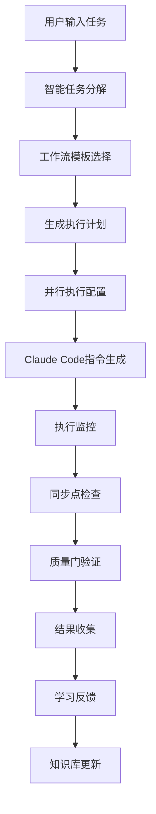

# Perfect21 架构文档

> 🏗️ **Perfect21**: Claude Code 智能工作流增强层架构设计
>
> 深度技术架构文档与设计决策记录

## 📖 目录

- [架构概览](#架构概览)
- [系统设计](#系统设计)
- [核心模块](#核心模块)
- [数据流设计](#数据流设计)
- [决策记录 (ADR)](#决策记录-adr)
- [扩展性设计](#扩展性设计)
- [安全架构](#安全架构)
- [性能架构](#性能架构)

## 🎯 架构概览

### 核心理念

Perfect21 采用**增强层架构**模式，不替代 Claude Code，而是增强其能力：

```
┌─────────────────────────────────────────┐
│             用户交互层                    │
│  CLI + Web API + WebSocket             │
└─────────────────┬───────────────────────┘
                  │
┌─────────────────┴───────────────────────┐
│           Perfect21 智能层              │
│  工作流编排 + 质量门 + 学习反馈         │
└─────────────────┬───────────────────────┘
                  │
┌─────────────────┴───────────────────────┐
│            Claude Code 执行层           │
│      直接调用 56个 SubAgents           │
└─────────────────────────────────────────┘
```

### 设计原则

1. **非侵入性**: 不修改 Claude Code 核心，纯增强模式
2. **智能编排**: 提供最佳实践的 Agent 调用策略
3. **质量内建**: 质量检查贯穿整个开发流程
4. **持续学习**: 记录决策，积累经验，持续改进
5. **扩展友好**: 模块化设计，支持插件扩展

## 🏗️ 系统设计

### 整体架构图

```
Perfect21/
├── 📱 交互层 (Interface Layer)
│   ├── main/cli.py              # CLI 命令行接口
│   ├── api/rest_server.py       # REST API 服务
│   └── api/websocket.py         # WebSocket 实时通信
│
├── 🧠 智能层 (Intelligence Layer)
│   ├── features/workflow_orchestrator/    # 工作流编排引擎
│   ├── features/sync_point_manager/       # 同步点管理器
│   ├── features/decision_recorder/        # 决策记录系统
│   ├── features/learning_feedback/        # 学习反馈循环
│   └── features/quality_guardian/         # 质量守护者
│
├── 🔄 执行层 (Execution Layer)
│   ├── features/parallel_executor/        # 并行执行引擎
│   ├── features/smart_decomposer/         # 智能任务分解
│   ├── features/capability_discovery/     # 能力发现系统
│   └── features/execution_supervisor/     # 执行监督器
│
├── 🏠 管理层 (Management Layer)
│   ├── features/multi_workspace/          # 多工作空间管理
│   ├── features/git_workflow/             # Git 工作流集成
│   ├── features/auth_system/              # 认证授权系统
│   └── features/claude_md_manager/        # CLAUDE.md 管理
│
├── 💾 数据层 (Data Layer)
│   ├── knowledge/                         # 知识库
│   ├── workflows/                         # 工作流模板
│   ├── data/                             # 数据存储
│   └── shared/                           # 共享缓存
│
└── 🔧 基础层 (Foundation Layer)
    ├── modules/                          # 通用模块
    ├── monitoring/                       # 监控指标
    └── infrastructure/                   # 基础设施
```

### 模块间通信

```python
# 事件驱动架构
class EventBus:
    """中央事件总线"""
    def emit(self, event: str, data: dict) -> None
    def subscribe(self, event: str, handler: callable) -> None

# 主要事件类型
EVENTS = {
    'task.started': 'features.execution_monitor',
    'workflow.phase_complete': 'features.sync_point_manager',
    'quality.gate_failed': 'features.quality_guardian',
    'decision.made': 'features.decision_recorder',
    'learning.feedback': 'features.learning_feedback'
}
```

## 🧩 核心模块

### 1. 工作流编排引擎 (Workflow Orchestrator)

**作用**: 智能编排 Claude Code 的 Agent 调用序列

```python
class WorkflowOrchestrator:
    """工作流编排引擎"""

    def __init__(self):
        self.templates = WorkflowTemplateManager()
        self.executor = TaskExecutor()
        self.sync_manager = SyncPointManager()

    def execute_workflow(self, task: Task) -> WorkflowResult:
        """执行工作流"""
        # 1. 选择最佳工作流模板
        template = self.templates.select_best_template(task)

        # 2. 生成执行计划
        execution_plan = self.generate_execution_plan(task, template)

        # 3. 分阶段执行
        for phase in execution_plan.phases:
            phase_result = self.execute_phase(phase)

            # 4. 同步点检查
            if phase.has_sync_point:
                sync_result = self.sync_manager.verify_sync_point(
                    phase.sync_point, phase_result
                )
                if not sync_result.passed:
                    return self.handle_sync_failure(sync_result)

        return WorkflowResult(success=True, output=execution_plan.results)
```

**设计决策**:
- 采用模板驱动的工作流设计
- 支持动态工作流调整
- 内置质量门检查

### 2. 并行执行引擎 (Parallel Executor)

**作用**: 智能分析任务复杂度，优化 Agent 并行调用

```python
class ParallelExecutor:
    """并行执行引擎"""

    def __init__(self):
        self.decomposer = SmartDecomposer()
        self.scheduler = AgentScheduler()
        self.monitor = ExecutionMonitor()

    def execute_parallel_task(self, task_desc: str) -> ExecutionConfig:
        """执行并行任务"""
        # 1. 智能任务分解
        analysis = self.decomposer.decompose_task(task_desc)

        # 2. 决定执行模式
        if analysis.complexity >= ComplexityLevel.MEDIUM:
            execution_mode = ExecutionMode.PARALLEL
        else:
            execution_mode = ExecutionMode.SEQUENTIAL

        # 3. 生成并行执行配置
        config = ParallelExecutionConfig(
            task_description=task_desc,
            execution_mode=execution_mode,
            agent_groups=analysis.agent_groups,
            sync_points=analysis.sync_points,
            quality_gates=analysis.quality_requirements
        )

        # 4. 生成 Claude Code 调用指令
        instructions = self.generate_claude_code_instructions(config)

        return ExecutionConfig(
            ready_for_execution=True,
            execution_instructions=instructions,
            monitoring_config=self.monitor.get_monitoring_config(config)
        )
```

**设计决策**:
- 基于复杂度的智能并行决策
- 生成 Claude Code 可直接执行的指令
- 支持实时执行监控

### 3. 质量守护者 (Quality Guardian)

**作用**: 预防性质量检查，确保每个阶段都符合质量标准

```python
class QualityGuardian:
    """质量守护者"""

    def __init__(self):
        self.quality_gates = QualityGateManager()
        self.metrics_collector = MetricsCollector()
        self.predictor = QualityPredictor()

    def check_quality_gate(self, gate: QualityGate, results: dict) -> QualityResult:
        """检查质量门"""
        # 1. 收集质量指标
        metrics = self.metrics_collector.collect_metrics(results)

        # 2. 执行质量检查
        checks = []
        for criterion in gate.criteria:
            check_result = self.evaluate_criterion(criterion, metrics)
            checks.append(check_result)

        # 3. 综合评估
        overall_passed = all(check.passed for check in checks)

        # 4. 预测性建议
        if not overall_passed:
            suggestions = self.predictor.suggest_improvements(checks, metrics)
        else:
            suggestions = []

        return QualityResult(
            gate_name=gate.name,
            passed=overall_passed,
            checks=checks,
            metrics=metrics,
            suggestions=suggestions
        )
```

**质量标准**:
```python
QUALITY_STANDARDS = {
    "code_coverage": {"threshold": 90, "unit": "percentage"},
    "api_response_time": {"threshold": 200, "unit": "milliseconds"},
    "security_score": {"threshold": 8.5, "unit": "scale_10"},
    "documentation_completeness": {"threshold": 85, "unit": "percentage"},
    "test_pass_rate": {"threshold": 100, "unit": "percentage"}
}
```

### 4. 学习反馈循环 (Learning Feedback Loop)

**作用**: 从每次执行中学习，持续改进工作流效率

```python
class LearningEngine:
    """学习引擎"""

    def __init__(self):
        self.pattern_analyzer = PatternAnalyzer()
        self.feedback_collector = FeedbackCollector()
        self.improvement_suggester = ImprovementSuggester()
        self.knowledge_base = KnowledgeBase()

    def learn_from_execution(self, execution: ExecutionRecord) -> LearningResult:
        """从执行中学习"""
        # 1. 分析执行模式
        patterns = self.pattern_analyzer.analyze_execution(execution)

        # 2. 收集用户反馈
        feedback = self.feedback_collector.get_feedback(execution.id)

        # 3. 识别改进机会
        improvements = self.improvement_suggester.suggest_improvements(
            patterns, feedback, execution
        )

        # 4. 更新知识库
        self.knowledge_base.update_knowledge(patterns, improvements)

        return LearningResult(
            patterns_identified=len(patterns),
            improvements_suggested=len(improvements),
            knowledge_updated=True
        )
```

**学习数据模型**:
```python
@dataclass
class ExecutionRecord:
    execution_id: str
    task_description: str
    workflow_used: str
    agents_called: List[str]
    execution_time: float
    quality_scores: Dict[str, float]
    user_satisfaction: float
    success: bool
    issues_encountered: List[str]
```

### 5. 多工作空间管理 (Multi-Workspace)

**作用**: 支持同时管理多个独立的开发环境

```python
class WorkspaceManager:
    """工作空间管理器"""

    def __init__(self, base_path: str):
        self.base_path = base_path
        self.workspaces: Dict[str, Workspace] = {}
        self.conflict_detector = ConflictDetector()
        self.auto_merger = AutoMerger()

    def create_workspace(self, name: str, workspace_type: WorkspaceType) -> str:
        """创建工作空间"""
        workspace_id = f"ws-{name}-{int(time.time())}"

        workspace = Workspace(
            id=workspace_id,
            name=name,
            type=workspace_type,
            base_branch=self.get_current_branch(),
            feature_branch=f"workspace/{workspace_id}",
            dev_port=self.allocate_port(),
            created_at=datetime.now()
        )

        # 创建特性分支
        self.create_feature_branch(workspace.feature_branch)

        # 分配开发端口
        workspace.dev_port = self.port_manager.allocate_port()

        self.workspaces[workspace_id] = workspace
        return workspace_id
```

**工作空间类型**:
```python
class WorkspaceType(Enum):
    FEATURE = "feature"      # 功能开发
    BUGFIX = "bugfix"        # Bug修复
    EXPERIMENT = "experiment" # 实验性开发
    HOTFIX = "hotfix"        # 热修复
    REFACTOR = "refactor"    # 重构
```

## 🔄 数据流设计

### 任务执行数据流



### 事件驱动数据流

```python
# 事件流架构
EVENT_FLOW = {
    "user.task_submitted": [
        "smart_decomposer.analyze_task",
        "workflow_orchestrator.select_template"
    ],
    "workflow.phase_started": [
        "execution_monitor.track_start",
        "parallel_executor.prepare_agents"
    ],
    "agents.execution_complete": [
        "sync_point_manager.check_sync",
        "quality_guardian.verify_quality"
    ],
    "quality.gate_passed": [
        "workflow_orchestrator.continue_next_phase"
    ],
    "quality.gate_failed": [
        "quality_guardian.suggest_fixes",
        "workflow_orchestrator.handle_failure"
    ],
    "workflow.completed": [
        "learning_engine.collect_feedback",
        "decision_recorder.save_decisions",
        "knowledge_base.update_patterns"
    ]
}
```

### 数据持久化策略

```python
# 分层存储架构
STORAGE_ARCHITECTURE = {
    "hot_data": {
        "storage": "Redis",
        "ttl": "1 hour",
        "data": ["execution_states", "real_time_metrics"]
    },
    "warm_data": {
        "storage": "SQLite",
        "retention": "30 days",
        "data": ["execution_history", "quality_metrics"]
    },
    "cold_data": {
        "storage": "JSON Files",
        "retention": "permanent",
        "data": ["knowledge_base", "learning_patterns", "adr_records"]
    }
}
```

## 📋 决策记录 (ADR)

### ADR-001: 增强层架构模式

**状态**: ✅ 已采纳
**日期**: 2025-09-16
**决策者**: 架构团队

**上下文**:
需要为 Claude Code 提供智能工作流能力，同时不影响其核心功能。

**考虑的选项**:
1. 修改 Claude Code 源码
2. 创建独立的替代系统
3. **采用增强层架构** (选择)

**决策**:
采用增强层架构模式，Perfect21 作为智能层覆盖在 Claude Code 之上。

**理由**:
- ✅ 非侵入性，不修改 Claude Code 核心
- ✅ 保持 Claude Code 的稳定性和更新能力
- ✅ 可以独立演进和升级
- ✅ 降低维护复杂度

**后果**:
- ✅ 需要通过指令生成与 Claude Code 交互
- ✅ 无法直接控制 Agent 执行过程
- ⚠️ 依赖 Claude Code 的 API 稳定性

### ADR-002: 事件驱动架构

**状态**: ✅ 已采纳
**日期**: 2025-09-16

**上下文**:
模块间需要松耦合的通信机制，支持插件化扩展。

**决策**:
采用事件驱动架构，通过中央事件总线进行模块间通信。

**理由**:
- ✅ 模块解耦，易于测试和维护
- ✅ 支持动态插件加载
- ✅ 便于监控和调试
- ✅ 支持异步处理

### ADR-003: 分层存储策略

**状态**: ✅ 已采纳
**日期**: 2025-09-16

**上下文**:
不同类型的数据有不同的访问模式和生命周期需求。

**决策**:
采用热-温-冷分层存储策略。

**理由**:
- ✅ 优化性能，热数据使用内存缓存
- ✅ 控制成本，冷数据使用文件存储
- ✅ 简化部署，避免复杂的数据库依赖
- ✅ 支持离线使用

### ADR-004: 智能并行决策算法

**状态**: ✅ 已采纳
**日期**: 2025-09-16

**上下文**:
需要自动决定何时使用并行执行，何时使用顺序执行。

**决策**:
基于任务复杂度和依赖关系的智能并行决策算法。

**算法**:
```python
def decide_execution_mode(task_analysis: TaskAnalysis) -> ExecutionMode:
    if task_analysis.complexity >= ComplexityLevel.MEDIUM:
        if task_analysis.has_clear_dependencies:
            return ExecutionMode.HYBRID  # 分层并行
        else:
            return ExecutionMode.PARALLEL
    else:
        return ExecutionMode.SEQUENTIAL
```

**理由**:
- ✅ 自动优化执行效率
- ✅ 减少用户决策负担
- ✅ 基于实际任务特征决策
- ✅ 支持混合执行模式

### ADR-005: 质量门设计

**状态**: ✅ 已采纳
**日期**: 2025-09-16

**上下文**:
需要确保每个工作流阶段都满足质量要求。

**决策**:
在工作流关键节点设置质量门，采用预防性质量保证策略。

**质量门类型**:
1. **入口门**: 检查输入质量
2. **过程门**: 检查中间产物质量
3. **出口门**: 检查最终交付质量
4. **预测门**: 预测潜在质量问题

**理由**:
- ✅ 左移质量保证，早期发现问题
- ✅ 降低返工成本
- ✅ 提高最终交付质量
- ✅ 支持持续改进

## 🔧 扩展性设计

### 插件化架构

```python
class PluginManager:
    """插件管理器"""

    def __init__(self):
        self.plugins: Dict[str, Plugin] = {}
        self.hooks: Dict[str, List[callable]] = {}

    def register_plugin(self, plugin: Plugin) -> None:
        """注册插件"""
        self.plugins[plugin.name] = plugin

        # 注册插件钩子
        for hook_name, handler in plugin.hooks.items():
            if hook_name not in self.hooks:
                self.hooks[hook_name] = []
            self.hooks[hook_name].append(handler)

    def execute_hook(self, hook_name: str, *args, **kwargs) -> List[Any]:
        """执行钩子"""
        results = []
        if hook_name in self.hooks:
            for handler in self.hooks[hook_name]:
                result = handler(*args, **kwargs)
                results.append(result)
        return results
```

### 扩展点定义

```python
EXTENSION_POINTS = {
    "workflow.before_phase": "工作流阶段开始前",
    "workflow.after_phase": "工作流阶段完成后",
    "quality.before_check": "质量检查前",
    "quality.after_check": "质量检查后",
    "parallel.before_execution": "并行执行前",
    "parallel.after_execution": "并行执行后",
    "learning.before_feedback": "学习反馈前",
    "learning.after_feedback": "学习反馈后"
}
```

### 自定义工作流模板

```python
# 用户可以定义自定义工作流
CUSTOM_WORKFLOW_TEMPLATE = {
    "name": "custom_ai_workflow",
    "description": "AI模型训练专用工作流",
    "phases": [
        {
            "name": "data_preparation",
            "agents": ["@data-scientist", "@ml-engineer"],
            "parallel": True,
            "sync_point": "data_quality_check"
        },
        {
            "name": "model_training",
            "agents": ["@ml-engineer"],
            "depends_on": ["data_preparation"],
            "sync_point": "model_validation"
        },
        {
            "name": "deployment",
            "agents": ["@devops-engineer", "@monitoring-specialist"],
            "parallel": True,
            "sync_point": "deployment_verification"
        }
    ]
}
```

## 🔒 安全架构

### 认证授权系统

```python
class AuthSystem:
    """认证授权系统"""

    def __init__(self):
        self.token_manager = JWTTokenManager()
        self.permission_manager = PermissionManager()
        self.audit_logger = AuditLogger()

    def authenticate_user(self, credentials: UserCredentials) -> AuthResult:
        """用户认证"""
        # 1. 验证用户凭据
        user = self.verify_credentials(credentials)
        if not user:
            self.audit_logger.log_failed_login(credentials.identifier)
            return AuthResult(success=False, message="Invalid credentials")

        # 2. 生成访问令牌
        access_token = self.token_manager.generate_access_token(user)
        refresh_token = self.token_manager.generate_refresh_token(user)

        # 3. 记录登录审计
        self.audit_logger.log_successful_login(user.id)

        return AuthResult(
            success=True,
            access_token=access_token,
            refresh_token=refresh_token,
            user=user
        )
```

### 安全中间件

```python
class SecurityMiddleware:
    """安全中间件"""

    def __init__(self):
        self.rate_limiter = RateLimiter()
        self.validator = InputValidator()
        self.csrf_protection = CSRFProtection()

    async def __call__(self, request: Request, call_next):
        # 1. 速率限制检查
        if not self.rate_limiter.is_allowed(request.client.host):
            raise HTTPException(status_code=429, detail="Rate limit exceeded")

        # 2. 输入验证
        if not self.validator.validate_request(request):
            raise HTTPException(status_code=400, detail="Invalid input")

        # 3. CSRF保护
        if request.method in ["POST", "PUT", "DELETE"]:
            if not self.csrf_protection.verify_token(request):
                raise HTTPException(status_code=403, detail="CSRF token invalid")

        response = await call_next(request)
        return response
```

### 数据加密

```python
class DataEncryption:
    """数据加密管理"""

    def __init__(self):
        self.key_manager = KeyManager()
        self.cipher = AESCipher()

    def encrypt_sensitive_data(self, data: dict) -> dict:
        """加密敏感数据"""
        encrypted_data = {}
        for key, value in data.items():
            if self.is_sensitive_field(key):
                encrypted_data[key] = self.cipher.encrypt(str(value))
            else:
                encrypted_data[key] = value
        return encrypted_data
```

## ⚡ 性能架构

### 缓存策略

```python
class CacheManager:
    """缓存管理器"""

    def __init__(self):
        self.redis_client = redis.Redis()
        self.local_cache = LRUCache(maxsize=1000)
        self.cache_policy = CachePolicy()

    def get(self, key: str, cache_level: CacheLevel = CacheLevel.AUTO) -> Any:
        """获取缓存数据"""
        # 1. 本地缓存检查
        if cache_level in [CacheLevel.LOCAL, CacheLevel.AUTO]:
            if key in self.local_cache:
                return self.local_cache[key]

        # 2. Redis缓存检查
        if cache_level in [CacheLevel.REDIS, CacheLevel.AUTO]:
            value = self.redis_client.get(key)
            if value:
                # 同步到本地缓存
                self.local_cache[key] = json.loads(value)
                return self.local_cache[key]

        return None
```

### 异步执行框架

```python
class AsyncExecutor:
    """异步执行框架"""

    def __init__(self):
        self.thread_pool = ThreadPoolExecutor(max_workers=8)
        self.task_queue = asyncio.Queue()
        self.result_store = {}

    async def submit_task(self, task: Task) -> str:
        """提交异步任务"""
        task_id = str(uuid.uuid4())

        # 将任务加入队列
        await self.task_queue.put((task_id, task))

        # 返回任务ID供后续查询
        return task_id

    async def process_tasks(self):
        """处理任务队列"""
        while True:
            task_id, task = await self.task_queue.get()

            # 在线程池中执行任务
            future = self.thread_pool.submit(task.execute)

            # 存储结果
            self.result_store[task_id] = {
                'status': 'running',
                'future': future
            }
```

### 性能监控

```python
class PerformanceMonitor:
    """性能监控器"""

    def __init__(self):
        self.metrics_collector = MetricsCollector()
        self.alert_manager = AlertManager()

    @contextmanager
    def monitor_execution(self, operation_name: str):
        """监控执行性能"""
        start_time = time.time()
        start_memory = psutil.Process().memory_info().rss

        try:
            yield
        finally:
            end_time = time.time()
            end_memory = psutil.Process().memory_info().rss

            # 收集性能指标
            metrics = {
                'operation': operation_name,
                'duration': end_time - start_time,
                'memory_delta': end_memory - start_memory,
                'timestamp': datetime.now()
            }

            self.metrics_collector.collect(metrics)

            # 性能告警检查
            if metrics['duration'] > PERFORMANCE_THRESHOLDS['max_duration']:
                self.alert_manager.send_alert(
                    f"Performance alert: {operation_name} took {metrics['duration']:.2f}s"
                )
```

## 🔄 部署架构

### 容器化部署

```dockerfile
# Dockerfile
FROM python:3.11-slim

WORKDIR /app

# 安装系统依赖
RUN apt-get update && apt-get install -y \
    git \
    curl \
    && rm -rf /var/lib/apt/lists/*

# 复制项目文件
COPY requirements.txt .
RUN pip install --no-cache-dir -r requirements.txt

COPY . .

# 健康检查
HEALTHCHECK --interval=30s --timeout=10s --start-period=60s --retries=3 \
    CMD curl -f http://localhost:8000/health || exit 1

# 启动服务
CMD ["python", "scripts/start_api.py"]
```

### 微服务架构

```yaml
# docker-compose.yml
version: '3.8'

services:
  perfect21-api:
    build: .
    ports:
      - "8000:8000"
    environment:
      - ENV=production
      - REDIS_URL=redis://redis:6379
    depends_on:
      - redis

  redis:
    image: redis:7-alpine
    volumes:
      - redis_data:/data

  nginx:
    image: nginx:alpine
    ports:
      - "80:80"
    volumes:
      - ./nginx.conf:/etc/nginx/nginx.conf
    depends_on:
      - perfect21-api

volumes:
  redis_data:
```

### Kubernetes 部署

```yaml
# k8s/deployment.yaml
apiVersion: apps/v1
kind: Deployment
metadata:
  name: perfect21-api
spec:
  replicas: 3
  selector:
    matchLabels:
      app: perfect21-api
  template:
    metadata:
      labels:
        app: perfect21-api
    spec:
      containers:
      - name: perfect21-api
        image: perfect21:latest
        ports:
        - containerPort: 8000
        env:
        - name: ENV
          value: "production"
        - name: REDIS_URL
          value: "redis://redis-service:6379"
        resources:
          requests:
            memory: "256Mi"
            cpu: "250m"
          limits:
            memory: "512Mi"
            cpu: "500m"
        livenessProbe:
          httpGet:
            path: /health
            port: 8000
          initialDelaySeconds: 30
          periodSeconds: 10
```

## 📊 监控与可观测性

### 指标收集

```python
# 关键性能指标
PERFORMANCE_METRICS = {
    "task_execution_time": "任务执行时间",
    "agent_response_time": "Agent响应时间",
    "workflow_success_rate": "工作流成功率",
    "quality_gate_pass_rate": "质量门通过率",
    "parallel_efficiency": "并行执行效率",
    "memory_usage": "内存使用量",
    "cpu_usage": "CPU使用率",
    "cache_hit_rate": "缓存命中率"
}
```

### 日志架构

```python
# 结构化日志格式
LOG_FORMAT = {
    "timestamp": "2025-09-17T10:30:00Z",
    "level": "INFO",
    "service": "perfect21-api",
    "module": "workflow_orchestrator",
    "operation": "execute_workflow",
    "user_id": "user123",
    "task_id": "task456",
    "duration_ms": 1250,
    "success": True,
    "message": "Workflow executed successfully",
    "metadata": {
        "workflow_template": "premium_quality",
        "agents_used": ["@backend-architect", "@test-engineer"],
        "quality_score": 0.95
    }
}
```

---

> 🏗️ **总结**: Perfect21 采用增强层架构模式，通过事件驱动、插件化、分层存储等设计原则，构建了一个可扩展、高性能、安全的智能工作流系统。所有架构决策都经过仔细考虑，并记录在 ADR 中，确保系统的可维护性和可演进性。