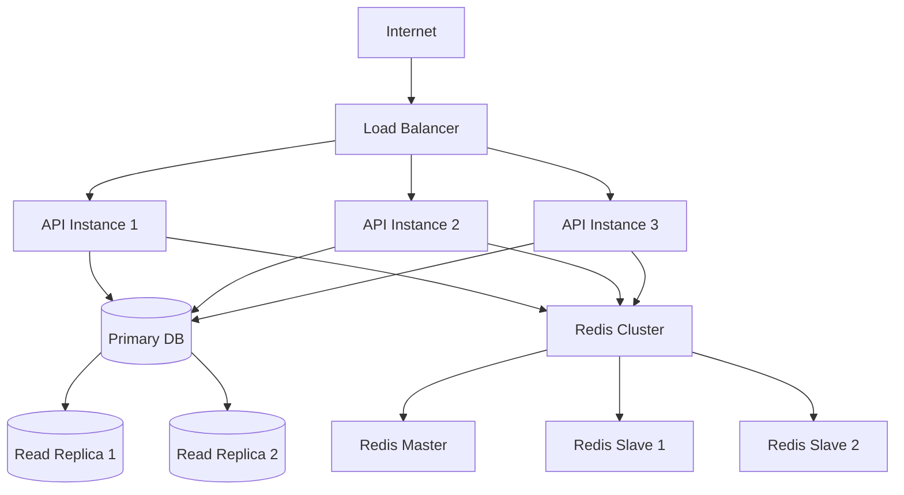

# Perfect21 Deployment Guide

## 🚀 Overview

This comprehensive deployment guide covers all aspects of deploying the Perfect21 (Claude Enhancer) system across different environments, from development setups to production-grade deployments with high availability and scalability.

## 📋 Pre-Deployment Requirements

### System Requirements

#### Minimum Requirements (Development)
- **CPU**: 2 cores
- **Memory**: 4GB RAM
- **Storage**: 20GB SSD
- **Network**: 100Mbps
- **OS**: Linux (Ubuntu 20.04+), macOS, Windows 10+

#### Recommended Requirements (Production)
- **CPU**: 8+ cores
- **Memory**: 16GB+ RAM
- **Storage**: 100GB+ SSD with backup
- **Network**: 1Gbps with redundancy
- **OS**: Linux (Ubuntu 20.04+ LTS)

#### Enterprise Requirements (High Availability)
- **CPU**: 16+ cores per node
- **Memory**: 32GB+ RAM per node
- **Storage**: 500GB+ SSD with RAID
- **Network**: 10Gbps with redundancy
- **Nodes**: 3+ nodes for clustering

### Software Dependencies

#### Core Dependencies
```bash
# Node.js and npm
curl -fsSL https://deb.nodesource.com/setup_18.x | sudo -E bash -
sudo apt-get install -y nodejs

# Docker and Docker Compose
curl -fsSL https://get.docker.com -o get-docker.sh
sh get-docker.sh
sudo usermod -aG docker $USER

# Git
sudo apt-get install -y git

# Essential tools
sudo apt-get install -y curl wget unzip jq
```

#### Database Requirements
- **PostgreSQL**: 13+ (recommended: 15+)
- **Redis**: 6+ (recommended: 7+)

#### Optional Components
- **Nginx**: For reverse proxy and load balancing
- **Kubernetes**: For container orchestration
- **Monitoring**: Prometheus, Grafana
- **CI/CD**: GitHub Actions, Jenkins

---

## 🛠️ Installation Methods

### Method 1: Quick Start (Development)

#### 1. Clone Repository
```bash
git clone https://github.com/perfect21/system.git
cd perfect21-system
```

#### 2. Environment Setup
```bash
# Copy environment template
cp .env.example .env

# Generate secrets
export JWT_ACCESS_SECRET=$(openssl rand -hex 64)
export JWT_REFRESH_SECRET=$(openssl rand -hex 64)
export DB_PASSWORD=$(openssl rand -hex 32)
export REDIS_PASSWORD=$(openssl rand -hex 32)

# Update .env file
cat > .env << EOF
NODE_ENV=development
PORT=3000

# Database
DB_HOST=localhost
DB_PORT=5432
DB_NAME=perfect21_dev
DB_USER=perfect21
DB_PASSWORD=${DB_PASSWORD}

# Redis
REDIS_HOST=localhost
REDIS_PORT=6379
REDIS_PASSWORD=${REDIS_PASSWORD}

# JWT Secrets
JWT_ACCESS_SECRET=${JWT_ACCESS_SECRET}
JWT_REFRESH_SECRET=${JWT_REFRESH_SECRET}
JWT_ACCESS_EXPIRY=15m
JWT_REFRESH_EXPIRY=7d

# Claude Enhancer
CLAUDE_ENHANCER_MODE=development
MIN_AGENTS=3
ENFORCE_PARALLEL=true
EOF
```

#### 3. Database Setup
```bash
# Install PostgreSQL
sudo apt-get install -y postgresql postgresql-contrib

# Create database and user
sudo -u postgres psql << EOF
CREATE DATABASE perfect21_dev;
CREATE USER perfect21 WITH PASSWORD '${DB_PASSWORD}';
GRANT ALL PRIVILEGES ON DATABASE perfect21_dev TO perfect21;
ALTER USER perfect21 CREATEDB;
EOF

# Apply schema
psql -h localhost -U perfect21 -d perfect21_dev -f database/schema.sql
```

#### 4. Redis Setup
```bash
# Install Redis
sudo apt-get install -y redis-server

# Configure Redis
sudo sed -i "s/# requirepass foobared/requirepass ${REDIS_PASSWORD}/" /etc/redis/redis.conf
sudo systemctl restart redis-server
```

#### 5. Install and Start
```bash
# Install dependencies
npm install

# Run migrations
npm run migrate

# Start development server
npm run dev
```

#### 6. Verify Installation
```bash
# Check health endpoint
curl -f http://localhost:3000/api/v1/health

# Test agent selection
curl -X POST http://localhost:3000/api/v1/agents/select \
  -H "Content-Type: application/json" \
  -d '{"task": "Create user authentication system", "complexity": "auto"}'
```

### Method 2: Docker Deployment

#### 1. Docker Compose Setup
```yaml
# docker-compose.yml
version: '3.8'

services:
  perfect21-api:
    build: .
    container_name: perfect21-api
    ports:
      - "3000:3000"
    environment:
      - NODE_ENV=production
      - DB_HOST=postgres
      - REDIS_HOST=redis
      - CLAUDE_ENHANCER_MODE=production
    depends_on:
      - postgres
      - redis
    restart: unless-stopped
    healthcheck:
      test: ["CMD", "curl", "-f", "http://localhost:3000/api/v1/health"]
      interval: 30s
      timeout: 10s
      retries: 3
      start_period: 40s

  postgres:
    image: postgres:15-alpine
    container_name: perfect21-postgres
    environment:
      POSTGRES_DB: perfect21
      POSTGRES_USER: perfect21
      POSTGRES_PASSWORD: ${DB_PASSWORD}
    volumes:
      - postgres_data:/var/lib/postgresql/data
      - ./database/schema.sql:/docker-entrypoint-initdb.d/01-schema.sql
      - ./database/seed.sql:/docker-entrypoint-initdb.d/02-seed.sql
    ports:
      - "5432:5432"
    restart: unless-stopped

  redis:
    image: redis:7-alpine
    container_name: perfect21-redis
    command: redis-server --requirepass ${REDIS_PASSWORD}
    volumes:
      - redis_data:/data
    ports:
      - "6379:6379"
    restart: unless-stopped

  nginx:
    image: nginx:alpine
    container_name: perfect21-nginx
    ports:
      - "80:80"
      - "443:443"
    volumes:
      - ./nginx/nginx.conf:/etc/nginx/nginx.conf
      - ./nginx/ssl:/etc/nginx/ssl
    depends_on:
      - perfect21-api
    restart: unless-stopped

volumes:
  postgres_data:
  redis_data:
```

#### 2. Nginx Configuration
```nginx
# nginx/nginx.conf
events {
    worker_connections 1024;
}

http {
    upstream perfect21_backend {
        server perfect21-api:3000;
    }

    # Rate limiting
    limit_req_zone $binary_remote_addr zone=api:10m rate=100r/m;
    limit_req_zone $binary_remote_addr zone=auth:10m rate=10r/m;

    server {
        listen 80;
        server_name api.perfect21.local;

        # Redirect HTTP to HTTPS
        return 301 https://$server_name$request_uri;
    }

    server {
        listen 443 ssl http2;
        server_name api.perfect21.local;

        # SSL Configuration
        ssl_certificate /etc/nginx/ssl/cert.pem;
        ssl_certificate_key /etc/nginx/ssl/key.pem;
        ssl_protocols TLSv1.2 TLSv1.3;
        ssl_ciphers ECDHE-RSA-AES256-GCM-SHA512:DHE-RSA-AES256-GCM-SHA512;

        # Security Headers
        add_header Strict-Transport-Security "max-age=31536000; includeSubDomains" always;
        add_header X-Content-Type-Options "nosniff" always;
        add_header X-Frame-Options "DENY" always;
        add_header X-XSS-Protection "1; mode=block" always;

        # API Routes
        location /api/v1/auth/ {
            limit_req zone=auth burst=20 nodelay;
            proxy_pass http://perfect21_backend;
            proxy_http_version 1.1;
            proxy_set_header Upgrade $http_upgrade;
            proxy_set_header Connection 'upgrade';
            proxy_set_header Host $host;
            proxy_set_header X-Real-IP $remote_addr;
            proxy_set_header X-Forwarded-For $proxy_add_x_forwarded_for;
            proxy_set_header X-Forwarded-Proto $scheme;
            proxy_cache_bypass $http_upgrade;
        }

        location /api/ {
            limit_req zone=api burst=50 nodelay;
            proxy_pass http://perfect21_backend;
            proxy_http_version 1.1;
            proxy_set_header Upgrade $http_upgrade;
            proxy_set_header Connection 'upgrade';
            proxy_set_header Host $host;
            proxy_set_header X-Real-IP $remote_addr;
            proxy_set_header X-Forwarded-For $proxy_add_x_forwarded_for;
            proxy_set_header X-Forwarded-Proto $scheme;
            proxy_cache_bypass $http_upgrade;
        }

        # Health check endpoint
        location /health {
            proxy_pass http://perfect21_backend/api/v1/health;
            access_log off;
        }
    }
}
```

#### 3. Deploy with Docker
```bash
# Generate environment variables
./scripts/generate-env.sh

# Build and start services
docker-compose up -d

# Check service status
docker-compose ps

# View logs
docker-compose logs -f perfect21-api

# Run database migrations
docker-compose exec perfect21-api npm run migrate

# Verify deployment
curl -k https://localhost/api/v1/health
```

### Method 3: Kubernetes Deployment

#### 1. Create Namespace and Secrets
```bash
# Create namespace
kubectl create namespace perfect21

# Create secrets
kubectl create secret generic perfect21-secrets \
  --from-literal=db-password="$(openssl rand -hex 32)" \
  --from-literal=redis-password="$(openssl rand -hex 32)" \
  --from-literal=jwt-access-secret="$(openssl rand -hex 64)" \
  --from-literal=jwt-refresh-secret="$(openssl rand -hex 64)" \
  -n perfect21

# Create TLS secret (if using HTTPS)
kubectl create secret tls perfect21-tls \
  --cert=path/to/tls.crt \
  --key=path/to/tls.key \
  -n perfect21
```

#### 2. Database Deployment
```yaml
# k8s/postgres.yaml
apiVersion: v1
kind: PersistentVolumeClaim
metadata:
  name: postgres-pvc
  namespace: perfect21
spec:
  accessModes:
    - ReadWriteOnce
  resources:
    requests:
      storage: 50Gi
  storageClassName: fast-ssd

---
apiVersion: apps/v1
kind: Deployment
metadata:
  name: postgres
  namespace: perfect21
spec:
  replicas: 1
  selector:
    matchLabels:
      app: postgres
  template:
    metadata:
      labels:
        app: postgres
    spec:
      containers:
      - name: postgres
        image: postgres:15-alpine
        env:
        - name: POSTGRES_DB
          value: perfect21
        - name: POSTGRES_USER
          value: perfect21
        - name: POSTGRES_PASSWORD
          valueFrom:
            secretKeyRef:
              name: perfect21-secrets
              key: db-password
        - name: PGDATA
          value: /var/lib/postgresql/data/pgdata
        ports:
        - containerPort: 5432
        volumeMounts:
        - name: postgres-storage
          mountPath: /var/lib/postgresql/data
        - name: init-scripts
          mountPath: /docker-entrypoint-initdb.d
        resources:
          requests:
            memory: "1Gi"
            cpu: "500m"
          limits:
            memory: "4Gi"
            cpu: "2000m"
        livenessProbe:
          exec:
            command:
            - pg_isready
            - -U
            - perfect21
          initialDelaySeconds: 30
          periodSeconds: 10
        readinessProbe:
          exec:
            command:
            - pg_isready
            - -U
            - perfect21
          initialDelaySeconds: 5
          periodSeconds: 5
      volumes:
      - name: postgres-storage
        persistentVolumeClaim:
          claimName: postgres-pvc
      - name: init-scripts
        configMap:
          name: postgres-init

---
apiVersion: v1
kind: Service
metadata:
  name: postgres-service
  namespace: perfect21
spec:
  selector:
    app: postgres
  ports:
  - port: 5432
    targetPort: 5432
  type: ClusterIP

---
apiVersion: v1
kind: ConfigMap
metadata:
  name: postgres-init
  namespace: perfect21
data:
  01-schema.sql: |
    -- Database schema will be inserted here
    CREATE EXTENSION IF NOT EXISTS "uuid-ossp";
    -- Add your schema definitions
```

#### 3. Redis Deployment
```yaml
# k8s/redis.yaml
apiVersion: apps/v1
kind: Deployment
metadata:
  name: redis
  namespace: perfect21
spec:
  replicas: 1
  selector:
    matchLabels:
      app: redis
  template:
    metadata:
      labels:
        app: redis
    spec:
      containers:
      - name: redis
        image: redis:7-alpine
        args:
        - redis-server
        - --requirepass
        - $(REDIS_PASSWORD)
        - --appendonly
        - "yes"
        env:
        - name: REDIS_PASSWORD
          valueFrom:
            secretKeyRef:
              name: perfect21-secrets
              key: redis-password
        ports:
        - containerPort: 6379
        volumeMounts:
        - name: redis-storage
          mountPath: /data
        resources:
          requests:
            memory: "512Mi"
            cpu: "250m"
          limits:
            memory: "2Gi"
            cpu: "1000m"
        livenessProbe:
          exec:
            command:
            - redis-cli
            - ping
          initialDelaySeconds: 30
          periodSeconds: 10
        readinessProbe:
          exec:
            command:
            - redis-cli
            - ping
          initialDelaySeconds: 5
          periodSeconds: 5
      volumes:
      - name: redis-storage
        emptyDir: {}

---
apiVersion: v1
kind: Service
metadata:
  name: redis-service
  namespace: perfect21
spec:
  selector:
    app: redis
  ports:
  - port: 6379
    targetPort: 6379
  type: ClusterIP
```

#### 4. Application Deployment
```yaml
# k8s/perfect21-api.yaml
apiVersion: apps/v1
kind: Deployment
metadata:
  name: perfect21-api
  namespace: perfect21
  labels:
    app: perfect21-api
spec:
  replicas: 3
  selector:
    matchLabels:
      app: perfect21-api
  template:
    metadata:
      labels:
        app: perfect21-api
    spec:
      containers:
      - name: perfect21-api
        image: perfect21/api:latest
        ports:
        - containerPort: 3000
        env:
        - name: NODE_ENV
          value: production
        - name: PORT
          value: "3000"
        - name: DB_HOST
          value: postgres-service
        - name: DB_PORT
          value: "5432"
        - name: DB_NAME
          value: perfect21
        - name: DB_USER
          value: perfect21
        - name: DB_PASSWORD
          valueFrom:
            secretKeyRef:
              name: perfect21-secrets
              key: db-password
        - name: REDIS_HOST
          value: redis-service
        - name: REDIS_PORT
          value: "6379"
        - name: REDIS_PASSWORD
          valueFrom:
            secretKeyRef:
              name: perfect21-secrets
              key: redis-password
        - name: JWT_ACCESS_SECRET
          valueFrom:
            secretKeyRef:
              name: perfect21-secrets
              key: jwt-access-secret
        - name: JWT_REFRESH_SECRET
          valueFrom:
            secretKeyRef:
              name: perfect21-secrets
              key: jwt-refresh-secret
        - name: CLAUDE_ENHANCER_MODE
          value: production
        - name: MIN_AGENTS
          value: "3"
        - name: ENFORCE_PARALLEL
          value: "true"
        resources:
          requests:
            memory: "512Mi"
            cpu: "250m"
          limits:
            memory: "2Gi"
            cpu: "1000m"
        livenessProbe:
          httpGet:
            path: /api/v1/health
            port: 3000
          initialDelaySeconds: 60
          periodSeconds: 30
          timeoutSeconds: 10
          failureThreshold: 3
        readinessProbe:
          httpGet:
            path: /api/v1/health
            port: 3000
          initialDelaySeconds: 30
          periodSeconds: 10
          timeoutSeconds: 5
          failureThreshold: 3
        startupProbe:
          httpGet:
            path: /api/v1/health
            port: 3000
          initialDelaySeconds: 30
          periodSeconds: 10
          timeoutSeconds: 5
          failureThreshold: 10

---
apiVersion: v1
kind: Service
metadata:
  name: perfect21-api-service
  namespace: perfect21
spec:
  selector:
    app: perfect21-api
  ports:
  - port: 80
    targetPort: 3000
  type: ClusterIP

---
apiVersion: networking.k8s.io/v1
kind: Ingress
metadata:
  name: perfect21-api-ingress
  namespace: perfect21
  annotations:
    nginx.ingress.kubernetes.io/rate-limit: "100"
    nginx.ingress.kubernetes.io/rate-limit-window: "1m"
    nginx.ingress.kubernetes.io/ssl-redirect: "true"
    nginx.ingress.kubernetes.io/force-ssl-redirect: "true"
    cert-manager.io/cluster-issuer: "letsencrypt-prod"
spec:
  tls:
  - hosts:
    - api.perfect21.com
    secretName: perfect21-tls
  rules:
  - host: api.perfect21.com
    http:
      paths:
      - path: /
        pathType: Prefix
        backend:
          service:
            name: perfect21-api-service
            port:
              number: 80
```

#### 5. Deploy to Kubernetes
```bash
# Apply all configurations
kubectl apply -f k8s/

# Check deployment status
kubectl get pods -n perfect21
kubectl get services -n perfect21
kubectl get ingress -n perfect21

# Check logs
kubectl logs -f deployment/perfect21-api -n perfect21

# Run database migrations
kubectl exec -it deployment/perfect21-api -n perfect21 -- npm run migrate

# Test deployment
kubectl port-forward service/perfect21-api-service 3000:80 -n perfect21
curl http://localhost:3000/api/v1/health
```

---

## ⚙️ Configuration Management

### Environment Variables

#### Core Configuration
```bash
# Application
NODE_ENV=production                    # production, development, test
PORT=3000                             # Server port
API_VERSION=v1                        # API version

# Database
DB_HOST=localhost                     # Database host
DB_PORT=5432                         # Database port
DB_NAME=perfect21                    # Database name
DB_USER=perfect21                    # Database user
DB_PASSWORD=secure_password          # Database password
DB_SSL=true                          # Enable SSL for database
DB_POOL_MIN=5                        # Minimum connection pool size
DB_POOL_MAX=25                       # Maximum connection pool size

# Redis
REDIS_HOST=localhost                 # Redis host
REDIS_PORT=6379                      # Redis port
REDIS_PASSWORD=secure_password       # Redis password
REDIS_DB=0                          # Redis database number

# JWT Configuration
JWT_ACCESS_SECRET=your_secret_here   # Access token secret (min 64 chars)
JWT_REFRESH_SECRET=your_secret_here  # Refresh token secret (min 64 chars)
JWT_ACCESS_EXPIRY=15m               # Access token expiry
JWT_REFRESH_EXPIRY=7d               # Refresh token expiry

# Claude Enhancer
CLAUDE_ENHANCER_MODE=production      # production, development, enforcement
MIN_AGENTS=3                        # Minimum agents required
MAX_AGENTS=10                       # Maximum agents allowed
ENFORCE_PARALLEL=true               # Enforce parallel execution
QUALITY_THRESHOLD=80                # Quality gate threshold

# Security
BCRYPT_ROUNDS=12                    # Password hashing rounds
RATE_LIMIT_WINDOW=15                # Rate limit window (minutes)
RATE_LIMIT_MAX=100                  # Rate limit max requests
AUTH_RATE_LIMIT_MAX=5               # Auth rate limit max

# CORS
ALLOWED_ORIGINS=https://app.perfect21.com,https://dashboard.perfect21.com

# Monitoring
LOG_LEVEL=info                      # debug, info, warn, error
ENABLE_METRICS=true                 # Enable Prometheus metrics
HEALTH_CHECK_TIMEOUT=5000           # Health check timeout (ms)

# Email (if needed)
SMTP_HOST=smtp.gmail.com
SMTP_PORT=587
SMTP_USER=noreply@perfect21.com
SMTP_PASSWORD=app_password
SMTP_FROM="Perfect21 <noreply@perfect21.com>"
```

#### Advanced Configuration
```bash
# Performance
CLUSTER_WORKERS=auto                # Number of cluster workers (auto = CPU cores)
KEEP_ALIVE_TIMEOUT=65000           # Keep alive timeout
BODY_LIMIT=10mb                    # Request body size limit
COMPRESSION=true                   # Enable gzip compression

# Session Management
SESSION_TIMEOUT=24h                # Session timeout
MAX_CONCURRENT_SESSIONS=5          # Max concurrent sessions per user
ENABLE_SESSION_TRACKING=true       # Enable session tracking

# File Upload (if enabled)
UPLOAD_MAX_SIZE=10MB              # Maximum file upload size
UPLOAD_ALLOWED_TYPES=jpg,jpeg,png,gif,pdf
UPLOAD_PATH=/app/uploads          # Upload directory

# Monitoring & Analytics
ENABLE_ANALYTICS=true             # Enable analytics
SENTRY_DSN=your_sentry_dsn       # Sentry error tracking
PROMETHEUS_PORT=9090             # Prometheus metrics port

# External Services
CLAUDE_API_KEY=your_claude_key   # Claude API key
OPENAI_API_KEY=your_openai_key   # OpenAI API key (if used)
```

### Configuration Files

#### Application Configuration
```javascript
// config/index.js
const config = {
  development: {
    port: process.env.PORT || 3000,
    database: {
      host: process.env.DB_HOST || 'localhost',
      port: process.env.DB_PORT || 5432,
      database: process.env.DB_NAME || 'perfect21_dev',
      username: process.env.DB_USER || 'perfect21',
      password: process.env.DB_PASSWORD || 'password',
      dialect: 'postgres',
      logging: console.log,
      pool: {
        min: parseInt(process.env.DB_POOL_MIN) || 5,
        max: parseInt(process.env.DB_POOL_MAX) || 25,
        idle: 30000,
        acquire: 60000,
      }
    },
    redis: {
      host: process.env.REDIS_HOST || 'localhost',
      port: process.env.REDIS_PORT || 6379,
      password: process.env.REDIS_PASSWORD,
      db: process.env.REDIS_DB || 0,
    },
    jwt: {
      accessSecret: process.env.JWT_ACCESS_SECRET,
      refreshSecret: process.env.JWT_REFRESH_SECRET,
      accessExpiry: process.env.JWT_ACCESS_EXPIRY || '15m',
      refreshExpiry: process.env.JWT_REFRESH_EXPIRY || '7d',
    },
    claudeEnhancer: {
      mode: process.env.CLAUDE_ENHANCER_MODE || 'development',
      minAgents: parseInt(process.env.MIN_AGENTS) || 3,
      maxAgents: parseInt(process.env.MAX_AGENTS) || 10,
      enforceParallel: process.env.ENFORCE_PARALLEL === 'true',
      qualityThreshold: parseInt(process.env.QUALITY_THRESHOLD) || 80,
    }
  },
  production: {
    // Production-specific overrides
    database: {
      logging: false,
      ssl: process.env.DB_SSL === 'true',
    },
    security: {
      bcryptRounds: parseInt(process.env.BCRYPT_ROUNDS) || 12,
      rateLimitWindow: parseInt(process.env.RATE_LIMIT_WINDOW) || 15,
      rateLimitMax: parseInt(process.env.RATE_LIMIT_MAX) || 100,
    }
  }
};

module.exports = config[process.env.NODE_ENV || 'development'];
```

#### Agent Configuration
```yaml
# config/agents.yaml
agents:
  development:
    - id: backend-architect
      name: Backend Architect
      description: Server-side architecture and API design
      capabilities:
        - system_architecture
        - database_design
        - api_design
        - scalability_planning
      complexity_level: high
      execution_time: 15-30

    - id: frontend-specialist
      name: Frontend Specialist
      description: User interface development and UX
      capabilities:
        - ui_development
        - responsive_design
        - performance_optimization
        - accessibility
      complexity_level: medium
      execution_time: 10-20

  quality_assurance:
    - id: test-engineer
      name: Test Engineer
      description: Comprehensive testing strategy and automation
      capabilities:
        - test_strategy
        - unit_testing
        - integration_testing
        - automated_testing
      complexity_level: medium
      execution_time: 10-15

    - id: security-auditor
      name: Security Auditor
      description: Security assessment and vulnerability testing
      capabilities:
        - security_assessment
        - vulnerability_scanning
        - compliance_checking
        - security_implementation
      complexity_level: high
      execution_time: 15-25

task_combinations:
  authentication_system:
    required_agents:
      - backend-architect
      - security-auditor
      - api-designer
      - database-specialist
      - test-engineer
    execution_mode: parallel
    estimated_time: 20-25

  web_application:
    required_agents:
      - backend-architect
      - frontend-specialist
      - database-specialist
      - security-auditor
      - test-engineer
      - ux-designer
    execution_mode: parallel
    estimated_time: 25-35
```

---

## 🔒 Security Configuration

### SSL/TLS Setup

#### Generate Self-Signed Certificates (Development)
```bash
# Create SSL directory
mkdir -p nginx/ssl

# Generate private key
openssl genrsa -out nginx/ssl/key.pem 2048

# Generate certificate
openssl req -new -x509 -key nginx/ssl/key.pem -out nginx/ssl/cert.pem -days 365 \
  -subj "/C=US/ST=State/L=City/O=Organization/CN=api.perfect21.local"
```

#### Let's Encrypt (Production)
```bash
# Install certbot
sudo apt-get install -y certbot python3-certbot-nginx

# Obtain certificate
sudo certbot --nginx -d api.perfect21.com

# Auto-renewal
sudo crontab -e
# Add: 0 12 * * * /usr/bin/certbot renew --quiet
```

### Firewall Configuration

#### UFW (Ubuntu)
```bash
# Enable UFW
sudo ufw enable

# Allow SSH
sudo ufw allow ssh

# Allow HTTP and HTTPS
sudo ufw allow 80/tcp
sudo ufw allow 443/tcp

# Allow database (if external access needed)
sudo ufw allow from trusted_ip to any port 5432

# Check status
sudo ufw status
```

#### iptables Rules
```bash
# Allow established connections
iptables -A INPUT -m state --state ESTABLISHED,RELATED -j ACCEPT

# Allow HTTP and HTTPS
iptables -A INPUT -p tcp --dport 80 -j ACCEPT
iptables -A INPUT -p tcp --dport 443 -j ACCEPT

# Allow SSH (from specific IPs)
iptables -A INPUT -p tcp -s trusted_ip --dport 22 -j ACCEPT

# Drop all other input
iptables -A INPUT -j DROP

# Save rules
iptables-save > /etc/iptables/rules.v4
```

### Application Security

#### Security Headers
```javascript
// middleware/security.js
const helmet = require('helmet');

const securityHeaders = helmet({
  contentSecurityPolicy: {
    directives: {
      defaultSrc: ["'self'"],
      styleSrc: ["'self'", "'unsafe-inline'"],
      scriptSrc: ["'self'"],
      imgSrc: ["'self'", "data:", "https:"],
      connectSrc: ["'self'"],
      fontSrc: ["'self'"],
      objectSrc: ["'none'"],
      mediaSrc: ["'self'"],
      frameSrc: ["'none'"],
    },
  },
  crossOriginEmbedderPolicy: false,
  hsts: {
    maxAge: 31536000,
    includeSubDomains: true,
    preload: true
  }
});

module.exports = securityHeaders;
```

#### Rate Limiting
```javascript
// middleware/rateLimiter.js
const rateLimit = require('express-rate-limit');
const RedisStore = require('rate-limit-redis');
const Redis = require('ioredis');

const redis = new Redis(process.env.REDIS_URL);

const createRateLimiter = (windowMs, max, message) => {
  return rateLimit({
    store: new RedisStore({
      client: redis,
      prefix: 'rl:',
    }),
    windowMs,
    max,
    message: {
      error: {
        code: 'RATE_LIMIT_EXCEEDED',
        message,
      }
    },
    standardHeaders: true,
    legacyHeaders: false,
  });
};

module.exports = {
  general: createRateLimiter(15 * 60 * 1000, 100, 'Too many requests'),
  auth: createRateLimiter(15 * 60 * 1000, 5, 'Too many authentication attempts'),
  registration: createRateLimiter(60 * 60 * 1000, 3, 'Too many registration attempts'),
};
```

---

## 📊 Monitoring Setup

### Prometheus Configuration

#### 1. Prometheus Setup
```yaml
# monitoring/prometheus.yml
global:
  scrape_interval: 15s
  evaluation_interval: 15s

rule_files:
  - "alert_rules.yml"

scrape_configs:
  - job_name: 'perfect21-api'
    static_configs:
      - targets: ['perfect21-api:3000']
    metrics_path: '/metrics'
    scrape_interval: 10s

  - job_name: 'postgres'
    static_configs:
      - targets: ['postgres:9187']

  - job_name: 'redis'
    static_configs:
      - targets: ['redis:9121']

  - job_name: 'nginx'
    static_configs:
      - targets: ['nginx:9113']

alerting:
  alertmanagers:
    - static_configs:
        - targets:
          - alertmanager:9093
```

#### 2. Alert Rules
```yaml
# monitoring/alert_rules.yml
groups:
  - name: perfect21_alerts
    rules:
      - alert: HighErrorRate
        expr: rate(http_requests_total{status=~"5.."}[5m]) > 0.1
        for: 5m
        labels:
          severity: critical
        annotations:
          summary: "High error rate detected"
          description: "Error rate is {{ $value }} errors per second"

      - alert: HighLatency
        expr: histogram_quantile(0.95, rate(http_request_duration_seconds_bucket[5m])) > 0.5
        for: 5m
        labels:
          severity: warning
        annotations:
          summary: "High latency detected"
          description: "95th percentile latency is {{ $value }} seconds"

      - alert: DatabaseDown
        expr: up{job="postgres"} == 0
        for: 1m
        labels:
          severity: critical
        annotations:
          summary: "Database is down"
          description: "PostgreSQL database is not responding"

      - alert: RedisDown
        expr: up{job="redis"} == 0
        for: 1m
        labels:
          severity: critical
        annotations:
          summary: "Redis is down"
          description: "Redis cache is not responding"
```

#### 3. Grafana Dashboard
```json
{
  "dashboard": {
    "title": "Perfect21 System Dashboard",
    "panels": [
      {
        "title": "Request Rate",
        "type": "graph",
        "targets": [
          {
            "expr": "rate(http_requests_total[5m])",
            "legendFormat": "Requests/sec"
          }
        ]
      },
      {
        "title": "Response Time",
        "type": "graph",
        "targets": [
          {
            "expr": "histogram_quantile(0.95, rate(http_request_duration_seconds_bucket[5m]))",
            "legendFormat": "95th percentile"
          }
        ]
      },
      {
        "title": "Error Rate",
        "type": "graph",
        "targets": [
          {
            "expr": "rate(http_requests_total{status=~\"5..\"}[5m])",
            "legendFormat": "Error rate"
          }
        ]
      },
      {
        "title": "Agent Utilization",
        "type": "graph",
        "targets": [
          {
            "expr": "perfect21_agents_active",
            "legendFormat": "Active agents"
          }
        ]
      }
    ]
  }
}
```

### Application Metrics

#### Metrics Collection
```javascript
// middleware/metrics.js
const promClient = require('prom-client');

// Create a Registry
const register = new promClient.Registry();

// Default metrics
promClient.collectDefaultMetrics({ register });

// Custom metrics
const httpRequestsTotal = new promClient.Counter({
  name: 'http_requests_total',
  help: 'Total HTTP requests',
  labelNames: ['method', 'route', 'status'],
  registers: [register]
});

const httpRequestDuration = new promClient.Histogram({
  name: 'http_request_duration_seconds',
  help: 'HTTP request duration in seconds',
  labelNames: ['method', 'route'],
  buckets: [0.1, 0.3, 0.5, 0.7, 1, 3, 5, 7, 10],
  registers: [register]
});

const agentsActive = new promClient.Gauge({
  name: 'perfect21_agents_active',
  help: 'Number of active agents',
  registers: [register]
});

const tasksCompleted = new promClient.Counter({
  name: 'perfect21_tasks_completed_total',
  help: 'Total completed tasks',
  labelNames: ['complexity', 'status'],
  registers: [register]
});

module.exports = {
  register,
  httpRequestsTotal,
  httpRequestDuration,
  agentsActive,
  tasksCompleted
};
```

---

## 🚀 Production Deployment

### Pre-Production Checklist

#### Security Checklist
- [ ] **SSL/TLS configured** with valid certificates
- [ ] **Environment variables** secured and not in code
- [ ] **Database credentials** rotated and secured
- [ ] **API keys** secured and with minimal permissions
- [ ] **Firewall rules** configured and tested
- [ ] **Security headers** implemented
- [ ] **Rate limiting** configured and tested
- [ ] **Input validation** comprehensive
- [ ] **Vulnerability scanning** completed

#### Performance Checklist
- [ ] **Database optimized** with proper indexes
- [ ] **Connection pooling** configured
- [ ] **Caching strategy** implemented
- [ ] **Load testing** completed
- [ ] **Resource limits** set appropriately
- [ ] **Health checks** configured
- [ ] **Monitoring** set up and tested
- [ ] **Alerting** configured
- [ ] **Backup strategy** implemented and tested

#### Reliability Checklist
- [ ] **High availability** architecture deployed
- [ ] **Auto-scaling** configured
- [ ] **Circuit breakers** implemented
- [ ] **Graceful shutdown** handling
- [ ] **Error handling** comprehensive
- [ ] **Logging** structured and comprehensive
- [ ] **Disaster recovery** plan documented
- [ ] **Runbooks** created for common issues

### Production Architecture

#### High Availability Setup


#### Resource Requirements (Production)

##### Small Production (< 1000 concurrent users)
```yaml
resources:
  api_instances: 3
  cpu_per_instance: 2 cores
  memory_per_instance: 4GB
  database:
    cpu: 4 cores
    memory: 8GB
    storage: 100GB SSD
  redis:
    cpu: 1 core
    memory: 2GB
  load_balancer:
    cpu: 1 core
    memory: 1GB
```

##### Medium Production (1000-10000 concurrent users)
```yaml
resources:
  api_instances: 6
  cpu_per_instance: 4 cores
  memory_per_instance: 8GB
  database:
    cpu: 8 cores
    memory: 32GB
    storage: 500GB SSD
  redis:
    cpu: 2 cores
    memory: 8GB
  load_balancer:
    cpu: 2 cores
    memory: 4GB
```

##### Large Production (> 10000 concurrent users)
```yaml
resources:
  api_instances: 12+
  cpu_per_instance: 8 cores
  memory_per_instance: 16GB
  database:
    cpu: 16+ cores
    memory: 64GB+
    storage: 1TB+ SSD
  redis_cluster: 6 nodes
  load_balancer: Multiple with failover
```

### Deployment Automation

#### CI/CD Pipeline
```yaml
# .github/workflows/deploy.yml
name: Deploy to Production

on:
  push:
    branches: [main]

jobs:
  test:
    runs-on: ubuntu-latest
    steps:
      - uses: actions/checkout@v3
      - name: Setup Node.js
        uses: actions/setup-node@v3
        with:
          node-version: '18'
      - name: Install dependencies
        run: npm ci
      - name: Run tests
        run: npm test
      - name: Run security audit
        run: npm audit

  build:
    needs: test
    runs-on: ubuntu-latest
    steps:
      - uses: actions/checkout@v3
      - name: Build Docker image
        run: |
          docker build -t perfect21/api:${{ github.sha }} .
          docker tag perfect21/api:${{ github.sha }} perfect21/api:latest
      - name: Push to registry
        run: |
          echo ${{ secrets.DOCKER_PASSWORD }} | docker login -u ${{ secrets.DOCKER_USERNAME }} --password-stdin
          docker push perfect21/api:${{ github.sha }}
          docker push perfect21/api:latest

  deploy:
    needs: build
    runs-on: ubuntu-latest
    environment: production
    steps:
      - name: Deploy to Kubernetes
        run: |
          kubectl set image deployment/perfect21-api perfect21-api=perfect21/api:${{ github.sha }} -n perfect21
          kubectl rollout status deployment/perfect21-api -n perfect21
```

#### Blue-Green Deployment Script
```bash
#!/bin/bash
# scripts/blue-green-deploy.sh

set -e

NAMESPACE="perfect21"
NEW_VERSION=$1
CURRENT_COLOR=$(kubectl get service perfect21-api-service -n $NAMESPACE -o jsonpath='{.spec.selector.color}')

if [ "$CURRENT_COLOR" = "blue" ]; then
    NEW_COLOR="green"
else
    NEW_COLOR="blue"
fi

echo "Current color: $CURRENT_COLOR"
echo "Deploying to: $NEW_COLOR"

# Update deployment with new image
kubectl set image deployment/perfect21-api-$NEW_COLOR \
    perfect21-api=perfect21/api:$NEW_VERSION \
    -n $NAMESPACE

# Wait for rollout to complete
kubectl rollout status deployment/perfect21-api-$NEW_COLOR -n $NAMESPACE

# Health check
sleep 30
kubectl exec -n $NAMESPACE deployment/perfect21-api-$NEW_COLOR -- curl -f http://localhost:3000/api/v1/health

# Switch traffic
kubectl patch service perfect21-api-service -n $NAMESPACE -p '{"spec":{"selector":{"color":"'$NEW_COLOR'"}}}'

echo "Traffic switched to $NEW_COLOR"
echo "Deployment complete!"

# Optional: Scale down old deployment
# kubectl scale deployment perfect21-api-$CURRENT_COLOR --replicas=0 -n $NAMESPACE
```

---

## 🔧 Maintenance & Operations

### Regular Maintenance Tasks

#### Daily Tasks
```bash
#!/bin/bash
# scripts/daily-maintenance.sh

# Check system health
curl -f https://api.perfect21.com/api/v1/health || echo "ALERT: Health check failed"

# Check disk space
df -h | awk '$5 > 80 {print "ALERT: Disk usage high: " $0}'

# Check memory usage
free -h | awk '/Mem:/ {if($3/$2 > 0.8) print "ALERT: Memory usage high: " $3 "/" $2}'

# Check database size
psql -h $DB_HOST -U $DB_USER -d $DB_NAME -c "
SELECT
    pg_size_pretty(pg_database_size(current_database())) as db_size,
    pg_size_pretty(pg_total_relation_size('users')) as users_table_size;
"

# Check Redis memory usage
redis-cli -h $REDIS_HOST -p $REDIS_PORT --no-auth-warning -a $REDIS_PASSWORD info memory | grep used_memory_human

# Check log files for errors
tail -1000 /var/log/perfect21/app.log | grep -i error | tail -10
```

#### Weekly Tasks
```bash
#!/bin/bash
# scripts/weekly-maintenance.sh

# Database maintenance
psql -h $DB_HOST -U $DB_USER -d $DB_NAME -c "
VACUUM ANALYZE;
REINDEX DATABASE $DB_NAME;
"

# Clean up old logs
find /var/log/perfect21 -name "*.log.*" -mtime +30 -delete

# Update security patches
sudo apt update && sudo apt upgrade -y

# Check SSL certificate expiry
echo | openssl s_client -connect api.perfect21.com:443 2>/dev/null | openssl x509 -noout -dates

# Backup verification
./scripts/verify-backup.sh
```

#### Monthly Tasks
```bash
#!/bin/bash
# scripts/monthly-maintenance.sh

# Security audit
npm audit --audit-level high

# Dependency updates
npm outdated

# Performance review
./scripts/performance-report.sh

# Capacity planning
./scripts/capacity-analysis.sh

# Disaster recovery test
./scripts/dr-test.sh
```

### Backup & Recovery

#### Database Backup
```bash
#!/bin/bash
# scripts/backup-database.sh

BACKUP_DIR="/backup/postgresql"
DATE=$(date +%Y%m%d_%H%M%S)
BACKUP_FILE="perfect21_backup_$DATE.sql"

# Create backup directory
mkdir -p $BACKUP_DIR

# Perform backup
pg_dump -h $DB_HOST -U $DB_USER -d $DB_NAME -f $BACKUP_DIR/$BACKUP_FILE

# Compress backup
gzip $BACKUP_DIR/$BACKUP_FILE

# Upload to S3 (if configured)
if [ -n "$S3_BACKUP_BUCKET" ]; then
    aws s3 cp $BACKUP_DIR/$BACKUP_FILE.gz s3://$S3_BACKUP_BUCKET/postgresql/
fi

# Clean up old backups (keep 30 days)
find $BACKUP_DIR -name "*.sql.gz" -mtime +30 -delete

echo "Backup completed: $BACKUP_FILE.gz"
```

#### Configuration Backup
```bash
#!/bin/bash
# scripts/backup-config.sh

BACKUP_DIR="/backup/config"
DATE=$(date +%Y%m%d_%H%M%S)

mkdir -p $BACKUP_DIR

# Backup environment files
cp .env $BACKUP_DIR/env_$DATE
cp .env.production $BACKUP_DIR/env_production_$DATE

# Backup configuration files
tar -czf $BACKUP_DIR/config_$DATE.tar.gz \
    config/ \
    nginx/ \
    k8s/ \
    docker-compose.yml

echo "Configuration backup completed"
```

#### Recovery Procedures
```bash
#!/bin/bash
# scripts/disaster-recovery.sh

RECOVERY_TYPE=$1  # full, database, config

case $RECOVERY_TYPE in
    "full")
        echo "Starting full disaster recovery..."

        # Restore configuration
        ./scripts/restore-config.sh $2

        # Restore database
        ./scripts/restore-database.sh $3

        # Restart services
        docker-compose down
        docker-compose up -d
        ;;

    "database")
        echo "Starting database recovery..."
        BACKUP_FILE=$2

        # Stop application
        docker-compose stop perfect21-api

        # Restore database
        gunzip -c $BACKUP_FILE | psql -h $DB_HOST -U $DB_USER -d $DB_NAME

        # Start application
        docker-compose start perfect21-api
        ;;

    "config")
        echo "Starting configuration recovery..."
        CONFIG_BACKUP=$2

        # Extract configuration
        tar -xzf $CONFIG_BACKUP

        # Restart services
        docker-compose restart
        ;;

    *)
        echo "Usage: $0 {full|database|config} [backup_file]"
        exit 1
        ;;
esac
```

---

## 🚨 Troubleshooting

### Common Deployment Issues

#### 1. Database Connection Issues

**Symptoms:**
```
Error: connect ECONNREFUSED 127.0.0.1:5432
```

**Diagnosis:**
```bash
# Check PostgreSQL status
sudo systemctl status postgresql

# Check database connectivity
psql -h $DB_HOST -U $DB_USER -d $DB_NAME -c "SELECT version();"

# Check network connectivity
telnet $DB_HOST $DB_PORT

# Check firewall
sudo ufw status
```

**Solutions:**
```bash
# Restart PostgreSQL
sudo systemctl restart postgresql

# Check PostgreSQL configuration
sudo nano /etc/postgresql/15/main/postgresql.conf
# Ensure: listen_addresses = '*'

sudo nano /etc/postgresql/15/main/pg_hba.conf
# Add: host all all 0.0.0.0/0 md5

# Update firewall
sudo ufw allow 5432/tcp
```

#### 2. High Memory Usage

**Symptoms:**
- Application crashes with OOM errors
- Slow response times
- High swap usage

**Diagnosis:**
```bash
# Check memory usage
free -h
docker stats
kubectl top pods

# Check for memory leaks
ps aux --sort=-%mem | head -10

# Check application metrics
curl http://localhost:3000/metrics | grep memory
```

**Solutions:**
```bash
# Optimize connection pool
# In config/database.js
pool: {
  min: 5,
  max: 10,  // Reduce from 25
  idle: 30000,
  acquire: 60000,
}

# Implement memory limits in Docker
# In docker-compose.yml
services:
  perfect21-api:
    deploy:
      resources:
        limits:
          memory: 2G
        reservations:
          memory: 1G

# Implement memory limits in Kubernetes
resources:
  requests:
    memory: "1Gi"
  limits:
    memory: "2Gi"
```

#### 3. Agent Selection Failures

**Symptoms:**
```json
{
  "error": {
    "code": "AGENT_SELECTION_FAILED",
    "message": "Unable to select appropriate agents"
  }
}
```

**Diagnosis:**
```bash
# Check agent configuration
cat config/agents.yaml

# Check Claude Enhancer settings
grep CLAUDE_ENHANCER .env

# Check system logs
docker logs perfect21-api 2>&1 | grep -i agent
```

**Solutions:**
```bash
# Verify agent configuration
./scripts/validate-agents.sh

# Reset agent cache
redis-cli -h $REDIS_HOST -p $REDIS_PORT FLUSHDB

# Update agent configuration
kubectl apply -f k8s/configmap-agents.yaml
kubectl rollout restart deployment/perfect21-api
```

#### 4. SSL Certificate Issues

**Symptoms:**
- SSL handshake failures
- Certificate expired warnings
- Mixed content errors

**Diagnosis:**
```bash
# Check certificate validity
openssl x509 -in /path/to/cert.pem -text -noout

# Check certificate expiry
echo | openssl s_client -connect api.perfect21.com:443 2>/dev/null | openssl x509 -noout -dates

# Test SSL configuration
curl -vI https://api.perfect21.com/api/v1/health
```

**Solutions:**
```bash
# Renew Let's Encrypt certificate
sudo certbot renew

# Update certificate in Kubernetes
kubectl create secret tls perfect21-tls \
  --cert=path/to/new-cert.pem \
  --key=path/to/new-key.pem \
  -n perfect21 \
  --dry-run=client -o yaml | kubectl apply -f -

# Restart services
kubectl rollout restart deployment/perfect21-api -n perfect21
```

### Performance Troubleshooting

#### Database Performance
```sql
-- Check slow queries
SELECT query, mean_time, calls, total_time
FROM pg_stat_statements
ORDER BY mean_time DESC
LIMIT 10;

-- Check index usage
SELECT schemaname, tablename, attname, n_distinct, correlation
FROM pg_stats
WHERE tablename = 'users';

-- Check table sizes
SELECT
    tablename,
    pg_size_pretty(pg_total_relation_size(tablename::regclass)) AS size
FROM pg_tables
WHERE schemaname = 'public'
ORDER BY pg_total_relation_size(tablename::regclass) DESC;

-- Add missing indexes
CREATE INDEX CONCURRENTLY idx_users_email ON users(email);
CREATE INDEX CONCURRENTLY idx_tasks_created_at ON tasks(created_at);
```

#### Application Performance
```bash
# Profile Node.js application
node --prof app.js
# After load testing:
node --prof-process isolate-*.log > processed.txt

# Monitor garbage collection
node --trace-gc app.js

# Check event loop lag
curl http://localhost:3000/metrics | grep eventloop

# Memory heap analysis
curl http://localhost:3000/metrics | grep heap
```

---

## 📞 Support & Maintenance

### Monitoring Dashboard URLs

- **Grafana**: `https://monitoring.perfect21.com/grafana`
- **Prometheus**: `https://monitoring.perfect21.com/prometheus`
- **Alertmanager**: `https://monitoring.perfect21.com/alertmanager`

### Log Locations

- **Application Logs**: `/var/log/perfect21/app.log`
- **Error Logs**: `/var/log/perfect21/error.log`
- **Access Logs**: `/var/log/nginx/access.log`
- **Database Logs**: `/var/log/postgresql/postgresql-15-main.log`

### Emergency Contacts

- **Primary On-Call**: +1-555-PERFECT21
- **Secondary On-Call**: +1-555-BACKUP21
- **Engineering Team**: engineering@perfect21.com
- **DevOps Team**: devops@perfect21.com

### Escalation Procedures

1. **Severity 1 (Critical)**: System down, data loss
   - Contact primary on-call immediately
   - If no response in 15 minutes, contact secondary
   - Notify engineering manager

2. **Severity 2 (High)**: Performance degraded, partial outage
   - Contact primary on-call within 30 minutes
   - Create incident ticket
   - Begin mitigation steps

3. **Severity 3 (Medium)**: Non-critical issues
   - Create support ticket
   - Standard business hours response

---

**Perfect21 Deployment Guide** - Complete deployment documentation for AI-driven development workflow system.

*Last updated: 2024-01-15*
*Version: 4.0.0*