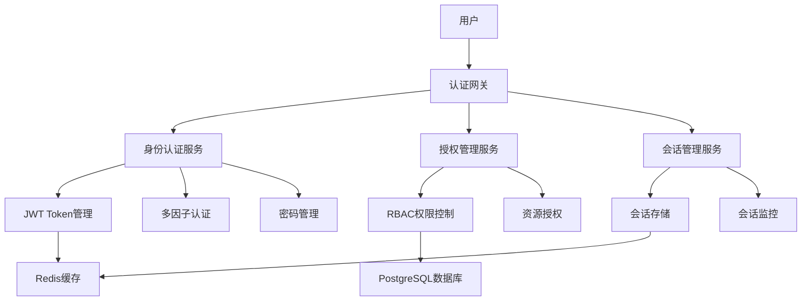

# 企业级认证系统功能需求与非功能需求规格说明书 (SRS)

## 📋 文档信息

**项目名称**: Claude Enhancer 企业级认证系统
**文档版本**: v1.0
**创建日期**: 2024-09-22
**文档类型**: 软件需求规格说明书 (SRS)
**状态**: 草案

## 目录

- [1. 引言](#1-引言)
- [2. 总体描述](#2-总体描述)
- [3. 功能需求](#3-功能需求)
- [4. 非功能需求](#4-非功能需求)
- [5. 用户故事](#5-用户故事)
- [6. 接受准则](#6-接受准则)
- [7. 约束条件](#7-约束条件)
- [8. 假设与依赖](#8-假设与依赖)
- [9. 需求追踪矩阵](#9-需求追踪矩阵)

---

## 1. 引言

### 1.1 目的

本文档详细描述了Claude Enhancer企业级认证系统的功能需求和非功能需求。该系统旨在为企业提供安全、可靠、可扩展的身份认证和授权解决方案。

### 1.2 范围

该认证系统包括以下核心模块：
- JWT token管理系统
- 多因子认证(MFA/2FA)服务
- 基于角色的权限控制(RBAC)
- 会话管理系统
- 密码策略与重置流程
- OAuth2集成支持
- 防暴力破解机制
- 审计日志系统

### 1.3 定义与缩略语

| 术语 | 定义 |
|------|------|
| JWT | JSON Web Token，一种开放标准的令牌格式 |
| MFA | Multi-Factor Authentication，多因子认证 |
| 2FA | Two-Factor Authentication，双因子认证 |
| RBAC | Role-Based Access Control，基于角色的访问控制 |
| ABAC | Attribute-Based Access Control，基于属性的访问控制 |
| OAuth2 | 开放授权标准 |
| SSO | Single Sign-On，单点登录 |
| TOTP | Time-based One-Time Password，基于时间的一次性密码 |

### 1.4 参考文档

- RFC 7519: JSON Web Token (JWT)
- RFC 6238: TOTP: Time-Based One-Time Password Algorithm
- RFC 6749: The OAuth 2.0 Authorization Framework
- NIST SP 800-63B: Authentication and Lifecycle Management
- OWASP Authentication Security Cheat Sheet

---

## 2. 总体描述

### 2.1 产品透视

Claude Enhancer认证系统是一个独立的微服务架构系统，为其他业务系统提供统一的身份认证和授权服务。

### 2.2 产品功能概览



### 2.3 用户类型

| 用户类型 | 描述 | 权限级别 |
|----------|------|----------|
| 超级管理员 | 系统最高权限用户 | 所有系统功能 |
| 系统管理员 | 系统配置和维护 | 系统配置、用户管理 |
| 用户管理员 | 负责用户账户管理 | 用户CRUD、角色分配 |
| 普通用户 | 系统的最终使用者 | 基础功能访问 |
| 只读用户 | 仅能查看信息的用户 | 只读权限 |

### 2.4 运行环境

- **服务器**: Linux (Ubuntu 20.04+)
- **容器**: Docker + Kubernetes
- **数据库**: PostgreSQL 15+
- **缓存**: Redis 7+
- **编程语言**: Python 3.9+ / Node.js 18+
- **框架**: FastAPI / Express.js

---

## 3. 功能需求

### 3.1 JWT Token管理系统

#### FR-JWT-001: Token生成与验证
**优先级**: 关键
**需求描述**: 系统必须能够生成和验证JWT access token和refresh token

**详细规格**:
- 生成符合RFC 7519标准的JWT token
- 使用RS256非对称加密算法
- Access token有效期：15分钟
- Refresh token有效期：7天
- 支持token即时撤销
- 实现token黑名单机制

**输入条件**:
- 用户ID
- 用户角色和权限信息
- 设备信息

**输出条件**:
- 包含用户身份和权限信息的JWT token
- Token过期时间
- Token唯一标识符(JTI)

**异常处理**:
- Token格式错误 → 返回400错误
- Token过期 → 返回401错误
- Token在黑名单 → 返回401错误

#### FR-JWT-002: 密钥轮换机制
**优先级**: 高
**需求描述**: 系统必须支持定期轮换JWT签名密钥

**详细规格**:
- 每24小时自动轮换密钥
- 支持手动紧急密钥轮换
- 保留旧密钥24小时以验证现有token
- 密钥存储在硬件安全模块(HSM)中

#### FR-JWT-003: Token刷新机制
**优先级**: 高
**需求描述**: 系统必须提供无缝的token刷新机制

**详细规格**:
- 使用refresh token获取新的access token
- 刷新时自动撤销旧token
- 支持refresh token的单次使用策略
- 刷新时验证设备指纹

### 3.2 多因子认证(MFA/2FA)系统

#### FR-MFA-001: TOTP认证支持
**优先级**: 高
**需求描述**: 系统必须支持基于时间的一次性密码认证

**详细规格**:
- 支持Google Authenticator、Authy等TOTP应用
- 密码有效期：30秒
- 容忍时间偏移：±30秒
- 生成QR码用于设备绑定
- 支持备用恢复码生成

**用户流程**:
1. 用户启用MFA功能
2. 系统生成共享密钥
3. 用户扫描QR码添加到认证器
4. 用户输入6位数字验证码确认
5. 系统生成10个备用恢复码

#### FR-MFA-002: SMS认证支持
**优先级**: 中
**需求描述**: 系统必须支持短信验证码认证

**详细规格**:
- 发送6位数字验证码
- 验证码有效期：5分钟
- 每日发送限制：20条/手机号
- 支持国际号码格式

#### FR-MFA-003: 邮箱认证支持
**优先级**: 中
**需求描述**: 系统必须支持邮箱验证码认证

**详细规格**:
- 发送6位数字验证码到注册邮箱
- 验证码有效期：10分钟
- 邮件模板可配置
- 支持HTML格式邮件

#### FR-MFA-004: 硬件Token支持
**优先级**: 低
**需求描述**: 系统应支持FIDO2/WebAuthn硬件令牌

**详细规格**:
- 支持USB安全密钥
- 支持生物识别认证
- 兼容YubiKey等主流设备

### 3.3 基于角色的权限控制(RBAC)

#### FR-RBAC-001: 角色管理
**优先级**: 关键
**需求描述**: 系统必须提供完整的角色管理功能

**详细规格**:
- 支持角色的创建、修改、删除
- 角色可以有层级关系
- 支持角色继承机制
- 系统预定义基础角色

**角色层级结构**:
```
超级管理员 (super_admin)
├── 系统管理员 (admin)
│   ├── 用户管理员 (user_manager)
│   └── 审计管理员 (audit_manager)
├── 业务管理员 (business_admin)
│   ├── 部门经理 (department_manager)
│   └── 项目经理 (project_manager)
└── 普通用户 (user)
    ├── 高级用户 (advanced_user)
    └── 只读用户 (readonly_user)
```

#### FR-RBAC-002: 权限管理
**优先级**: 关键
**需求描述**: 系统必须提供细粒度的权限控制

**详细规格**:
- 支持资源级权限控制
- 权限格式：资源:操作:范围
- 支持权限的增删改查
- 权限可以直接分配给用户

**权限示例**:
```
用户管理权限:
- user:read:own (查看自己的信息)
- user:read:all (查看所有用户信息)
- user:write:own (修改自己的信息)
- user:write:all (修改所有用户信息)
- user:delete:own (删除自己的账户)
- user:delete:all (删除任意用户账户)

待办事项权限:
- todo:read:own (查看自己的待办事项)
- todo:read:team (查看团队的待办事项)
- todo:write:own (创建/修改自己的待办事项)
- todo:delete:all (删除所有待办事项)
```

#### FR-RBAC-003: 用户角色分配
**优先级**: 高
**需求描述**: 系统必须支持用户角色的动态分配

**详细规格**:
- 一个用户可以有多个角色
- 支持角色的临时分配（设置过期时间）
- 角色变更立即生效
- 记录角色分配的审计日志

#### FR-RBAC-004: 权限验证
**优先级**: 关键
**需求描述**: 系统必须在每次资源访问时验证用户权限

**详细规格**:
- 实时权限验证，不依赖缓存
- 支持权限缓存以提高性能
- 权限验证失败返回403错误
- 记录权限验证的审计日志

### 3.4 会话管理系统

#### FR-SESSION-001: 会话创建与维护
**优先级**: 高
**需求描述**: 系统必须管理用户会话的完整生命周期

**详细规格**:
- 登录成功后创建用户会话
- 会话包含用户ID、IP地址、设备信息
- 会话超时时间：30分钟无活动
- 每个用户最多5个并发会话
- 支持会话的手动终止

#### FR-SESSION-002: 设备管理
**优先级**: 中
**需求描述**: 系统必须跟踪和管理用户的登录设备

**详细规格**:
- 记录设备指纹（浏览器、操作系统等）
- 支持设备信任机制
- 新设备登录时发送通知
- 支持远程设备注销

#### FR-SESSION-003: 异常会话检测
**优先级**: 高
**需求描述**: 系统必须检测和处理异常会话活动

**详细规格**:
- 检测IP地址频繁变化
- 检测异常地理位置登录
- 检测设备指纹不匹配
- 自动终止可疑会话

### 3.5 密码策略与重置流程

#### FR-PWD-001: 密码复杂度策略
**优先级**: 高
**需求描述**: 系统必须强制执行强密码策略

**详细规格**:
- 最小长度：12个字符
- 必须包含：大写字母、小写字母、数字、特殊字符
- 禁止常见密码
- 禁止连续重复字符
- 密码历史检查（不能重复使用最近5个密码）

#### FR-PWD-002: 密码加密存储
**优先级**: 关键
**需求描述**: 系统必须安全存储用户密码

**详细规格**:
- 使用bcrypt算法，工作因子12
- 每个密码使用唯一盐值
- 添加应用级胡椒(pepper)
- 支持密码哈希算法升级

#### FR-PWD-003: 密码重置流程
**优先级**: 高
**需求描述**: 系统必须提供安全的密码重置机制

**详细规格**:
- 通过邮箱发送重置链接
- 重置链接有效期：1小时
- 重置链接只能使用一次
- 重置后强制用户重新登录所有设备

**密码重置流程**:
1. 用户请求密码重置
2. 系统验证邮箱地址
3. 生成唯一重置令牌
4. 发送重置邮件
5. 用户点击链接设置新密码
6. 系统验证令牌并更新密码
7. 注销所有现有会话

### 3.6 OAuth2集成支持

#### FR-OAUTH-001: 标准OAuth2流程
**优先级**: 中
**需求描述**: 系统必须支持标准OAuth2授权流程

**详细规格**:
- 支持Authorization Code流程
- 支持Client Credentials流程
- 支持Refresh Token流程
- 符合RFC 6749标准

#### FR-OAUTH-002: 第三方身份提供商集成
**优先级**: 中
**需求描述**: 系统必须支持主流第三方身份提供商

**详细规格**:
- 支持Google OAuth2
- 支持Microsoft Azure AD
- 支持GitHub OAuth2
- 支持企业LDAP/AD集成

#### FR-OAUTH-003: 授权范围管理
**优先级**: 中
**需求描述**: 系统必须管理OAuth2授权范围

**详细规格**:
- 预定义标准授权范围
- 支持自定义授权范围
- 授权范围映射到系统权限
- 用户可以选择授权范围

### 3.7 防暴力破解机制

#### FR-BRUTE-001: 登录频率限制
**优先级**: 高
**需求描述**: 系统必须防止暴力破解攻击

**详细规格**:
- IP级别限制：每分钟最多5次登录尝试
- 用户级别限制：每小时最多10次失败尝试
- 失败次数达到阈值后增加延迟
- 支持验证码挑战

**频率限制策略**:
```
第1-3次失败: 无延迟
第4-5次失败: 延迟5秒
第6-7次失败: 延迟30秒
第8-10次失败: 延迟2分钟
超过10次: 锁定账户1小时
```

#### FR-BRUTE-002: CAPTCHA验证
**优先级**: 中
**需求描述**: 系统必须在检测到异常活动时要求CAPTCHA验证

**详细规格**:
- 连续3次登录失败后显示CAPTCHA
- 支持图形验证码和reCAPTCHA
- CAPTCHA失败增加额外延迟
- 成功验证后重置失败计数

#### FR-BRUTE-003: IP黑名单机制
**优先级**: 中
**需求描述**: 系统必须维护动态IP黑名单

**详细规格**:
- 自动检测恶意IP地址
- 支持手动添加IP到黑名单
- 黑名单IP自动解锁时间：24小时
- 支持白名单IP绕过限制

### 3.8 审计日志系统

#### FR-AUDIT-001: 用户行为审计
**优先级**: 高
**需求描述**: 系统必须记录所有用户的关键行为

**详细规格**:
- 记录登录/登出事件
- 记录权限变更事件
- 记录密码修改事件
- 记录管理员操作事件

**审计日志格式**:
```json
{
  "event_id": "evt_12345678",
  "timestamp": "2024-09-22T10:30:00Z",
  "event_type": "user_login",
  "user_id": "user_12345",
  "ip_address": "192.168.1.100",
  "user_agent": "Mozilla/5.0...",
  "result": "success",
  "details": {
    "login_method": "password",
    "mfa_used": true,
    "device_trusted": false
  }
}
```

#### FR-AUDIT-002: 系统事件审计
**优先级**: 高
**需求描述**: 系统必须记录所有安全相关的系统事件

**详细规格**:
- 记录配置变更
- 记录权限策略修改
- 记录系统启停事件
- 记录错误和异常事件

#### FR-AUDIT-003: 审计日志保护
**优先级**: 关键
**需求描述**: 系统必须保护审计日志的完整性

**详细规格**:
- 审计日志加密存储
- 日志文件数字签名
- 支持日志完整性验证
- 日志保留期：7年

#### FR-AUDIT-004: 审计报告生成
**优先级**: 中
**需求描述**: 系统必须能够生成各种审计报告

**详细规格**:
- 用户活动报告
- 安全事件报告
- 权限变更报告
- 合规性检查报告

---

## 4. 非功能需求

### 4.1 性能需求

#### NFR-PERF-001: 响应时间
**需求描述**: 系统必须在指定时间内响应用户请求

**性能指标**:
- 用户登录响应时间：< 500ms (95%的请求)
- Token验证响应时间：< 100ms (99%的请求)
- 权限检查响应时间：< 50ms (99%的请求)
- MFA验证响应时间：< 200ms (95%的请求)

#### NFR-PERF-002: 并发性能
**需求描述**: 系统必须支持大量并发用户

**性能指标**:
- 并发登录用户：10,000
- 每秒登录请求：1,000 TPS
- 每秒权限检查：10,000 TPS
- 系统峰值负载：50,000并发请求

#### NFR-PERF-003: 吞吐量
**需求描述**: 系统必须处理高吞吐量的认证请求

**性能指标**:
- Token生成速率：5,000 tokens/秒
- Token验证速率：20,000 validations/秒
- 审计日志写入速率：10,000 logs/秒

### 4.2 可用性需求

#### NFR-AVAIL-001: 系统可用性
**需求描述**: 系统必须保持高可用性

**可用性指标**:
- 系统可用性：99.9% (每月停机时间 < 43分钟)
- 计划维护窗口：每月4小时
- 故障恢复时间：< 15分钟 (RTO)
- 数据丢失容忍：< 1分钟 (RPO)

#### NFR-AVAIL-002: 容错性
**需求描述**: 系统必须具备容错能力

**容错要求**:
- 单点故障自动恢复
- 数据库主从切换 < 30秒
- 缓存故障不影响核心功能
- 负载均衡器冗余部署

### 4.3 可扩展性需求

#### NFR-SCALE-001: 水平扩展
**需求描述**: 系统必须支持水平扩展

**扩展要求**:
- 支持微服务架构
- 无状态服务设计
- 数据库分片支持
- 缓存集群支持

#### NFR-SCALE-002: 用户增长
**需求描述**: 系统必须支持用户规模增长

**增长支持**:
- 支持100万注册用户
- 支持10万日活跃用户
- 支持1万并发在线用户
- 数据存储支持TB级别

### 4.4 安全性需求

#### NFR-SEC-001: 数据加密
**需求描述**: 系统必须保护敏感数据安全

**加密要求**:
- 传输加密：TLS 1.3
- 存储加密：AES-256
- 密钥管理：硬件安全模块(HSM)
- 密码哈希：bcrypt (工作因子 ≥ 12)

#### NFR-SEC-002: 访问控制
**需求描述**: 系统必须实施严格的访问控制

**访问控制要求**:
- 最小权限原则
- 职责分离原则
- 定期权限审查
- 访问日志记录

#### NFR-SEC-003: 安全审计
**需求描述**: 系统必须满足安全审计要求

**审计要求**:
- 完整的审计跟踪
- 审计日志不可篡改
- 审计日志加密存储
- 符合SOX、PCI DSS标准

### 4.5 可维护性需求

#### NFR-MAINT-001: 代码质量
**需求描述**: 系统代码必须易于维护

**质量要求**:
- 代码覆盖率 ≥ 90%
- 代码复杂度 ≤ 10
- 遵循编码规范
- API文档完整

#### NFR-MAINT-002: 监控告警
**需求描述**: 系统必须支持全面监控

**监控要求**:
- 实时性能监控
- 错误率监控
- 资源使用监控
- 自动告警机制

### 4.6 兼容性需求

#### NFR-COMPAT-001: 浏览器兼容性
**需求描述**: 系统必须支持主流浏览器

**兼容性要求**:
- Chrome 90+
- Firefox 88+
- Safari 14+
- Edge 90+

#### NFR-COMPAT-002: 移动设备兼容性
**需求描述**: 系统必须支持移动设备

**移动设备要求**:
- iOS 14+
- Android 10+
- 响应式设计
- 移动App集成

### 4.7 法规遵循需求

#### NFR-COMP-001: 数据保护法规
**需求描述**: 系统必须遵循数据保护法规

**法规要求**:
- GDPR合规 (欧盟)
- CCPA合规 (加州)
- 个人信息保护法合规 (中国)
- 数据跨境传输合规

#### NFR-COMP-002: 行业标准
**需求描述**: 系统必须符合行业安全标准

**标准要求**:
- ISO 27001信息安全管理
- SOC 2 Type II合规
- PCI DSS合规 (如涉及支付)
- NIST网络安全框架

---

## 5. 用户故事

### 5.1 用户认证相关故事

#### US-AUTH-001: 用户注册
**作为** 新用户
**我希望** 能够创建账户
**以便** 访问系统功能

**接受准则**:
```gherkin
Given 我是新用户
When 我填写注册表单（邮箱、密码、基本信息）
Then 系统应该创建我的账户
And 发送邮箱验证链接
And 显示"请查收验证邮件"消息

Given 我使用已存在的邮箱注册
When 我提交注册表单
Then 系统应该显示"邮箱已被注册"错误
And 不创建重复账户

Given 我的密码不符合安全策略
When 我提交注册表单
Then 系统应该显示密码强度要求
And 不创建账户
```

#### US-AUTH-002: 用户登录
**作为** 注册用户
**我希望** 能够登录系统
**以便** 访问我的个人功能

**接受准则**:
```gherkin
Given 我有有效的账户
When 我输入正确的邮箱和密码
Then 系统应该让我登录成功
And 生成访问令牌
And 重定向到主页面

Given 我启用了MFA
When 我输入正确的密码
Then 系统应该要求我输入MFA验证码
And 在验证成功后完成登录

Given 我连续输入错误密码5次
When 我再次尝试登录
Then 系统应该临时锁定我的账户
And 显示锁定时间
```

#### US-AUTH-003: 多因子认证设置
**作为** 安全意识强的用户
**我希望** 能够启用多因子认证
**以便** 提高账户安全性

**接受准则**:
```gherkin
Given 我已登录系统
When 我选择启用TOTP认证
Then 系统应该显示QR码
And 提供共享密钥
And 要求我输入验证码确认

Given 我成功设置TOTP
When 系统生成恢复码
Then 我应该能下载或打印恢复码
And 系统应该提醒我安全保存

Given 我丢失了认证器设备
When 我使用恢复码登录
Then 系统应该接受恢复码
And 提示我重新设置MFA
```

### 5.2 权限管理相关故事

#### US-RBAC-001: 管理员分配角色
**作为** 系统管理员
**我希望** 能够为用户分配角色
**以便** 控制用户的访问权限

**接受准则**:
```gherkin
Given 我是系统管理员
When 我为用户分配"用户管理员"角色
Then 用户应该获得相应权限
And 系统应该记录权限变更日志
And 用户下次登录时权限生效

Given 我设置角色过期时间
When 角色到期时间到达
Then 系统应该自动撤销角色
And 通知用户角色已过期
```

#### US-RBAC-002: 用户查看权限
**作为** 普通用户
**我希望** 能够查看我的权限
**以便** 了解我能访问哪些功能

**接受准则**:
```gherkin
Given 我已登录系统
When 我访问"我的权限"页面
Then 系统应该显示我的所有角色
And 显示每个角色包含的权限
And 显示权限的有效期（如果有）
```

### 5.3 会话管理相关故事

#### US-SESSION-001: 查看活动会话
**作为** 用户
**我希望** 能够查看我的所有活动会话
**以便** 监控账户安全

**接受准则**:
```gherkin
Given 我已登录系统
When 我访问"会话管理"页面
Then 系统应该显示我的所有活动会话
And 显示每个会话的设备信息
And 显示每个会话的登录时间和位置
And 允许我终止任何会话
```

#### US-SESSION-002: 异常会话通知
**作为** 用户
**我希望** 在检测到异常登录时收到通知
**以便** 及时发现账户异常

**接受准则**:
```gherkin
Given 我的账户在新设备上登录
When 系统检测到新设备登录
Then 我应该收到邮件通知
And 通知包含登录时间、地点、设备信息
And 提供快速锁定账户的链接

Given 系统检测到可疑活动
When 可疑活动触发安全策略
Then 系统应该自动终止可疑会话
And 发送安全警告通知
```

### 5.4 密码管理相关故事

#### US-PWD-001: 修改密码
**作为** 用户
**我希望** 能够修改我的密码
**以便** 维护账户安全

**接受准则**:
```gherkin
Given 我已登录系统
When 我访问密码修改页面
And 输入当前密码和新密码
Then 系统应该验证当前密码
And 检查新密码符合安全策略
And 更新密码并注销其他会话

Given 我的新密码与最近5个密码相同
When 我尝试更新密码
Then 系统应该拒绝更新
And 提示我选择不同的密码
```

#### US-PWD-002: 重置忘记的密码
**作为** 忘记密码的用户
**我希望** 能够重置我的密码
**以便** 重新访问我的账户

**接受准则**:
```gherkin
Given 我忘记了密码
When 我在登录页面点击"忘记密码"
And 输入我的邮箱地址
Then 系统应该发送重置链接到我的邮箱
And 重置链接应该在1小时内有效

Given 我点击了重置链接
When 我设置新密码
Then 系统应该更新我的密码
And 注销所有现有会话
And 要求我重新登录
```

---

## 6. 接受准则

### 6.1 功能接受准则

#### AC-FUNC-001: JWT Token管理
- [ ] Token生成时间 < 50ms
- [ ] Token验证时间 < 10ms
- [ ] 支持token即时撤销
- [ ] 密钥轮换无服务中断
- [ ] Refresh token流程工作正常

#### AC-FUNC-002: 多因子认证
- [ ] TOTP验证成功率 > 99%
- [ ] SMS验证码5分钟内送达
- [ ] 邮箱验证码10分钟内送达
- [ ] 恢复码正确生成和验证
- [ ] MFA绕过机制安全可控

#### AC-FUNC-003: 权限控制
- [ ] 权限检查响应时间 < 50ms
- [ ] 权限变更实时生效
- [ ] RBAC规则正确执行
- [ ] 权限继承逻辑正确
- [ ] 权限审计日志完整

#### AC-FUNC-004: 会话管理
- [ ] 会话创建成功率 > 99.9%
- [ ] 异常会话检测准确率 > 95%
- [ ] 会话超时机制正常工作
- [ ] 并发会话限制正确执行
- [ ] 设备管理功能完整

#### AC-FUNC-005: 防暴力破解
- [ ] 频率限制正确执行
- [ ] CAPTCHA挑战及时触发
- [ ] IP黑名单机制有效
- [ ] 账户锁定策略正确
- [ ] 恶意行为检测灵敏

### 6.2 性能接受准则

#### AC-PERF-001: 响应时间
- [ ] 95%的登录请求 < 500ms
- [ ] 99%的token验证 < 100ms
- [ ] 99%的权限检查 < 50ms
- [ ] 95%的MFA验证 < 200ms

#### AC-PERF-002: 吞吐量
- [ ] 支持1,000 TPS登录请求
- [ ] 支持10,000 TPS权限检查
- [ ] 支持5,000个token/秒生成
- [ ] 支持20,000个token/秒验证

#### AC-PERF-003: 并发性
- [ ] 支持10,000并发用户
- [ ] 支持50,000并发请求
- [ ] 系统负载均匀分布
- [ ] 无内存泄漏问题

### 6.3 安全接受准则

#### AC-SEC-001: 数据保护
- [ ] 所有敏感数据加密存储
- [ ] 传输数据使用TLS 1.3
- [ ] 密码哈希使用bcrypt
- [ ] 会话令牌安全生成

#### AC-SEC-002: 访问控制
- [ ] 最小权限原则执行
- [ ] 未授权访问被拒绝
- [ ] 权限提升被阻止
- [ ] 审计日志不可篡改

#### AC-SEC-003: 安全测试
- [ ] 通过渗透测试
- [ ] 无SQL注入漏洞
- [ ] 无XSS攻击漏洞
- [ ] 无CSRF攻击漏洞

### 6.4 可用性接受准则

#### AC-AVAIL-001: 系统可用性
- [ ] 99.9%的系统可用性
- [ ] RTO < 15分钟
- [ ] RPO < 1分钟
- [ ] 故障自动恢复

#### AC-AVAIL-002: 容错性
- [ ] 单点故障不影响服务
- [ ] 数据库故障切换 < 30秒
- [ ] 负载均衡器冗余
- [ ] 缓存故障优雅降级

---

## 7. 约束条件

### 7.1 技术约束

#### TC-001: 开发平台
- 服务端必须使用Python 3.9+或Node.js 18+
- 数据库必须使用PostgreSQL 15+
- 缓存必须使用Redis 7+
- 容器化必须使用Docker

#### TC-002: 安全标准
- 必须遵循OWASP安全指南
- 必须使用TLS 1.3进行数据传输
- 必须使用强加密算法（AES-256）
- JWT必须使用RS256签名算法

#### TC-003: 性能约束
- 单个API响应时间不得超过5秒
- 数据库查询时间不得超过1秒
- 缓存命中率必须 > 95%
- 内存使用率不得超过80%

### 7.2 业务约束

#### BC-001: 法规遵循
- 必须符合GDPR数据保护要求
- 必须符合SOX审计要求
- 必须满足等级保护三级要求
- 审计日志保留期不少于7年

#### BC-002: 用户体验
- 登录流程不得超过3个步骤
- MFA设置必须有详细指导
- 错误消息必须用户友好
- 支持多语言界面

### 7.3 运营约束

#### OC-001: 部署环境
- 生产环境必须使用Kubernetes
- 必须支持蓝绿部署
- 必须支持自动备份
- 必须有完整监控体系

#### OC-002: 维护窗口
- 计划维护窗口：每月第一个周日凌晨2-6点
- 紧急维护必须在30分钟内开始
- 维护期间必须有回滚方案
- 用户必须提前24小时收到通知

---

## 8. 假设与依赖

### 8.1 假设条件

#### AS-001: 基础设施假设
- Kubernetes集群稳定可用
- 网络连接可靠
- DNS服务正常工作
- 时间同步服务可用

#### AS-002: 第三方服务假设
- 邮件服务商服务稳定
- SMS服务商覆盖率充足
- 第三方OAuth提供商可用
- 证书颁发机构可信

#### AS-003: 用户行为假设
- 用户会妥善保管登录凭证
- 用户会及时更新联系方式
- 用户具备基本的安全意识
- 用户设备时间准确

### 8.2 外部依赖

#### ED-001: 硬件依赖
- 服务器硬件性能满足要求
- 网络带宽充足
- 存储容量充足
- 硬件安全模块(HSM)可用

#### ED-002: 软件依赖
- 操作系统安全更新及时
- 数据库软件版本兼容
- 缓存服务稳定运行
- 容器运行时正常

#### ED-003: 服务依赖
- 负载均衡器服务
- 监控告警服务
- 日志聚合服务
- 备份恢复服务

---

## 9. 需求追踪矩阵

### 9.1 功能需求追踪

| 需求ID | 需求名称 | 优先级 | 用户故事 | 测试用例 | 实现状态 |
|--------|----------|--------|----------|----------|----------|
| FR-JWT-001 | Token生成与验证 | 关键 | US-AUTH-002 | TC-JWT-001 | 待开发 |
| FR-JWT-002 | 密钥轮换机制 | 高 | - | TC-JWT-002 | 待开发 |
| FR-JWT-003 | Token刷新机制 | 高 | US-AUTH-002 | TC-JWT-003 | 待开发 |
| FR-MFA-001 | TOTP认证支持 | 高 | US-AUTH-003 | TC-MFA-001 | 待开发 |
| FR-MFA-002 | SMS认证支持 | 中 | US-AUTH-003 | TC-MFA-002 | 待开发 |
| FR-RBAC-001 | 角色管理 | 关键 | US-RBAC-001 | TC-RBAC-001 | 待开发 |
| FR-RBAC-002 | 权限管理 | 关键 | US-RBAC-001 | TC-RBAC-002 | 待开发 |
| FR-SESSION-001 | 会话创建与维护 | 高 | US-SESSION-001 | TC-SESSION-001 | 待开发 |
| FR-PWD-001 | 密码复杂度策略 | 高 | US-PWD-001 | TC-PWD-001 | 待开发 |
| FR-AUDIT-001 | 用户行为审计 | 高 | - | TC-AUDIT-001 | 待开发 |

### 9.2 非功能需求追踪

| 需求ID | 需求名称 | 指标 | 测试方法 | 验证状态 |
|--------|----------|------|----------|----------|
| NFR-PERF-001 | 响应时间 | <500ms登录 | 性能测试 | 待验证 |
| NFR-PERF-002 | 并发性能 | 10,000并发 | 负载测试 | 待验证 |
| NFR-AVAIL-001 | 系统可用性 | 99.9%可用性 | 可用性监控 | 待验证 |
| NFR-SEC-001 | 数据加密 | TLS 1.3 | 安全审计 | 待验证 |
| NFR-SCALE-001 | 水平扩展 | 微服务架构 | 扩展测试 | 待验证 |

### 9.3 测试覆盖矩阵

| 功能模块 | 单元测试 | 集成测试 | 系统测试 | 安全测试 | 性能测试 |
|----------|----------|----------|----------|----------|----------|
| JWT管理 | ✅ | ✅ | ✅ | ✅ | ✅ |
| MFA认证 | ✅ | ✅ | ✅ | ✅ | ✅ |
| RBAC权限 | ✅ | ✅ | ✅ | ✅ | ✅ |
| 会话管理 | ✅ | ✅ | ✅ | ✅ | ✅ |
| 密码管理 | ✅ | ✅ | ✅ | ✅ | - |
| OAuth2集成 | ✅ | ✅ | ✅ | ✅ | ✅ |
| 防暴力破解 | ✅ | ✅ | ✅ | ✅ | ✅ |
| 审计日志 | ✅ | ✅ | ✅ | ✅ | ✅ |

---

## 10. 附录

### 10.1 术语表

| 术语 | 英文 | 定义 |
|------|------|------|
| 认证 | Authentication | 验证用户身份的过程 |
| 授权 | Authorization | 确定用户权限的过程 |
| 令牌 | Token | 表示认证状态的凭证 |
| 会话 | Session | 用户登录后的活动期间 |
| 多因子认证 | Multi-Factor Authentication | 需要多种验证方式的认证 |
| 基于角色的访问控制 | Role-Based Access Control | 根据用户角色控制访问 |
| 单点登录 | Single Sign-On | 一次登录访问多个系统 |
| 暴力破解 | Brute Force Attack | 通过穷举法破解密码的攻击 |

### 10.2 参考标准

- **RFC 7519**: JSON Web Token (JWT)
- **RFC 6238**: TOTP: Time-Based One-Time Password Algorithm
- **RFC 6749**: The OAuth 2.0 Authorization Framework
- **RFC 7636**: Proof Key for Code Exchange by OAuth Public Clients
- **NIST SP 800-63B**: Authentication and Lifecycle Management
- **OWASP ASVS**: Application Security Verification Standard
- **ISO 27001**: Information Security Management Systems
- **SOC 2**: Service Organization Control 2

### 10.3 版本历史

| 版本 | 日期 | 修改内容 | 作者 |
|------|------|----------|------|
| v1.0 | 2024-09-22 | 初始版本，包含完整的功能和非功能需求 | 需求分析师 |

---

**文档状态**: 草案
**审核状态**: 待审核
**批准状态**: 待批准

---

*本文档包含机密信息，仅供Claude Enhancer项目团队内部使用。*