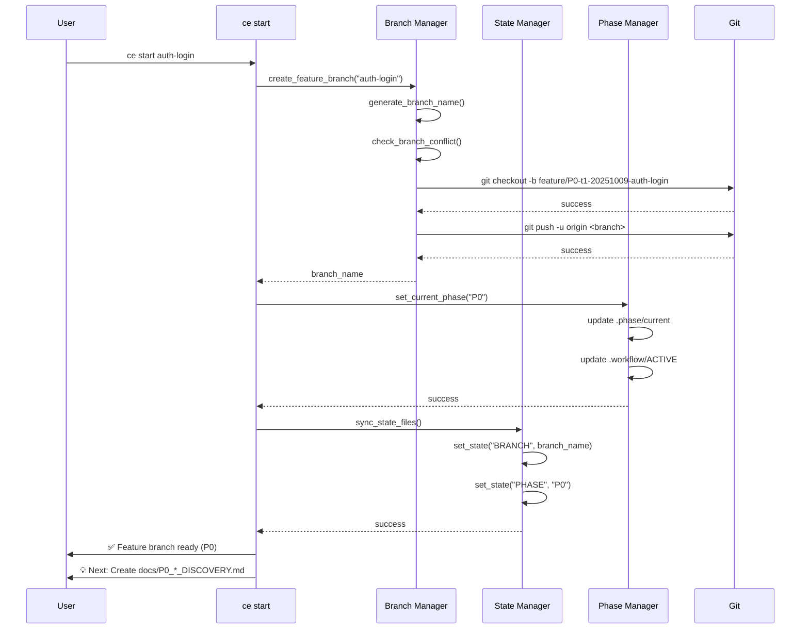
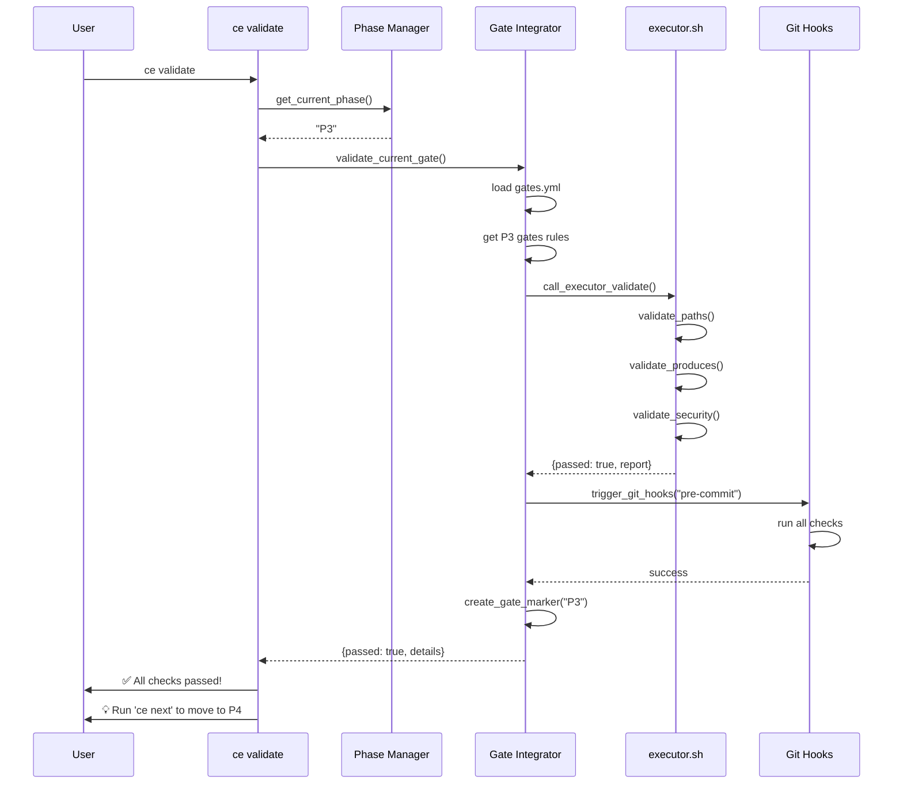
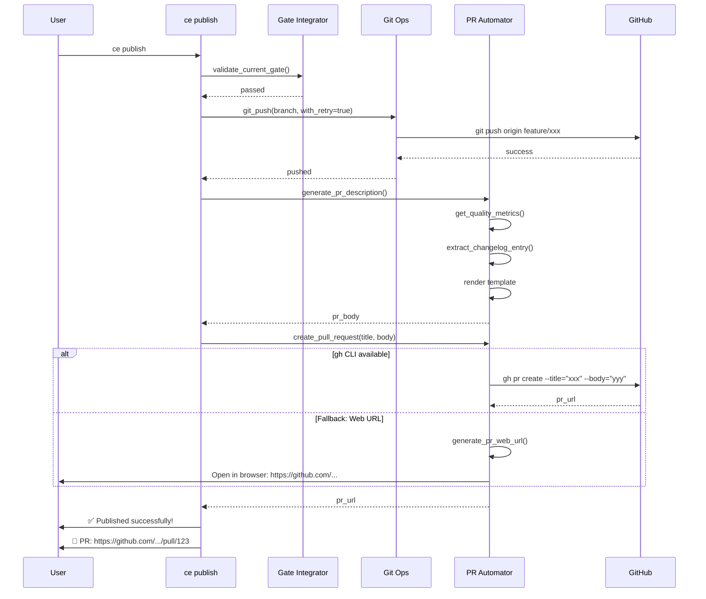

# ce 命令架构设计与模块划分

**项目**: Claude Enhancer 5.0
**阶段**: P1 - Plan (规划)
**文档类型**: 架构设计
**日期**: 2025-10-09
**版本**: 1.0

---

## 目录

1. [执行摘要](#执行摘要)
2. [架构设计原则](#架构设计原则)
3. [整体架构](#整体架构)
4. [模块划分](#模块划分)
5. [文件结构](#文件结构)
6. [核心模块详细设计](#核心模块详细设计)
7. [数据流设计](#数据流设计)
8. [与现有系统的集成点](#与现有系统的集成点)
9. [状态管理策略](#状态管理策略)
10. [错误处理与恢复](#错误处理与恢复)
11. [性能优化策略](#性能优化策略)
12. [安全性设计](#安全性设计)
13. [测试策略](#测试策略)
14. [部署与安装](#部署与安装)

---

## 执行摘要

本文档定义了 `ce` 命令行工具的完整架构设计，该工具是 Claude Enhancer 5.0 的用户界面层，旨在简化和自动化 8-Phase 工作流（P0-P7）的操作。

### 设计目标

1. **简洁易用** - 常用操作 1-2 个词完成
2. **渐进式复杂度** - 从简单到高级的学习曲线
3. **高度集成** - 无缝对接现有 executor.sh 和 gates.yml
4. **状态隔离** - 支持多终端并行开发
5. **容错可靠** - 完善的错误处理和恢复机制

### 核心命令

| 命令 | 功能 | 复杂度 |
|-----|------|--------|
| `ce start <feature>` | 创建分支并初始化 P0 | 简单 |
| `ce status` | 查看当前状态 | 简单 |
| `ce validate` | 验证当前阶段 | 中等 |
| `ce next` | 进入下一阶段 | 中等 |
| `ce publish` | 发布（验证+推送+PR） | 复杂 |
| `ce merge <branch>` | 合并到目标分支 | 复杂 |
| `ce clean` | 清理已合并分支 | 简单 |

---

## 架构设计原则

### 1. 单一职责原则（SRP）

每个模块只负责一个明确的功能域：

```
Command Router     → 只负责命令分发
Branch Manager     → 只负责分支操作
State Manager      → 只负责状态管理
Phase Manager      → 只负责阶段逻辑
Gate Integrator    → 只负责质量闸门集成
```

### 2. 依赖倒置原则（DIP）

高层模块不依赖低层实现，通过接口抽象：

```bash
# 接口定义
interface GitOps {
    create_branch(name)
    push_to_remote()
    create_pr(title, body)
}

# 实现可替换
GitOps_GitHub    # 使用 gh CLI
GitOps_Web       # 使用 Web URL 生成
GitOps_GitLab    # 支持 GitLab（未来）
```

### 3. 开闭原则（OCP）

对扩展开放，对修改封闭：

```bash
# 插件化命令注册
register_command "start" "commands/start.sh"
register_command "status" "commands/status.sh"

# 新增命令无需修改主控制器
register_command "export" "commands/export.sh"  # 未来扩展
```

### 4. 里氏替换原则（LSP）

子模块可替换父模块而不破坏系统：

```bash
# 状态存储抽象
StateStore::read(key)
StateStore::write(key, value)

# 可替换实现
FileStateStore       # 基于文件（默认）
RedisStateStore      # 基于 Redis（未来）
SQLiteStateStore     # 基于 SQLite（未来）
```

### 5. 最小惊讶原则（POLA）

命令行为符合用户直觉：

```bash
ce start feature  →  创建分支（类似 git checkout -b）
ce status        →  显示状态（类似 git status）
ce clean         →  清理分支（类似 git branch -d）
```

---

## 整体架构

### 架构分层图

```
┌───────────────────────────────────────────────────────────────┐
│                      User Interface Layer                      │
│                         (ce CLI)                               │
└─────────────────────────────┬─────────────────────────────────┘
                              │
┌─────────────────────────────┴─────────────────────────────────┐
│                    Command Router Layer                        │
│  ┌──────────┐  ┌──────────┐  ┌──────────┐  ┌──────────┐     │
│  │  start   │  │  status  │  │ validate │  │   next   │     │
│  └────┬─────┘  └────┬─────┘  └────┬─────┘  └────┬─────┘     │
└───────┼─────────────┼─────────────┼─────────────┼────────────┘
        │             │             │             │
┌───────┴─────────────┴─────────────┴─────────────┴────────────┐
│                     Business Logic Layer                       │
│  ┌──────────────┐  ┌──────────────┐  ┌──────────────┐       │
│  │   Branch     │  │    State     │  │    Phase     │       │
│  │   Manager    │  │   Manager    │  │   Manager    │       │
│  └──────────────┘  └──────────────┘  └──────────────┘       │
│  ┌──────────────┐  ┌──────────────┐  ┌──────────────┐       │
│  │     Gate     │  │      PR      │  │     Git      │       │
│  │  Integrator  │  │  Automator   │  │  Operations  │       │
│  └──────────────┘  └──────────────┘  └──────────────┘       │
└─────────────────────────────┬─────────────────────────────────┘
                              │
┌─────────────────────────────┴─────────────────────────────────┐
│                 Infrastructure Layer                           │
│  ┌──────────────┐  ┌──────────────┐  ┌──────────────┐       │
│  │   executor   │  │    gates     │  │    config    │       │
│  │     .sh      │  │     .yml     │  │     .yml     │       │
│  └──────────────┘  └──────────────┘  └──────────────┘       │
│  ┌──────────────┐  ┌──────────────┐  ┌──────────────┐       │
│  │  Git Hooks   │  │Claude Hooks  │  │     Git      │       │
│  │ (pre-commit) │  │ (helpers)    │  │   (remote)   │       │
│  └──────────────┘  └──────────────┘  └──────────────┘       │
└───────────────────────────────────────────────────────────────┘
```

### 架构特点

1. **分层清晰** - UI → Router → Business Logic → Infrastructure
2. **松耦合** - 模块间通过接口通信
3. **可测试** - 每层可独立测试
4. **可扩展** - 新命令、新模块易于添加

---

## 模块划分

### 1. Command Router（命令路由器）

**职责**：
- 解析命令行参数
- 验证参数格式
- 分发到具体命令处理器
- 处理全局选项（--verbose, --json, --dry-run）

**接口**：
```bash
# 主入口
main(args[])

# 命令注册
register_command(name, handler)

# 参数解析
parse_args(args[])
validate_args(command, args[])

# 分发
dispatch(command, args[])
```

### 2. Branch Manager（分支管理器）

**职责**：
- 创建 feature 分支（带命名规范）
- 分支命名冲突检测
- 多终端分支隔离
- 分支清理和删除

**接口**：
```bash
# 分支创建
create_feature_branch(description, terminal_id, phase)
  → Returns: branch_name

# 分支命名
generate_branch_name(description, terminal_id, timestamp, phase)
  → Returns: "feature/P3-t1-20251009-auth-login"

# 冲突检测
check_branch_conflict(branch_name)
  → Returns: true/false

# 分支清理
cleanup_merged_branches(target_branch, keep_days)
  → Returns: deleted_count
```

### 3. State Manager（状态管理器）

**职责**：
- 管理多终端状态隔离
- 读写状态文件
- 状态同步和验证
- 状态快照和恢复

**接口**：
```bash
# 状态读写
get_state(key)
  → Returns: value

set_state(key, value)
  → Returns: success/failure

# 会话管理
create_session(terminal_id)
  → Returns: session_id

get_current_session()
  → Returns: session_info

# 状态同步
sync_state_files()  # .phase/current ↔ .workflow/ACTIVE

# 状态快照
create_snapshot(tag)
restore_snapshot(tag)
```

### 4. Phase Manager（阶段管理器）

**职责**：
- Phase 状态转换
- Phase 信息查询
- Phase 验证逻辑
- Phase 进度跟踪

**接口**：
```bash
# Phase 读取
get_current_phase()
  → Returns: "P3"

get_phase_info(phase)
  → Returns: {name, allow_paths, must_produce, gates}

# Phase 切换
set_current_phase(phase)
  → Side effect: 更新 .phase/current 和 .workflow/ACTIVE

transition_to_next_phase()
  → Returns: new_phase

# Phase 验证
validate_phase_requirements(phase)
  → Returns: {passed, failed_checks[]}

# 进度查询
get_phase_progress()
  → Returns: {completed[], current, remaining[]}
```

### 5. Gate Integrator（质量闸门集成器）

**职责**：
- 与 gates.yml 集成
- 调用 executor.sh validate
- 运行 Git hooks
- 生成验证报告

**接口**：
```bash
# 闸门验证
validate_current_gate()
  → Returns: {passed, report}

run_gate_checks(phase)
  → Returns: {check_results[]}

# 闸门创建
create_gate_marker(phase)
  → Side effect: 创建 .gates/0X.ok

# 闸门查询
get_gate_status(phase)
  → Returns: {exists, signed, timestamp}

# 集成调用
call_executor_validate()
  → Returns: executor.sh 返回值

trigger_git_hooks(hook_type)
  → Returns: hook 执行结果
```

### 6. PR Automator（PR 自动化器）

**职责**：
- 生成 PR 描述
- 创建 PR（gh CLI 或 Web URL）
- PR 状态查询
- PR 模板应用

**接口**：
```bash
# PR 描述生成
generate_pr_description(phase)
  → Returns: markdown_content

get_quality_metrics()
  → Returns: {score, coverage, gates_passed}

extract_changelog_entry()
  → Returns: changelog_lines[]

# PR 创建
create_pull_request(title, body, options)
  → Returns: pr_url

generate_pr_web_url(branch)
  → Returns: github_compare_url

# PR 查询（需要 gh CLI）
get_pr_status(pr_number)
  → Returns: {state, checks[], reviews[]}
```

### 7. Git Operations（Git 操作封装）

**职责**：
- 封装常用 Git 命令
- 错误处理和重试
- 网络故障恢复
- 权限检查

**接口**：
```bash
# 分支操作
git_checkout(branch)
git_create_branch(name)
git_delete_branch(name, force)

# 远程操作
git_push(branch, force, with_retry)
git_pull(branch, rebase)
git_fetch(prune)

# 合并操作
git_merge(source, target, strategy)
  → strategy: squash/rebase/merge

# 状态查询
git_get_current_branch()
git_has_uncommitted_changes()
git_get_unpushed_commits()

# 权限检查
check_github_permissions()
  → Returns: {can_push, can_create_pr}
```

---

## 文件结构

### 完整目录树

```
/home/xx/dev/Claude Enhancer 5.0/
├── ce                           # 主入口（符号链接到 .workflow/cli/ce.sh）
├── .workflow/
│   ├── cli/                     # ce 命令实现
│   │   ├── ce.sh                # 主控制器（Command Router）
│   │   ├── commands/            # 子命令实现
│   │   │   ├── start.sh         # ce start 实现
│   │   │   ├── status.sh        # ce status 实现
│   │   │   ├── validate.sh      # ce validate 实现
│   │   │   ├── next.sh          # ce next 实现
│   │   │   ├── publish.sh       # ce publish 实现
│   │   │   ├── merge.sh         # ce merge 实现
│   │   │   └── clean.sh         # ce clean 实现
│   │   ├── lib/                 # 共享库（核心模块）
│   │   │   ├── common.sh        # 公共函数（颜色、日志、工具）
│   │   │   ├── branch_manager.sh     # 分支管理器
│   │   │   ├── state_manager.sh      # 状态管理器
│   │   │   ├── phase_manager.sh      # 阶段管理器
│   │   │   ├── gate_integrator.sh    # 质量闸门集成器
│   │   │   ├── pr_automator.sh       # PR 自动化器
│   │   │   ├── git_ops.sh            # Git 操作封装
│   │   │   └── report_generator.sh   # 报告生成器
│   │   ├── templates/           # 模板文件
│   │   │   ├── pr_description.md.tmpl
│   │   │   ├── commit_message.txt.tmpl
│   │   │   └── status_report.txt.tmpl
│   │   ├── config/              # CLI 配置
│   │   │   └── defaults.yml     # 默认配置
│   │   └── tests/               # 单元测试
│   │       ├── test_branch_manager.sh
│   │       ├── test_state_manager.sh
│   │       └── test_phase_manager.sh
│   │
│   ├── state/                   # 状态存储（多终端隔离）
│   │   ├── sessions/            # 会话目录
│   │   │   ├── t1.state         # 终端 1 状态
│   │   │   ├── t2.state         # 终端 2 状态
│   │   │   └── t3.state         # 终端 3 状态
│   │   ├── global.state         # 全局状态（项目级别）
│   │   └── snapshots/           # 状态快照
│   │       └── snapshot_20251009_143022.json
│   │
│   ├── executor.sh              # 现有工作流引擎（被 ce 调用）
│   ├── gates.yml                # 质量闸门配置（被 ce 读取）
│   ├── config.yml               # 系统配置（被 ce 读取）
│   └── lib/
│       └── final_gate.sh        # 现有质量闸门（被 ce 调用）
│
├── .phase/
│   ├── current                  # 当前 Phase（被 ce 管理）
│   └── history/                 # Phase 切换历史
│       └── transitions.log      # P0→P1→P2...
│
├── .gates/                      # Gate 标记文件（被 ce 创建）
│   ├── 00.ok                    # P0 通过
│   ├── 01.ok                    # P1 通过
│   └── ...
│
└── .git/hooks/                  # Git Hooks（被 ce 触发）
    ├── pre-commit               # 提交前验证
    └── pre-push                 # 推送前验证
```

### 文件依赖关系

```
ce (main entry)
 ├─→ .workflow/cli/ce.sh (Command Router)
 │    ├─→ .workflow/cli/commands/*.sh (Command Handlers)
 │    │    ├─→ .workflow/cli/lib/branch_manager.sh
 │    │    ├─→ .workflow/cli/lib/state_manager.sh
 │    │    ├─→ .workflow/cli/lib/phase_manager.sh
 │    │    ├─→ .workflow/cli/lib/gate_integrator.sh
 │    │    ├─→ .workflow/cli/lib/pr_automator.sh
 │    │    └─→ .workflow/cli/lib/git_ops.sh
 │    └─→ .workflow/cli/lib/common.sh (全局依赖)
 │
 └─→ 现有基础设施
      ├─→ .workflow/executor.sh
      ├─→ .workflow/gates.yml
      ├─→ .workflow/lib/final_gate.sh
      └─→ .git/hooks/pre-commit
```

---

## 核心模块详细设计

### 1. Command Router (ce.sh)

**主要职责**：命令分发和全局处理

**代码框架**：

```bash
#!/usr/bin/env bash
# ce - Claude Enhancer CLI Main Controller
# Version: 1.0

set -euo pipefail

# ==================== 全局配置 ====================
readonly SCRIPT_DIR="$(cd "$(dirname "${BASH_SOURCE[0]}")" && pwd)"
readonly PROJECT_ROOT="$(cd "${SCRIPT_DIR}/../.." && pwd)"
readonly LIB_DIR="${SCRIPT_DIR}/lib"
readonly COMMANDS_DIR="${SCRIPT_DIR}/commands"

# 加载公共库
source "${LIB_DIR}/common.sh"

# ==================== 命令注册表 ====================
declare -A COMMANDS=(
    ["start"]="${COMMANDS_DIR}/start.sh"
    ["status"]="${COMMANDS_DIR}/status.sh"
    ["validate"]="${COMMANDS_DIR}/validate.sh"
    ["next"]="${COMMANDS_DIR}/next.sh"
    ["publish"]="${COMMANDS_DIR}/publish.sh"
    ["merge"]="${COMMANDS_DIR}/merge.sh"
    ["clean"]="${COMMANDS_DIR}/clean.sh"
)

# ==================== 全局选项解析 ====================
parse_global_options() {
    local args=("$@")

    # 默认值
    VERBOSE=false
    JSON_OUTPUT=false
    DRY_RUN=false

    for arg in "${args[@]}"; do
        case "$arg" in
            --verbose|-v)
                VERBOSE=true
                ;;
            --json)
                JSON_OUTPUT=true
                ;;
            --dry-run)
                DRY_RUN=true
                ;;
            --help|-h)
                show_help
                exit 0
                ;;
            --version)
                show_version
                exit 0
                ;;
        esac
    done

    # 导出全局变量
    export VERBOSE JSON_OUTPUT DRY_RUN
}

# ==================== 命令分发 ====================
dispatch_command() {
    local command="$1"
    shift

    # 检查命令是否存在
    if [[ ! -v COMMANDS["$command"] ]]; then
        error "Unknown command: $command"
        echo "Run 'ce help' for usage"
        exit 1
    fi

    # 检查命令脚本是否可执行
    local handler="${COMMANDS[$command]}"
    if [[ ! -f "$handler" ]]; then
        error "Command handler not found: $handler"
        exit 1
    fi

    # 执行命令
    log_debug "Dispatching to: $handler"
    bash "$handler" "$@"
}

# ==================== 帮助信息 ====================
show_help() {
    cat << 'EOF'
Claude Enhancer CLI - AI-Driven Development Workflow

Usage: ce <command> [options]

Commands:
  start <feature>    Start a new feature development
  status             Show current workflow status
  validate           Validate current phase requirements
  next               Move to next phase
  publish            Publish feature (push + PR)
  merge [branch]     Merge to target branch
  clean              Clean merged branches

Options:
  --verbose, -v      Show detailed output
  --json             Output in JSON format
  --dry-run          Show execution plan without running
  --help, -h         Show this help
  --version          Show version

Examples:
  ce start user-auth          # Start new feature
  ce status                   # Check status
  ce validate                 # Validate current phase
  ce next                     # Move to next phase
  ce publish                  # Publish to remote
  ce merge main               # Merge to main

Learn more: https://github.com/user/repo/wiki
EOF
}

show_version() {
    echo "Claude Enhancer CLI v1.0"
    echo "Build: $(date -r "$0" '+%Y%m%d')"
}

# ==================== 主入口 ====================
main() {
    # 解析全局选项
    parse_global_options "$@"

    # 获取命令
    local command="${1:-help}"
    shift || true

    # 特殊命令处理
    case "$command" in
        help|--help|-h)
            show_help
            exit 0
            ;;
        version|--version)
            show_version
            exit 0
            ;;
    esac

    # 环境检查
    check_environment

    # 分发命令
    dispatch_command "$command" "$@"
}

# 环境检查
check_environment() {
    # 检查是否在 Git 仓库中
    if ! git rev-parse --git-dir > /dev/null 2>&1; then
        error "Not a git repository"
        exit 1
    fi

    # 检查必需文件
    local required_files=(
        ".workflow/gates.yml"
        ".workflow/executor.sh"
    )

    for file in "${required_files[@]}"; do
        if [[ ! -f "${PROJECT_ROOT}/${file}" ]]; then
            error "Required file not found: $file"
            exit 1
        fi
    done
}

# 脚本入口
if [[ "${BASH_SOURCE[0]}" == "${0}" ]]; then
    main "$@"
fi
```

---

### 2. Branch Manager (lib/branch_manager.sh)

**主要职责**：分支管理和命名规范

**代码框架**：

```bash
#!/usr/bin/env bash
# Branch Manager - 分支管理模块

# ==================== 分支创建 ====================
create_feature_branch() {
    local description="$1"
    local terminal_id="${CE_TERMINAL_ID:-t1}"
    local phase="${2:-$(get_current_phase)}"

    # 生成分支名
    local branch_name=$(generate_branch_name "$description" "$terminal_id" "$phase")

    # 冲突检测
    if check_branch_conflict "$branch_name"; then
        warn "Branch already exists: $branch_name"
        branch_name=$(resolve_branch_conflict "$branch_name")
        info "Using: $branch_name"
    fi

    # 检查未提交更改
    if git_has_uncommitted_changes; then
        error "You have uncommitted changes. Please commit or stash them first."
        return 1
    fi

    # 创建并切换分支
    info "Creating feature branch: $branch_name"
    git checkout -b "$branch_name" || return 1

    # 设置远程跟踪（如果配置启用）
    if [[ "${AUTO_TRACK_REMOTE:-true}" == "true" ]]; then
        info "Setting up remote tracking..."
        git push -u origin "$branch_name" 2>/dev/null || warn "Could not push to remote"
    fi

    # 返回分支名
    echo "$branch_name"
}

# ==================== 分支命名 ====================
generate_branch_name() {
    local description="$1"
    local terminal_id="$2"
    local phase="$3"
    local timestamp=$(date +%Y%m%d)

    # 清理描述（转为 kebab-case）
    description=$(echo "$description" | \
        tr '[:upper:]' '[:lower:]' | \
        tr ' ' '-' | \
        tr -cd '[:alnum:]-')

    # 生成分支名：feature/<phase>-<terminal>-<date>-<desc>
    echo "feature/${phase}-${terminal_id}-${timestamp}-${description}"
}

# ==================== 冲突检测 ====================
check_branch_conflict() {
    local branch_name="$1"

    # 检查本地分支
    if git show-ref --verify --quiet "refs/heads/$branch_name"; then
        return 0  # 存在冲突
    fi

    # 检查远程分支
    if git show-ref --verify --quiet "refs/remotes/origin/$branch_name"; then
        return 0  # 存在冲突
    fi

    return 1  # 无冲突
}

# ==================== 冲突解决 ====================
resolve_branch_conflict() {
    local base_name="$1"
    local counter=1
    local new_name="$base_name"

    while check_branch_conflict "$new_name"; do
        new_name="${base_name}-${counter}"
        ((counter++))

        if [[ $counter -gt 99 ]]; then
            error "Too many branch conflicts"
            exit 1
        fi
    done

    echo "$new_name"
}

# ==================== 分支清理 ====================
cleanup_merged_branches() {
    local target_branch="${1:-main}"
    local keep_days="${2:-7}"
    local dry_run="${3:-false}"

    info "Scanning for merged branches..."

    # 获取已合并分支（排除保护分支）
    local merged_branches=$(git branch --merged "$target_branch" | \
        grep -v "^\*" | \
        grep -v "  main$" | \
        grep -v "  master$" | \
        grep -v "  develop$")

    local deleted_count=0
    local protected_branches=("main" "master" "develop" "production")

    while IFS= read -r branch; do
        branch=$(echo "$branch" | xargs)  # trim whitespace
        [[ -z "$branch" ]] && continue

        # 跳过保护分支
        local is_protected=false
        for protected in "${protected_branches[@]}"; do
            if [[ "$branch" == "$protected" ]]; then
                is_protected=true
                break
            fi
        done

        [[ "$is_protected" == true ]] && continue

        # 检查分支年龄（如果有日期）
        if [[ "$branch" =~ [0-9]{8} ]]; then
            local branch_date=$(echo "$branch" | grep -oP '\d{8}' | head -1)
            local cutoff_date=$(date -d "$keep_days days ago" +%Y%m%d)

            if [[ "$branch_date" > "$cutoff_date" ]]; then
                log_debug "Skipping recent branch: $branch (created: $branch_date)"
                continue
            fi
        fi

        # 删除分支
        if [[ "$dry_run" == "true" ]]; then
            echo "Would delete: $branch"
        else
            info "Deleting branch: $branch"
            git branch -d "$branch" && ((deleted_count++))
        fi

    done <<< "$merged_branches"

    echo "$deleted_count"
}

# ==================== 获取分支信息 ====================
get_branch_info() {
    local branch="${1:-$(git branch --show-current)}"

    # 解析分支名（如果符合命名规范）
    if [[ "$branch" =~ ^feature/(P[0-7])-([^-]+)-([0-9]{8})-(.+)$ ]]; then
        local phase="${BASH_REMATCH[1]}"
        local terminal="${BASH_REMATCH[2]}"
        local date="${BASH_REMATCH[3]}"
        local desc="${BASH_REMATCH[4]}"

        cat << EOF
{
    "branch": "$branch",
    "type": "feature",
    "phase": "$phase",
    "terminal": "$terminal",
    "date": "$date",
    "description": "$desc"
}
EOF
    else
        cat << EOF
{
    "branch": "$branch",
    "type": "unknown"
}
EOF
    fi
}
```

---

### 3. State Manager (lib/state_manager.sh)

**主要职责**：多终端状态隔离和同步

**代码框架**：

```bash
#!/usr/bin/env bash
# State Manager - 状态管理模块

# ==================== 配置 ====================
readonly STATE_DIR="${PROJECT_ROOT}/.workflow/state"
readonly SESSIONS_DIR="${STATE_DIR}/sessions"
readonly GLOBAL_STATE="${STATE_DIR}/global.state"

# 确保目录存在
mkdir -p "$SESSIONS_DIR"

# ==================== 会话管理 ====================
get_current_session() {
    local terminal_id="${CE_TERMINAL_ID:-t1}"
    echo "${SESSIONS_DIR}/${terminal_id}.state"
}

create_session() {
    local terminal_id="$1"
    local session_file="${SESSIONS_DIR}/${terminal_id}.state"

    if [[ -f "$session_file" ]]; then
        warn "Session already exists: $terminal_id"
        return 0
    fi

    # 创建会话文件
    cat > "$session_file" << EOF
# Session: $terminal_id
# Created: $(date -u +%Y-%m-%dT%H:%M:%SZ)

SESSION_ID=$terminal_id
CREATED_AT=$(date +%s)
BRANCH=
PHASE=
LAST_COMMAND=
LAST_COMMAND_TIME=
EOF

    info "Created session: $terminal_id"
}

# ==================== 状态读写 ====================
get_state() {
    local key="$1"
    local scope="${2:-session}"  # session | global

    local state_file
    if [[ "$scope" == "global" ]]; then
        state_file="$GLOBAL_STATE"
    else
        state_file=$(get_current_session)
    fi

    # 读取值
    if [[ -f "$state_file" ]]; then
        grep "^${key}=" "$state_file" 2>/dev/null | cut -d'=' -f2-
    else
        echo ""
    fi
}

set_state() {
    local key="$1"
    local value="$2"
    local scope="${3:-session}"

    local state_file
    if [[ "$scope" == "global" ]]; then
        state_file="$GLOBAL_STATE"
    else
        state_file=$(get_current_session)

        # 确保会话存在
        if [[ ! -f "$state_file" ]]; then
            create_session "${CE_TERMINAL_ID:-t1}"
        fi
    fi

    # 更新或添加键值对
    if grep -q "^${key}=" "$state_file" 2>/dev/null; then
        # 更新现有值（跨平台兼容）
        if [[ "$OSTYPE" == "darwin"* ]]; then
            sed -i '' "s|^${key}=.*|${key}=${value}|" "$state_file"
        else
            sed -i "s|^${key}=.*|${key}=${value}|" "$state_file"
        fi
    else
        # 添加新键
        echo "${key}=${value}" >> "$state_file"
    fi

    log_debug "State set: $key=$value (scope: $scope)"
}

# ==================== 状态同步 ====================
sync_state_files() {
    # 同步 .phase/current ↔ .workflow/ACTIVE

    local phase_file="${PROJECT_ROOT}/.phase/current"
    local active_file="${PROJECT_ROOT}/.workflow/ACTIVE"

    # 读取当前 Phase
    local phase
    if [[ -f "$phase_file" ]]; then
        phase=$(cat "$phase_file" | tr -d '\n\r')
    else
        phase="P0"
        mkdir -p "$(dirname "$phase_file")"
        echo "$phase" > "$phase_file"
    fi

    # 更新 ACTIVE 文件
    cat > "$active_file" << EOF
phase: $phase
ticket: ce-$(date +%Y%m%d-%H%M%S)
started_at: $(date -u +%Y-%m-%dT%H:%M:%SZ)
terminal: ${CE_TERMINAL_ID:-t1}
EOF

    # 更新会话状态
    set_state "PHASE" "$phase" "session"
    set_state "BRANCH" "$(git branch --show-current 2>/dev/null || echo '')" "session"
    set_state "LAST_SYNC" "$(date +%s)" "session"

    log_debug "State synced: phase=$phase"
}

# ==================== 状态快照 ====================
create_snapshot() {
    local tag="${1:-snapshot_$(date +%Y%m%d_%H%M%S)}"
    local snapshot_dir="${STATE_DIR}/snapshots"
    mkdir -p "$snapshot_dir"

    local snapshot_file="${snapshot_dir}/${tag}.json"

    # 收集状态信息
    cat > "$snapshot_file" << EOF
{
    "tag": "$tag",
    "timestamp": "$(date -u +%Y-%m-%dT%H:%M:%SZ)",
    "phase": "$(cat ${PROJECT_ROOT}/.phase/current 2>/dev/null || echo 'unknown')",
    "branch": "$(git branch --show-current 2>/dev/null || echo 'unknown')",
    "commit": "$(git rev-parse HEAD 2>/dev/null || echo 'unknown')",
    "terminal": "${CE_TERMINAL_ID:-t1}",
    "gates": {
        "passed": [$(ls ${PROJECT_ROOT}/.gates/*.ok 2>/dev/null | wc -l)]
    }
}
EOF

    success "Snapshot created: $tag"
    echo "$snapshot_file"
}

restore_snapshot() {
    local tag="$1"
    local snapshot_file="${STATE_DIR}/snapshots/${tag}.json"

    if [[ ! -f "$snapshot_file" ]]; then
        error "Snapshot not found: $tag"
        return 1
    fi

    warn "Restoring snapshot: $tag"
    warn "This will reset your workflow state!"

    if ! confirm "Continue?"; then
        info "Restore cancelled"
        return 1
    fi

    # 解析 JSON（使用 python）
    local phase=$(python3 -c "import json; print(json.load(open('$snapshot_file'))['phase'])")
    local branch=$(python3 -c "import json; print(json.load(open('$snapshot_file'))['branch'])")

    # 恢复 Phase
    echo "$phase" > "${PROJECT_ROOT}/.phase/current"

    # 恢复分支（如果存在）
    if git show-ref --verify --quiet "refs/heads/$branch"; then
        git checkout "$branch"
    else
        warn "Branch '$branch' does not exist, staying on current branch"
    fi

    # 同步状态
    sync_state_files

    success "Snapshot restored: $tag"
}

# ==================== 状态查询 ====================
get_session_info() {
    local session_file=$(get_current_session)

    if [[ ! -f "$session_file" ]]; then
        echo "{}"
        return
    fi

    # 读取所有状态
    local branch=$(get_state "BRANCH" "session")
    local phase=$(get_state "PHASE" "session")
    local last_cmd=$(get_state "LAST_COMMAND" "session")
    local last_time=$(get_state "LAST_COMMAND_TIME" "session")

    cat << EOF
{
    "terminal": "${CE_TERMINAL_ID:-t1}",
    "branch": "${branch:-unknown}",
    "phase": "${phase:-unknown}",
    "last_command": "${last_cmd:-none}",
    "last_command_time": "${last_time:-0}"
}
EOF
}

# ==================== 清理 ====================
cleanup_old_sessions() {
    local days="${1:-30}"
    local cutoff=$(date -d "$days days ago" +%s)

    info "Cleaning sessions older than $days days..."

    local cleaned=0
    for session_file in "$SESSIONS_DIR"/*.state; do
        [[ ! -f "$session_file" ]] && continue

        local created=$(grep "^CREATED_AT=" "$session_file" | cut -d'=' -f2)
        [[ -z "$created" ]] && continue

        if [[ $created -lt $cutoff ]]; then
            info "Removing old session: $(basename "$session_file")"
            rm -f "$session_file"
            ((cleaned++))
        fi
    done

    success "Cleaned $cleaned old sessions"
}
```

---

## 数据流设计

### 1. ce start 数据流



### 2. ce validate 数据流



### 3. ce publish 数据流



---

## 与现有系统的集成点

### 1. Executor.sh 集成

**调用点**：
```bash
# ce validate → executor.sh validate
bash "${PROJECT_ROOT}/.workflow/executor.sh" validate

# ce next → executor.sh next
bash "${PROJECT_ROOT}/.workflow/executor.sh" next

# ce status → executor.sh status
bash "${PROJECT_ROOT}/.workflow/executor.sh" status
```

**数据交换**：
- 读取：`.phase/current`, `.workflow/ACTIVE`
- 写入：`.gates/*.ok`, `.workflow/logs/*`

### 2. Gates.yml 集成

**读取点**：
```bash
# 读取 Phase 配置
python3 << EOF
import yaml
with open('.workflow/gates.yml') as f:
    data = yaml.safe_load(f)
    phase = data['phases']['P3']
    print(phase['allow_paths'])
    print(phase['must_produce'])
    print(phase['gates'])
EOF
```

**使用场景**：
- `ce validate` - 读取 gates 规则
- `ce next` - 读取 on_pass 动作
- `ce status` - 读取 phase 信息

### 3. Git Hooks 集成

**触发时机**：
```bash
# ce next → 自动提交 → 触发 pre-commit
git add . && git commit -m "[P3][impl] xxx"
# → .git/hooks/pre-commit 自动运行

# ce publish → 推送 → 触发 pre-push
git push origin feature/xxx
# → .git/hooks/pre-push 自动运行
```

### 4. Final Gate 集成

**调用方式**：
```bash
# ce validate 内部调用
source "${PROJECT_ROOT}/.workflow/lib/final_gate.sh"
final_gate_check || {
    error "Quality gate failed"
    exit 1
}
```

### 5. Config.yml 集成

**配置读取**：
```bash
# 读取自动化配置
AUTO_COMMIT=$(yq '.git.auto_commit' .workflow/config.yml)
AUTO_TAG=$(yq '.git.auto_tag' .workflow/config.yml)
AUTO_PR=$(yq '.git.auto_pr' .workflow/config.yml)
```

---

## 状态管理策略

### 1. 多终端隔离

**问题**：3 个终端同时开发不同功能，状态冲突

**解决方案**：

```
.workflow/state/sessions/
├── t1.state        # Terminal 1 (开发功能A)
├── t2.state        # Terminal 2 (开发功能B)
└── t3.state        # Terminal 3 (开发功能C)
```

**环境变量设置**：
```bash
# Terminal 1
export CE_TERMINAL_ID=t1
ce start feature-a

# Terminal 2
export CE_TERMINAL_ID=t2
ce start feature-b

# Terminal 3
export CE_TERMINAL_ID=t3
ce start feature-c
```

### 2. 状态同步机制

**同步时机**：
- `ce start` - 初始化会话状态
- `ce next` - Phase 切换时同步
- `ce validate` - 验证后同步
- 每个命令结束时 - 自动同步

**同步内容**：
```
.phase/current         ← 主状态源
    ↓ sync
.workflow/ACTIVE       ← executor.sh 使用
    ↓ sync
.workflow/state/sessions/t1.state  ← ce 会话状态
```

### 3. 状态快照

**用途**：回滚、恢复、审计

**快照内容**：
```json
{
  "tag": "before-P4-tests",
  "timestamp": "2025-10-09T14:32:15Z",
  "phase": "P3",
  "branch": "feature/P3-t1-20251009-auth",
  "commit": "a1b2c3d4e5f6",
  "terminal": "t1",
  "gates": {
    "passed": ["00", "01", "02", "03"]
  }
}
```

**操作**：
```bash
# 创建快照
ce snapshot create before-refactor

# 恢复快照
ce snapshot restore before-refactor

# 列出快照
ce snapshot list
```

---

## 错误处理与恢复

### 1. 错误分类

| 类型 | 严重性 | 处理策略 |
|-----|--------|---------|
| 用户输入错误 | 低 | 提示正确用法，不退出 |
| 配置文件缺失 | 中 | 提供默认配置，警告 |
| Git 操作失败 | 高 | 重试3次，失败后提示 |
| 网络故障 | 高 | 重试+指数退避，保存离线状态 |
| Gate 验证失败 | 高 | 显示详细报告，提供修复建议 |

### 2. 重试机制

```bash
retry_with_backoff() {
    local max_attempts="$1"
    local delay="$2"
    shift 2
    local command="$@"

    local attempt=1
    while [[ $attempt -le $max_attempts ]]; do
        if eval "$command"; then
            return 0
        fi

        if [[ $attempt -lt $max_attempts ]]; then
            local wait_time=$((delay * attempt))
            warn "Attempt $attempt/$max_attempts failed. Retrying in ${wait_time}s..."
            sleep "$wait_time"
        fi

        ((attempt++))
    done

    error "Command failed after $max_attempts attempts: $command"
    return 1
}

# 使用示例
retry_with_backoff 3 5 git push origin feature/xxx
```

### 3. 事务回滚

```bash
transaction_begin() {
    TRANSACTION_ID=$(date +%s)
    TRANSACTION_SNAPSHOT="${STATE_DIR}/snapshots/tx_${TRANSACTION_ID}.json"
    create_snapshot "tx_${TRANSACTION_ID}"
}

transaction_commit() {
    rm -f "$TRANSACTION_SNAPSHOT"
    unset TRANSACTION_ID TRANSACTION_SNAPSHOT
}

transaction_rollback() {
    if [[ -n "$TRANSACTION_SNAPSHOT" ]]; then
        warn "Rolling back transaction: $TRANSACTION_ID"
        restore_snapshot "tx_${TRANSACTION_ID}"
        transaction_commit
    fi
}

# 使用示例
transaction_begin
if complex_operation; then
    transaction_commit
else
    transaction_rollback
fi
```

### 4. 离线模式

```bash
save_offline_state() {
    local operation="$1"
    local offline_file="${STATE_DIR}/offline_operations.log"

    cat >> "$offline_file" << EOF
{
  "timestamp": "$(date -u +%Y-%m-%dT%H:%M:%SZ)",
  "operation": "$operation",
  "branch": "$(git branch --show-current)",
  "phase": "$(get_current_phase)",
  "commit": "$(git rev-parse HEAD)"
}
EOF

    info "Operation saved for retry when online: $operation"
}

# 恢复离线操作
resume_offline_operations() {
    local offline_file="${STATE_DIR}/offline_operations.log"

    if [[ ! -f "$offline_file" ]]; then
        return 0
    fi

    info "Resuming offline operations..."

    while IFS= read -r line; do
        local operation=$(echo "$line" | jq -r '.operation')
        info "Retrying: $operation"
        eval "$operation" && success "✓ $operation" || warn "✗ $operation failed"
    done < "$offline_file"

    # 清空日志
    > "$offline_file"
}
```

---

## 性能优化策略

### 1. 缓存机制

```bash
# 全局缓存变量
declare -A CACHE
CACHE_TTL=300  # 5分钟

cache_get() {
    local key="$1"
    local cached="${CACHE[$key]}"

    if [[ -n "$cached" ]]; then
        local timestamp=$(echo "$cached" | cut -d'|' -f1)
        local value=$(echo "$cached" | cut -d'|' -f2-)
        local now=$(date +%s)

        if [[ $((now - timestamp)) -lt $CACHE_TTL ]]; then
            echo "$value"
            return 0
        fi
    fi

    return 1
}

cache_set() {
    local key="$1"
    local value="$2"
    local timestamp=$(date +%s)

    CACHE[$key]="${timestamp}|${value}"
}

# 使用示例
get_current_phase_cached() {
    local cached_phase=$(cache_get "current_phase")

    if [[ -n "$cached_phase" ]]; then
        echo "$cached_phase"
    else
        local phase=$(cat .phase/current)
        cache_set "current_phase" "$phase"
        echo "$phase"
    fi
}
```

### 2. 并行执行

```bash
# 并行验证多个检查
validate_parallel() {
    local pids=()

    # 启动并行任务
    validate_paths > /tmp/check1.log 2>&1 & pids+=($!)
    validate_produces > /tmp/check2.log 2>&1 & pids+=($!)
    validate_security > /tmp/check3.log 2>&1 & pids+=($!)
    validate_quality > /tmp/check4.log 2>&1 & pids+=($!)

    # 等待所有任务
    local failed=0
    for pid in "${pids[@]}"; do
        wait "$pid" || ((failed++))
    done

    # 显示结果
    cat /tmp/check*.log
    rm -f /tmp/check*.log

    return $failed
}
```

### 3. 增量验证

```bash
# 只验证变更的文件
validate_incremental() {
    local last_hash=$(get_state "LAST_VALIDATE_HASH")
    local current_hash=$(git rev-parse HEAD)

    if [[ "$last_hash" == "$current_hash" ]]; then
        info "No changes since last validation (using cached result)"
        return 0
    fi

    # 获取变更文件
    local changed_files=$(git diff --name-only "$last_hash" "$current_hash" 2>/dev/null)

    if [[ -z "$changed_files" ]]; then
        info "No file changes detected"
        return 0
    fi

    # 只验证变更的文件
    while IFS= read -r file; do
        validate_single_file "$file"
    done <<< "$changed_files"

    # 更新哈希
    set_state "LAST_VALIDATE_HASH" "$current_hash"
}
```

### 4. 懒加载

```bash
# 延迟加载大型配置文件
load_gates_config() {
    if [[ -n "${GATES_CONFIG_LOADED:-}" ]]; then
        return 0
    fi

    info "Loading gates configuration..."
    GATES_CONFIG=$(cat .workflow/gates.yml)
    GATES_CONFIG_LOADED=true
}
```

---

## 安全性设计

### 1. 输入验证

```bash
validate_feature_name() {
    local name="$1"

    # 长度检查
    if [[ ${#name} -gt 50 ]]; then
        error "Feature name too long (max 50 chars)"
        return 1
    fi

    # 字符检查
    if [[ ! "$name" =~ ^[a-zA-Z0-9_-]+$ ]]; then
        error "Feature name contains invalid characters (use: a-z, 0-9, _, -)"
        return 1
    fi

    # 保留词检查
    local reserved=("main" "master" "develop" "HEAD")
    for word in "${reserved[@]}"; do
        if [[ "$name" == "$word" ]]; then
            error "Feature name '$name' is reserved"
            return 1
        fi
    done

    return 0
}
```

### 2. 权限检查

```bash
check_permissions() {
    # 检查 Git 写权限
    if ! git push --dry-run origin HEAD:refs/test/$$-test 2>&1 | grep -q "Would"; then
        error "No push permission to remote repository"
        return 1
    fi

    # 检查文件写权限
    local required_dirs=(".phase" ".gates" ".workflow/state")
    for dir in "${required_dirs[@]}"; do
        if [[ ! -w "${PROJECT_ROOT}/$dir" ]]; then
            error "No write permission to: $dir"
            return 1
        fi
    done

    return 0
}
```

### 3. 敏感信息保护

```bash
# 状态文件中不包含敏感信息
sanitize_state_value() {
    local value="$1"

    # 移除可能的密码、token
    value=$(echo "$value" | sed -E 's/(password|token|key)=([^&]+)/\1=***REDACTED***/gi')

    echo "$value"
}
```

### 4. 审计日志

```bash
audit_log() {
    local action="$1"
    local details="$2"
    local audit_file="${PROJECT_ROOT}/.workflow/logs/audit.log"

    mkdir -p "$(dirname "$audit_file")"

    cat >> "$audit_file" << EOF
$(date -u +%Y-%m-%dT%H:%M:%SZ) [AUDIT] action=$action terminal=${CE_TERMINAL_ID:-unknown} user=$(git config user.name) details=$details
EOF
}

# 使用示例
audit_log "branch_created" "feature/P3-t1-20251009-auth"
audit_log "phase_transition" "P3→P4"
audit_log "publish_executed" "PR #123 created"
```

---

## 测试策略

### 1. 单元测试

**测试框架**：bats (Bash Automated Testing System)

**测试文件示例**：
```bash
#!/usr/bin/env bats
# tests/test_branch_manager.sh

load test_helper

@test "generate_branch_name with valid input" {
    result=$(generate_branch_name "auth-login" "t1" "P3")
    [[ "$result" =~ ^feature/P3-t1-[0-9]{8}-auth-login$ ]]
}

@test "check_branch_conflict detects existing branch" {
    git checkout -b test-branch
    run check_branch_conflict "test-branch"
    [ "$status" -eq 0 ]
    git checkout -
    git branch -D test-branch
}

@test "create_feature_branch creates and pushes" {
    skip_if_no_remote

    result=$(create_feature_branch "test-feature")
    [[ "$result" =~ ^feature/ ]]

    # 验证分支存在
    git show-ref --verify --quiet "refs/heads/$result"

    # 清理
    git checkout main
    git branch -D "$result"
}
```

### 2. 集成测试

**测试场景**：
```bash
#!/usr/bin/env bats
# tests/integration/test_full_workflow.sh

@test "complete workflow from start to publish" {
    # Phase 1: Start feature
    run ce start test-integration-feature
    [ "$status" -eq 0 ]

    # Phase 2: Create P0 discovery doc
    mkdir -p docs
    echo "# Discovery" > docs/P0_test_DISCOVERY.md
    git add docs/P0_test_DISCOVERY.md
    git commit -m "[P0] Add discovery doc"

    # Phase 3: Validate and move to P1
    run ce validate
    [ "$status" -eq 0 ]

    run ce next
    [ "$status" -eq 0 ]

    # Phase 4: Continue through phases...
    # (simplified for brevity)

    # Phase N: Publish
    run ce publish --skip-pr
    [ "$status" -eq 0 ]

    # Cleanup
    git checkout main
    ce clean --force
}
```

### 3. 多终端并行测试

```bash
#!/usr/bin/env bats

@test "multiple terminals work independently" {
    # Terminal 1
    CE_TERMINAL_ID=t1 ce start feature-t1 &
    pid1=$!

    # Terminal 2
    CE_TERMINAL_ID=t2 ce start feature-t2 &
    pid2=$!

    # Terminal 3
    CE_TERMINAL_ID=t3 ce start feature-t3 &
    pid3=$!

    # 等待所有进程
    wait $pid1
    wait $pid2
    wait $pid3

    # 验证3个分支都创建成功
    git show-ref --verify --quiet refs/heads/feature-t1
    git show-ref --verify --quiet refs/heads/feature-t2
    git show-ref --verify --quiet refs/heads/feature-t3

    # 验证状态隔离
    [[ "$(CE_TERMINAL_ID=t1 ce status --json | jq -r '.branch')" =~ feature-t1 ]]
    [[ "$(CE_TERMINAL_ID=t2 ce status --json | jq -r '.branch')" =~ feature-t2 ]]
    [[ "$(CE_TERMINAL_ID=t3 ce status --json | jq -r '.branch')" =~ feature-t3 ]]

    # Cleanup
    git checkout main
    git branch -D feature-t1 feature-t2 feature-t3
}
```

### 4. 压力测试

```bash
#!/usr/bin/env bash
# tests/stress/test_concurrent_operations.sh

# 模拟10个并发 ce status 调用
stress_test_status() {
    local iterations=10
    local pids=()

    for i in $(seq 1 $iterations); do
        CE_TERMINAL_ID=t$i ce status > /dev/null 2>&1 &
        pids+=($!)
    done

    local failed=0
    for pid in "${pids[@]}"; do
        wait $pid || ((failed++))
    done

    echo "Completed: $iterations, Failed: $failed"
    [[ $failed -eq 0 ]]
}
```

---

## 部署与安装

### 1. 安装脚本

```bash
#!/usr/bin/env bash
# install.sh - Install ce CLI

set -euo pipefail

INSTALL_DIR="${1:-/usr/local/bin}"
SCRIPT_DIR="$(cd "$(dirname "${BASH_SOURCE[0]}")" && pwd)"

echo "Installing Claude Enhancer CLI..."

# 1. 检查权限
if [[ ! -w "$INSTALL_DIR" ]]; then
    echo "Error: No write permission to $INSTALL_DIR"
    echo "Try: sudo $0"
    exit 1
fi

# 2. 创建符号链接
ln -sf "${SCRIPT_DIR}/.workflow/cli/ce.sh" "${INSTALL_DIR}/ce"

# 3. 设置执行权限
chmod +x "${SCRIPT_DIR}/.workflow/cli/ce.sh"
chmod +x "${SCRIPT_DIR}/.workflow/cli/commands/"*.sh
chmod +x "${SCRIPT_DIR}/.workflow/cli/lib/"*.sh

# 4. 验证安装
if command -v ce &>/dev/null; then
    echo "✅ Installation successful!"
    echo ""
    echo "Usage: ce <command>"
    echo "Run 'ce help' for more information"
else
    echo "❌ Installation failed"
    echo "Please add $INSTALL_DIR to your PATH"
    exit 1
fi

# 5. 初始化状态目录
mkdir -p "${SCRIPT_DIR}/.workflow/state/sessions"
mkdir -p "${SCRIPT_DIR}/.workflow/state/snapshots"

echo ""
echo "🎉 Ready to use!"
echo "Try: ce start my-first-feature"
```

### 2. 卸载脚本

```bash
#!/usr/bin/env bash
# uninstall.sh

INSTALL_DIR="${1:-/usr/local/bin}"

echo "Uninstalling Claude Enhancer CLI..."

# 删除符号链接
if [[ -L "${INSTALL_DIR}/ce" ]]; then
    rm -f "${INSTALL_DIR}/ce"
    echo "✅ Removed: ${INSTALL_DIR}/ce"
fi

# 可选：清理状态文件
read -p "Remove state files? (y/n): " -n 1 -r
echo
if [[ $REPLY =~ ^[Yy]$ ]]; then
    rm -rf .workflow/state
    echo "✅ State files removed"
fi

echo "✅ Uninstallation complete"
```

### 3. 自动补全

```bash
# ce-completion.bash
# 将此文件放到 /etc/bash_completion.d/ 或 ~/.bash_completion.d/

_ce_completion() {
    local cur prev opts
    COMPREPLY=()
    cur="${COMP_WORDS[COMP_CWORD]}"
    prev="${COMP_WORDS[COMP_CWORD-1]}"

    # 主命令
    local commands="start status validate next publish merge clean help"

    # 子命令选项
    case "${prev}" in
        ce)
            COMPREPLY=($(compgen -W "${commands}" -- ${cur}))
            return 0
            ;;
        merge)
            # 建议分支名
            local branches=$(git branch --format='%(refname:short)')
            COMPREPLY=($(compgen -W "${branches}" -- ${cur}))
            return 0
            ;;
        *)
            ;;
    esac

    # 全局选项
    local opts="--verbose --json --dry-run --help"
    COMPREPLY=($(compgen -W "${opts}" -- ${cur}))
}

complete -F _ce_completion ce
```

### 4. 环境配置

**推荐的 .bashrc / .zshrc 配置**：

```bash
# Claude Enhancer 配置
export CE_TERMINAL_ID=t1  # 或 t2, t3 (根据终端编号)
export CE_AUTO_TRACK_REMOTE=true
export CE_VERBOSE=false

# 别名（可选）
alias ces='ce status'
alias cev='ce validate'
alias cen='ce next'
alias cep='ce publish'

# 加载自动补全
if [ -f ~/.bash_completion.d/ce-completion.bash ]; then
    source ~/.bash_completion.d/ce-completion.bash
fi
```

---

## 总结

本架构设计提供了 `ce` 命令的完整实现蓝图，包括：

### 核心优势

1. **模块化设计** - 7 个独立模块，职责清晰
2. **状态隔离** - 支持多终端并行开发
3. **深度集成** - 无缝对接现有 executor.sh 和 gates.yml
4. **容错可靠** - 完善的错误处理、重试、回滚机制
5. **性能优化** - 缓存、并行、增量验证
6. **安全可靠** - 输入验证、权限检查、审计日志

### 文件组织

- **7 个子命令** (`commands/*.sh`)
- **8 个核心库** (`lib/*.sh`)
- **3 种状态存储** (session/global/snapshot)
- **完整的测试套件** (unit/integration/stress)

### 集成点

- ✅ executor.sh - 工作流引擎
- ✅ gates.yml - 质量闸门配置
- ✅ config.yml - 系统配置
- ✅ Git Hooks - 强制验证
- ✅ final_gate.sh - 质量检查

### 下一步

1. **P2 (Skeleton)** - 创建目录结构和接口骨架
2. **P3 (Implementation)** - 实现核心模块和命令
3. **P4 (Testing)** - 编写完整测试套件
4. **P5 (Review)** - 代码审查和优化
5. **P6 (Release)** - 文档和发布
6. **P7 (Monitor)** - 生产监控和反馈

---

**文档版本**: 1.0
**作者**: Claude (AI Collaboration)
**最后更新**: 2025-10-09
**状态**: Ready for P2 (Skeleton Phase)
