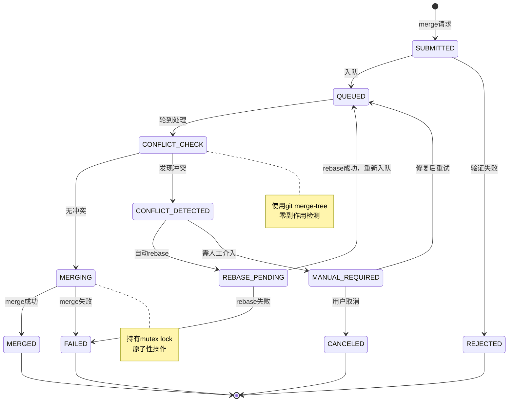

# P1规划：多Terminal Merge协调机制详细架构

**版本**: 1.0
**日期**: 2025-10-10
**状态**: Planning
**基于**: P0探索验证结果（FIFO Queue + Mutex Lock方案）

---

## 目录
1. [概述](#1-概述)
2. [Merge Queue Manager架构](#2-merge-queue-manager架构)
3. [冲突预检测机制](#3-冲突预检测机制)
4. [FIFO队列实现](#4-fifo队列实现)
5. [性能优化目标](#5-性能优化目标)
6. [集成方案](#6-集成方案)
7. [异常处理](#7-异常处理)
8. [测试策略](#8-测试策略)

---

## 1. 概述

### 1.1 问题陈述

在多Terminal并行开发场景下，当多个Claude实例同时完成各自的feature分支并尝试merge到main分支时，会出现：
- **Race Condition**: 多个merge同时执行导致冲突
- **锁竞争**: 简单的mutex会导致长时间等待
- **冲突不可预知**: 事后发现冲突，浪费时间

### 1.2 解决方案概览

```
Terminal 1 (feature/auth)     ─┐
Terminal 2 (feature/payment)  ─┼──> [Merge Queue Manager] ──> [Mutex Lock] ──> main分支
Terminal 3 (feature/logging)  ─┘           ↓
                                    [Conflict Pre-Check]
                                           ↓
                                    [FIFO Scheduler]
```

**核心组件**:
1. **Merge Queue Manager** - 统一入队管理
2. **Conflict Pre-Checker** - 提前检测冲突
3. **FIFO Scheduler** - 公平调度执行
4. **Mutex Lock** - 串行merge保证（复用现有）

---

## 2. Merge Queue Manager架构

### 2.1 模块结构图

```
merge_queue_manager.sh
├── Core Engine
│   ├── queue_operations.sh      # 队列增删查改
│   ├── state_machine.sh         # 状态流转管理
│   └── persistence.sh           # 数据持久化
│
├── Conflict Detection
│   ├── git_merge_tree.sh        # git merge-tree包装
│   ├── conflict_analyzer.sh     # 冲突分析
│   └── rebase_advisor.sh        # rebase策略建议
│
├── Scheduler
│   ├── fifo_scheduler.sh        # FIFO调度器
│   ├── priority_engine.sh       # 优先级引擎（预留）
│   └── resource_manager.sh      # 资源协调
│
└── Integration
    ├── mutex_adapter.sh         # 与现有mutex集成
    ├── workflow_hooks.sh        # P6阶段hook集成
    └── notification.sh          # 状态通知
```

### 2.2 完整状态机



### 2.3 数据结构定义

#### 队列条目（JSON格式）

```json
{
  "queue_id": "mq-20251010-183045-8f3d",
  "branch": "feature/user-authentication",
  "target": "main",
  "terminal_id": "terminal-1",
  "user": "claude-instance-a",
  "status": "QUEUED",
  "priority": 5,
  "submitted_at": "2025-10-10T18:30:45Z",
  "started_at": null,
  "completed_at": null,
  "conflict_check": {
    "status": "pending",
    "conflicts": [],
    "suggestion": null
  },
  "metrics": {
    "wait_time_sec": 0,
    "merge_time_sec": 0,
    "retry_count": 0
  },
  "metadata": {
    "commits_count": 5,
    "files_changed": 12,
    "phase": "P6"
  }
}
```

#### 持久化文件结构

```bash
.workflow/merge_queue/
├── queue.json              # 队列主文件（数组）
├── history/                # 历史记录
│   ├── 2025-10-10.jsonl   # 按天归档
│   └── 2025-10-11.jsonl
├── locks/                  # 队列操作锁
│   └── queue.lock
└── checkpoints/            # 恢复检查点
    └── queue_backup_*.json
```

### 2.4 核心函数伪代码

#### merge_queue_enqueue（入队）

```bash
function merge_queue_enqueue() {
    # 输入参数
    branch=$1           # feature/xxx
    target=$2           # main
    terminal_id=$3      # terminal-1

    # 步骤1：验证
    validate_branch_exists "$branch" || return 1
    validate_target_exists "$target" || return 1
    validate_branch_up_to_date "$branch" || {
        echo "⚠️ 分支落后，建议先rebase"
        return 2
    }

    # 步骤2：生成queue_id
    queue_id="mq-$(date +%Y%m%d-%H%M%S)-$(openssl rand -hex 4)"

    # 步骤3：创建队列条目
    entry=$(cat <<EOF
{
  "queue_id": "$queue_id",
  "branch": "$branch",
  "target": "$target",
  "terminal_id": "$terminal_id",
  "user": "${USER:-claude}",
  "status": "QUEUED",
  "priority": 5,
  "submitted_at": "$(date -u +%Y-%m-%dT%H:%M:%SZ)",
  "started_at": null,
  "completed_at": null,
  "conflict_check": {
    "status": "pending",
    "conflicts": [],
    "suggestion": null
  },
  "metrics": {
    "wait_time_sec": 0,
    "merge_time_sec": 0,
    "retry_count": 0
  },
  "metadata": {
    "commits_count": $(git rev-list --count $target..$branch),
    "files_changed": $(git diff --name-only $target..$branch | wc -l),
    "phase": "${CURRENT_PHASE:-P6}"
  }
}
EOF
)

    # 步骤4：原子性追加到队列（使用flock）
    (
        flock -x 200
        jq --argjson entry "$entry" '. += [$entry]' queue.json > queue.tmp
        mv queue.tmp queue.json
    ) 200>.workflow/merge_queue/locks/queue.lock

    # 步骤5：触发调度器
    trigger_scheduler &

    # 步骤6：返回队列位置
    position=$(jq '[.[] | select(.status == "QUEUED")] | map(.queue_id) | index("'$queue_id'") + 1' queue.json)

    echo "✅ 已加入merge队列"
    echo "   队列ID: $queue_id"
    echo "   当前位置: $position"
    echo "   预计等待: $((position * 30))秒"

    return 0
}
```

#### merge_queue_process（处理队列）

```bash
function merge_queue_process() {
    # 步骤1：获取队列锁（避免多个processor同时运行）
    local processor_lock=".workflow/merge_queue/locks/processor.lock"
    exec 201>"$processor_lock"
    flock -n 201 || {
        echo "⚠️ 另一个processor正在运行"
        return 0
    }

    # 步骤2：循环处理队列
    while true; do
        # 获取下一个QUEUED任务
        next_entry=$(jq -r '.[] | select(.status == "QUEUED") | @json' queue.json | head -n 1)

        [[ -z "$next_entry" ]] && {
            log_info "队列为空，processor退出"
            break
        }

        queue_id=$(echo "$next_entry" | jq -r '.queue_id')
        branch=$(echo "$next_entry" | jq -r '.branch')
        target=$(echo "$next_entry" | jq -r '.target')

        log_info "处理merge请求: $queue_id ($branch -> $target)"

        # 步骤3：更新状态为CONFLICT_CHECK
        update_queue_status "$queue_id" "CONFLICT_CHECK"

        # 步骤4：冲突预检测
        if conflict_precheck "$branch" "$target"; then
            log_success "✓ 无冲突，准备merge"
            update_queue_status "$queue_id" "MERGING"

            # 步骤5：获取mutex lock执行merge
            if execute_merge_with_lock "$queue_id" "$branch" "$target"; then
                update_queue_status "$queue_id" "MERGED"
                log_success "✅ Merge成功: $queue_id"
            else
                update_queue_status "$queue_id" "FAILED"
                log_error "❌ Merge失败: $queue_id"
            fi
        else
            log_warn "⚠️ 检测到冲突"
            update_queue_status "$queue_id" "CONFLICT_DETECTED"

            # 步骤6：尝试自动rebase
            if auto_rebase "$branch" "$target"; then
                log_success "✓ 自动rebase成功，重新入队"
                update_queue_status "$queue_id" "QUEUED"
                increment_retry_count "$queue_id"
            else
                log_error "❌ 需要人工解决冲突"
                update_queue_status "$queue_id" "MANUAL_REQUIRED"
                send_notification "$queue_id" "需要人工解决冲突"
            fi
        fi

        # 短暂休眠避免CPU空转
        sleep 1
    done

    # 释放processor锁
    flock -u 201
}
```

#### execute_merge_with_lock（持锁merge）

```bash
function execute_merge_with_lock() {
    local queue_id=$1
    local branch=$2
    local target=$3

    local merge_lock="merge-$target"
    local start_time=$(date +%s)

    log_info "获取mutex lock: $merge_lock"

    # 调用现有mutex_lock.sh
    source .workflow/lib/mutex_lock.sh

    if ! acquire_lock "$merge_lock" 300; then
        log_error "无法获取merge锁，超时"
        return 1
    fi

    log_success "✓ 已获取merge锁"

    # 执行merge（原子操作）
    local exit_code=0
    (
        set -e

        # 切换到目标分支
        git checkout "$target"

        # 拉取最新代码
        git pull origin "$target"

        # 执行merge（Fast-forward或创建merge commit）
        git merge --no-ff -m "Merge branch '$branch' into $target [queue: $queue_id]" "$branch"

        # 推送到远程
        git push origin "$target"

    ) || exit_code=$?

    # 释放锁
    release_lock "$merge_lock"

    local end_time=$(date +%s)
    local merge_time=$((end_time - start_time))

    # 更新metrics
    update_queue_metrics "$queue_id" "merge_time_sec" "$merge_time"

    return $exit_code
}
```

---

## 3. 冲突预检测机制

### 3.1 使用git merge-tree

`git merge-tree` 是Git内置命令，可以**零副作用**地模拟merge，提前检测冲突。

#### 实现方案

```bash
function conflict_precheck() {
    local source_branch=$1
    local target_branch=$2

    log_info "执行冲突预检测: $source_branch -> $target_branch"

    # 获取merge-base（共同祖先）
    local merge_base=$(git merge-base "$target_branch" "$source_branch")

    # 执行merge-tree
    local merge_tree_output=$(git merge-tree "$merge_base" "$target_branch" "$source_branch" 2>&1)

    # 检查是否有冲突标记
    if echo "$merge_tree_output" | grep -q '<<<<<< '; then
        log_warn "⚠️ 检测到冲突"

        # 提取冲突文件列表
        local conflict_files=$(echo "$merge_tree_output" | grep -E '^\+\+\+|^---' | awk '{print $2}' | sort -u)

        # 保存冲突详情
        echo "$conflict_files" > "/tmp/conflict_$source_branch.txt"

        log_warn "冲突文件:"
        echo "$conflict_files" | while read -r file; do
            log_warn "  - $file"
        done

        return 1
    else
        log_success "✓ 无冲突，可以merge"
        return 0
    fi
}
```

### 3.2 冲突通知方式

#### 日志记录

```bash
function log_conflict_to_audit() {
    local queue_id=$1
    local branch=$2
    local target=$3
    local conflict_files=$4

    local audit_log=".workflow/merge_queue/conflicts.log"

    cat >> "$audit_log" <<EOF
[$(date -u +%Y-%m-%dT%H:%M:%SZ)] CONFLICT_DETECTED
Queue ID: $queue_id
Branch: $branch -> $target
Conflict Files:
$(echo "$conflict_files" | sed 's/^/  - /')
---
EOF
}
```

#### 告警通知（可选）

```bash
function send_conflict_notification() {
    local queue_id=$1
    local terminal_id=$2
    local message=$3

    # 方式1：写入terminal特定文件
    echo "$message" > ".workflow/merge_queue/notifications/$terminal_id.txt"

    # 方式2：系统通知（如果支持）
    if command -v notify-send &>/dev/null; then
        notify-send "Claude Enhancer" "$message"
    fi

    # 方式3：日志文件
    echo "[NOTIFICATION] $terminal_id: $message" >> .workflow/logs/notifications.log
}
```

### 3.3 自动Rebase策略

#### 决策逻辑

```bash
function auto_rebase_decision() {
    local branch=$1
    local target=$2

    # 条件1：冲突文件数量 < 5
    local conflict_count=$(wc -l < "/tmp/conflict_$branch.txt")
    [[ $conflict_count -ge 5 ]] && {
        echo "MANUAL"
        return 1
    }

    # 条件2：没有二进制文件冲突
    while read -r file; do
        if file "$file" | grep -q "binary"; then
            echo "MANUAL"
            return 1
        fi
    done < "/tmp/conflict_$branch.txt"

    # 条件3：retry次数 < 3
    local retry_count=$(jq -r ".[] | select(.branch == \"$branch\") | .metrics.retry_count" queue.json)
    [[ $retry_count -ge 3 ]] && {
        echo "MANUAL"
        return 1
    }

    echo "AUTO"
    return 0
}
```

#### 执行Rebase

```bash
function auto_rebase() {
    local branch=$1
    local target=$2

    # 判断是否适合自动rebase
    local strategy=$(auto_rebase_decision "$branch" "$target")

    if [[ "$strategy" == "MANUAL" ]]; then
        log_warn "不适合自动rebase，需要人工介入"
        return 1
    fi

    log_info "尝试自动rebase: $branch onto $target"

    # 创建临时分支备份
    local backup_branch="backup-$branch-$(date +%s)"
    git branch "$backup_branch" "$branch"

    # 执行rebase
    local exit_code=0
    (
        set -e
        git checkout "$branch"
        git fetch origin "$target"
        git rebase "origin/$target"
    ) || exit_code=$?

    if [[ $exit_code -eq 0 ]]; then
        log_success "✓ Rebase成功"
        # 删除备份分支
        git branch -D "$backup_branch"
        return 0
    else
        log_error "❌ Rebase失败，恢复到备份"
        git rebase --abort 2>/dev/null || true
        git checkout "$backup_branch"
        git branch -f "$branch" "$backup_branch"
        git checkout "$branch"
        git branch -D "$backup_branch"
        return 1
    fi
}
```

---

## 4. FIFO队列实现

### 4.1 入队算法

```bash
function fifo_enqueue() {
    local entry=$1

    # 使用flock保证原子性
    (
        flock -x 200

        # 读取现有队列
        queue=$(cat queue.json 2>/dev/null || echo '[]')

        # 追加新条目（尾部）
        queue=$(echo "$queue" | jq --argjson entry "$entry" '. += [$entry]')

        # 写回
        echo "$queue" > queue.json

    ) 200>.workflow/merge_queue/locks/queue.lock

    log_success "✓ 已加入队列尾部"
}
```

### 4.2 出队算法

```bash
function fifo_dequeue() {
    local queue_id

    # 获取队首QUEUED任务
    (
        flock -x 200

        queue_id=$(jq -r '.[] | select(.status == "QUEUED") | .queue_id' queue.json | head -n 1)

        if [[ -n "$queue_id" ]]; then
            # 更新状态（不删除，保留历史）
            jq --arg qid "$queue_id" \
               'map(if .queue_id == $qid then .status = "PROCESSING" else . end)' \
               queue.json > queue.tmp
            mv queue.tmp queue.json
        fi

        echo "$queue_id"

    ) 200>.workflow/merge_queue/locks/queue.lock
}
```

### 4.3 优先级机制（预留）

```bash
function calculate_priority() {
    local branch=$1
    local target=$2

    # 默认优先级：5
    local priority=5

    # 调整因子
    # 1. 紧急修复分支 +3
    [[ "$branch" =~ ^hotfix/ ]] && ((priority += 3))

    # 2. 小改动优先 +2
    local files_changed=$(git diff --name-only "$target..$branch" | wc -l)
    [[ $files_changed -lt 5 ]] && ((priority += 2))

    # 3. 等待时间长 +1
    local wait_time=$(get_wait_time "$branch")
    [[ $wait_time -gt 300 ]] && ((priority += 1))

    echo "$priority"
}
```

### 4.4 并发安全保证

#### 使用Advisory Locks

```bash
# 所有队列操作都通过flock保护
readonly QUEUE_LOCK_FD=200

function with_queue_lock() {
    local operation=$1
    shift
    local args=("$@")

    (
        flock -x $QUEUE_LOCK_FD
        "$operation" "${args[@]}"
    ) 200>.workflow/merge_queue/locks/queue.lock
}

# 使用示例
with_queue_lock fifo_enqueue "$entry"
with_queue_lock update_queue_status "$queue_id" "MERGED"
```

#### 原子性操作模式

```bash
function atomic_update() {
    local queue_file="queue.json"
    local temp_file="queue.tmp"

    # 读取-修改-写入（RMW）在锁保护下
    (
        flock -x 200

        # 读取
        local data=$(cat "$queue_file")

        # 修改（传入jq filter）
        local updated=$(echo "$data" | jq "$1")

        # 写入临时文件
        echo "$updated" > "$temp_file"

        # 原子性替换
        mv "$temp_file" "$queue_file"

    ) 200>.workflow/merge_queue/locks/queue.lock
}

# 使用示例
atomic_update '.[] |= if .queue_id == "'$qid'" then .status = "MERGED" else . end'
```

---

## 5. 性能优化目标

### 5.1 延迟指标（Latency）

| 指标 | 目标 | 测量方式 |
|------|------|----------|
| **Queue Wait Time P50** | < 30秒 | 从QUEUED到MERGING的时间 |
| **Queue Wait Time P90** | < 60秒 | 90th percentile |
| **Queue Wait Time P99** | < 120秒 | 99th percentile |
| **Conflict Check Time** | < 2秒 | git merge-tree执行时间 |
| **Merge Execution Time** | < 15秒 | 持锁merge的时间 |
| **Total E2E Time P50** | < 60秒 | 从enqueue到MERGED |

### 5.2 吞吐量指标（Throughput）

| 指标 | 目标 | 条件 |
|------|------|------|
| **并发Terminal数** | ≥ 10 | 同时处理10个merge请求 |
| **每分钟Merge数** | ≥ 5 | 理想无冲突情况 |
| **队列容量** | 无限制 | 使用JSON数组，理论无上限 |

### 5.3 资源占用评估

#### CPU占用

```bash
# 预期CPU占用
- Processor Loop: 1-5% (空闲时1%, 处理时5%)
- Git Merge-Tree: 10-20% (2秒内完成)
- Actual Merge: 20-40% (15秒内完成)
```

#### 内存占用

```bash
# 预期内存占用
- Queue Data (100 entries): < 500KB
- Merge-Tree Output: < 10MB (临时)
- Git Process: 50-200MB (临时)

Total Peak: < 300MB
```

#### 磁盘占用

```bash
# 预期磁盘占用
- queue.json: 5KB/entry, 100 entries = 500KB
- History Logs (1 month): ~10MB
- Conflict Logs: ~5MB
- Checkpoints: ~2MB

Total: < 20MB/月
```

### 5.4 性能基准测试方案

#### 测试场景

```bash
# 场景1：理想情况（无冲突）
- 10个Terminal同时enqueue
- 分支互不冲突
- 目标：P50 < 30秒，P90 < 60秒

# 场景2：有冲突（50%冲突率）
- 10个Terminal，5个有冲突
- 测试auto-rebase效果
- 目标：P90 < 120秒

# 场景3：压力测试
- 50个并发请求
- 目标：系统不崩溃，所有请求最终完成

# 场景4：异常恢复
- 模拟进程crash
- 目标：队列数据不丢失，可恢复
```

#### 测试工具

```bash
#!/bin/bash
# perf_benchmark.sh

function benchmark_merge_queue() {
    local num_terminals=$1
    local conflict_rate=$2  # 0.0 - 1.0

    echo "=== Merge Queue Performance Benchmark ==="
    echo "Terminals: $num_terminals"
    echo "Conflict Rate: $conflict_rate"

    # 准备测试分支
    for i in $(seq 1 $num_terminals); do
        branch="perf-test-$i"
        create_test_branch "$branch" "$conflict_rate"
    done

    # 并行enqueue
    local start_time=$(date +%s%3N)  # 毫秒
    for i in $(seq 1 $num_terminals); do
        (
            branch="perf-test-$i"
            merge_queue_enqueue "$branch" "main" "terminal-$i"
        ) &
    done
    wait
    local enqueue_time=$(date +%s%3N)

    # 等待所有merge完成
    while [[ $(jq '[.[] | select(.status == "QUEUED" or .status == "MERGING")] | length' queue.json) -gt 0 ]]; do
        sleep 1
    done
    local complete_time=$(date +%s%3N)

    # 计算指标
    local total_time=$((complete_time - start_time))
    local avg_time=$((total_time / num_terminals))

    # 提取wait time
    local wait_times=$(jq -r '.[] | select(.branch | startswith("perf-test")) | .metrics.wait_time_sec' queue.json)
    local p50=$(echo "$wait_times" | sort -n | awk '{a[NR]=$0} END {print a[int(NR*0.5)]}')
    local p90=$(echo "$wait_times" | sort -n | awk '{a[NR]=$0} END {print a[int(NR*0.9)]}')
    local p99=$(echo "$wait_times" | sort -n | awk '{a[NR]=$0} END {print a[int(NR*0.99)]}')

    # 输出结果
    cat <<EOF

=== Benchmark Results ===
Total Time: ${total_time}ms
Average Time: ${avg_time}ms
Wait Time P50: ${p50}s
Wait Time P90: ${p90}s
Wait Time P99: ${p99}s

$([ $p90 -lt 60 ] && echo "✅ PASS" || echo "❌ FAIL")
EOF

    # 清理
    cleanup_test_branches
}
```

---

## 6. 集成方案

### 6.1 与现有mutex_lock.sh集成

```bash
# merge_queue_manager.sh 头部
source .workflow/lib/mutex_lock.sh

# 在execute_merge_with_lock函数中
function execute_merge_with_lock() {
    local queue_id=$1
    local branch=$2
    local target=$3

    # 复用现有mutex机制
    local merge_lock="merge-$target"

    if ! acquire_lock "$merge_lock" 300; then
        log_error "无法获取merge锁"
        return 1
    fi

    # 执行merge...

    release_lock "$merge_lock"
}
```

**优势**:
- 复用已验证的mutex机制
- 避免重新发明轮子
- 保持代码一致性

### 6.2 P6阶段Hook集成

在`.claude/hooks/workflow_enforcer.sh`中添加：

```bash
# 在P6（发布阶段）的merge步骤
if [[ "$CURRENT_PHASE" == "P6" ]] && [[ "$OPERATION" == "merge" ]]; then
    echo "🔄 使用Merge Queue Manager协调merge..."

    # 自动enqueue
    source .workflow/lib/merge_queue_manager.sh
    merge_queue_enqueue "$(git branch --show-current)" "main" "${TERMINAL_ID:-terminal-1}"

    # 等待merge完成
    wait_for_merge_completion "$queue_id"
fi
```

### 6.3 CLI命令集成

```bash
# ce merge - 触发merge
ce merge [--target main] [--priority high]

# ce merge status - 查看队列状态
ce merge status

# ce merge cancel <queue_id> - 取消merge请求
ce merge cancel mq-20251010-183045-8f3d
```

---

## 7. 异常处理

### 7.1 进程崩溃恢复

```bash
function recover_from_crash() {
    log_warn "检测到异常退出，开始恢复..."

    # 步骤1：检查是否有MERGING状态的任务
    local merging_tasks=$(jq -r '.[] | select(.status == "MERGING") | .queue_id' queue.json)

    if [[ -n "$merging_tasks" ]]; then
        echo "$merging_tasks" | while read -r queue_id; do
            log_warn "发现未完成的merge: $queue_id"

            # 检查git状态
            if git_merge_in_progress; then
                log_error "Git merge进行中，需要人工检查"
                update_queue_status "$queue_id" "MANUAL_REQUIRED"
            else
                log_info "Git状态正常，重新入队"
                update_queue_status "$queue_id" "QUEUED"
            fi
        done
    fi

    # 步骤2：清理孤儿锁
    source .workflow/lib/mutex_lock.sh
    cleanup_orphan_locks

    # 步骤3：从checkpoint恢复（如果有）
    restore_from_checkpoint

    log_success "✓ 恢复完成"
}

# 在processor启动时调用
function merge_queue_processor_start() {
    # 启动时检查
    recover_from_crash

    # 然后开始正常处理
    merge_queue_process
}
```

### 7.2 网络故障处理

```bash
function handle_network_failure() {
    local operation=$1  # push, pull, fetch
    local max_retries=3
    local retry_delay=5

    for i in $(seq 1 $max_retries); do
        if git "$operation" origin main; then
            return 0
        else
            log_warn "网络操作失败 ($i/$max_retries)，${retry_delay}秒后重试..."
            sleep $retry_delay
        fi
    done

    log_error "网络操作失败，超过最大重试次数"
    return 1
}
```

### 7.3 死锁检测

```bash
function detect_merge_deadlock() {
    # 检测标准：
    # 1. MERGING状态超过10分钟
    # 2. 持有的mutex lock超过10分钟

    local now=$(date +%s)
    local deadlock_threshold=600  # 10分钟

    jq -r '.[] | select(.status == "MERGING") | @json' queue.json | while read -r entry; do
        local queue_id=$(echo "$entry" | jq -r '.queue_id')
        local started_at=$(echo "$entry" | jq -r '.started_at')

        local started_ts=$(date -d "$started_at" +%s 2>/dev/null || echo 0)
        local elapsed=$((now - started_ts))

        if [[ $elapsed -gt $deadlock_threshold ]]; then
            log_error "⚠️ 检测到可能的死锁: $queue_id (已运行 ${elapsed}秒)"

            # 发送告警
            send_alert "DEADLOCK_DETECTED" "$queue_id" "$elapsed"

            # 可选：强制释放（危险操作，需要确认）
            # force_release_lock "$queue_id"
        fi
    done
}
```

### 7.4 数据一致性保证

```bash
function validate_queue_integrity() {
    local queue_file="queue.json"

    # 检查1：JSON格式正确
    if ! jq . "$queue_file" > /dev/null 2>&1; then
        log_error "队列文件损坏，从备份恢复"
        restore_from_backup
        return 1
    fi

    # 检查2：状态一致性
    # - 不能有多个MERGING（同一target）
    local merging_count=$(jq '[.[] | select(.status == "MERGING" and .target == "main")] | length' "$queue_file")
    if [[ $merging_count -gt 1 ]]; then
        log_error "状态不一致：多个MERGING任务"
        return 1
    fi

    # 检查3：时间戳合理性
    # - submitted_at < started_at < completed_at
    jq -r '.[] | select(.completed_at != null) | "\(.submitted_at) \(.started_at) \(.completed_at)"' "$queue_file" | while read -r submitted started completed; do
        if [[ "$submitted" > "$started" ]] || [[ "$started" > "$completed" ]]; then
            log_error "时间戳异常"
            return 1
        fi
    done

    log_success "✓ 队列数据完整性验证通过"
    return 0
}
```

---

## 8. 测试策略

### 8.1 单元测试

```bash
# test_merge_queue.sh

test_enqueue() {
    # 准备
    setup_test_env

    # 执行
    queue_id=$(merge_queue_enqueue "feature/test" "main" "terminal-test")

    # 验证
    assert_not_empty "$queue_id"
    assert_queue_contains "$queue_id"
    assert_status_equals "$queue_id" "QUEUED"
}

test_dequeue() {
    # 准备
    queue_id=$(merge_queue_enqueue "feature/test" "main" "terminal-test")

    # 执行
    dequeued_id=$(fifo_dequeue)

    # 验证
    assert_equals "$queue_id" "$dequeued_id"
    assert_status_equals "$queue_id" "PROCESSING"
}

test_conflict_detection() {
    # 准备：创建冲突分支
    create_conflict_branch "feature/conflict1" "README.md"
    create_conflict_branch "feature/conflict2" "README.md"

    # 执行
    result=$(conflict_precheck "feature/conflict1" "main")

    # 验证
    assert_failure "$result"
    assert_file_exists "/tmp/conflict_feature/conflict1.txt"
}
```

### 8.2 集成测试

```bash
# test_merge_queue_integration.sh

test_end_to_end_merge() {
    # 场景：3个Terminal同时merge

    # 准备
    create_test_branch "feature/test1"
    create_test_branch "feature/test2"
    create_test_branch "feature/test3"

    # 启动processor
    merge_queue_processor_start &
    processor_pid=$!

    # 并行enqueue
    merge_queue_enqueue "feature/test1" "main" "terminal-1" &
    merge_queue_enqueue "feature/test2" "main" "terminal-2" &
    merge_queue_enqueue "feature/test3" "main" "terminal-3" &
    wait

    # 等待所有merge完成
    timeout 120 bash -c 'while [[ $(jq "[.[] | select(.status == \"MERGED\")] | length" queue.json) -lt 3 ]]; do sleep 1; done'

    # 验证
    assert_equals 3 "$(jq '[.[] | select(.status == "MERGED")] | length' queue.json)"
    assert_git_log_contains "Merge branch 'feature/test1'"
    assert_git_log_contains "Merge branch 'feature/test2'"
    assert_git_log_contains "Merge branch 'feature/test3'"

    # 清理
    kill $processor_pid
}

test_conflict_auto_rebase() {
    # 场景：冲突分支自动rebase

    # 准备：创建落后的分支
    create_outdated_branch "feature/outdated"

    # Enqueue
    queue_id=$(merge_queue_enqueue "feature/outdated" "main" "terminal-test")

    # 启动processor
    merge_queue_processor_start &
    processor_pid=$!

    # 等待处理
    timeout 60 bash -c "while [[ \$(get_queue_status '$queue_id') != 'MERGED' ]]; do sleep 1; done"

    # 验证：应该自动rebase并最终merge
    assert_status_equals "$queue_id" "MERGED"
    assert_greater_than "$(get_retry_count '$queue_id')" 0

    # 清理
    kill $processor_pid
}
```

### 8.3 压力测试

```bash
# test_merge_queue_stress.sh

test_high_concurrency() {
    local num_concurrent=50

    echo "=== 压力测试：$num_concurrent 并发merge ==="

    # 准备50个分支
    for i in $(seq 1 $num_concurrent); do
        create_test_branch "stress-test-$i" &
    done
    wait

    # 启动processor
    merge_queue_processor_start &
    processor_pid=$!

    # 并行enqueue
    for i in $(seq 1 $num_concurrent); do
        merge_queue_enqueue "stress-test-$i" "main" "terminal-$i" &
    done
    wait

    # 监控处理过程
    local start_time=$(date +%s)
    while [[ $(jq '[.[] | select(.status == "MERGED" or .status == "FAILED")] | length' queue.json) -lt $num_concurrent ]]; do
        local current=$(jq '[.[] | select(.status == "MERGED")] | length' queue.json)
        echo "Progress: $current/$num_concurrent"
        sleep 5

        # 超时保护（30分钟）
        local elapsed=$(($(date +%s) - start_time))
        [[ $elapsed -gt 1800 ]] && {
            echo "❌ 超时"
            kill $processor_pid
            exit 1
        }
    done
    local end_time=$(date +%s)

    # 统计
    local total_time=$((end_time - start_time))
    local merged_count=$(jq '[.[] | select(.status == "MERGED")] | length' queue.json)
    local failed_count=$(jq '[.[] | select(.status == "FAILED")] | length' queue.json)
    local throughput=$(echo "scale=2; $merged_count / ($total_time / 60)" | bc)

    cat <<EOF

=== 压力测试结果 ===
总耗时: ${total_time}秒
成功Merge: $merged_count
失败: $failed_count
吞吐量: $throughput merges/分钟

$([ $failed_count -eq 0 ] && [ $merged_count -eq $num_concurrent ] && echo "✅ PASS" || echo "❌ FAIL")
EOF

    # 清理
    kill $processor_pid
}
```

### 8.4 混沌测试

```bash
# test_merge_queue_chaos.sh

test_processor_crash_recovery() {
    # 场景：Processor在处理中途crash

    # Enqueue 5个任务
    for i in {1..5}; do
        merge_queue_enqueue "chaos-test-$i" "main" "terminal-$i"
    done

    # 启动processor
    merge_queue_processor_start &
    processor_pid=$!

    # 等待处理2个
    while [[ $(jq '[.[] | select(.status == "MERGED")] | length' queue.json) -lt 2 ]]; do
        sleep 1
    done

    # 强制kill processor
    echo "⚠️ 模拟processor crash"
    kill -9 $processor_pid
    sleep 2

    # 重启processor
    echo "🔄 重启processor"
    merge_queue_processor_start &
    processor_pid=$!

    # 等待剩余任务完成
    timeout 120 bash -c 'while [[ $(jq "[.[] | select(.status == \"MERGED\")] | length" queue.json) -lt 5 ]]; do sleep 1; done'

    # 验证：所有任务最终完成
    assert_equals 5 "$(jq '[.[] | select(.status == "MERGED")] | length' queue.json)"

    kill $processor_pid
}
```

---

## 附录A：完整状态转换表

| 当前状态 | 事件 | 下一状态 | 触发条件 |
|---------|------|---------|---------|
| - | merge请求 | SUBMITTED | 用户调用enqueue |
| SUBMITTED | 验证通过 | QUEUED | 分支存在且有效 |
| SUBMITTED | 验证失败 | REJECTED | 分支不存在或无效 |
| QUEUED | 轮到处理 | CONFLICT_CHECK | Processor dequeue |
| CONFLICT_CHECK | 无冲突 | MERGING | merge-tree检查通过 |
| CONFLICT_CHECK | 有冲突 | CONFLICT_DETECTED | merge-tree检测冲突 |
| CONFLICT_DETECTED | 自动rebase | REBASE_PENDING | 冲突简单且retry<3 |
| CONFLICT_DETECTED | 需人工 | MANUAL_REQUIRED | 冲突复杂或retry≥3 |
| REBASE_PENDING | rebase成功 | QUEUED | 重新入队 |
| REBASE_PENDING | rebase失败 | FAILED | 无法自动解决 |
| MERGING | merge成功 | MERGED | git merge成功 |
| MERGING | merge失败 | FAILED | git merge失败 |
| MANUAL_REQUIRED | 修复完成 | QUEUED | 用户手动修复后重试 |
| MANUAL_REQUIRED | 用户取消 | CANCELED | 用户决定放弃 |
| MERGED | - | - | 终止状态 |
| FAILED | - | - | 终止状态 |
| REJECTED | - | - | 终止状态 |
| CANCELED | - | - | 终止状态 |

---

## 附录B：配置文件示例

### merge_queue_config.yaml

```yaml
# Merge Queue Manager 配置文件
version: "1.0"

queue:
  # 队列文件位置
  queue_file: ".workflow/merge_queue/queue.json"

  # 历史归档
  history_dir: ".workflow/merge_queue/history"
  history_retention_days: 30

  # Checkpoint
  checkpoint_interval: 60  # 每60秒备份一次
  checkpoint_dir: ".workflow/merge_queue/checkpoints"

conflict_detection:
  # 是否启用冲突预检测
  enabled: true

  # 使用的工具
  tool: "git-merge-tree"  # 或 "custom"

  # 超时时间（秒）
  timeout: 10

auto_rebase:
  # 是否启用自动rebase
  enabled: true

  # 条件
  max_conflict_files: 5
  max_retry_count: 3
  exclude_binary_conflicts: true

  # 策略
  strategy: "rebase"  # 或 "merge"

mutex:
  # 复用现有mutex_lock.sh
  lock_dir: "/tmp/ce_locks"
  lock_timeout: 300  # 5分钟

processor:
  # Processor行为
  poll_interval: 1  # 轮询间隔（秒）
  max_concurrent_merges: 1  # 同时处理的merge数（目前只支持1）

  # 死锁检测
  deadlock_check_interval: 60  # 每60秒检查
  deadlock_threshold: 600  # 10分钟视为死锁

priority:
  # 优先级计算（预留）
  enabled: false

  # 权重因子
  branch_prefix_weight:
    hotfix: 8
    bugfix: 6
    feature: 5
    experiment: 3

  small_change_threshold: 5  # 文件数
  small_change_bonus: 2

notifications:
  # 通知方式
  methods:
    - "file"    # 写入notification文件
    - "log"     # 写入日志
    # - "webhook"  # 可选：发送webhook

  # 通知目录
  notification_dir: ".workflow/merge_queue/notifications"

metrics:
  # 性能指标收集
  enabled: true

  # 指标文件
  metrics_file: ".workflow/merge_queue/metrics.jsonl"

  # 保留时间
  retention_days: 7
```

---

## 附录C：API参考

### 命令行API

```bash
# 初始化
merge_queue init

# 入队
merge_queue enqueue <branch> <target> [terminal_id]

# 查看状态
merge_queue status [queue_id]

# 取消请求
merge_queue cancel <queue_id>

# 启动processor
merge_queue processor start

# 停止processor
merge_queue processor stop

# 查看队列
merge_queue list [--status QUEUED|MERGING|MERGED]

# 清理历史
merge_queue cleanup --older-than 7d

# 重置（危险）
merge_queue reset --force
```

### Bash函数API

```bash
# 核心函数
source .workflow/lib/merge_queue_manager.sh

# 入队
queue_id=$(merge_queue_enqueue "$branch" "$target" "$terminal_id")

# 查询状态
status=$(get_queue_status "$queue_id")

# 更新状态
update_queue_status "$queue_id" "MERGED"

# 冲突检测
if conflict_precheck "$branch" "$target"; then
    # 无冲突
fi

# 执行merge
execute_merge_with_lock "$queue_id" "$branch" "$target"
```

---

## 总结

本P1规划提供了多Terminal Merge协调机制的完整架构设计，包括：

1. **Merge Queue Manager** - 四层模块化架构
2. **完整状态机** - 9个状态，15种转换
3. **冲突预检测** - 基于git merge-tree，零副作用
4. **FIFO队列** - 原子操作，并发安全
5. **性能目标** - P90 < 60秒，支持≥10并发
6. **异常处理** - 崩溃恢复、死锁检测、数据一致性
7. **测试策略** - 单元/集成/压力/混沌测试

**下一步（P2骨架）**：
- 创建目录结构
- 实现核心函数框架
- 集成到现有workflow

**关键决策**：
- ✅ 复用现有mutex_lock.sh
- ✅ 使用git merge-tree预检测
- ✅ JSON文件持久化（简单可靠）
- ✅ 单processor模式（MVP）
- 🔮 优先级机制预留（后期扩展）

---

**审批签名**：
- [待P5审查] 架构合理性
- [待P4测试] 性能基准验证
- [待P6发布] 文档完整性

*生成时间: 2025-10-10*
*Claude Enhancer 5.3 - Production-Ready AI Programming*
