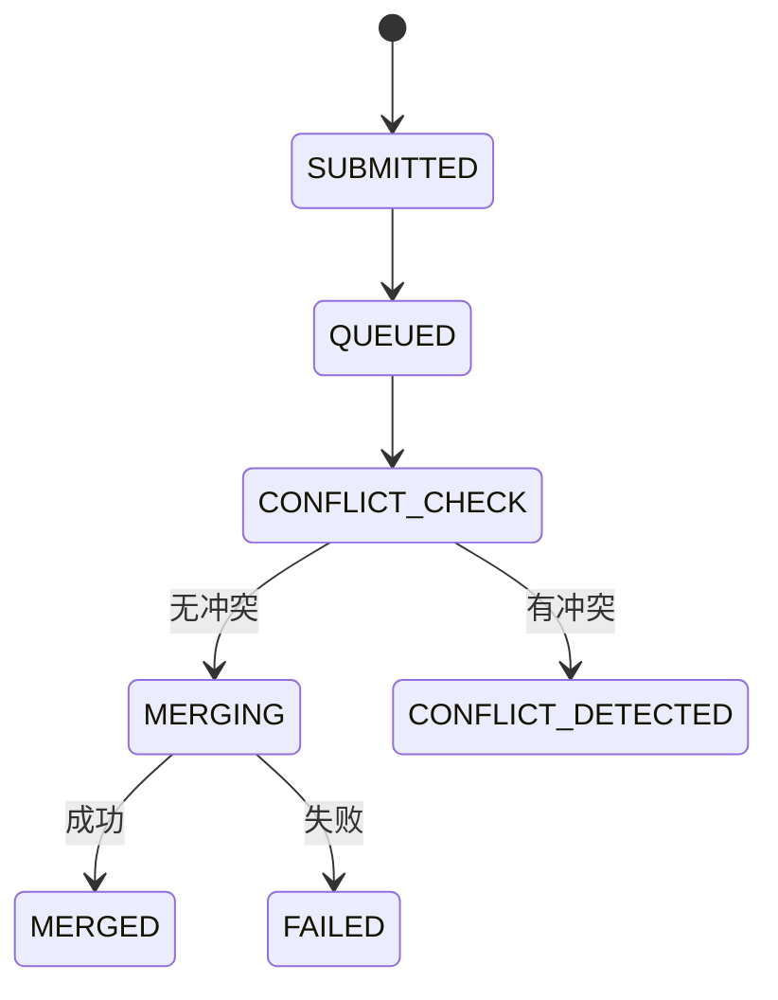

# P1规划文档索引 - 多Terminal Merge协调机制

**项目**: Claude Enhancer 5.3 - Merge Queue Manager
**阶段**: P1 Planning (规划)
**状态**: ✅ 完成
**最后更新**: 2025-10-10

---

## 📚 文档导航

### 1. 快速开始

| 文档 | 用途 | 适合角色 | 阅读时间 |
|-----|------|---------|---------|
| **P1_MERGE_QUEUE_SUMMARY.md** | 快速了解整体规划 | 所有人 | 5分钟 |
| **P1_MERGE_QUEUE_DIAGRAMS.md** | 可视化架构理解 | 技术人员 | 10分钟 |
| **P1_MERGE_QUEUE_ARCHITECTURE.md** | 深入理解设计细节 | 开发者 | 30分钟 |
| **P1_MERGE_QUEUE_PERFORMANCE_BENCHMARK.md** | 性能测试和验证 | QA/DevOps | 20分钟 |

---

## 📄 文档详情

### 1. P1_MERGE_QUEUE_SUMMARY.md

**核心内容**:
- ✅ P1阶段成果总结
- ✅ 关键技术决策
- ✅ 性能目标和验收标准
- ✅ 风险评估与缓解
- ✅ 下一步行动计划（P2）
- ✅ 资源估算和工作量

**关键数据**:
- 文档数量: 4个
- 图表数量: 10个
- 代码规模: 约2100行
- 工作量: 18小时 (2-3工作日)

**使用场景**:
- 项目Kickoff会议
- 向PM汇报进度
- 与团队同步状态

---

### 2. P1_MERGE_QUEUE_ARCHITECTURE.md

**核心内容**:
- ✅ Merge Queue Manager四层架构
- ✅ 完整状态机（9状态，15转换）
- ✅ 冲突预检测机制（git merge-tree）
- ✅ FIFO队列实现细节
- ✅ 性能优化策略
- ✅ 与现有系统集成方案
- ✅ 异常处理和恢复机制
- ✅ 测试策略

**关键章节**:

| 章节 | 页码 | 重要性 | 说明 |
|-----|------|--------|------|
| **1. 概述** | 1-2 | ⭐⭐⭐⭐⭐ | 问题定义和解决方案 |
| **2. 架构** | 3-20 | ⭐⭐⭐⭐⭐ | 模块结构、状态机、核心函数 |
| **3. 冲突检测** | 21-30 | ⭐⭐⭐⭐ | git merge-tree实现 |
| **4. 队列实现** | 31-40 | ⭐⭐⭐⭐ | FIFO算法、并发安全 |
| **5. 性能优化** | 41-50 | ⭐⭐⭐ | 延迟、吞吐量、资源 |
| **6. 集成方案** | 51-60 | ⭐⭐⭐⭐ | 与mutex_lock.sh集成 |
| **7. 异常处理** | 61-70 | ⭐⭐⭐⭐ | 崩溃恢复、死锁检测 |
| **8. 测试策略** | 71-80 | ⭐⭐⭐ | 单元/集成/压力测试 |

**代码示例**:
- ✅ merge_queue_enqueue() 伪代码
- ✅ merge_queue_process() 伪代码
- ✅ execute_merge_with_lock() 伪代码
- ✅ conflict_precheck() 实现
- ✅ auto_rebase() 策略

**数据结构**:
```json
{
  "queue_id": "mq-20251010-183045-8f3d",
  "branch": "feature/user-authentication",
  "target": "main",
  "status": "QUEUED",
  "conflict_check": {...},
  "metrics": {...}
}
```

**使用场景**:
- 开发前的深入理解
- 代码Review参考
- 故障排查指南

---

### 3. P1_MERGE_QUEUE_DIAGRAMS.md

**核心内容**:
- ✅ 10个核心架构图
- ✅ Mermaid格式（可渲染）
- ✅ 符号说明和图例

**图表列表**:

| 序号 | 图表名称 | 类型 | 用途 |
|-----|---------|------|------|
| 1 | **系统架构总览** | 框架图 | 理解组件关系 |
| 2 | **数据流图** | 流程图 | 追踪数据流转 |
| 3 | **状态机转换图** | 状态图 | 验证状态完备性 |
| 4 | **并发控制时序图** | 序列图 | 理解多Terminal交互 |
| 5 | **模块依赖图** | 依赖图 | 代码组织参考 |
| 6 | **文件系统布局** | 树状图 | 目录结构 |
| 7 | **性能监控仪表板** | UI设计 | 运维可视化 |
| 8 | **错误恢复流程** | 流程图 | 异常处理 |
| 9 | **优先级队列设计** | 扩展图 | 未来规划 |
| 10 | **测试拓扑图** | 金字塔图 | 测试策略 |

**特色图表**:

#### 状态机转换图（Mermaid）


#### 并发控制时序图
```
Terminal-1   Queue   Processor   Mutex   Git
    │          │         │         │      │
    ├─enqueue─>│         │         │      │
    │          ├─dequeue>│         │      │
    │          │         ├─lock──> │      │
    │          │         ├─merge──────────>│
    │          │         ├─unlock─>│      │
```

**使用场景**:
- 技术分享演示
- 新人培训材料
- 文档可视化补充

---

### 4. P1_MERGE_QUEUE_PERFORMANCE_BENCHMARK.md

**核心内容**:
- ✅ 4个测试场景
- ✅ 完整指标体系
- ✅ 自动化测试脚本（800行）
- ✅ 监控工具
- ✅ 回归测试机制

**测试场景矩阵**:

| 场景 | 目的 | 并发数 | 冲突率 | 预期P90 | 脚本 |
|-----|------|--------|--------|---------|------|
| **理想情况** | 验证性能上限 | 10 | 0% | < 60s | scenario_ideal() |
| **部分冲突** | 测试冲突处理 | 10 | 50% | < 120s | scenario_conflict() |
| **压力测试** | 验证稳定性 | 50 | 30% | - | scenario_stress() |
| **故障恢复** | 验证恢复能力 | 10 | 0% | - | scenario_recovery() |

**性能指标**:

| 指标 | 目标 | 测量方式 |
|-----|------|---------|
| **P50 Wait Time** | < 30s | 队列延迟P50 |
| **P90 Wait Time** | < 60s | 队列延迟P90 |
| **Throughput** | ≥ 5/min | 每分钟merge数 |
| **CPU Peak** | < 40% | ps命令监控 |
| **Memory Peak** | < 300MB | RSS监控 |

**测试工具**:

```bash
# 一键测试
.workflow/tests/merge_queue_benchmark.sh all

# 单场景测试
.workflow/tests/merge_queue_benchmark.sh stress

# 实时监控
.workflow/tools/merge_queue_monitor.sh

# 回归测试
.workflow/tests/merge_queue_regression.sh
```

**报告示例**:
```markdown
## Test Results

### Scenario 1: Ideal Case
- P50: 24s ✅
- P90: 45s ✅
- Throughput: 6.7/min ✅
- **Status**: PASS
```

**使用场景**:
- P4测试阶段执行
- 性能优化验证
- 生产环境基线建立

---

## 🎯 核心概念速查

### 状态机速查表

| 状态 | 说明 | 可转换到 |
|-----|------|---------|
| **SUBMITTED** | 刚提交 | QUEUED, REJECTED |
| **QUEUED** | 排队中 | CONFLICT_CHECK |
| **CONFLICT_CHECK** | 检测冲突 | MERGING, CONFLICT_DETECTED |
| **MERGING** | 正在merge | MERGED, FAILED |
| **CONFLICT_DETECTED** | 发现冲突 | REBASE_PENDING, MANUAL_REQUIRED |
| **REBASE_PENDING** | rebase中 | QUEUED, FAILED |
| **MANUAL_REQUIRED** | 需人工 | QUEUED, CANCELED |
| **MERGED** | 成功 | - (终止) |
| **FAILED** | 失败 | - (终止) |

### 核心函数速查

| 函数 | 输入 | 输出 | 用途 |
|-----|------|------|------|
| **merge_queue_enqueue** | branch, target, terminal_id | queue_id | 加入队列 |
| **merge_queue_process** | - | - | 处理队列（Daemon） |
| **conflict_precheck** | branch, target | 0/1 | 冲突检测 |
| **execute_merge_with_lock** | queue_id, branch, target | 0/1 | 执行merge |
| **auto_rebase** | branch, target | 0/1 | 自动rebase |

### 性能目标速查

```
延迟:
  P50 < 30s  ✅ Target
  P90 < 60s  ✅ Target
  P99 < 120s ✅ Target

吞吐:
  ≥ 5 merges/min ✅ Target
  ≥ 10 concurrent ✅ Target

资源:
  CPU < 40%   ✅ Target
  MEM < 300MB ✅ Target
```

---

## 🔧 开发指南

### P2骨架阶段（下一步）

**创建目录**:
```bash
mkdir -p .workflow/merge_queue/{locks,history,checkpoints,notifications}
mkdir -p .workflow/modules/merge_queue/{core,conflict_detection,scheduler,integration,utils}
```

**创建文件框架**:
```bash
# 主入口
touch .workflow/lib/merge_queue_manager.sh

# 核心模块
touch .workflow/modules/merge_queue/core/queue_operations.sh
touch .workflow/modules/merge_queue/core/state_machine.sh
touch .workflow/modules/merge_queue/core/persistence.sh

# 冲突检测
touch .workflow/modules/merge_queue/conflict_detection/git_merge_tree.sh
touch .workflow/modules/merge_queue/conflict_detection/conflict_analyzer.sh
touch .workflow/modules/merge_queue/conflict_detection/rebase_advisor.sh

# 调度器
touch .workflow/modules/merge_queue/scheduler/fifo_scheduler.sh
touch .workflow/modules/merge_queue/scheduler/priority_engine.sh
touch .workflow/modules/merge_queue/scheduler/resource_manager.sh

# 集成
touch .workflow/modules/merge_queue/integration/mutex_adapter.sh
touch .workflow/modules/merge_queue/integration/workflow_hooks.sh
touch .workflow/modules/merge_queue/integration/notification.sh

# 工具
touch .workflow/modules/merge_queue/utils/logger.sh
touch .workflow/modules/merge_queue/utils/validator.sh
touch .workflow/modules/merge_queue/utils/metrics.sh
```

**接口定义模板**:
```bash
#!/bin/bash
# merge_queue_manager.sh

set -euo pipefail

# ==================== Public API ====================

function merge_queue_enqueue() {
    local branch=$1
    local target=$2
    local terminal_id=$3
    # TODO: Implementation in P3
    :
}

function merge_queue_process() {
    # TODO: Implementation in P3
    :
}

# ... 其他函数
```

---

## 📊 进度追踪

### 各阶段完成度

```
P0 探索 [████████████████████] 100%
P1 规划 [████████████████████] 100%
P2 骨架 [░░░░░░░░░░░░░░░░░░░░]   0%
P3 实现 [░░░░░░░░░░░░░░░░░░░░]   0%
P4 测试 [░░░░░░░░░░░░░░░░░░░░]   0%
P5 审查 [░░░░░░░░░░░░░░░░░░░░]   0%
P6 发布 [░░░░░░░░░░░░░░░░░░░░]   0%
P7 监控 [░░░░░░░░░░░░░░░░░░░░]   0%
```

### 里程碑

- ✅ 2025-10-10: P0探索完成
- ✅ 2025-10-10: P1规划完成
- 🔜 待定: P2骨架完成
- 🔜 待定: P3实现完成
- 🔜 待定: 功能验收通过

---

## 📞 联系方式

**问题反馈**:
- 架构问题: 参考 P1_MERGE_QUEUE_ARCHITECTURE.md
- 性能问题: 参考 P1_MERGE_QUEUE_PERFORMANCE_BENCHMARK.md
- 可视化: 参考 P1_MERGE_QUEUE_DIAGRAMS.md

**Code Review**:
- 检查点: 状态机完整性、错误处理、性能优化
- 参考: 架构文档第2.2节、第7节

---

## 🏆 成功标准

### P1阶段（当前）

- ✅ 架构设计文档完整
- ✅ 状态机定义清晰
- ✅ 性能目标明确
- ✅ 测试方案详细
- ✅ 风险已识别

### 整体项目

- [ ] 所有测试通过
- [ ] 性能达标（P90 < 60s）
- [ ] 文档完整
- [ ] Code Review无重大问题
- [ ] 生产部署成功

---

## 📚 扩展阅读

### 相关技术

- **Git Merge-Tree**: https://git-scm.com/docs/git-merge-tree
- **Bash flock**: `man flock`
- **JSON处理**: `man jq`

### Claude Enhancer规范

- **规则0**: 分支前置检查（CLAUDE.md）
- **8-Phase工作流**: P0-P7完整生命周期
- **4-6-8 Agent策略**: 根据复杂度选择Agent数量

---

## 版本历史

| 版本 | 日期 | 变更 |
|-----|------|------|
| 1.0 | 2025-10-10 | P1规划完成，创建索引文档 |

---

**快速链接**:
- [总结文档](./P1_MERGE_QUEUE_SUMMARY.md)
- [架构设计](./P1_MERGE_QUEUE_ARCHITECTURE.md)
- [架构图集](./P1_MERGE_QUEUE_DIAGRAMS.md)
- [性能测试](./P1_MERGE_QUEUE_PERFORMANCE_BENCHMARK.md)

*Claude Enhancer 5.3 - Production-Ready AI Programming*
*Designed with Vibe Coding - AI does the heavy lifting*
