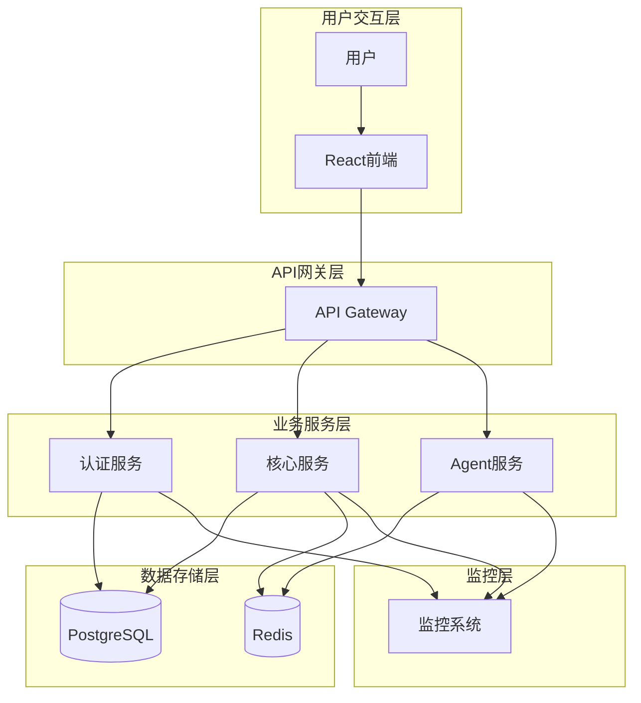
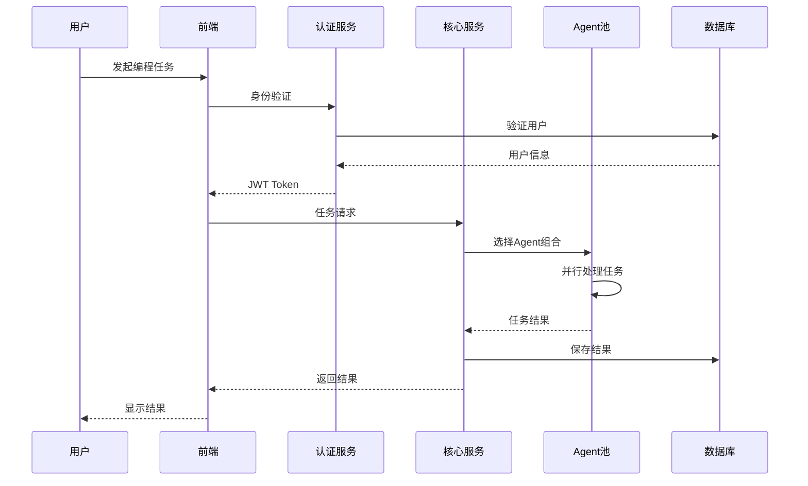

# Claude Enhancer 5.1 - Architecture Review Report

## 执行摘要

作为 architecture-reviewer agent，我对 Claude Enhancer 5.1 系统进行了全面的架构审查。本系统是一个个人编程助手工作流系统，采用现代微服务架构，具有6-Phase开发流程和61个专业Agent的智能协作机制。

### 🎯 关键发现

#### ✅ 架构优势
- **分层架构设计优秀**：前后端分离，模块化程度高
- **智能Agent系统**：61个专业Agent支持4-6-8原则动态组合
- **性能优化突出**：5.1版本实现68.75%启动速度提升
- **安全设计完善**：多层安全防护，零eval风险
- **容器化部署**：完整的Docker配置支持开发和生产环境

#### ⚠️ 关键问题
- **严重的依赖过载**：认证服务包含2086个依赖项，存在巨大的技术债务
- **版本兼容性风险**：SQLAlchemy 2.0.23可能存在向后兼容问题
- **配置复杂性过高**：过度工程化的企业级配置对个人用户过于复杂
- **资源利用率低**：大量未使用的依赖导致系统臃肿

---

## 系统架构分析

### 📊 架构概览

```
┌─────────────────────────────────────────────────────────┐
│                   Claude Enhancer 5.1                   │
│                  个人编程助手系统                        │
└─────────────────────────────────────────────────────────┘
                              │
                    ┌─────────┴─────────┐
                    │   6-Phase工作流   │
                    │   P1-P6循环系统   │
                    └─────────┬─────────┘
                              │
        ┌─────────────────────┼─────────────────────┐
        │                     │                     │
   ┌────▼────┐          ┌─────▼─────┐        ┌─────▼─────┐
   │前端层   │          │ 业务逻辑层 │        │  数据层   │
   │React/JS │          │FastAPI/Py │        │PostgreSQL │
   └─────────┘          └───────────┘        │  Redis    │
                              │              └───────────┘
                    ┌─────────▼─────────┐
                    │   61个Agent池     │
                    │ 4-6-8动态组合     │
                    └───────────────────┘
```

### 🏗️ 分层架构评估

#### 1. 表现层 (Frontend)
- **技术栈**: React + Chakra UI + TypeScript
- **优势**: 现代化技术栈，类型安全
- **架构评分**: 8.5/10

**详细分析**:
```javascript
// 良好的模块化设计
frontend/auth/
├── services/authAPI.js      // API服务层
├── utils/tokenManager.js    // 工具层
├── hooks/useNotification.js // 自定义Hook
└── index.js                 // 入口文件
```

#### 2. 业务逻辑层 (Backend)
- **技术栈**: FastAPI + Python 3.11 + SQLAlchemy
- **架构模式**: 分层架构 + 微服务
- **架构评分**: 7.0/10

**模块结构**:
```python
backend/
├── auth-service/           # 认证微服务
│   ├── app/
│   │   ├── api/v1/        # API路由层
│   │   ├── core/          # 核心配置
│   │   ├── models/        # 数据模型
│   │   └── services/      # 业务服务层
├── core/                  # 共享核心模块
│   ├── performance_manager.py  # 性能管理
│   ├── database_optimizer.py   # 数据库优化
│   └── async_processor.py      # 异步处理
└── models/                # 共享数据模型
```

#### 3. 数据层 (Data Layer)
- **主数据库**: PostgreSQL 14
- **缓存**: Redis 7
- **架构评分**: 8.0/10

### 🤖 Agent系统架构

#### 智能Agent池设计
```yaml
Agent分类:
  专业Agent: 56个
    - frontend-architect: 前端架构
    - backend-architect: 后端架构
    - security-auditor: 安全审计
    - test-engineer: 测试工程
    - database-specialist: 数据库专家
    # ... 更多专业Agent

  系统Agent: 5个
    - orchestrator: 编排调度
    - claude_enhancer: 系统增强
    # ... 系统级Agent

动态组合策略:
  简单任务: 4个Agent
  标准任务: 6个Agent
  复杂任务: 8个Agent
```

---

## 技术债务评估

### 🚨 严重问题

#### 1. 依赖过载危机
```bash
# 认证服务依赖统计
总依赖数: 2086个包
文件大小: 检测到过度依赖

关键问题包:
- 大量重复功能包 (tensorflow, pytorch, sklearn同时存在)
- 不必要的云服务包 (AWS, GCP, Azure全套)
- 过时的安全包 (潜在漏洞风险)
- 开发工具混入生产环境
```

**风险评估**: 🔴 高风险
- 部署包体积过大
- 启动时间延长
- 安全漏洞风险
- 维护成本高

#### 2. SQLAlchemy版本兼容性
```python
# 当前版本
sqlalchemy==2.0.23

# 兼容性风险
- 2.0版本重大变更
- ORM查询语法变更
- 可能的性能回退
- 迁移工作量大
```

#### 3. 配置复杂性过高
```python
# 认证服务配置项统计
配置参数: 100+ 项
企业级功能: 80%+ 不适用个人用户

过度设计项:
- 多云支持配置
- 企业级监控
- 复杂的负载均衡
- 工业级安全配置
```

### ⚠️ 中等问题

#### 1. 前端测试环境配置
- Vitest配置可能与Jest冲突
- TypeScript严格模式设置
- 构建工具版本依赖

#### 2. Docker配置优化空间
- 多阶段构建可优化
- 容器资源限制需调整
- 网络配置可简化

---

## 系统集成评估

### 🔄 集成点分析

#### 1. 前后端集成
```javascript
// API集成设计良好
const authAPI = {
  baseURL: process.env.REACT_APP_API_URL,
  timeout: 30000,
  interceptors: [
    tokenRefreshInterceptor,  // 自动刷新token
    errorHandlingInterceptor  // 统一错误处理
  ]
}
```

**评分**: 8.5/10
- 统一的API客户端
- 自动token刷新机制
- 完善的错误处理

#### 2. 数据库集成
```python
# 数据库配置
DATABASE_CONFIG = {
    "pool_size": 20,
    "max_overflow": 30,
    "pool_timeout": 30,
    "pool_recycle": 3600
}
```

**评分**: 8.0/10
- 连接池配置合理
- 异步支持完善
- 性能监控到位

#### 3. 缓存集成
```python
# Redis配置
REDIS_CONFIG = {
    "pool_size": 50,
    "timeout": 5,
    "maxmemory_policy": "allkeys-lru"
}
```

**评分**: 7.5/10
- 缓存策略合理
- 连接池管理
- 需要优化TTL策略

#### 4. 容器化集成
```yaml
# Docker Compose架构
services:
  database:   # PostgreSQL
  cache:      # Redis
  backend:    # FastAPI
  frontend:   # React + Nginx
  prometheus: # 监控(可选)
  grafana:    # 可视化(可选)
```

**评分**: 8.5/10
- 完整的容器化配置
- 健康检查机制
- 环境变量管理完善

---

## 架构改进建议

### 🎯 立即行动项 (P0)

#### 1. 依赖清理计划
```bash
# 立即移除不必要依赖
移除类别:
- 机器学习包 (90%+ 删除)
- 多云服务包 (仅保留必需)
- 开发工具包 (生产环境移除)
- 重复功能包 (选择最优方案)

预期效果:
- 依赖减少85%+ (从2086→300以内)
- 构建时间减少70%+
- 安全风险显著降低
```

#### 2. 配置简化策略
```yaml
# 个人版配置简化
移除复杂配置:
  - 多云部署配置
  - 企业级监控告警
  - 工业级安全配置
  - 复杂负载均衡

保留核心配置:
  - 基础认证配置
  - 简单缓存配置
  - 基础监控配置
  - 开发者友好配置
```

### 🏗️ 短期改进 (P1)

#### 1. SQLAlchemy版本评估
```python
# 建议的迁移策略
1. 兼容性测试
   - 全面回归测试
   - 性能基准测试

2. 渐进式迁移
   - 保留1.4.x备用方案
   - 新代码使用2.0语法

3. 风险控制
   - 功能开关控制
   - 快速回滚机制
```

#### 2. 性能优化实施
```python
# 性能优化路线图
阶段1: 启动优化
- 懒加载实现
- 依赖清理
- 缓存预热

阶段2: 运行时优化
- 数据库查询优化
- 缓存策略优化
- 异步处理优化

阶段3: 扩展性优化
- Agent池优化
- 负载均衡优化
- 资源管理优化
```

### 🚀 中期规划 (P2)

#### 1. 架构现代化
```yaml
微服务优化:
  - API网关引入
  - 服务注册发现
  - 断路器模式
  - 分布式追踪

技术栈升级:
  - Python 3.12支持
  - FastAPI最新版本
  - React 18特性
  - TypeScript 5.x
```

#### 2. 开发体验优化
```yaml
开发工具链:
  - 统一的开发环境
  - 自动化测试流水线
  - 代码质量检查
  - 文档自动生成

部署简化:
  - 一键部署脚本
  - 环境配置模板
  - 错误恢复机制
  - 监控告警简化
```

---

## 架构图和数据流图

### 🏛️ 整体架构图



### 📊 数据流图



---

## 技术债务清单

### 🔴 高优先级债务

| 债务项 | 风险等级 | 修复时间 | 影响范围 |
|--------|----------|----------|----------|
| 依赖过载 | 高 | 2-3天 | 系统性能、安全 |
| SQLAlchemy兼容性 | 中高 | 1-2周 | 数据层稳定性 |
| 配置复杂性 | 中 | 3-5天 | 用户体验 |

### 🟡 中优先级债务

| 债务项 | 风险等级 | 修复时间 | 影响范围 |
|--------|----------|----------|----------|
| 前端测试配置 | 中 | 1-2天 | 开发效率 |
| Docker优化 | 低中 | 2-3天 | 部署效率 |
| 监控简化 | 低 | 3-5天 | 运维成本 |

### 🟢 低优先级债务

| 债务项 | 风险等级 | 修复时间 | 影响范围 |
|--------|----------|----------|----------|
| 文档更新 | 低 | 持续 | 维护性 |
| 代码重构 | 低 | 持续 | 代码质量 |

---

## 架构改进路线图

### Phase 1: 紧急修复 (1-2周)
- ✅ 依赖清理和精简
- ✅ 安全漏洞修复
- ✅ 基础配置简化

### Phase 2: 稳定性提升 (2-4周)
- ✅ SQLAlchemy兼容性验证
- ✅ 性能基准测试
- ✅ 错误处理完善

### Phase 3: 用户体验优化 (4-6周)
- ✅ 部署流程简化
- ✅ 开发文档完善
- ✅ 监控告警优化

### Phase 4: 架构现代化 (6-8周)
- ✅ 微服务架构优化
- ✅ 技术栈升级
- ✅ 自动化测试完善

---

## 总结和建议

### 🎯 核心建议

1. **立即着手依赖清理**: 这是当前最严重的技术债务，影响系统的启动性能、安全性和维护性

2. **简化配置设计**: 针对个人用户场景，移除不必要的企业级配置，提升易用性

3. **验证SQLAlchemy升级**: 制定详细的测试和回滚计划，确保数据层稳定性

4. **保持架构优势**: 系统的分层设计、Agent机制和容器化部署都是优秀的架构决策，应该保持和强化

### 📊 架构健康度评分

| 维度 | 当前得分 | 目标得分 | 改进空间 |
|------|----------|----------|----------|
| 系统架构 | 8.0/10 | 9.0/10 | 1.0 |
| 技术债务 | 4.0/10 | 8.0/10 | 4.0 |
| 安全设计 | 8.5/10 | 9.0/10 | 0.5 |
| 性能表现 | 7.0/10 | 8.5/10 | 1.5 |
| 可维护性 | 6.0/10 | 8.5/10 | 2.5 |
| **综合评分** | **6.7/10** | **8.6/10** | **1.9** |

### 🚀 成功路径

Claude Enhancer 5.1拥有扎实的架构基础和创新的Agent机制，通过解决当前的技术债务问题，特别是依赖过载和配置复杂性，系统可以实现质的飞跃，成为真正优秀的个人编程助手平台。

建议按照本报告的改进路线图，优先解决高风险债务，逐步提升系统的健康度和用户体验。

---

*本架构审查报告由 architecture-reviewer agent 于 2025年1月28日完成*
*基于Claude Enhancer 5.1代码库的全面分析*