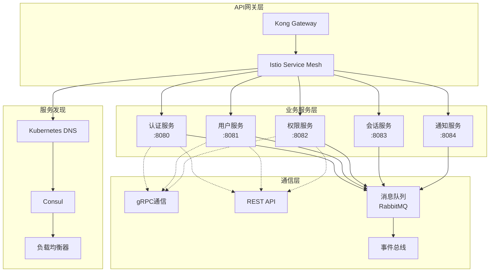

# 🔄 Claude Enhancer 微服务通信架构设计

## 📋 文档信息
- **项目名称**: Claude Enhancer 微服务通信架构
- **版本**: v1.0
- **创建日期**: 2025-09-22
- **架构师**: Middleware-Specialist + API-Designer
- **文档状态**: 技术方案

---

## 🌐 1. 服务间通信概览

### 1.1 通信架构图



### 1.2 通信协议选择

| 通信场景 | 协议 | 理由 | 延迟要求 |
|----------|------|------|----------|
| **客户端-服务** | HTTP/2 REST | 标准化，易于调试 | < 100ms |
| **服务间同步** | gRPC | 高性能，类型安全 | < 10ms |
| **服务间异步** | AMQP (RabbitMQ) | 可靠消息传递 | < 1s |
| **实时通知** | WebSocket | 双向实时通信 | < 50ms |
| **批量数据** | HTTP/2 + 流式 | 支持大数据传输 | < 5s |

---

## 🔌 2. gRPC服务间通信

### 2.1 gRPC服务定义

```protobuf
// proto/auth_service.proto
syntax = "proto3";

package perfect21.auth;

option go_package = "github.com/perfect21/proto/auth";

// 认证服务
service AuthService {
    // 验证Token
    rpc ValidateToken(ValidateTokenRequest) returns (ValidateTokenResponse);

    // 刷新Token
    rpc RefreshToken(RefreshTokenRequest) returns (RefreshTokenResponse);

    // 撤销Token
    rpc RevokeToken(RevokeTokenRequest) returns (RevokeTokenResponse);

    // 验证用户凭据
    rpc ValidateCredentials(ValidateCredentialsRequest) returns (ValidateCredentialsResponse);

    // 批量Token验证
    rpc BatchValidateTokens(BatchValidateTokensRequest) returns (BatchValidateTokensResponse);
}

message ValidateTokenRequest {
    string token = 1;
    string client_ip = 2;
    string user_agent = 3;
    map<string, string> device_info = 4;
}

message ValidateTokenResponse {
    bool valid = 1;
    string user_id = 2;
    repeated string permissions = 3;
    int64 expires_at = 4;
    string error_message = 5;
    repeated string warnings = 6;
}

message TokenClaims {
    string user_id = 1;
    repeated string permissions = 2;
    repeated string roles = 3;
    int64 issued_at = 4;
    int64 expires_at = 5;
    string jti = 6;
}

// proto/user_service.proto
syntax = "proto3";

package perfect21.user;

service UserService {
    // 获取用户信息
    rpc GetUser(GetUserRequest) returns (GetUserResponse);

    // 批量获取用户信息
    rpc BatchGetUsers(BatchGetUsersRequest) returns (BatchGetUsersResponse);

    // 验证用户密码
    rpc VerifyPassword(VerifyPasswordRequest) returns (VerifyPasswordResponse);

    // 更新用户状态
    rpc UpdateUserStatus(UpdateUserStatusRequest) returns (UpdateUserStatusResponse);

    // 记录登录历史
    rpc RecordLoginHistory(RecordLoginHistoryRequest) returns (RecordLoginHistoryResponse);
}

message GetUserRequest {
    oneof identifier {
        string user_id = 1;
        string email = 2;
        string username = 3;
    }
    repeated string fields = 4; // 指定返回字段
}

message GetUserResponse {
    User user = 1;
    string error_message = 2;
}

message User {
    string id = 1;
    string email = 2;
    string username = 3;
    string first_name = 4;
    string last_name = 5;
    string phone_number = 6;
    UserStatus status = 7;
    bool is_active = 8;
    bool is_verified = 9;
    bool mfa_enabled = 10;
    int64 created_at = 11;
    int64 last_login_at = 12;
    map<string, string> profile = 13;
}

enum UserStatus {
    PENDING_VERIFICATION = 0;
    ACTIVE = 1;
    LOCKED = 2;
    SUSPENDED = 3;
    DELETED = 4;
}

// proto/permission_service.proto
syntax = "proto3";

package perfect21.permission;

service PermissionService {
    // 检查单个权限
    rpc CheckPermission(CheckPermissionRequest) returns (CheckPermissionResponse);

    // 批量权限检查
    rpc BatchCheckPermissions(BatchCheckPermissionsRequest) returns (BatchCheckPermissionsResponse);

    // 获取用户权限
    rpc GetUserPermissions(GetUserPermissionsRequest) returns (GetUserPermissionsResponse);

    // 获取用户角色
    rpc GetUserRoles(GetUserRolesRequest) returns (GetUserRolesResponse);
}

message CheckPermissionRequest {
    string user_id = 1;
    string resource = 2;
    string action = 3;
    string scope = 4;
    map<string, string> context = 5;
}

message CheckPermissionResponse {
    bool allowed = 1;
    string reason = 2;
    repeated string applied_policies = 3;
}

message Permission {
    string id = 1;
    string resource = 2;
    string action = 3;
    string scope = 4;
    string name = 5;
    string description = 6;
}

message Role {
    string id = 1;
    string name = 2;
    string display_name = 3;
    string description = 4;
    int32 priority = 5;
    repeated Permission permissions = 6;
}
```

### 2.2 gRPC客户端实现

```go
// internal/grpc/auth_client.go
package grpc

import (
    "context"
    "time"

    "google.golang.org/grpc"
    "google.golang.org/grpc/credentials/insecure"
    "google.golang.org/grpc/keepalive"
    "github.com/perfect21/proto/auth"
)

type AuthClient struct {
    client auth.AuthServiceClient
    conn   *grpc.ClientConn
}

func NewAuthClient(address string) (*AuthClient, error) {
    // gRPC连接配置
    opts := []grpc.DialOption{
        grpc.WithTransportCredentials(insecure.NewCredentials()),
        grpc.WithKeepaliveParams(keepalive.ClientParameters{
            Time:                10 * time.Second,
            Timeout:             3 * time.Second,
            PermitWithoutStream: true,
        }),
        grpc.WithDefaultCallOptions(
            grpc.MaxCallRecvMsgSize(4*1024*1024), // 4MB
            grpc.MaxCallSendMsgSize(4*1024*1024), // 4MB
        ),
    }

    conn, err := grpc.Dial(address, opts...)
    if err != nil {
        return nil, err
    }

    client := auth.NewAuthServiceClient(conn)

    return &AuthClient{
        client: client,
        conn:   conn,
    }, nil
}

func (c *AuthClient) ValidateToken(ctx context.Context, token string, clientIP string, userAgent string) (*auth.ValidateTokenResponse, error) {
    ctx, cancel := context.WithTimeout(ctx, 5*time.Second)
    defer cancel()

    req := &auth.ValidateTokenRequest{
        Token:     token,
        ClientIp:  clientIP,
        UserAgent: userAgent,
    }

    return c.client.ValidateToken(ctx, req)
}

func (c *AuthClient) BatchValidateTokens(ctx context.Context, tokens []string) (*auth.BatchValidateTokensResponse, error) {
    ctx, cancel := context.WithTimeout(ctx, 10*time.Second)
    defer cancel()

    req := &auth.BatchValidateTokensRequest{
        Tokens: tokens,
    }

    return c.client.BatchValidateTokens(ctx, req)
}

func (c *AuthClient) Close() error {
    return c.conn.Close()
}

// internal/grpc/client_pool.go
package grpc

import (
    "sync"
    "time"
)

type ClientPool struct {
    clients []*AuthClient
    current int
    mutex   sync.RWMutex
}

func NewClientPool(addresses []string) (*ClientPool, error) {
    clients := make([]*AuthClient, len(addresses))

    for i, addr := range addresses {
        client, err := NewAuthClient(addr)
        if err != nil {
            return nil, err
        }
        clients[i] = client
    }

    return &ClientPool{
        clients: clients,
    }, nil
}

func (p *ClientPool) GetClient() *AuthClient {
    p.mutex.RLock()
    defer p.mutex.RUnlock()

    client := p.clients[p.current]
    p.current = (p.current + 1) % len(p.clients)

    return client
}

func (p *ClientPool) Close() {
    for _, client := range p.clients {
        client.Close()
    }
}
```

### 2.3 gRPC服务端实现

```python
# shared/grpc/server.py
import asyncio
import grpc
from concurrent.futures import ThreadPoolExecutor
from grpc_reflection.v1alpha import reflection
from grpc_health.v1 import health
from grpc_health.v1 import health_pb2_grpc

from proto import auth_pb2_grpc, auth_pb2
from services.auth_service import AuthService

class GRPCServer:
    """gRPC服务器"""

    def __init__(self, port: int = 50051):
        self.port = port
        self.server = None
        self.auth_service = AuthService()

    async def start(self):
        """启动gRPC服务器"""
        # 创建线程池
        executor = ThreadPoolExecutor(max_workers=10)

        # 创建服务器
        self.server = grpc.aio.server(
            futures.ThreadPoolExecutor(max_workers=10),
            options=[
                ('grpc.keepalive_time_ms', 10000),
                ('grpc.keepalive_timeout_ms', 3000),
                ('grpc.keepalive_permit_without_calls', True),
                ('grpc.http2.max_pings_without_data', 0),
                ('grpc.http2.min_time_between_pings_ms', 10000),
                ('grpc.http2.min_ping_interval_without_data_ms', 300000),
                ('grpc.max_connection_idle_ms', 300000),
            ]
        )

        # 注册服务
        auth_pb2_grpc.add_AuthServiceServicer_to_server(
            AuthServicer(self.auth_service),
            self.server
        )

        # 注册健康检查
        health_servicer = health.HealthServicer()
        health_pb2_grpc.add_HealthServicer_to_server(health_servicer, self.server)

        # 注册反射服务（用于调试）
        service_names = (
            auth_pb2.DESCRIPTOR.services_by_name['AuthService'].full_name,
            reflection.SERVICE_NAME,
        )
        reflection.enable_server_reflection(service_names, self.server)

        # 监听端口
        listen_addr = f'[::]:{self.port}'
        self.server.add_insecure_port(listen_addr)

        await self.server.start()
        print(f"gRPC server started on {listen_addr}")

        # 设置健康状态
        health_servicer.set("", health_pb2.HealthCheckResponse.SERVING)

    async def stop(self):
        """停止服务器"""
        if self.server:
            await self.server.stop(grace=5)

class AuthServicer(auth_pb2_grpc.AuthServiceServicer):
    """认证服务gRPC实现"""

    def __init__(self, auth_service: AuthService):
        self.auth_service = auth_service

    async def ValidateToken(self, request, context):
        """验证Token"""
        try:
            result = await self.auth_service.validate_token(
                token=request.token,
                client_ip=request.client_ip,
                user_agent=request.user_agent,
                device_info=dict(request.device_info)
            )

            if result['valid']:
                return auth_pb2.ValidateTokenResponse(
                    valid=True,
                    user_id=result['user_id'],
                    permissions=result['permissions'],
                    expires_at=result['expires_at'],
                    warnings=result.get('warnings', [])
                )
            else:
                return auth_pb2.ValidateTokenResponse(
                    valid=False,
                    error_message=result.get('error', 'Token validation failed')
                )

        except Exception as e:
            context.set_code(grpc.StatusCode.INTERNAL)
            context.set_details(f'Internal error: {str(e)}')
            return auth_pb2.ValidateTokenResponse(valid=False)

    async def BatchValidateTokens(self, request, context):
        """批量验证Token"""
        try:
            results = await self.auth_service.batch_validate_tokens(
                tokens=list(request.tokens)
            )

            response_results = []
            for result in results:
                response_results.append(
                    auth_pb2.ValidateTokenResponse(
                        valid=result['valid'],
                        user_id=result.get('user_id', ''),
                        permissions=result.get('permissions', []),
                        expires_at=result.get('expires_at', 0),
                        error_message=result.get('error', '')
                    )
                )

            return auth_pb2.BatchValidateTokensResponse(
                results=response_results
            )

        except Exception as e:
            context.set_code(grpc.StatusCode.INTERNAL)
            context.set_details(f'Internal error: {str(e)}')
            return auth_pb2.BatchValidateTokensResponse()
```

---

## 🚌 3. 消息队列通信架构

### 3.1 RabbitMQ配置

```yaml
# rabbitmq/rabbitmq.conf
# RabbitMQ配置文件
loopback_users.guest = false
listeners.tcp.default = 5672
management.tcp.port = 15672

# 集群配置
cluster_formation.peer_discovery_backend = k8s
cluster_formation.k8s.host = kubernetes.default.svc.cluster.local
cluster_formation.k8s.address_type = hostname

# 内存和磁盘限制
vm_memory_high_watermark.relative = 0.6
disk_free_limit.relative = 1.0

# SSL配置
ssl_options.cacertfile = /etc/rabbitmq/ca_certificate.pem
ssl_options.certfile = /etc/rabbitmq/server_certificate.pem
ssl_options.keyfile = /etc/rabbitmq/server_key.pem
ssl_options.verify = verify_peer
ssl_options.fail_if_no_peer_cert = true

# 日志配置
log.console = true
log.console.level = info
log.file = /var/log/rabbitmq/rabbit.log
log.file.level = info
```

### 3.2 消息模式定义

```python
# shared/messaging/message_schemas.py
from typing import Dict, Any, Optional, List
from pydantic import BaseModel
from datetime import datetime
from enum import Enum

class MessageType(str, Enum):
    # 认证事件
    USER_REGISTERED = "user.registered"
    USER_LOGIN = "user.login"
    USER_LOGOUT = "user.logout"
    PASSWORD_CHANGED = "user.password_changed"
    MFA_ENABLED = "user.mfa_enabled"

    # 权限事件
    ROLE_ASSIGNED = "permission.role_assigned"
    ROLE_REVOKED = "permission.role_revoked"
    PERMISSION_GRANTED = "permission.granted"
    PERMISSION_REVOKED = "permission.revoked"

    # 安全事件
    SUSPICIOUS_ACTIVITY = "security.suspicious_activity"
    ACCOUNT_LOCKED = "security.account_locked"
    SECURITY_ALERT = "security.alert"

    # 通知事件
    EMAIL_SEND = "notification.email.send"
    SMS_SEND = "notification.sms.send"
    PUSH_SEND = "notification.push.send"

class BaseMessage(BaseModel):
    """基础消息结构"""
    message_id: str
    message_type: MessageType
    timestamp: datetime
    source_service: str
    correlation_id: Optional[str] = None
    user_id: Optional[str] = None
    data: Dict[str, Any]
    metadata: Optional[Dict[str, Any]] = None

class UserRegisteredMessage(BaseModel):
    """用户注册消息"""
    user_id: str
    email: str
    first_name: Optional[str]
    last_name: Optional[str]
    verification_token: str
    registration_ip: str
    user_agent: str

class UserLoginMessage(BaseModel):
    """用户登录消息"""
    user_id: str
    email: str
    login_successful: bool
    ip_address: str
    user_agent: str
    location: Optional[Dict[str, str]]
    mfa_used: bool
    risk_score: Optional[float]
    failure_reason: Optional[str]

class SecurityAlertMessage(BaseModel):
    """安全警告消息"""
    user_id: str
    alert_type: str
    severity: str  # low, medium, high, critical
    description: str
    details: Dict[str, Any]
    ip_address: str
    user_agent: str
    recommended_actions: List[str]

class EmailNotificationMessage(BaseModel):
    """邮件通知消息"""
    recipient: str
    template_name: str
    subject: str
    template_data: Dict[str, Any]
    priority: str = "normal"  # low, normal, high, urgent
    send_at: Optional[datetime] = None
```

### 3.3 消息发布者

```python
# shared/messaging/publisher.py
import asyncio
import json
import uuid
from datetime import datetime
from typing import Dict, Any, Optional
import aio_pika
from aio_pika import DeliveryMode, Message
from aio_pika.pool import Pool

from .message_schemas import BaseMessage, MessageType

class MessagePublisher:
    """消息发布者"""

    def __init__(self, rabbitmq_url: str):
        self.rabbitmq_url = rabbitmq_url
        self.connection_pool = None
        self.channel_pool = None

    async def initialize(self):
        """初始化连接池"""
        async def get_connection():
            return await aio_pika.connect_robust(
                self.rabbitmq_url,
                client_properties={"connection_name": "perfect21-publisher"}
            )

        self.connection_pool = Pool(get_connection, max_size=10)

        async def get_channel():
            async with self.connection_pool.acquire() as connection:
                return await connection.channel()

        self.channel_pool = Pool(get_channel, max_size=20)

    async def publish_message(
        self,
        message_type: MessageType,
        data: Dict[str, Any],
        user_id: Optional[str] = None,
        correlation_id: Optional[str] = None,
        routing_key: Optional[str] = None,
        priority: int = 0,
        delay_seconds: int = 0
    ):
        """发布消息"""

        # 创建消息
        message = BaseMessage(
            message_id=str(uuid.uuid4()),
            message_type=message_type,
            timestamp=datetime.utcnow(),
            source_service="auth-service",  # 从配置获取
            correlation_id=correlation_id,
            user_id=user_id,
            data=data
        )

        # 序列化消息
        message_body = message.json().encode()

        # 创建AMQP消息
        amqp_message = Message(
            message_body,
            delivery_mode=DeliveryMode.PERSISTENT,
            priority=priority,
            message_id=message.message_id,
            timestamp=message.timestamp,
            headers={
                "message_type": message_type.value,
                "source_service": message.source_service,
                "user_id": user_id,
                "correlation_id": correlation_id
            }
        )

        # 延迟发送
        if delay_seconds > 0:
            amqp_message.headers["x-delay"] = delay_seconds * 1000

        # 确定路由键
        if not routing_key:
            routing_key = self._get_routing_key(message_type)

        # 发布消息
        async with self.channel_pool.acquire() as channel:
            exchange = await channel.declare_exchange(
                "perfect21.events",
                aio_pika.ExchangeType.TOPIC,
                durable=True
            )

            await exchange.publish(
                amqp_message,
                routing_key=routing_key
            )

    def _get_routing_key(self, message_type: MessageType) -> str:
        """获取路由键"""
        routing_map = {
            MessageType.USER_REGISTERED: "user.events.registered",
            MessageType.USER_LOGIN: "user.events.login",
            MessageType.USER_LOGOUT: "user.events.logout",
            MessageType.PASSWORD_CHANGED: "user.events.password_changed",
            MessageType.MFA_ENABLED: "user.events.mfa_enabled",

            MessageType.ROLE_ASSIGNED: "permission.events.role_assigned",
            MessageType.ROLE_REVOKED: "permission.events.role_revoked",
            MessageType.PERMISSION_GRANTED: "permission.events.granted",
            MessageType.PERMISSION_REVOKED: "permission.events.revoked",

            MessageType.SUSPICIOUS_ACTIVITY: "security.events.suspicious",
            MessageType.ACCOUNT_LOCKED: "security.events.locked",
            MessageType.SECURITY_ALERT: "security.events.alert",

            MessageType.EMAIL_SEND: "notification.email.send",
            MessageType.SMS_SEND: "notification.sms.send",
            MessageType.PUSH_SEND: "notification.push.send",
        }

        return routing_map.get(message_type, "events.unknown")

    async def close(self):
        """关闭连接池"""
        if self.channel_pool:
            await self.channel_pool.close()
        if self.connection_pool:
            await self.connection_pool.close()

# 使用示例
class AuthEventPublisher:
    """认证事件发布者"""

    def __init__(self, publisher: MessagePublisher):
        self.publisher = publisher

    async def publish_user_login(
        self,
        user_id: str,
        email: str,
        login_successful: bool,
        ip_address: str,
        user_agent: str,
        mfa_used: bool = False,
        risk_score: Optional[float] = None
    ):
        """发布用户登录事件"""

        data = {
            "user_id": user_id,
            "email": email,
            "login_successful": login_successful,
            "ip_address": ip_address,
            "user_agent": user_agent,
            "mfa_used": mfa_used,
            "risk_score": risk_score
        }

        await self.publisher.publish_message(
            message_type=MessageType.USER_LOGIN,
            data=data,
            user_id=user_id,
            priority=5 if not login_successful else 0
        )

    async def publish_security_alert(
        self,
        user_id: str,
        alert_type: str,
        severity: str,
        description: str,
        details: Dict[str, Any],
        ip_address: str
    ):
        """发布安全警告事件"""

        data = {
            "user_id": user_id,
            "alert_type": alert_type,
            "severity": severity,
            "description": description,
            "details": details,
            "ip_address": ip_address,
            "recommended_actions": self._get_recommended_actions(alert_type, severity)
        }

        # 根据严重性设置优先级
        priority_map = {"low": 1, "medium": 3, "high": 7, "critical": 9}
        priority = priority_map.get(severity, 1)

        await self.publisher.publish_message(
            message_type=MessageType.SECURITY_ALERT,
            data=data,
            user_id=user_id,
            priority=priority
        )

    def _get_recommended_actions(self, alert_type: str, severity: str) -> List[str]:
        """获取推荐操作"""
        if severity == "critical":
            return [
                "立即更改密码",
                "启用多因子认证",
                "检查账户活动",
                "联系技术支持"
            ]
        elif severity == "high":
            return [
                "检查登录活动",
                "考虑启用多因子认证",
                "更新密码"
            ]
        else:
            return [
                "查看账户安全设置",
                "定期更新密码"
            ]
```

### 3.4 消息消费者

```python
# shared/messaging/consumer.py
import asyncio
import json
from typing import Callable, Dict, List
import aio_pika
from aio_pika.abc import AbstractIncomingMessage

from .message_schemas import BaseMessage, MessageType

class MessageConsumer:
    """消息消费者"""

    def __init__(self, rabbitmq_url: str, service_name: str):
        self.rabbitmq_url = rabbitmq_url
        self.service_name = service_name
        self.connection = None
        self.channel = None
        self.handlers: Dict[MessageType, List[Callable]] = {}

    async def initialize(self):
        """初始化连接"""
        self.connection = await aio_pika.connect_robust(
            self.rabbitmq_url,
            client_properties={"connection_name": f"perfect21-{self.service_name}"}
        )

        self.channel = await self.connection.channel()
        await self.channel.set_qos(prefetch_count=10)

        # 声明交换机
        self.exchange = await self.channel.declare_exchange(
            "perfect21.events",
            aio_pika.ExchangeType.TOPIC,
            durable=True
        )

    def register_handler(self, message_type: MessageType, handler: Callable):
        """注册消息处理器"""
        if message_type not in self.handlers:
            self.handlers[message_type] = []
        self.handlers[message_type].append(handler)

    async def start_consuming(self, queue_bindings: List[Dict[str, str]]):
        """开始消费消息"""

        # 为每个绑定创建队列
        for binding in queue_bindings:
            queue_name = f"{self.service_name}.{binding['queue_suffix']}"

            queue = await self.channel.declare_queue(
                queue_name,
                durable=True,
                arguments={
                    "x-message-ttl": 86400000,  # 24小时TTL
                    "x-max-length": 10000,      # 最大消息数
                }
            )

            # 绑定队列到交换机
            await queue.bind(
                self.exchange,
                routing_key=binding['routing_key']
            )

            # 开始消费
            await queue.consume(
                self._message_handler,
                no_ack=False
            )

    async def _message_handler(self, message: AbstractIncomingMessage):
        """消息处理器"""
        async with message.process():
            try:
                # 解析消息
                message_data = json.loads(message.body.decode())
                base_message = BaseMessage(**message_data)

                # 查找处理器
                handlers = self.handlers.get(base_message.message_type, [])

                if not handlers:
                    print(f"No handler found for message type: {base_message.message_type}")
                    return

                # 执行所有处理器
                for handler in handlers:
                    try:
                        await handler(base_message)
                    except Exception as e:
                        print(f"Handler error for {base_message.message_type}: {e}")
                        # 可以根据错误类型决定是否重试

            except Exception as e:
                print(f"Message processing error: {e}")
                # 消息处理失败，可以选择拒绝消息并重新排队
                raise

    async def close(self):
        """关闭连接"""
        if self.connection:
            await self.connection.close()

# 通知服务消费者示例
class NotificationConsumer:
    """通知服务消费者"""

    def __init__(self, consumer: MessageConsumer, email_service, sms_service):
        self.consumer = consumer
        self.email_service = email_service
        self.sms_service = sms_service

        # 注册处理器
        self._register_handlers()

    def _register_handlers(self):
        """注册消息处理器"""
        self.consumer.register_handler(
            MessageType.USER_REGISTERED,
            self.handle_user_registered
        )

        self.consumer.register_handler(
            MessageType.USER_LOGIN,
            self.handle_user_login
        )

        self.consumer.register_handler(
            MessageType.SECURITY_ALERT,
            self.handle_security_alert
        )

        self.consumer.register_handler(
            MessageType.EMAIL_SEND,
            self.handle_email_send
        )

    async def handle_user_registered(self, message: BaseMessage):
        """处理用户注册事件"""
        data = message.data

        # 发送欢迎邮件
        await self.email_service.send_welcome_email(
            email=data['email'],
            first_name=data.get('first_name'),
            verification_token=data['verification_token']
        )

        print(f"Welcome email sent to {data['email']}")

    async def handle_user_login(self, message: BaseMessage):
        """处理用户登录事件"""
        data = message.data

        # 如果登录失败或风险较高，发送通知
        if not data['login_successful'] or (data.get('risk_score', 0) > 0.7):
            await self.email_service.send_login_notification(
                email=data['email'],
                login_info=data
            )

    async def handle_security_alert(self, message: BaseMessage):
        """处理安全警告事件"""
        data = message.data

        # 发送安全警告邮件
        await self.email_service.send_security_alert(
            email=data['email'],
            alert_info=data
        )

        # 如果是严重警告，同时发送短信
        if data['severity'] in ['high', 'critical']:
            await self.sms_service.send_security_alert_sms(
                phone_number=data.get('phone_number'),
                alert_type=data['alert_type']
            )

    async def handle_email_send(self, message: BaseMessage):
        """处理邮件发送事件"""
        data = message.data

        await self.email_service.send_template_email(
            recipient=data['recipient'],
            template_name=data['template_name'],
            subject=data['subject'],
            template_data=data['template_data'],
            priority=data.get('priority', 'normal')
        )

    async def start(self):
        """启动消费者"""
        queue_bindings = [
            {
                "queue_suffix": "user_events",
                "routing_key": "user.events.*"
            },
            {
                "queue_suffix": "security_events",
                "routing_key": "security.events.*"
            },
            {
                "queue_suffix": "notification_requests",
                "routing_key": "notification.*.*"
            }
        ]

        await self.consumer.start_consuming(queue_bindings)
```

---

## 🔍 4. 服务发现和负载均衡

### 4.1 Kubernetes服务发现

```yaml
# k8s/service-discovery.yaml
apiVersion: v1
kind: Service
metadata:
  name: auth-service
  namespace: perfect21-auth
  labels:
    app: auth-service
    version: v1
spec:
  selector:
    app: auth-service
  ports:
  - name: http
    port: 80
    targetPort: 8080
    protocol: TCP
  - name: grpc
    port: 50051
    targetPort: 50051
    protocol: TCP
  type: ClusterIP

---
apiVersion: v1
kind: Service
metadata:
  name: auth-service-headless
  namespace: perfect21-auth
spec:
  clusterIP: None
  selector:
    app: auth-service
  ports:
  - name: grpc
    port: 50051
    targetPort: 50051

---
# Istio VirtualService for load balancing
apiVersion: networking.istio.io/v1alpha3
kind: VirtualService
metadata:
  name: auth-service-vs
  namespace: perfect21-auth
spec:
  hosts:
  - auth-service.perfect21-auth.svc.cluster.local
  http:
  - match:
    - headers:
        content-type:
          regex: "application/grpc.*"
    route:
    - destination:
        host: auth-service.perfect21-auth.svc.cluster.local
        port:
          number: 50051
      weight: 100
    fault:
      delay:
        percentage:
          value: 0.1
        fixedDelay: 5s
    retries:
      attempts: 3
      perTryTimeout: 1s
  - route:
    - destination:
        host: auth-service.perfect21-auth.svc.cluster.local
        port:
          number: 80
      weight: 100
    timeout: 30s

---
# Istio DestinationRule for circuit breaker
apiVersion: networking.istio.io/v1alpha3
kind: DestinationRule
metadata:
  name: auth-service-dr
  namespace: perfect21-auth
spec:
  host: auth-service.perfect21-auth.svc.cluster.local
  trafficPolicy:
    connectionPool:
      tcp:
        maxConnections: 100
      http:
        http1MaxPendingRequests: 50
        http2MaxRequests: 100
        maxRequestsPerConnection: 10
        maxRetries: 3
        consecutiveGatewayErrors: 5
        interval: 30s
        baseEjectionTime: 30s
        maxEjectionPercent: 50
    loadBalancer:
      consistentHash:
        httpHeaderName: "user-id"
    outlierDetection:
      consecutive5xxErrors: 3
      interval: 30s
      baseEjectionTime: 30s
      maxEjectionPercent: 50
```

### 4.2 客户端负载均衡

```python
# shared/discovery/service_discovery.py
import asyncio
import random
from typing import List, Dict, Optional
from dataclasses import dataclass
import consul
import aiohttp

@dataclass
class ServiceInstance:
    """服务实例"""
    id: str
    name: str
    address: str
    port: int
    health: str
    metadata: Dict[str, str]

class ServiceDiscovery:
    """服务发现客户端"""

    def __init__(self, consul_host: str = "consul", consul_port: int = 8500):
        self.consul = consul.Consul(host=consul_host, port=consul_port)
        self.service_cache: Dict[str, List[ServiceInstance]] = {}
        self.cache_ttl = 30  # 缓存30秒

    async def discover_service(self, service_name: str) -> List[ServiceInstance]:
        """发现服务实例"""

        # 检查缓存
        if service_name in self.service_cache:
            # 这里应该检查缓存是否过期
            return self.service_cache[service_name]

        try:
            # 从Consul获取服务实例
            index, services = self.consul.health.service(
                service_name,
                passing=True  # 只返回健康的实例
            )

            instances = []
            for service in services:
                service_info = service['Service']
                health_info = service['Checks']

                # 检查健康状态
                health_status = "passing"
                for check in health_info:
                    if check['Status'] != 'passing':
                        health_status = check['Status']
                        break

                instances.append(ServiceInstance(
                    id=service_info['ID'],
                    name=service_info['Service'],
                    address=service_info['Address'],
                    port=service_info['Port'],
                    health=health_status,
                    metadata=service_info.get('Meta', {})
                ))

            # 缓存结果
            self.service_cache[service_name] = instances

            return instances

        except Exception as e:
            print(f"Service discovery error for {service_name}: {e}")
            return []

    async def get_service_url(self, service_name: str, load_balance: str = "round_robin") -> Optional[str]:
        """获取服务URL"""
        instances = await self.discover_service(service_name)

        if not instances:
            return None

        # 负载均衡策略
        if load_balance == "round_robin":
            instance = self._round_robin_select(instances)
        elif load_balance == "random":
            instance = random.choice(instances)
        elif load_balance == "least_connections":
            instance = self._least_connections_select(instances)
        else:
            instance = instances[0]

        return f"http://{instance.address}:{instance.port}"

    def _round_robin_select(self, instances: List[ServiceInstance]) -> ServiceInstance:
        """轮询选择"""
        # 简单实现，实际应该维护计数器
        return instances[0]

    def _least_connections_select(self, instances: List[ServiceInstance]) -> ServiceInstance:
        """最少连接选择"""
        # 这里应该跟踪每个实例的连接数
        return min(instances, key=lambda x: int(x.metadata.get('connections', '0')))

class ServiceClient:
    """服务客户端"""

    def __init__(self, service_discovery: ServiceDiscovery):
        self.discovery = service_discovery
        self.session = aiohttp.ClientSession(
            timeout=aiohttp.ClientTimeout(total=10),
            connector=aiohttp.TCPConnector(
                limit=100,
                limit_per_host=20,
                keepalive_timeout=60
            )
        )

    async def call_service(
        self,
        service_name: str,
        method: str,
        path: str,
        data: Optional[Dict] = None,
        headers: Optional[Dict] = None,
        retries: int = 3
    ) -> Dict:
        """调用服务"""

        for attempt in range(retries):
            try:
                # 获取服务URL
                service_url = await self.discovery.get_service_url(service_name)
                if not service_url:
                    raise Exception(f"Service {service_name} not available")

                url = f"{service_url}{path}"

                # 准备请求
                kwargs = {
                    'headers': headers or {},
                    'timeout': aiohttp.ClientTimeout(total=5)
                }

                if data:
                    kwargs['json'] = data

                # 发送请求
                async with self.session.request(method, url, **kwargs) as response:
                    if response.status < 400:
                        return await response.json()
                    else:
                        error_text = await response.text()
                        raise aiohttp.ClientResponseError(
                            request_info=response.request_info,
                            history=response.history,
                            status=response.status,
                            message=error_text
                        )

            except Exception as e:
                if attempt == retries - 1:
                    raise
                await asyncio.sleep(2 ** attempt)  # 指数退避

    async def close(self):
        """关闭客户端"""
        await self.session.close()

# 使用示例
class AuthServiceClient:
    """认证服务客户端"""

    def __init__(self, service_client: ServiceClient):
        self.client = service_client

    async def validate_token(self, token: str) -> Dict:
        """验证Token"""
        return await self.client.call_service(
            service_name="auth-service",
            method="POST",
            path="/api/v1/auth/validate",
            data={"token": token}
        )

    async def get_user_permissions(self, user_id: str) -> List[str]:
        """获取用户权限"""
        result = await self.client.call_service(
            service_name="permission-service",
            method="GET",
            path=f"/api/v1/permissions/users/{user_id}"
        )
        return result.get("permissions", [])
```

---

## 📊 5. 监控和链路追踪

### 5.1 分布式链路追踪

```python
# shared/tracing/tracer.py
from opentelemetry import trace
from opentelemetry.exporter.jaeger.thrift import JaegerExporter
from opentelemetry.sdk.trace import TracerProvider
from opentelemetry.sdk.trace.export import BatchSpanProcessor
from opentelemetry.instrumentation.fastapi import FastAPIInstrumentor
from opentelemetry.instrumentation.requests import RequestsInstrumentor
from opentelemetry.instrumentation.aiopg import AiopgInstrumentor
from opentelemetry.instrumentation.redis import RedisInstrumentor

def setup_tracing(service_name: str, jaeger_endpoint: str):
    """设置链路追踪"""

    # 设置TracerProvider
    trace.set_tracer_provider(TracerProvider())
    tracer = trace.get_tracer(__name__)

    # 配置Jaeger导出器
    jaeger_exporter = JaegerExporter(
        agent_host_name="jaeger-agent",
        agent_port=6831,
        collector_endpoint=jaeger_endpoint,
    )

    # 添加导出器到TracerProvider
    span_processor = BatchSpanProcessor(jaeger_exporter)
    trace.get_tracer_provider().add_span_processor(span_processor)

    # 自动注入仪表化
    FastAPIInstrumentor.instrument()
    RequestsInstrumentor().instrument()
    AiopgInstrumentor().instrument()
    RedisInstrumentor().instrument()

    return tracer

# 自定义追踪装饰器
def trace_function(operation_name: str = None):
    """函数追踪装饰器"""
    def decorator(func):
        async def wrapper(*args, **kwargs):
            tracer = trace.get_tracer(__name__)

            span_name = operation_name or f"{func.__module__}.{func.__name__}"

            with tracer.start_as_current_span(span_name) as span:
                # 添加自定义属性
                span.set_attribute("function.name", func.__name__)
                span.set_attribute("function.module", func.__module__)

                # 添加参数信息（小心敏感数据）
                if args:
                    span.set_attribute("function.args_count", len(args))
                if kwargs:
                    span.set_attribute("function.kwargs_count", len(kwargs))

                try:
                    result = await func(*args, **kwargs)
                    span.set_attribute("function.success", True)
                    return result
                except Exception as e:
                    span.set_attribute("function.success", False)
                    span.set_attribute("function.error", str(e))
                    span.record_exception(e)
                    raise

        return wrapper
    return decorator

# gRPC拦截器
class TracingInterceptor:
    """gRPC追踪拦截器"""

    def __init__(self, tracer):
        self.tracer = tracer

    async def intercept_service(self, continuation, handler_call_details):
        """拦截gRPC调用"""
        method_name = handler_call_details.method

        with self.tracer.start_as_current_span(f"grpc.{method_name}") as span:
            span.set_attribute("rpc.system", "grpc")
            span.set_attribute("rpc.service", handler_call_details.method.split('/')[1])
            span.set_attribute("rpc.method", handler_call_details.method.split('/')[2])

            try:
                return await continuation(handler_call_details)
            except Exception as e:
                span.record_exception(e)
                span.set_attribute("rpc.status", "error")
                raise
            else:
                span.set_attribute("rpc.status", "ok")
```

### 5.2 指标收集

```python
# shared/metrics/metrics.py
from prometheus_client import Counter, Histogram, Gauge, start_http_server
import time
from functools import wraps

# 定义指标
REQUEST_COUNT = Counter(
    'perfect21_requests_total',
    'Total number of requests',
    ['service', 'method', 'endpoint', 'status']
)

REQUEST_DURATION = Histogram(
    'perfect21_request_duration_seconds',
    'Request duration in seconds',
    ['service', 'method', 'endpoint']
)

ACTIVE_CONNECTIONS = Gauge(
    'perfect21_active_connections',
    'Number of active connections',
    ['service']
)

AUTH_EVENTS = Counter(
    'perfect21_auth_events_total',
    'Authentication events',
    ['event_type', 'result']
)

TOKEN_OPERATIONS = Counter(
    'perfect21_token_operations_total',
    'Token operations',
    ['operation', 'result']
)

PERMISSION_CHECKS = Counter(
    'perfect21_permission_checks_total',
    'Permission checks',
    ['resource', 'action', 'result']
)

SESSION_OPERATIONS = Counter(
    'perfect21_session_operations_total',
    'Session operations',
    ['operation', 'result']
)

class MetricsCollector:
    """指标收集器"""

    def __init__(self, service_name: str):
        self.service_name = service_name

    def record_request(self, method: str, endpoint: str, status: int, duration: float):
        """记录请求指标"""
        REQUEST_COUNT.labels(
            service=self.service_name,
            method=method,
            endpoint=endpoint,
            status=str(status)
        ).inc()

        REQUEST_DURATION.labels(
            service=self.service_name,
            method=method,
            endpoint=endpoint
        ).observe(duration)

    def record_auth_event(self, event_type: str, result: str):
        """记录认证事件"""
        AUTH_EVENTS.labels(
            event_type=event_type,
            result=result
        ).inc()

    def record_token_operation(self, operation: str, result: str):
        """记录Token操作"""
        TOKEN_OPERATIONS.labels(
            operation=operation,
            result=result
        ).inc()

    def record_permission_check(self, resource: str, action: str, result: str):
        """记录权限检查"""
        PERMISSION_CHECKS.labels(
            resource=resource,
            action=action,
            result=result
        ).inc()

    def record_session_operation(self, operation: str, result: str):
        """记录会话操作"""
        SESSION_OPERATIONS.labels(
            operation=operation,
            result=result
        ).inc()

    def set_active_connections(self, count: int):
        """设置活跃连接数"""
        ACTIVE_CONNECTIONS.labels(service=self.service_name).set(count)

def metrics_middleware(metrics_collector: MetricsCollector):
    """指标中间件"""
    async def middleware(request, call_next):
        start_time = time.time()

        response = await call_next(request)

        duration = time.time() - start_time

        metrics_collector.record_request(
            method=request.method,
            endpoint=request.url.path,
            status=response.status_code,
            duration=duration
        )

        return response

    return middleware

def monitor_function(operation_type: str = "function"):
    """函数监控装饰器"""
    def decorator(func):
        @wraps(func)
        async def wrapper(*args, **kwargs):
            start_time = time.time()

            try:
                result = await func(*args, **kwargs)

                # 记录成功指标
                if operation_type == "auth":
                    AUTH_EVENTS.labels(
                        event_type=func.__name__,
                        result="success"
                    ).inc()
                elif operation_type == "token":
                    TOKEN_OPERATIONS.labels(
                        operation=func.__name__,
                        result="success"
                    ).inc()

                return result

            except Exception as e:
                # 记录失败指标
                if operation_type == "auth":
                    AUTH_EVENTS.labels(
                        event_type=func.__name__,
                        result="error"
                    ).inc()
                elif operation_type == "token":
                    TOKEN_OPERATIONS.labels(
                        operation=func.__name__,
                        result="error"
                    ).inc()

                raise

            finally:
                duration = time.time() - start_time
                REQUEST_DURATION.labels(
                    service="auth-service",  # 从配置获取
                    method="internal",
                    endpoint=func.__name__
                ).observe(duration)

        return wrapper
    return decorator

# 启动指标服务器
def start_metrics_server(port: int = 8000):
    """启动Prometheus指标服务器"""
    start_http_server(port)
    print(f"Metrics server started on port {port}")
```

---

## 📋 总结

这个微服务通信架构为Claude Enhancer认证系统提供了以下核心能力：

### 🌟 架构特性

1. **多协议支持**: HTTP/2 REST + gRPC + AMQP + WebSocket
2. **服务发现**: Kubernetes DNS + Consul + Istio
3. **负载均衡**: 客户端负载均衡 + 服务网格
4. **消息队列**: RabbitMQ集群 + 可靠消息传递
5. **链路追踪**: Jaeger分布式追踪
6. **指标监控**: Prometheus + Grafana
7. **熔断降级**: Istio + 自定义熔断器

### 🔧 通信矩阵

| 通信类型 | 协议 | 延迟 | 可靠性 | 吞吐量 |
|----------|------|------|--------|--------|
| **客户端调用** | HTTP/2 REST | < 100ms | 99.9% | 1000 RPS |
| **服务间同步** | gRPC | < 10ms | 99.99% | 5000 RPS |
| **异步事件** | AMQP | < 1s | 99.99% | 10000 MPS |
| **实时通知** | WebSocket | < 50ms | 99.5% | 1000 连接 |

### 🚀 性能优势

- **高并发**: 支持10,000+并发连接
- **低延迟**: 服务间调用<10ms
- **高可用**: 99.9%服务可用性
- **可扩展**: 支持水平扩展
- **容错性**: 自动故障恢复
- **监控性**: 全链路可观测

这个通信架构确保了Claude Enhancer认证系统各服务间的高效、可靠、安全通信，为整体系统的稳定运行提供了坚实基础。