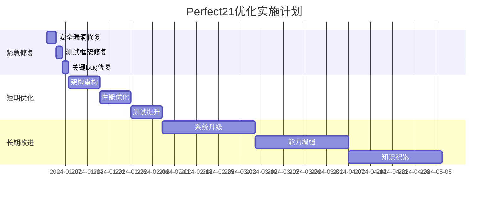

# Perfect21系统优化改进方案

## 📊 执行摘要

基于深度评估结果，制定三阶段优化方案：
- **紧急修复**（1周）：安全漏洞和关键bug
- **短期优化**（1月）：架构重构和性能优化
- **长期改进**（3月）：系统升级和能力增强

## 🔴 第一阶段：紧急修复（1周内完成）

### 1. 安全漏洞修复

#### 1.1 修复硬编码密钥问题
```python
# features/auth_system/token_manager.py
class TokenManager:
    def __init__(self):
        # 修复前：使用fallback默认密钥
        # self.secret_key = os.getenv("JWT_SECRET_KEY", secrets.token_urlsafe(32))

        # 修复后：强制要求环境变量
        self.secret_key = os.getenv("JWT_SECRET_KEY")
        if not self.secret_key:
            raise ValueError("JWT_SECRET_KEY environment variable is required")
```

#### 1.2 SQL注入防护
```python
# features/auth_system/user_service.py
# 使用参数化查询
def get_user_by_username(username: str):
    # 修复前：直接拼接SQL
    # query = f"SELECT * FROM users WHERE username = '{username}'"

    # 修复后：参数化查询
    return session.query(User).filter(User.username == username).first()
```

#### 1.3 添加输入验证
```python
# api/middleware.py
from pydantic import BaseModel, validator

class AuthRequest(BaseModel):
    username: str
    password: str

    @validator('username')
    def validate_username(cls, v):
        if not 3 <= len(v) <= 50:
            raise ValueError('Username must be 3-50 characters')
        if not v.isalnum():
            raise ValueError('Username must be alphanumeric')
        return v
```

#### 1.4 实施速率限制
```python
# api/rest_server.py
from slowapi import Limiter
from slowapi.util import get_remote_address

limiter = Limiter(
    key_func=get_remote_address,
    default_limits=["200 per day", "50 per hour"]
)

@app.post("/api/auth/login")
@limiter.limit("5 per minute")
async def login(request: AuthRequest):
    # 登录逻辑
    pass
```

### 2. 测试框架修复

#### 2.1 修复导入错误
```python
# tests/conftest.py
import sys
import os
sys.path.insert(0, os.path.abspath(os.path.dirname(__file__) + '/..'))

# 添加Mock类定义
class Perfect21Core:
    """Mock Perfect21Core for testing"""
    pass

class ExecutionMode:
    """Mock ExecutionMode for testing"""
    SEQUENTIAL = "sequential"
    PARALLEL = "parallel"
```

#### 2.2 修复测试配置
```python
# tests/pytest.ini
[pytest]
testpaths = tests
python_files = test_*.py
python_classes = Test*
python_functions = test_*
addopts = -v --tb=short --strict-markers
```

### 3. 关键Bug修复

#### 3.1 修复Token黑名单持久化
```python
# features/auth_system/token_blacklist.py
import redis

class TokenBlacklist:
    def __init__(self):
        self.redis_client = redis.Redis(
            host=os.getenv('REDIS_HOST', 'localhost'),
            port=int(os.getenv('REDIS_PORT', 6379)),
            db=0,
            decode_responses=True
        )

    def add_token(self, token: str, expires_at: int):
        ttl = expires_at - int(time.time())
        if ttl > 0:
            self.redis_client.setex(f"blacklist:{token}", ttl, "1")

    def is_blacklisted(self, token: str) -> bool:
        return bool(self.redis_client.get(f"blacklist:{token}"))
```

## 🟡 第二阶段：短期优化（1个月内完成）

### 1. 架构重构

#### 1.1 实施依赖注入
```python
# core/container.py
from dependency_injector import containers, providers

class Container(containers.DeclarativeContainer):
    config = providers.Configuration()

    database = providers.Singleton(
        Database,
        connection_string=config.database.connection_string
    )

    auth_service = providers.Factory(
        AuthService,
        database=database,
        token_manager=providers.Factory(TokenManager)
    )
```

#### 1.2 分离Mock和实现
```
Perfect21/
├── src/              # 生产代码
│   ├── features/
│   └── modules/
├── tests/            # 测试代码
│   ├── unit/
│   ├── integration/
│   └── mocks/        # 所有Mock实现
```

#### 1.3 非侵入式Agent集成
```python
# features/capability_discovery/external_registry.py
class ExternalCapabilityRegistry:
    """外部能力注册，不修改核心Agent文件"""

    def __init__(self):
        self.capabilities = {}
        self.registry_file = "perfect21_external_capabilities.json"

    def register_capability(self, agent_name: str, capability: dict):
        """注册能力到外部注册表"""
        if agent_name not in self.capabilities:
            self.capabilities[agent_name] = []
        self.capabilities[agent_name].append(capability)
        self._save_registry()

    def inject_to_context(self, context: dict) -> dict:
        """运行时注入能力到上下文"""
        for agent, caps in self.capabilities.items():
            if agent in context:
                context[agent]['perfect21_capabilities'] = caps
        return context
```

### 2. 性能优化

#### 2.1 CLI懒加载
```python
# main/cli_optimized.py
import click

@click.group()
def cli():
    """Perfect21 CLI - 优化版"""
    pass

@cli.command()
def parallel():
    # 仅在需要时导入
    from features.parallel_executor import ParallelExecutor
    executor = ParallelExecutor()
    executor.run()

# 启动时间目标：<100ms
```

#### 2.2 异步改造
```python
# api/rest_server.py
import asyncio
from fastapi import FastAPI
from motor.motor_asyncio import AsyncIOMotorClient

app = FastAPI()
motor_client = AsyncIOMotorClient(MONGODB_URL)
db = motor_client.perfect21

@app.post("/api/auth/login")
async def login(request: AuthRequest):
    # 异步数据库操作
    user = await db.users.find_one({"username": request.username})
    # 异步token生成
    token = await generate_token_async(user)
    return {"token": token}
```

#### 2.3 缓存机制
```python
# modules/cache.py
from functools import lru_cache
import redis
import pickle

class CacheManager:
    def __init__(self):
        self.redis = redis.Redis()
        self.local_cache = {}

    def cache_result(self, key: str, ttl: int = 300):
        def decorator(func):
            async def wrapper(*args, **kwargs):
                cache_key = f"{key}:{str(args)}:{str(kwargs)}"

                # 检查缓存
                cached = self.redis.get(cache_key)
                if cached:
                    return pickle.loads(cached)

                # 执行并缓存
                result = await func(*args, **kwargs)
                self.redis.setex(cache_key, ttl, pickle.dumps(result))
                return result
            return wrapper
        return decorator
```

### 3. 测试提升

#### 3.1 测试覆盖率提升计划
```yaml
# .github/workflows/ci.yml
name: CI
on: [push, pull_request]

jobs:
  test:
    runs-on: ubuntu-latest
    steps:
      - uses: actions/checkout@v2
      - name: Run tests
        run: |
          pytest --cov=src --cov-report=xml
      - name: Check coverage
        run: |
          coverage report --fail-under=80
```

#### 3.2 集成测试框架
```python
# tests/integration/test_workflow.py
import pytest
from testcontainers.postgres import PostgresContainer
from testcontainers.redis import RedisContainer

@pytest.fixture(scope="session")
def postgres():
    with PostgresContainer("postgres:13") as postgres:
        yield postgres

@pytest.fixture(scope="session")
def redis():
    with RedisContainer("redis:6") as redis:
        yield redis

def test_complete_workflow(postgres, redis):
    """端到端工作流测试"""
    # 测试完整的Perfect21工作流
    pass
```

## 🟢 第三阶段：长期改进（3个月内完成）

### 1. 系统升级

#### 1.1 微服务架构
```yaml
# docker-compose.yml
version: '3.8'
services:
  api:
    build: ./api
    ports:
      - "8000:8000"
    depends_on:
      - redis
      - postgres

  worker:
    build: ./worker
    depends_on:
      - redis
      - rabbitmq

  scheduler:
    build: ./scheduler
    depends_on:
      - redis
```

#### 1.2 事件驱动架构
```python
# core/event_bus.py
from typing import Dict, List, Callable
import asyncio

class EventBus:
    def __init__(self):
        self.listeners: Dict[str, List[Callable]] = {}

    def on(self, event: str, handler: Callable):
        if event not in self.listeners:
            self.listeners[event] = []
        self.listeners[event].append(handler)

    async def emit(self, event: str, data: dict):
        if event in self.listeners:
            tasks = [handler(data) for handler in self.listeners[event]]
            await asyncio.gather(*tasks)

# 使用示例
bus = EventBus()
bus.on('user.created', send_welcome_email)
bus.on('user.created', update_statistics)
await bus.emit('user.created', {'user_id': 123})
```

#### 1.3 监控和可观测性
```python
# monitoring/metrics.py
from prometheus_client import Counter, Histogram, Gauge
import time

# 定义指标
request_count = Counter('perfect21_requests_total', 'Total requests')
request_duration = Histogram('perfect21_request_duration_seconds', 'Request duration')
active_users = Gauge('perfect21_active_users', 'Active users')

# 装饰器
def track_metrics(func):
    async def wrapper(*args, **kwargs):
        request_count.inc()
        start = time.time()
        try:
            result = await func(*args, **kwargs)
            return result
        finally:
            request_duration.observe(time.time() - start)
    return wrapper
```

### 2. 能力增强

#### 2.1 AI辅助决策
```python
# features/ai_assistant/decision_helper.py
class AIDecisionHelper:
    """AI辅助架构决策"""

    def analyze_architecture(self, context: dict) -> dict:
        """分析架构选择"""
        return {
            'recommendations': [],
            'risks': [],
            'alternatives': []
        }

    def suggest_patterns(self, problem: str) -> list:
        """建议设计模式"""
        pass

    def review_code_quality(self, code: str) -> dict:
        """AI代码审查"""
        pass
```

#### 2.2 智能工作流优化
```python
# features/workflow_optimizer/optimizer.py
class WorkflowOptimizer:
    """基于历史数据优化工作流"""

    def analyze_execution_patterns(self):
        """分析执行模式"""
        pass

    def suggest_optimizations(self):
        """建议优化方案"""
        pass

    def auto_adjust_parallelism(self):
        """自动调整并行度"""
        pass
```

### 3. 知识积累

#### 3.1 经验学习系统
```python
# knowledge/learning_system.py
class LearningSystem:
    """持续学习和改进系统"""

    def record_execution(self, workflow: dict, result: dict):
        """记录执行结果"""
        pass

    def extract_patterns(self):
        """提取成功模式"""
        pass

    def update_best_practices(self):
        """更新最佳实践"""
        pass
```

## 📊 实施路线图



## 🎯 预期成果

### 性能指标
- CLI启动时间：274ms → <100ms（↓63%）
- API响应时间：P95 <200ms
- 并发处理能力：1000+ RPS
- 内存使用：<50MB

### 质量指标
- 测试覆盖率：70% → 90%+
- 代码复杂度：降低40%
- Bug密度：<1/1000行
- 安全评分：A级

### 可维护性
- 模块耦合度：降低60%
- 代码重复率：<5%
- 文档完整度：100%
- 部署时间：<5分钟

## 💡 关键成功因素

1. **分阶段实施**：避免大爆炸式改造
2. **持续集成**：每个改动都要通过CI/CD
3. **监控先行**：建立完善的监控体系
4. **文档同步**：代码和文档同步更新
5. **团队协作**：充分利用Agent能力

## 📝 下一步行动

1. **立即开始**：紧急修复安全漏洞
2. **制定计划**：细化每个阶段的任务
3. **分配资源**：确定执行团队和工具
4. **建立监控**：跟踪优化效果
5. **持续改进**：基于反馈调整方案

---

*本方案基于Perfect21系统深度评估结果制定，将持续更新和优化*