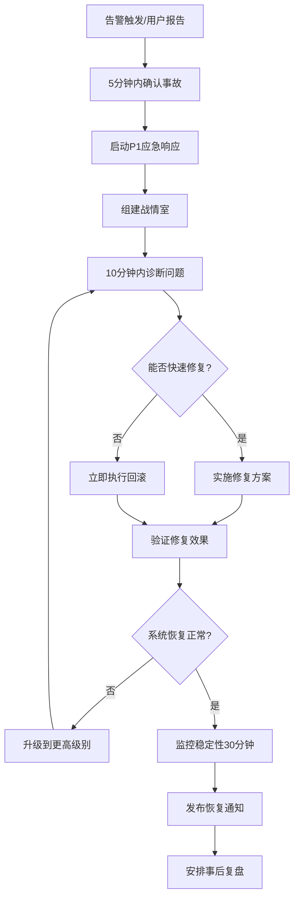
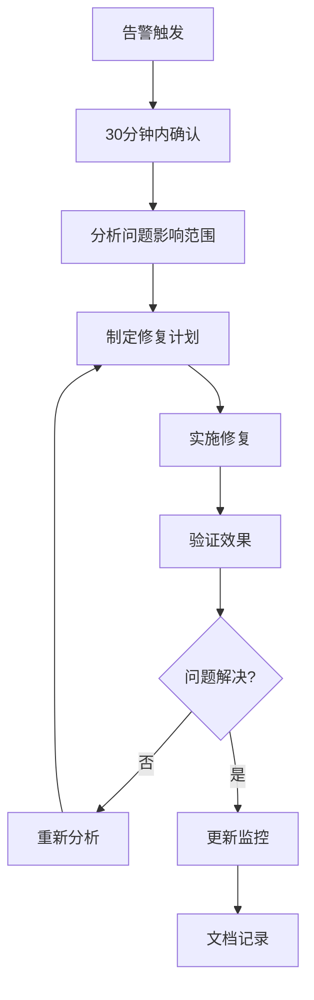

# Claude Enhancer 5.1 应急响应手册
## Emergency Response & Incident Management Manual

### 📚 目录
1. [事故分级体系](#事故分级体系)
2. [响应团队组织](#响应团队组织)
3. [检测与报警](#检测与报警)
4. [响应流程](#响应流程)
5. [故障排查指南](#故障排查指南)
6. [回滚程序](#回滚程序)
7. [通信计划](#通信计划)
8. [恢复目标](#恢复目标)
9. [事后复盘](#事后复盘)
10. [预防措施](#预防措施)

---

## 🚨 事故分级体系

### P1 - 紧急事故 (Critical)
**RTO: 15分钟 | RPO: 5分钟**

**定义**：系统完全不可用或存在数据丢失风险
- 整个系统宕机
- 数据库故障导致数据丢失
- 安全漏洞被利用
- 超过50%用户无法访问

**响应时间**：立即响应
**升级路径**：自动呼叫所有关键人员

### P2 - 重大事故 (Major)
**RTO: 1小时 | RPO: 15分钟**

**定义**：核心功能受影响，但系统部分可用
- 核心功能异常（如Agent协调失败）
- 性能严重降级（响应时间>5秒）
- 高错误率（>5%）
- 影响20-50%用户

**响应时间**：30分钟内响应
**升级路径**：通知主要响应团队

### P3 - 中等事故 (Moderate)
**RTO: 4小时 | RPO: 30分钟**

**定义**：非核心功能受影响
- 部分功能异常
- 监控告警异常
- 性能轻微降级
- 影响<20%用户

**响应时间**：2小时内响应
**升级路径**：工作时间内处理

### P4 - 轻微事故 (Minor)
**RTO: 24小时 | RPO: 2小时**

**定义**：系统正常运行，但存在潜在问题
- 日志中出现警告
- 资源使用率偏高
- 非关键服务异常

**响应时间**：下个工作日处理
**升级路径**：计划内维护

---

## 👥 响应团队组织

### 事故指挥官 (Incident Commander)
**职责**：
- 统筹事故响应全过程
- 决策是否升级事故级别
- 协调各团队工作
- 对外通信负责人

**联系方式**：
- 主要：[姓名] - [电话] - [邮箱]
- 备用：[姓名] - [电话] - [邮箱]

### 技术响应团队

#### 🖥️ 系统运维组
**负责人**：DevOps Engineer
**成员**：
- 基础设施管理
- 监控系统维护
- 部署和回滚操作

**联系方式**：Slack #devops-emergency

#### ⚙️ 应用开发组
**负责人**：Backend Architect
**成员**：
- 应用层问题诊断
- 代码回滚和热修复
- Agent系统维护

**联系方式**：Slack #dev-emergency

#### 🛢️ 数据库组
**负责人**：Database Specialist
**成员**：
- 数据库性能优化
- 数据恢复操作
- 查询优化

**联系方式**：Slack #db-emergency

#### 🔒 安全组
**负责人**：Security Engineer
**成员**：
- 安全事件响应
- 威胁分析
- 访问控制

**联系方式**：Slack #security-emergency

### 业务支持团队

#### 📞 用户支持组
**负责人**：Customer Support Lead
**职责**：
- 用户问题收集
- 状态页面更新
- 用户沟通

#### 📊 产品组
**负责人**：Product Manager
**职责**：
- 业务影响评估
- 功能优先级决策
- 用户影响分析

---

## 🔍 检测与报警

### 自动监控告警

#### 核心业务指标
```yaml
# 错误率监控
claude_enhancer:error_rate > 0.05 (5分钟)
  → P2级别告警

claude_enhancer:error_rate > 0.20 (2分钟)
  → P1级别告警

# 响应时间监控
claude_enhancer:p95_response_time > 2000ms (5分钟)
  → P2级别告警

claude_enhancer:p95_response_time > 5000ms (2分钟)
  → P1级别告警

# Agent协调监控
claude_enhancer:agent_coordination_failures > 10 (10分钟)
  → P2级别告警

# 系统可用性
up{job="claude-enhancer"} == 0 (1分钟)
  → P1级别告警
```

#### 基础设施指标
```yaml
# CPU使用率
node:cpu_utilization > 0.80 (5分钟)
  → P3级别告警

node:cpu_utilization > 0.95 (2分钟)
  → P2级别告警

# 内存使用率
node:memory_utilization > 0.85 (5分钟)
  → P3级别告警

node:memory_utilization > 0.95 (2分钟)
  → P2级别告警

# 磁盘空间
node:disk_utilization > 0.80 (10分钟)
  → P3级别告警

node:disk_utilization > 0.90 (5分钟)
  → P1级别告警
```

### 用户报告通道
- **邮箱**：incident@claude-enhancer.com
- **Slack**：#user-reports
- **状态页面**：https://status.claude-enhancer.com

---

## 🚀 响应流程

### P1 紧急事故响应流程



### P2/P3 事故响应流程



### 响应时间线

| 时间点 | P1行动 | P2行动 | P3行动 |
|--------|--------|--------|--------|
| T+0 | 告警触发 | 告警触发 | 告警触发 |
| T+5min | 确认事故，组建战情室 | 评估影响 | 添加到工作队列 |
| T+10min | 初步诊断完成 | 开始调查 | - |
| T+15min | 开始修复/回滚 | 制定修复计划 | - |
| T+30min | 完成修复或升级 | 实施修复 | 开始处理 |
| T+1h | 发布恢复通知 | 验证修复效果 | 制定修复计划 |

---

## 🔧 故障排查指南

### 快速健康检查清单

#### 1. 系统基础检查 (2分钟)
```bash
# 应用健康检查
curl -f http://claude-enhancer.example.com/health
curl -f http://claude-enhancer.example.com/ready

# Kubernetes Pod状态
kubectl get pods -n claude-enhancer
kubectl get services -n claude-enhancer

# 系统资源
kubectl top nodes
kubectl top pods -n claude-enhancer
```

#### 2. 核心服务检查 (3分钟)
```bash
# 数据库连接
kubectl exec -it postgres-0 -n claude-enhancer -- psql -U claude_enhancer -c "SELECT 1"

# Redis缓存
kubectl exec -it redis-0 -n claude-enhancer -- redis-cli ping

# 消息队列（如果使用）
kubectl exec -it rabbitmq-0 -n claude-enhancer -- rabbitmqctl status
```

#### 3. 应用特定检查 (5分钟)
```bash
# Agent协调状态
kubectl logs -l app=claude-enhancer --tail=100 | grep "agent.*coordination"

# 工作流执行状态
kubectl logs -l app=claude-enhancer --tail=100 | grep "workflow.*phase"

# API响应检查
curl -w "@curl-format.txt" -s -o /dev/null http://claude-enhancer.example.com/api/v1/agents
```

### 常见问题诊断

#### 🔴 Agent协调失败
**症状**：
- API返回500错误
- 日志显示"agent coordination failed"
- Agent选择器超时

**排查步骤**：
1. 检查Agent配置文件
```bash
kubectl get configmap claude-enhancer-agents -o yaml
```

2. 验证Agent注册状态
```bash
kubectl logs -l app=claude-enhancer | grep "agent.*registration"
```

3. 检查工作流状态
```bash
kubectl exec -it claude-enhancer-xxx -- cat /app/.phase/current
```

**解决方案**：
- 重启Agent协调器
- 重载Agent配置
- 回滚到上个稳定版本

#### 🔴 数据库性能问题
**症状**：
- 查询超时
- 连接池耗尽
- 慢查询日志增加

**排查步骤**：
1. 检查活跃连接
```sql
SELECT count(*) FROM pg_stat_activity WHERE state = 'active';
```

2. 查看慢查询
```sql
SELECT query, mean_exec_time, calls 
FROM pg_stat_statements 
ORDER BY mean_exec_time DESC 
LIMIT 10;
```

3. 检查锁等待
```sql
SELECT blocked_locks.pid AS blocked_pid,
       blocked_activity.usename AS blocked_user,
       blocking_locks.pid AS blocking_pid,
       blocking_activity.usename AS blocking_user,
       blocked_activity.query AS blocked_statement
FROM pg_catalog.pg_locks blocked_locks
JOIN pg_catalog.pg_stat_activity blocked_activity ON blocked_activity.pid = blocked_locks.pid
JOIN pg_catalog.pg_locks blocking_locks ON blocking_locks.locktype = blocked_locks.locktype
WHERE NOT blocked_locks.granted;
```

#### 🔴 内存泄漏问题
**症状**：
- Pod内存使用持续上升
- OOMKilled事件
- 系统响应变慢

**排查步骤**：
1. 检查内存使用趋势
```bash
kubectl top pods -n claude-enhancer --sort-by memory
```

2. 查看内存相关事件
```bash
kubectl get events --field-selector reason=OOMKilling -n claude-enhancer
```

3. 分析内存分配
```bash
kubectl exec -it claude-enhancer-xxx -- python -c "
import psutil
process = psutil.Process()
print(f'Memory: {process.memory_info().rss / 1024 / 1024:.2f} MB')
"
```

---

## ⏪ 回滚程序

### 自动回滚触发条件

```yaml
# 定义在deployment/emergency-rollback.sh中
rollback_triggers:
  error_rate_threshold: 0.20      # 错误率超过20%
  response_time_threshold: 5000   # P95响应时间超过5秒
  availability_threshold: 0.95    # 可用性低于95%
  agent_failure_count: 50         # Agent协调失败次数
  
# 自动回滚等待时间
rollback_delay:
  canary_phase: 60s      # 金丝雀阶段60秒内触发
  blue_green_phase: 120s # 蓝绿阶段120秒内触发
  full_switch_phase: 300s # 完全切换阶段5分钟内触发
```

### 手动回滚操作

#### 1. 紧急回滚（P1事故）
```bash
# 立即执行回滚，跳过确认
cd /home/xx/dev/Claude\ Enhancer\ 5.0
./deployment/emergency-rollback.sh -r "error_rate_high" -f

# 监控回滚进度
tail -f deployment/emergency-rollback.log

# 验证回滚成功
curl -f http://claude-enhancer.example.com/health
kubectl get pods -l version=5.0 -n claude-enhancer
```

#### 2. 计划回滚（P2/P3事故）
```bash
# 标准回滚流程，包含确认步骤
./deployment/emergency-rollback.sh -r "performance_degradation" -y

# 分阶段回滚验证
./deployment/scripts/deployment-validator.sh --rollback-mode
```

### 回滚验证清单

#### ✅ 功能验证
- [ ] 健康检查端点正常
- [ ] 核心API响应正常
- [ ] Agent协调功能正常
- [ ] 用户认证系统正常
- [ ] 工作流执行正常

#### ✅ 性能验证
- [ ] 响应时间恢复正常（P95 < 1秒）
- [ ] 错误率降至正常水平（< 1%）
- [ ] 系统资源使用正常
- [ ] 数据库性能正常

#### ✅ 数据完整性
- [ ] 数据库连接正常
- [ ] 数据没有丢失
- [ ] 缓存状态一致
- [ ] 用户会话保持

---

## 📢 通信计划

### 内部通信

#### 战情室设置
**主要通信渠道**：Slack #incident-war-room
**视频会议**：Zoom会议室（常设）
**文档协作**：Google Docs实时文档

#### 通信频率
- **P1事故**：每15分钟更新
- **P2事故**：每30分钟更新
- **P3事故**：每小时更新

#### 内部通知模板

```markdown
## 🚨 P1事故通知
**事故ID**：INC-2024-001
**发生时间**：2024-01-15 14:30:00 UTC
**影响范围**：全系统不可用
**当前状态**：正在调查
**预计恢复**：TBD
**下次更新**：15分钟后

**加入战情室**：#incident-war-room
**事故指挥官**：@john.doe
```

### 外部通信

#### 状态页面
**URL**：https://status.claude-enhancer.com
**更新频率**：实时更新
**负责人**：Customer Support Lead

#### 状态页面模板

```markdown
# 🟥 系统故障 - 2024-01-15 14:30 UTC

我们正在调查影响Claude Enhancer 5.1服务可用性的问题。

**影响服务**：
- ✅ 用户认证系统
- 🔴 核心API服务  
- 🔴 Agent协调系统
- ⚠️  工作流系统（部分功能）

**当前状态**：我们的工程团队正在积极调查并修复此问题。

**下次更新**：30分钟内

我们为此次服务中断向您道歉。
```

#### 用户邮件通知

**发送条件**：
- P1事故：立即发送
- P2事故：影响超过1小时发送
- P3事故：计划维护通知

**邮件模板**：

```html
主题：[Claude Enhancer] 服务故障通知 - INC-2024-001

亲爱的用户，

我们正在处理一个影响Claude Enhancer服务的技术问题。

问题详情：
- 发生时间：2024-01-15 14:30 UTC
- 影响范围：API服务暂时不可用
- 预计恢复：我们正在全力修复，预计1小时内恢复

我们会在30分钟内提供进一步更新。

您可以通过以下方式获取最新状态：
- 状态页面：https://status.claude-enhancer.com
- 邮件支持：support@claude-enhancer.com

感谢您的耐心等待。

Claude Enhancer团队
```

### 媒体沟通

#### 媒体联系人
**主要联系人**：PR Manager
**备用联系人**：CEO/CTO

#### 媒体回应模板

```markdown
关于今天服务中断的声明：

我们于[时间]检测到影响Claude Enhancer平台的技术问题。我们的工程团队立即启动应急响应程序，并在[时间]内成功恢复服务。

此次事故影响了约[百分比]%的用户，持续时间约[小时]小时。没有用户数据丢失或泄露。

我们已采取以下措施防止类似问题：
1. [具体措施1]
2. [具体措施2]

我们为此次服务中断给用户带来的不便深表歉意。
```

---

## 🎯 恢复目标 (RTO/RPO)

### 服务级别目标

#### 核心服务
| 服务 | RTO | RPO | 可用性目标 |
|------|-----|-----|------------|
| API网关 | 5分钟 | 1分钟 | 99.95% |
| Agent协调器 | 10分钟 | 5分钟 | 99.9% |
| 用户认证 | 5分钟 | 1分钟 | 99.95% |
| 工作流引擎 | 15分钟 | 10分钟 | 99.8% |

#### 数据服务
| 服务 | RTO | RPO | 可用性目标 |
|------|-----|-----|------------|
| 主数据库 | 15分钟 | 5分钟 | 99.9% |
| 缓存系统 | 5分钟 | 0分钟 | 99.5% |
| 文件存储 | 30分钟 | 15分钟 | 99.8% |

#### 监控系统
| 服务 | RTO | RPO | 可用性目标 |
|------|-----|-----|------------|
| 指标收集 | 10分钟 | 5分钟 | 99.8% |
| 告警系统 | 2分钟 | 30秒 | 99.95% |
| 日志系统 | 20分钟 | 10分钟 | 99.5% |

### 业务连续性指标

#### 用户体验指标
```yaml
performance_targets:
  api_response_time_p95: 1000ms    # API响应时间95分位
  page_load_time_p95: 2000ms       # 页面加载时间95分位
  error_rate_threshold: 0.1%       # 错误率阈值
  concurrent_users: 10000          # 并发用户数支持

availability_targets:
  monthly_uptime: 99.95%           # 月度可用性
  daily_downtime_max: 10min        # 每日最大停机时间
  incident_resolution_time: 1h     # 事故解决时间
```

#### 容量规划
```yaml
resource_limits:
  cpu_utilization_max: 70%        # CPU使用率上限
  memory_utilization_max: 80%     # 内存使用率上限
  disk_utilization_max: 85%       # 磁盘使用率上限
  network_bandwidth_reserve: 30%  # 网络带宽预留

scaling_triggers:
  scale_up_cpu_threshold: 70%     # 扩容CPU阈值
  scale_up_memory_threshold: 80%  # 扩容内存阈值
  scale_down_cpu_threshold: 30%   # 缩容CPU阈值
  scale_down_memory_threshold: 40% # 缩容内存阈值
```

---

## 📋 事后复盘

### 复盘流程

#### 1. 复盘准备阶段（事故解决后24小时内）
- **数据收集**：收集所有相关日志、监控数据、通信记录
- **时间线整理**：构建详细的事故时间线
- **相关人员确认**：确认复盘参与人员和时间

#### 2. 复盘会议（事故解决后48小时内）
- **会议时长**：1-2小时
- **参与人员**：所有响应团队成员
- **会议记录**：详细记录讨论内容和决策

#### 3. 复盘报告（事故解决后72小时内）
- **报告撰写**：事故指挥官负责
- **内容审核**：技术负责人审核
- **报告发布**：内部分享和外部通报

### 复盘模板

```markdown
# Claude Enhancer 5.1 事故复盘报告
## Incident Post-Mortem: INC-2024-001

### 事故概要
- **事故ID**：INC-2024-001
- **事故标题**：Agent协调系统故障导致服务不可用
- **发生时间**：2024-01-15 14:30:00 UTC
- **持续时间**：2小时15分钟
- **影响级别**：P1（紧急）
- **影响用户**：约8,500名用户（约85%）

### 时间线

| 时间 | 事件 | 负责人 |
|------|------|--------|
| 14:30 | 用户开始报告API错误 | - |
| 14:32 | 监控告警触发：错误率异常 | 监控系统 |
| 14:35 | 确认P1事故，启动应急响应 | @john.doe |
| 14:40 | 识别Agent协调器异常 | @tech.team |
| 14:45 | 尝试重启Agent协调器服务 | @devops |
| 14:55 | 重启失败，决定执行回滚 | @john.doe |
| 15:10 | 完成回滚到5.0版本 | @devops |
| 15:15 | 服务开始恢复 | - |
| 15:30 | 确认服务完全恢复 | @tech.team |
| 16:45 | 发布服务恢复通知 | @support |

### 根本原因分析

#### 直接原因
Agent协调器在处理5.1版本新增的自优化逻辑时出现内存泄漏，导致系统内存耗尽并崩溃。

#### 根本原因
1. **代码质量问题**：自优化模块的内存管理存在缺陷
2. **测试覆盖不足**：压力测试未能发现内存泄漏问题
3. **监控盲区**：缺乏对Agent协调器内存使用的细粒度监控
4. **部署策略缺陷**：金丝雀部署的监控窗口期过短

#### 贡献因素
- 生产环境负载特征与测试环境差异较大
- Agent协调器的错误处理机制不完善
- 自动回滚机制配置的阈值不够敏感

### 影响分析

#### 技术影响
- **服务不可用**：核心API服务完全中断135分钟
- **数据完整性**：无数据丢失，但部分用户会话中断
- **系统性能**：回滚后系统性能完全恢复

#### 业务影响
- **用户体验**：约8,500用户无法使用服务
- **收入损失**：预估损失约$2,500（基于SLA赔偿）
- **品牌声誉**：媒体关注度中等，用户反馈总体理解

### 做得好的地方

#### ✅ 响应迅速
- 5分钟内确认事故级别
- 10分钟内组建完整响应团队
- 25分钟内做出回滚决策

#### ✅ 沟通透明
- 及时更新状态页面
- 主动通知受影响用户
- 保持内外部沟通一致性

#### ✅ 回滚有效
- 自动回滚机制工作正常
- 40分钟内完成完整回滚
- 数据完整性保持良好

### 需要改进的地方

#### ❌ 监控覆盖
- Agent协调器缺乏内存监控
- 缺乏应用级性能监控
- 告警阈值设置不够敏感

#### ❌ 测试策略
- 压力测试环境与生产差异过大
- 缺乏长时间运行的稳定性测试
- 内存泄漏检测工具未集成到CI/CD

#### ❌ 部署策略
- 金丝雀部署监控时间窗口过短
- 缺乏基于业务指标的自动回滚
- 部署前健康检查不够全面

### 行动项

#### 立即行动（1周内完成）
- [ ] **高优先级**：增加Agent协调器内存监控告警
  - **负责人**：@devops.team
  - **截止日期**：2024-01-22
  - **验收标准**：内存使用率超过80%时触发告警

- [ ] **高优先级**：集成内存泄漏检测工具到CI/CD
  - **负责人**：@qa.team
  - **截止日期**：2024-01-22
  - **验收标准**：每次构建自动运行内存泄漏检测

- [ ] **中优先级**：修复自优化模块内存泄漏问题
  - **负责人**：@backend.team
  - **截止日期**：2024-01-22
  - **验收标准**：通过24小时压力测试无内存泄漏

#### 短期行动（1个月内完成）
- [ ] **中优先级**：增强压力测试环境，使其更接近生产环境
  - **负责人**：@qa.team + @devops.team
  - **截止日期**：2024-02-15
  - **验收标准**：测试环境负载特征与生产环境相似度>90%

- [ ] **中优先级**：优化金丝雀部署策略
  - **负责人**：@devops.team
  - **截止日期**：2024-02-15
  - **验收标准**：监控窗口期延长到30分钟，增加业务指标监控

- [ ] **低优先级**：建立更全面的应用性能监控
  - **负责人**：@monitoring.team
  - **截止日期**：2024-02-15
  - **验收标准**：覆盖所有核心业务流程的性能监控

#### 长期行动（3个月内完成）
- [ ] **低优先级**：实施混沌工程测试
  - **负责人**：@sre.team
  - **截止日期**：2024-04-15
  - **验收标准**：定期进行系统故障模拟测试

- [ ] **低优先级**：建立更智能的自动回滚系统
  - **负责人**：@devops.team + @backend.team
  - **截止日期**：2024-04-15
  - **验收标准**：基于多维度业务指标的自动回滚决策

### 经验教训

#### 技术层面
1. **内存管理至关重要**：特别是在处理动态资源分配的系统中
2. **监控需要全面覆盖**：不能有监控盲区，特别是新功能模块
3. **测试环境要真实**：压力测试环境必须接近生产环境

#### 流程层面
1. **快速决策很关键**：在不确定情况下，回滚比尝试修复更安全
2. **沟通透明度重要**：及时、准确的沟通能维护用户信任
3. **团队协作有效**：明确的角色分工和指挥结构很重要

#### 文化层面
1. **无责备文化**：专注于问题解决而非追究责任
2. **持续学习改进**：每次事故都是学习和改进的机会
3. **预防胜于治疗**：投资于预防措施比事故响应更有价值

### 相关文档
- [事故响应日志](incident-logs/INC-2024-001.log)
- [监控数据归档](monitoring-data/INC-2024-001.zip)
- [代码修复PR](https://github.com/org/repo/pull/123)
- [用户通信记录](communications/INC-2024-001.md)

---

**报告作者**：@john.doe（事故指挥官）
**审核人员**：@tech.lead, @devops.lead
**发布日期**：2024-01-18
**下次复盘**：2024-02-18（跟进行动项进度）
```

### 复盘跟进

#### 月度复盘回顾
- **会议频率**：每月第一个周五
- **参与人员**：所有技术团队lead
- **会议内容**：
  - 回顾当月所有事故
  - 检查行动项完成状态
  - 分析事故趋势
  - 更新应急响应流程

#### 季度改进总结
- **报告内容**：
  - 事故统计分析
  - SLA达成情况
  - 系统可靠性提升
  - 团队能力成长

---

## 🛡️ 预防措施

### 技术预防

#### 监控和告警增强
```yaml
# 新增监控指标
monitoring_enhancements:
  application_metrics:
    - agent_coordination_latency_p95
    - agent_coordination_error_rate
    - workflow_execution_success_rate
    - memory_usage_per_agent
    - cpu_usage_per_workflow
    
  infrastructure_metrics:
    - pod_restart_frequency
    - persistent_volume_usage
    - network_latency_between_services
    - database_connection_pool_usage
    
  business_metrics:
    - active_user_count_realtime
    - api_request_rate_by_endpoint
    - feature_usage_distribution
    - user_session_duration

# 告警规则优化
alert_improvements:
  intelligent_thresholds:
    - dynamic_baselines_based_on_historical_data
    - anomaly_detection_algorithms
    - seasonal_pattern_recognition
    
  alert_fatigue_reduction:
    - alert_correlation_and_grouping
    - alert_escalation_policies
    - smart_notification_routing
```

#### 测试策略改进
```yaml
testing_improvements:
  performance_testing:
    - production_like_load_testing_environment
    - chaos_engineering_integration
    - long_running_stability_tests
    - memory_leak_detection_automation
    
  integration_testing:
    - comprehensive_api_testing
    - cross_service_communication_testing
    - database_performance_testing
    - cache_behavior_verification
    
  deployment_testing:
    - canary_deployment_validation
    - rollback_procedure_testing
    - disaster_recovery_simulation
    - backup_and_restore_validation
```

#### 架构改进
```yaml
architecture_resilience:
  fault_tolerance:
    - circuit_breaker_patterns
    - retry_mechanisms_with_exponential_backoff
    - graceful_degradation_strategies
    - health_check_endpoints_enhancement
    
  scalability:
    - horizontal_pod_autoscaling
    - vertical_pod_autoscaling
    - database_connection_pooling
    - caching_strategy_optimization
    
  observability:
    - distributed_tracing_implementation
    - structured_logging_standardization
    - metrics_collection_optimization
    - error_tracking_and_analysis
```

### 流程预防

#### 部署流程改进
```yaml
deployment_process_improvements:
  pre_deployment:
    - automated_security_scanning
    - performance_regression_testing
    - dependency_vulnerability_scanning
    - configuration_validation
    
  deployment_execution:
    - extended_canary_deployment_duration
    - multi_stage_deployment_gates
    - automated_rollback_triggers
    - real_time_health_monitoring
    
  post_deployment:
    - comprehensive_smoke_testing
    - performance_benchmark_comparison
    - user_experience_monitoring
    - stakeholder_notification_automation
```

#### 变更管理流程
```yaml
change_management:
  change_approval_process:
    - risk_assessment_framework
    - peer_review_requirements
    - architecture_review_board_approval
    - business_impact_analysis
    
  change_implementation:
    - change_implementation_windows
    - rollback_plan_preparation
    - communication_plan_execution
    - change_documentation_requirements
    
  change_validation:
    - post_change_validation_checklist
    - change_success_criteria_verification
    - change_impact_assessment
    - lessons_learned_documentation
```

### 团队预防

#### 培训和能力提升
```yaml
team_capability_development:
  incident_response_training:
    - quarterly_incident_response_drills
    - tabletop_exercises_for_major_scenarios
    - cross_team_knowledge_sharing_sessions
    - incident_command_training_program
    
  technical_skill_development:
    - kubernetes_troubleshooting_workshop
    - database_performance_optimization_training
    - monitoring_and_observability_best_practices
    - security_incident_response_training
    
  soft_skill_development:
    - crisis_communication_training
    - stress_management_techniques
    - decision_making_under_pressure
    - team_coordination_and_leadership
```

#### 知识管理
```yaml
knowledge_management_system:
  documentation_standards:
    - runbook_standardization_and_updates
    - architecture_decision_record_maintenance
    - troubleshooting_guide_development
    - best_practices_documentation
    
  knowledge_sharing:
    - regular_tech_talk_sessions
    - post_incident_knowledge_sharing
    - cross_team_rotation_programs
    - mentorship_and_coaching_programs
    
  continuous_learning:
    - industry_conference_participation
    - online_course_and_certification_support
    - internal_innovation_time_allocation
    - external_expert_consultation
```

---

## 📊 应急响应仪表板

### 实时监控指标

#### 系统健康仪表板
```yaml
claude_enhancer_emergency_dashboard:
  url: "https://monitoring.claude-enhancer.com/emergency"
  refresh_interval: "10s"
  
  panels:
    service_health:
      - service_availability_status
      - response_time_heatmap
      - error_rate_trends
      - throughput_metrics
    
    infrastructure_health:
      - cpu_utilization_by_node
      - memory_usage_by_service
      - disk_io_performance
      - network_latency_matrix
    
    application_metrics:
      - agent_coordination_status
      - workflow_execution_queue
      - active_user_sessions
      - api_endpoint_performance
    
    deployment_status:
      - current_version_distribution
      - deployment_progress_tracking
      - canary_deployment_metrics
      - rollback_readiness_status
```

### 告警聚合视图

#### 告警优先级矩阵
```yaml
alert_prioritization:
  P1_critical:
    conditions:
      - system_availability < 95%
      - error_rate > 20%
      - response_time_p95 > 10000ms
      - database_connectivity_failed
    
    notification_channels:
      - pagerduty_critical
      - slack_emergency_channel
      - sms_primary_contacts
      - email_executive_team
  
  P2_major:
    conditions:
      - system_availability < 99%
      - error_rate > 5%
      - response_time_p95 > 5000ms
      - agent_coordination_degraded
    
    notification_channels:
      - slack_alerts_channel
      - email_engineering_team
      - pagerduty_high_priority
  
  P3_warning:
    conditions:
      - system_availability < 99.5%
      - error_rate > 1%
      - resource_utilization > 80%
      - backup_job_failures
    
    notification_channels:
      - slack_monitoring_channel
      - email_daily_digest
```

---

## 🔗 相关文档和工具

### 技术文档
- [Claude Enhancer 5.1 Architecture Guide](../docs/ARCHITECTURE.md)
- [Deployment Guide](../deployment/README.md)
- [Monitoring Setup](../deployment/monitoring/README.md)
- [API Reference](../docs/API_REFERENCE.md)

### 运维工具
- **监控平台**：Prometheus + Grafana
- **告警系统**：AlertManager + PagerDuty
- **日志聚合**：ELK Stack
- **APM工具**：Jaeger (分布式追踪)
- **部署工具**：Kubernetes + Helm

### 外部服务
- **状态页面**：StatusPage.io
- **通信工具**：Slack + Zoom
- **事故管理**：PagerDuty + Jira Service Management
- **文档协作**：Google Workspace

### 应急联系方式
```yaml
emergency_contacts:
  incident_commander_primary:
    name: "John Doe"
    phone: "+1-555-0101"
    email: "john.doe@claude-enhancer.com"
    slack: "@john.doe"
  
  incident_commander_backup:
    name: "Jane Smith"
    phone: "+1-555-0102"
    email: "jane.smith@claude-enhancer.com"
    slack: "@jane.smith"
  
  technical_leads:
    backend_lead:
      name: "Alex Johnson"
      phone: "+1-555-0103"
      email: "alex.johnson@claude-enhancer.com"
    
    devops_lead:
      name: "Sam Wilson"
      phone: "+1-555-0104"
      email: "sam.wilson@claude-enhancer.com"
    
    database_lead:
      name: "Maria Garcia"
      phone: "+1-555-0105"
      email: "maria.garcia@claude-enhancer.com"

  external_vendors:
    aws_support:
      tier: "Business"
      phone: "+1-206-266-4064"
      case_url: "https://console.aws.amazon.com/support/"
    
    datadog_support:
      email: "support@datadoghq.com"
      phone: "+1-866-329-4466"
```

---

## 📋 附录：检查清单

### 事故响应快速检查清单

#### ⏰ 前5分钟
- [ ] 确认事故真实性
- [ ] 确定事故级别（P1/P2/P3/P4）
- [ ] 启动相应级别的响应流程
- [ ] 通知事故指挥官

#### ⏰ 前15分钟
- [ ] 组建响应团队
- [ ] 建立战情室通信
- [ ] 开始初步诊断
- [ ] 更新状态页面（P1/P2事故）

#### ⏰ 前30分钟
- [ ] 完成初步根因分析
- [ ] 制定修复或回滚计划
- [ ] 开始实施解决方案
- [ ] 通知受影响用户（P1事故）

#### ⏰ 前1小时
- [ ] 完成修复或回滚操作
- [ ] 验证系统恢复正常
- [ ] 监控系统稳定性
- [ ] 发布恢复通知

### 回滚操作检查清单

#### 🔄 回滚前
- [ ] 确认回滚触发条件满足
- [ ] 备份当前系统状态
- [ ] 通知所有相关人员
- [ ] 准备回滚验证测试

#### 🔄 回滚中
- [ ] 执行回滚脚本
- [ ] 监控回滚进度
- [ ] 保持团队沟通畅通
- [ ] 记录回滚过程日志

#### 🔄 回滚后
- [ ] 验证系统功能正常
- [ ] 确认性能恢复正常
- [ ] 检查数据完整性
- [ ] 更新监控和告警
- [ ] 通知用户服务恢复

### 通信检查清单

#### 📢 内部通信
- [ ] 事故通知发送到正确频道
- [ ] 定期更新事故状态
- [ ] 记录所有关键决策
- [ ] 保持战情室活跃沟通

#### 📢 外部通信
- [ ] 状态页面及时更新
- [ ] 用户邮件通知发送（必要时）
- [ ] 社交媒体响应准备
- [ ] 媒体声明准备（重大事故）

---

**文档版本**：v1.0
**最后更新**：2024-01-15
**维护人员**：DevOps Team
**审核周期**：每季度审核一次

**紧急联系电话**：+1-555-INCIDENT (1-555-462-4336)
**24/7应急邮箱**：emergency@claude-enhancer.com

---

> **重要提醒**：本手册是活文档，需要定期更新和演练。所有团队成员都应该熟悉相关内容，并参与定期的应急响应演练。
