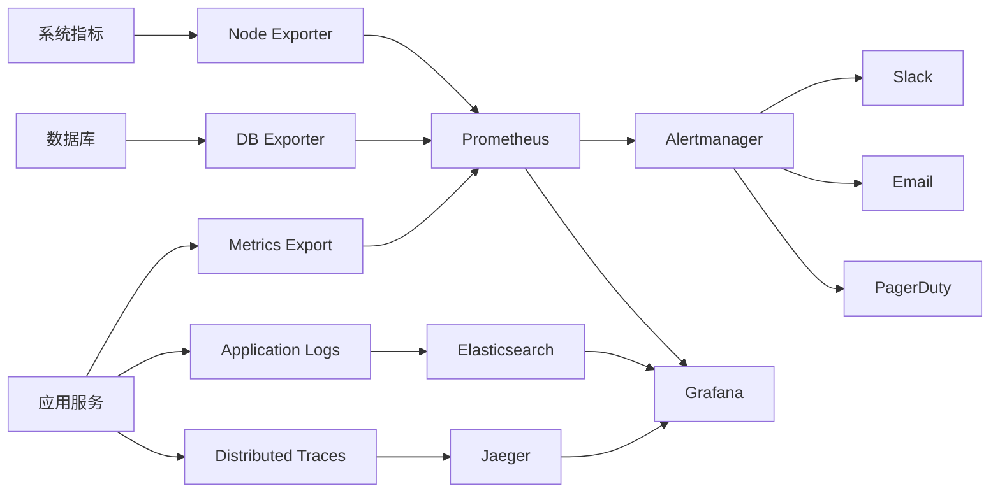

# Claude Enhancer 5.1 - 企业级监控系统架构

## 🎯 监控系统概览

Claude Enhancer 5.1监控系统采用现代化的可观测性架构，实现对系统的全方位监控和智能预警。

```
┌─────────────────────────────────────────────────────────────┐
│                Claude Enhancer 5.1 监控架构                  │
├─────────────────────────────────────────────────────────────┤
│  ┌──────────────┐  ┌──────────────┐  ┌──────────────┐    │
│  │   Metrics    │  │     Logs     │  │    Traces    │    │
│  │ (Prometheus) │  │ (ELK Stack)  │ (OpenTelemetry)│    │
│  └──────┬───────┘  └──────┬───────┘  └──────┬───────┘    │
│         │                 │                 │           │
│         └─────────────────┼─────────────────┘           │
│                           │                             │
│  ┌─────────────────────────────────────────────────────┐    │
│  │               Grafana Dashboard                     │    │
│  │  ┌─────────────┐ ┌─────────────┐ ┌─────────────┐  │    │
│  │  │   System    │ │  Business   │ │   Alert     │  │    │
│  │  │ Monitoring  │ │ Monitoring  │ │ Management  │  │    │
│  │  └─────────────┘ └─────────────┘ └─────────────┘  │    │
│  └─────────────────────────────────────────────────────┘    │
│                           │                             │
│  ┌─────────────────────────────────────────────────────┐    │
│  │                Alert Manager                        │    │
│  │  ┌─────────┐ ┌─────────┐ ┌─────────┐ ┌─────────┐  │    │
│  │  │ Slack   │ │ Email   │ │ PagerDuty│ │ Webhook │  │    │
│  │  └─────────┘ └─────────┘ └─────────┘ └─────────┘  │    │
│  └─────────────────────────────────────────────────────┘    │
└─────────────────────────────────────────────────────────────┘
```

## 📊 监控指标体系

### 1. 业务指标 (RED方法)
- **Request Rate**: 请求速率和QPS
- **Error Rate**: 错误率和失败请求占比
- **Duration**: 响应时间分布和延迟指标

### 2. 基础设施指标 (USE方法)
- **Utilization**: 资源利用率（CPU、内存、磁盘）
- **Saturation**: 资源饱和度（队列长度、等待时间）
- **Errors**: 系统级错误和故障

### 3. 四大黄金信号
- **延迟**: P50, P90, P95, P99响应时间
- **流量**: QPS和并发用户数
- **错误**: 错误率和错误类型分布
- **饱和度**: 资源使用情况和容量规划

## 🔍 SLI/SLO定义

### 可用性SLI/SLO
```yaml
availability_slo:
  target: 99.9%  # 99.9%可用性
  window: 30d    # 30天滑动窗口
  measurement: |
    sum(up{job=~"claude-enhancer.*"}) /
    count(up{job=~"claude-enhancer.*"})
  error_budget: 43.2m  # 每月43.2分钟停机时间
```

### 延迟SLI/SLO
```yaml
latency_slo:
  target: 95%    # 95%请求在200ms内完成
  threshold: 200ms
  percentile: 95
  window: 7d
  measurement: |
    histogram_quantile(0.95,
      sum(rate(http_request_duration_seconds_bucket[5m]))
    ) < 0.2
```

### 错误率SLI/SLO
```yaml
error_rate_slo:
  target: 99.9%  # 错误率低于0.1%
  threshold: 0.1%
  window: 24h
  measurement: |
    sum(rate(http_requests_total{status!~"5.."}[5m])) /
    sum(rate(http_requests_total[5m])) > 0.999
```

## 📈 监控仪表板设计

### 1. 系统概览仪表板
- 系统健康度总览
- 关键业务指标趋势
- 实时告警状态
- 资源使用情况

### 2. 性能监控仪表板
- 请求响应时间分析
- 吞吐量和QPS统计
- 资源利用率监控
- 慢查询和性能瓶颈

### 3. 错误分析仪表板
- 错误率趋势分析
- 错误类型分布
- 错误影响范围评估
- 错误恢复时间统计

### 4. 业务监控仪表板
- 用户行为分析
- 功能使用统计
- 转化率监控
- A/B测试效果

## 🚨 告警策略

### 告警等级定义
- **Critical**: 影响系统可用性，需要立即响应
- **Warning**: 可能影响性能，需要关注
- **Info**: 信息性提醒，用于趋势分析

### 告警规则设计
```yaml
alerting_rules:
  availability:
    - service_down (Critical, 2m)
    - high_error_rate (Warning, 5m)
    - api_gateway_failure (Critical, 1m)

  performance:
    - high_response_time (Warning, 10m)
    - critical_response_time (Critical, 5m)
    - queue_backlog (Warning, 5m)

  resources:
    - high_cpu_usage (Warning, 15m)
    - critical_memory_usage (Critical, 5m)
    - disk_space_low (Warning, 30m)

  security:
    - suspicious_auth_failures (Warning, 2m)
    - massive_auth_failures (Critical, 1m)
    - high_mfa_failure_rate (Warning, 10m)
```

## 📱 通知渠道配置

### 1. Slack集成
- 不同严重级别的通道分离
- 富文本告警消息
- 快速响应按钮
- 告警静音功能

### 2. 邮件通知
- HTML格式告警邮件
- 包含直接链接到仪表板
- 告警历史和趋势
- 自动升级机制

### 3. PagerDuty集成
- Critical告警自动创建事件
- 值班轮换支持
- 升级策略配置
- 事件关联和去重

## 🔄 监控数据流



## 🛠 技术栈

### 监控组件
- **Prometheus**: 指标收集和存储
- **Grafana**: 可视化和仪表板
- **Alertmanager**: 告警管理和路由
- **Node Exporter**: 系统指标收集

### 日志组件
- **Elasticsearch**: 日志存储和搜索
- **Logstash**: 日志处理和转换
- **Kibana**: 日志分析和可视化
- **Filebeat**: 日志收集代理

### 追踪组件
- **OpenTelemetry**: 分布式追踪标准
- **Jaeger**: 追踪数据存储和分析
- **Zipkin**: 备用追踪系统

## 📋 部署架构

### 容器化部署
```yaml
services:
  prometheus:
    image: prom/prometheus:latest
    ports: ["9090:9090"]
    volumes:
      - prometheus-config:/etc/prometheus
      - prometheus-data:/prometheus

  grafana:
    image: grafana/grafana:latest
    ports: ["3000:3000"]
    volumes:
      - grafana-data:/var/lib/grafana

  alertmanager:
    image: prom/alertmanager:latest
    ports: ["9093:9093"]
    volumes:
      - alertmanager-config:/etc/alertmanager
```

### Kubernetes部署
```yaml
apiVersion: v1
kind: ConfigMap
metadata:
  name: prometheus-config
data:
  prometheus.yml: |
    global:
      scrape_interval: 15s
    scrape_configs:
      - job_name: 'claude-enhancer'
        static_configs:
          - targets: ['claude-enhancer:8080']
```

## 🔐 安全考虑

### 1. 访问控制
- 基于角色的权限管理
- API密钥认证
- 网络隔离
- TLS加密传输

### 2. 数据保护
- 敏感数据脱敏
- 日志数据清理
- 备份和恢复
- 审计日志记录

## 📈 容量规划

### 存储需求
- Prometheus: 每个时间序列 1-2 bytes/sample
- Elasticsearch: 日志压缩率约 10:1
- 建议保留期: Metrics 30天, Logs 7天

### 资源配置
- Prometheus: 4CPU, 8GB RAM, 100GB SSD
- Grafana: 2CPU, 4GB RAM, 20GB SSD
- Elasticsearch: 8CPU, 16GB RAM, 500GB SSD

## 🎯 成功指标

### 监控系统KPI
- **MTTD**: 平均故障检测时间 < 2分钟
- **MTTR**: 平均故障恢复时间 < 15分钟
- **覆盖率**: 关键服务监控覆盖率 100%
- **可用性**: 监控系统自身可用性 > 99.9%

### 业务价值
- 减少生产事故 50%
- 提高故障响应速度 70%
- 降低系统运维成本 30%
- 提升用户体验满意度 20%

## 🔄 持续改进

### 监控演进路线图
1. **Phase 1**: 基础监控搭建 (已完成)
2. **Phase 2**: 智能告警优化 (进行中)
3. **Phase 3**: 预测性监控 (规划中)
4. **Phase 4**: 自愈系统集成 (未来)

### 定期评估
- 每月监控系统健康评估
- 每季度告警规则优化
- 每半年监控策略审查
- 年度技术栈升级评估